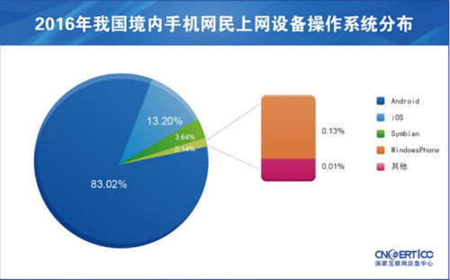

## 前言

随着信息化水平的不断提高，互联网已经深入到用户的日常生活和学习工作中，当然人们对互联网的要求也越来越高。慢慢人们不满足于只能在家里或者在办公室里才能接入互联网，人们增加了对随时随地在移动过程中接入互联网的需求。相应地，无线技术的飞速发展正为此提供了所需的技术支撑，如无线局域网（如Wi-Fi）技术、3G移动通信技术（如WCDMA、TD-SCDMA、WiMAX）、4G/5G移动通信技术等。

移动互联网的概念是相对传统互联网而言，主要强调**随时随地**可以在移动中接入互联网并使用业务。一般人们可以认为移动互联网是采用手机、便携式计算机、平板电脑等作为终端，移动通信网络或者无线局域网作为接入手段，直接或通过无线应用协议访问互联网并使用其业务。

移动互联网不仅融合了互联网和移动通信技术，而且衍生出新的产业链条、业务形态和商业模式。在业务应用层面，如社交网站、搜索引擎等应用规模不断壮大，微博客、手机地图、手机支付等新型移动互联网业务层出不穷。移动互联网是当前信息技术领域的热门话题之一，它体现了无处不在的网络、无所不能的业务的思想，正在改变着人们的生活方式、工作方式和休闲娱乐方式。据[艾瑞咨询统计](attach/chap0x01/2017Q2移动互联网市场季度数据发布研究报告.pdf)，2017年中国移动互联网市场规模在经历了第一季度的明显下降后，第二季度迅速回升并拥有较大增幅，环比达到23.3%，
整体规模超过三千亿。其增长主要由于移动购物和移动游戏市场的稳定增长。随着移动广告高峰期的到来以及电商活动的
增多，预计未来中国移动互联网市场规模将进一步增长。

根据[《中国移动互联网发展状况及其安全报告（2017）》](http://www.cac.gov.cn/2017-05/18/c_1120991371.htm)，2016年中国境内活跃的手机上网码号数量达12.47亿，较2015年增长59.9%。2016年中国境内活跃的智能手机达23.3亿部，较2015年增长106%。在所有智能手机设备中，境内手机网民上网时所用设备的操作系统集中在Android、iOS、Symbian和WindowsPhone这四个操作系统。其中，运行Android系统的智能手机最多，数量达19.3亿部，占所有智能手机数量的83.02%。其次是运行iOS系统的iPhone智能手机，数量达3.1亿部，占所有智能手机数量的13.20%。

图 2016年我国境内手机网民上网设备操作系统分布（来源：CNCERT/CC）

2016年CNCERT/CC捕获及通过厂商交换获得的移动互联网恶意程序样本数量为2,053,501个。其中，2016年移动互联网恶意程序主要针对Android平台，共有2,053,450个，占99.9%以上，位居第一。其次是Symbian平台，共有51个，占0.01%。2016年CNCERT/CC捕获和通过厂商交换获得的移动互联网恶意程序按行为属性统计，流氓行为类的恶意程序数量为1,255,301个（占61.13%），恶意扣费类373,212个（占18.17%）、资费消耗类278,481个（占13.56%）分列第二、三位。2016我国境内感染移动恶意程序用户数量最多的操作系统为Android、Symbian和iOS，占比分别为70.3%、 18.8%和10.9%。

移动智能终端打破了传统手机应用的封闭性，使其不仅具有与电脑相当的强大功能和计算能力，而且记录存储了大量用户隐私数据。移动互联网继承了传统互联网技术以及移动通信网技术的脆弱性，正面临着来自互联网和移动网络的双重脆弱性威胁。当今手机的权限正在无限放大，手机几乎是个人的全部身份认证的信任根，从这个角度来看，智能手机智能终端安全甚至决定了互联网安全的根基是否健壮。移动互联网存在的安全问题正在日益凸显，学习和研究移动互联网安全正当其时，势在必行。

