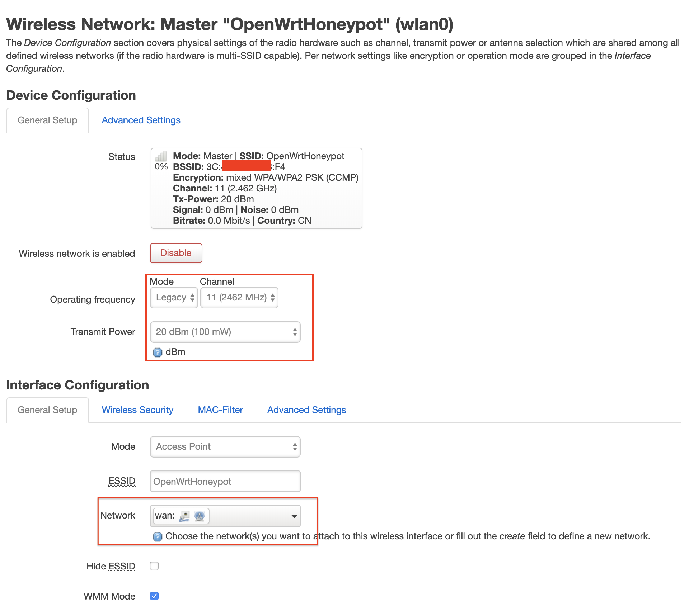

# 实验

## 无线路由器/无线接入点（AP）配置

以下实验，默认配置的是AP，除非特别说明时会强调该实验内容需要无线路由器支持。

* 重置和恢复AP到出厂默认设置状态
* 设置AP的管理员用户名和密码
* 设置SSID广播和非广播模式
* 配置不同的加密方式
* 设置AP管理密码
* 配置无线路由器使用自定义的DNS解析服务器 
* 配置DHCP和禁用DHCP
* 开启路由器/AP的日志记录功能（对指定事件记录）
* 配置AP隔离(WLAN划分)功能
* 设置MAC地址过滤规则（ACL地址过滤器）
* 查看WPS功能的支持情况
* 查看AP/无线路由器支持哪些工作模式

## 使用手机连接不同配置状态下的AP对比实验

* 如果手机无法分配到IP地址但又想联网该如何解决？

## 使用路由器/AP的配置导出备份功能，尝试解码导出的配置文件

下图以TP-LINK TL-WR720N为例：


提示：

* 在Google上搜索：路由器品牌名 backup decoder，例如：tp link router backup decoder


打开[Zibri's Blog: TP-LINK Configuration file encrypt and decrypt](http://www.zibri.org/2015/10/tp-link-configuration-file-encrypt-and-decrypt.html)，上传上一步备份导出的路由器配置文件会自动得到一份解码之后的明文路由器配置文件。

* 检查一下明文配置文件内容，看看你的路由器设置是不是在这份配置文件里都可以找到？
* 用浏览器的调试工具分析一下这个【备份配置文件】功能的网络通信过程，有没有安全风险？

## 复习VirtualBox的配置与使用

* 虚拟机镜像列表
* 设置虚拟机和宿主机的文件共享，实现宿主机和虚拟机的双向文件共享
* 虚拟机镜像备份和还原的方法
* 熟悉虚拟机基本网络配置，了解不同联网模式的典型应用场景

## OpenWrt on VirtualBox

```bash
# 下载镜像文件
wget https://downloads.openwrt.org/snapshots/targets/x86/64/openwrt-x86-64-combined-squashfs.img.gz
# 解压缩
gunzip openwrt-x86-64-combined-squashfs.img.gz
# img 格式转换为 Virtualbox 虚拟硬盘格式 vdi
VBoxManage convertfromraw --format VDI openwrt-x86-64-combined-squashfs.img openwrt-x86-64-combined-squashfs.vdi
# 新建虚拟机选择「类型」 Linux / 「版本」Linux 2.6 / 3.x / 4.x (64-bit)，填写有意义的虚拟机「名称」
# 内存设置为 256 MB
# 使用已有的虚拟硬盘文件 - 「注册」新虚拟硬盘文件选择刚才转换生成的 .vdi 文件
```

在下载镜像时，包含 `squashfs` 关键词的镜像文件区别于包含 `ext4` 关键词的镜像文件之处在于：`squashfs` 镜像包含一个只读文件系统可以用于「恢复出厂设置」。[OpenWrt 的官方镜像下载站点](https://downloads.openwrt.org/) 同时提供了最新版镜像和历史版本镜像的下载链接。对于在 VirtualBox 中安装 `OpenWrt` 来说首选 `x86` 架构的镜像文件以获得最好的运行兼容性保证。

经过上述命令操作之后我们将在 VirtualBox 的虚拟机列表里看到我们刚刚创建的 `OpenWrt` 虚拟机。在启动虚拟机之前，我们还需要进行必要的虚拟网卡设置。推荐设置为：

* 第一块网卡设置为：Intel PRO/1000 MT 桌面（仅主机(Host-Only)网络）
* 第二块网卡设置为：Intel PRO/1000 MT 桌面（网络地址转换(NAT)）

示例第一块网卡对应的 `Host-Only` 网卡 `vboxnet0` 设置如下：


确认好网络设置正确后，启动虚拟机，大约数秒之后（根据宿主机性能不同可能会有差异）黑色命令行界面不再滚动更新新消息时，按下「ENTER」键即可进入 OpenWrt 的终端控制台。

如果你熟悉常见 Linux 发行版的命令行使用，那么对于 `OpenWrt` 的基本使用应该很容易上手。

首先，可以使用 `ping` 来检查互联网连通性。在保证有互联网联通的条件下，可以通过 `OpenWrt` 的软件包管理器 `opkg` 进行联网安装软件。不过考虑到在 VirtualBox 的默认显示终端里进行命令行操作不便，建议先配置好 `OpenWrt` 的管理接口再通过 `SSH` 的方式远程操控会更方便一些。除了在「参考资料」一节给出的 `OpenWrt` 官方指南里的方法可以完成网络配置之外。如果你熟悉 `vi` 的基本使用，还可以通过 `vi` 直接编辑 `/etc/config/network` 配置文件来设置好远程管理专用网卡的 IP 地址。如下配置片段所示，修改 OpenWrt 局域网地址为当前 Host-only 网段内可用地址，只需要修改 `option ipaddr` 的值即可。

```ini
config interface 'lan'
	option type 'bridge'
	option ifname 'eth0'
	option proto 'static'
	option ipaddr '192.168.56.11' 
	option netmask '255.255.255.0'
	option ip6assign '60'
```

修改完网络配置之后，可以通过 `ifdown eth0 && ifup eth0` 完成指定网卡 `eth0` 的重新加载配置生效无需重新启动系统。如果遇到 `ifdown` 或 `ifup` 指令无效的情况，可以重启系统以使新的网络配置生效。

通过 SSH 方式来管理 `OpenWrt` 可以很方便进行「复制粘贴」操作，大大提升系统管理效率。对于路由器操作系统 `OpenWrt` 来说，更常见的远程管理方式是通过 `LuCi` 这个网页形式的管理界面来完成。以下以 `LuCi` 软件包的安装为例，给出常用的一些 `opkg` 命令供参考。

```bash
# 更新 opkg 本地缓存
opkg update

# 检索指定软件包
opkg find luci
# luci - git-19.223.33685-f929298-1

# 查看 luci 依赖的软件包有哪些 
opkg depends luci
# luci depends on:
# 	libc
# 	uhttpd
# 	uhttpd-mod-ubus
# 	luci-mod-admin-full
# 	luci-theme-bootstrap
# 	luci-app-firewall
# 	luci-proto-ppp
# 	libiwinfo-lua
# 	luci-proto-ipv6

# 查看系统中已安装软件包
opkg list-installed

# 安装 luci
opkg install luci

# 查看 luci-mod-admin-full 在系统上释放的文件有哪些
opkg files luci-mod-admin-full
# Package luci-mod-admin-full (git-16.018.33482-3201903-1) is installed on root and has the following files:
# /usr/lib/lua/luci/view/admin_network/wifi_status.htm
# /usr/lib/lua/luci/view/admin_system/packages.htm
# /usr/lib/lua/luci/model/cbi/admin_status/processes.lua
# /www/luci-static/resources/wireless.svg
# /usr/lib/lua/luci/model/cbi/admin_system/system.
# ...
# /usr/lib/lua/luci/view/admin_network/iface_status.htm
# /usr/lib/lua/luci/view/admin_uci/revert.htm
# /usr/lib/lua/luci/model/cbi/admin_network/proto_ahcp.lua
# /usr/lib/lua/luci/view/admin_uci/changelog.htm
```

以下是安装好 `luci` 后通过浏览器访问管理 `OpenWrt` 的效果截图。


### 开启 AP 功能

OpenWrt 安装到 VirtualBox 之后，由于 VirtualBox 本身无法提供无线网卡的虚拟化仿真功能。所以如果需要在虚拟机中的 OpenWrt 开启无线网络支持，需要借助无线网卡硬件设备。在本书中，我们推荐使用外接 USB 无线网卡。本书实验验证过的外接 USB 无线网卡信息可以参阅本书第二章的 [常见无线网卡](../chap0x02/wifi_card_list.md) 一节，OpenWrt 在默认安装状态下没有安装无线网卡相关的驱动程序，所以为了让 OpenWrt 可以正确的识别并管理外接 USB 无线网卡，首先需要解决无线网卡驱动在 OpenWrt 中安装的问题。

当前待接入 USB 无线网卡的芯片信息可以通过在 Kali 虚拟机中使用 `lsusb` 的方式查看，但默认情况下 OpenWrt 并没有安装对应的软件包，需要通过如下 `opkg` 命令完成软件安装。

```bash
# 每次重启 OpenWRT 之后，安装软件包或使用搜索命令之前均需要执行一次 opkg update
opkg update && opkg install usbutils
```

安装好 `usbutils` 之后，通过以下 2 个步骤可以确定该无线网卡的驱动是否已经安装好。

```bash
# 查看 USB 外设的标识信息
lsusb
# Bus 001 Device 005: ID 0cf3:9271 Qualcomm Atheros Communications AR9271 802.11n
# Bus 001 Device 006: ID 0bda:8187 Realtek Semiconductor Corp. RTL8187 Wireless Adapter

# 查看 USB 外设的驱动加载情况
lsusb -t
# /:  Bus 01.Port 1: Dev 1, Class=root_hub, Driver=ehci-pci/12p, 480M
#     |__ Port 1: Dev 4, If 0, Class=(Defined at Interface level), Driver=, 480M
#     |__ Port 2: Dev 5, If 0, Class=Vendor Specific Class, Driver=ath9k_htc, 480M
```

在上面的命令例子中，芯片名称为 `AR9271` 的无线网卡已经成功加载了驱动 `ath9k_htc` ，而另一块芯片名称为 `RTL8187` 的无线网卡则未加载到匹配的驱动。通过 `ifconfig -a` 或 `ip link` 均可以验证系统当前只能识别到一块无线网卡。

通过 `opkg find` 命令可以快速查找可能包含指定芯片名称的驱动程序包，如下所示：

```bash
opkg find kmod-* | grep 8187
# kmod-rtl8187 - 4.14.131+2017-11-01-10 - Realtek Drivers for RTL818x devices (RTL8187 USB)
```

安装 `kmod-rtl8187` 驱动之后，再执行 `lsusb -t` 时发现已经成功加载驱动。

```
|__ Port 1: Dev 6, If 0, Class=(Defined at Interface level), Driver=rtl8187, 480M
```

此时再次执行 `ifconfig -a` 或 `ip link` 均可以验证系统当前已经可以识别 2 块无线网卡。

查看 `openwrt` 支持哪些无线网卡驱动可以通过 `opkg find kmod-* | grep wireless` 进行查看。

默认情况下，OpenWrt 只支持 `WEP` 系列过时的无线安全机制。为了让 OpenWrt 支持 `WPA` 系列更安全的无线安全机制，还需要额外安装 2 个软件包：`wpa-supplicant` 和 `hostapd` 。其中 `wpa-supplicant` 提供 WPA 客户端认证，`hostapd` 提供 AP 或 ad-hoc 模式的 WPA 认证。

```bash
opkg install hostapd wpa-supplicant
```

可以通过 `OpenWrt` 的 `LuCi` 完成无线网络的配置，如果需要在 `LuCi` 的网页版中管理无线网卡设置，还需要在安装完无线网卡驱动和上述 2 个软件之后重启系统方可生效。有时即使在虚拟机的 `USB Device Filters` 中添加了当前无线网卡的自动连入配置时，`OpenWrt` 系统重启时也可能找不到设备，此时只需要物理上重新连接一次无线网卡或通过虚拟机的 USB 设备管理菜单将网卡连入虚拟机即可在 `OpenWrt` 中通过 `lsusb -t` 正确识别网卡并加载网卡驱动，登入 `LuCi` 之后在顶部菜单 `Network` 里即可发现新增了一个菜单项 `Wireless` 。 


为了使用其他无线客户端可以正确发现新创建的无线网络，以下还有 3 点需要额外注意的特殊配置注意事项：

* 无线网络的详细配置界面里的 `Interface Configuration` 表单里 `Network` 记得勾选 `wan` ；
* 虚拟机的 WAN 网卡对应的虚拟网络类型必须设置为 `NAT` 而不能使用 `NatNetwork` ，无线客户端连入无线网络后才可以正常上网。
* 不要使用 Auto 模式的信道选择和信号强度，[均手工指定](https://forum.archive.openwrt.org/viewtopic.php?id=37896) 才可以。如下图所示为手工指定监听信道和信号强度的示例：



完成无线网络配置之后，需要点击 `Enable` 按钮启用当前无线网络。


在没有客户端加入当前无线网络时，我们在 `LuCi` 上查看无线网络状态如下图所示：


当有客户端加入当前无线网络时，我们在 `LuCi` 上查看无线网络状态如下图所示：


在使用外置 USB 无线网卡来作为虚拟机中的 OpenWrt 的无线网卡时需要注意设备连接的「不稳定性」可能会导致随时出现无线网卡突然在 OpenWrt 系统中无法被识别的情况，故障排查方法可以参考 [第二章的「无线网卡设置查看基本工具」](../chap0x02/main.md#无线网卡设置查看基本工具) 一节提供的一些软硬件故障排查方法。

## 参考资料

* [新版 OpenWrt 安装到 VirtualBox 的指南](https://openwrt.org/docs/guide-user/virtualization/virtualbox-vm)
* [旧版 OpenWrt 安装到 VirtualBox 的指南](https://oldwiki.archive.openwrt.org/doc/howto/virtualbox)


