# 第一章 无线网络安全基础

## 前言

随着信息化水平的不断提高，互联网已经深入到用户的日常生活和学习工作中，当然人们对互联网的要求也越来越高。慢慢人们不满足于只能在家里或者在办公室里才能接入互联网，人们增加了对随时随地在移动过程中接入互联网的需求。相应地，无线技术的飞速发展正为此提供了所需的技术支撑，如无线局域网（如Wi-Fi）技术、3G移动通信技术（如WCDMA、TD-SCDMA、WiMAX）、4G/5G移动通信技术等。

移动互联网的概念是相对传统互联网而言，主要强调**随时随地**可以在移动中接入互联网并使用业务。一般人们可以认为移动互联网是采用手机、便携式计算机、平板电脑等作为终端，移动通信网络或者无线局域网作为接入手段，直接或通过无线应用协议访问互联网并使用其业务。

移动互联网不仅融合了互联网和移动通信技术，而且衍生出新的产业链条、业务形态和商业模式。在业务应用层面，如社交网站、搜索引擎等应用规模不断壮大，微博客、手机地图、手机支付等新型移动互联网业务层出不穷。移动互联网是当前信息技术领域的热门话题之一，它体现了无处不在的网络、无所不能的业务的思想，正在改变着人们的生活方式、工作方式和休闲娱乐方式。据[艾瑞咨询统计](attach/chap0x01/2017Q2移动互联网市场季度数据发布研究报告.pdf)，2017年中国移动互联网市场规模在经历了第一季度的明显下降后，第二季度迅速回升并拥有较大增幅，环比达到23.3%，
整体规模超过三千亿。其增长主要由于移动购物和移动游戏市场的稳定增长。随着移动广告高峰期的到来以及电商活动的
增多，预计未来中国移动互联网市场规模将进一步增长。

根据[《中国移动互联网发展状况及其安全报告（2017）》](http://www.cac.gov.cn/2017-05/18/c_1120991371.htm)，2016年中国境内活跃的手机上网码号数量达12.47亿，较2015年增长59.9%。2016年中国境内活跃的智能手机达23.3亿部，较2015年增长106%。在所有智能手机设备中，境内手机网民上网时所用设备的操作系统集中在Android、iOS、Symbian和WindowsPhone这四个操作系统。其中，运行Android系统的智能手机最多，数量达19.3亿部，占所有智能手机数量的83.02%。其次是运行iOS系统的iPhone智能手机，数量达3.1亿部，占所有智能手机数量的13.20%。

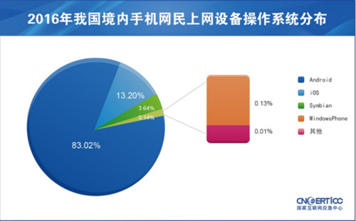

图 2016年我国境内手机网民上网设备操作系统分布（来源：CNCERT/CC）

2016年CNCERT/CC捕获及通过厂商交换获得的移动互联网恶意程序样本数量为2,053,501个。其中，2016年移动互联网恶意程序主要针对Android平台，共有2,053,450个，占99.9%以上，位居第一。其次是Symbian平台，共有51个，占0.01%。2016年CNCERT/CC捕获和通过厂商交换获得的移动互联网恶意程序按行为属性统计，流氓行为类的恶意程序数量为1,255,301个（占61.13%），恶意扣费类373,212个（占18.17%）、资费消耗类278,481个（占13.56%）分列第二、三位。2016我国境内感染移动恶意程序用户数量最多的操作系统为Android、Symbian和iOS，占比分别为70.3%、 18.8%和10.9%。

移动智能终端打破了传统手机应用的封闭性，使其不仅具有与电脑相当的强大功能和计算能力，而且记录存储了大量用户隐私数据。移动互联网继承了传统互联网技术以及移动通信网技术的脆弱性，正面临着来自互联网和移动网络的双重脆弱性威胁。当今手机的权限正在无限放大，手机几乎是个人的全部身份认证的信任根，从这个角度来看，智能手机智能终端安全甚至决定了互联网安全的根基是否健壮。移动互联网存在的安全问题正在日益凸显，学习和研究移动互联网安全正当其时，势在必行。


## 移动互联网基础

关于移动互联网具体是什么，包含哪些主要技术组件，一种普遍被认可的架构定义为：**云、管、端**三层架构，如下图所示：

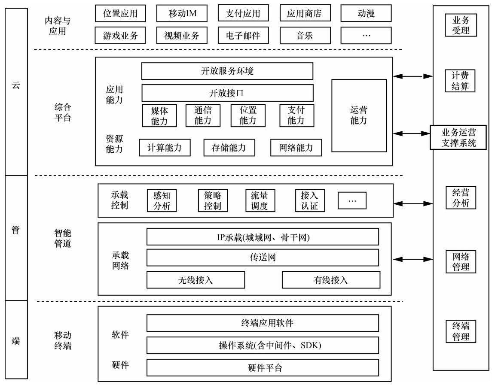

本课程的主要内容聚焦在：**管**和**端**，更具体来说，我们将重点讲解**无线接入**（以下主要使用**无线网络**这个术语来指代这里的**无线接入**技术）和**移动终端**的相关安全问题。

## 无线网络

提到**无线网络**，你的脑海里会闪现出哪些关键词？

> Wi-Fi？WLAN？802.11？蓝牙？NFC？

以下是这些与无线网络技术相关的关键词简介，这些技术共同组成了无线网络构建的通信协议基础。

* [Wi-Fi](https://www.zhihu.com/question/20587817/answer/151080788)

> WiFi的名字，最早是出现在1999年，是WiFi联盟(当时不叫做WiFi联盟)雇佣当时的一个商标咨询公司Interband，替他们为“IEEE 802.11b direct sequence”起一个更简洁更具吸引力的名字，而当时WiFi联盟的创始成员(Phil Belanger)主持的“WiFi”的这个名字最后胜出，被称之为WiFi名字的发明人。Interband在起名字之后又设计了WiFi的logo，用于这个WiFi logo的产品意味着兼容WiFi技术的产品。而后来文献中误传WiFi是WirelessFidelity的缩写，这是由于WiFi联盟自己曾在广告宣传的时候使用了“The Standard Wireless Fidelity”的广告标语，但其实WiFi最开始的产生是没有任何意义的，根据Interband的说法，只是hi-fi的一种语音合成或者双关。 所以可以看出来，WiFi最开始是遵从IEEE 802.11b标准的一种通信技术，和蓝牙同级，但同时也是一个商标。

* WLAN

> 无线局域网络(Wireless Local Area Networks, WLAN)是相当便利的数据传输系统，它利用射频(Radio Frequency, RF)的技术，取代旧式碍手碍脚的双绞铜线(Coaxial)所构成的局域网络，使得无线局域网络能利用简单的存取架构让用户透过它，达到“信息随身化、便利走天下”的理想场景。目前无线局域网络最为广泛使用的标准是IEEE 802.11协议标准。当然还有别的标准，如IEEE 802.15，蓝牙（Bluetooth）使用的就是这个标准。

* 802.11

> 802.11是IEEE 802.11 Task Group制定的一系列无线局域网标准，最初主要用于解决办公室局域网和校园网中，用户与用户终端的无线接入，业务主要限于数据存取，速率最高只能达到2Mbps。随着技术的发展，该系列标准演进出了许多细分标准，网络传输速率也已经伴随着802.11ac的制定和发布，正式宣告进入千兆网络时代。

* 蓝牙

> 蓝牙技术是一种开放式无线通讯标准，能够在短距离范围内无线连接桌上型电脑与笔记本电脑、便携设备、PDA、移动电话、拍照手机、打印机、数码相机、耳麦、键盘甚至是电脑鼠标。蓝牙无线技术使用了全球通用的免费频带（2.4GHz），以确保能在世界各地通行无阻。简言之，蓝牙技术让各种数码设备之间能够无线沟通，让散落各种连线的桌面成为历史。

* NFC

> 近场通信（英语：Near Field Communication，NFC），又称近距离无线通信，是一种短距离的高频无线通信技术，允许电子设备之间进行非接触式点对点数据传输，在十厘米（3.9英吋）内交换数据。这个技术由非接触式射频识别（RFID）演变而来，由飞利浦半导体（现恩智浦半导体）、诺基亚和索尼共同研制开发，其基础是RFID及互连技术。近场通信是一种短距高频的无线电技术，在13.56MHz频率运行于20厘米距离内。目前近场通信已通过成为ISO/IEC IS 18092国际标准、EMCA-340标准与ETSI TS 102 190标准。NFC采用主动和被动两种读取模式。

### 无线网络中的常见设备

在无线局域网里，常见的网络基础设施设备有无线网卡、无线网桥、AP、路由器等。

* AP

> 无线访问接入点（Wireless Access Piont, AP）相当于一个连接有线网和无线网的桥梁，其主要作用是将各个无线网络客户端连接到一起，然后将无线网络接入以太网(这正是Access Point名称的本义)。AP又被称为**无线交换机**，这让它和无线路由器更容易区分角色和应用于不同的使用场景。

> 目前大多数的无线AP都支持多用户接入、数据加密、多速率发送等功能，一些产品更提供了完善的无线网络管理功能。对于家庭、办公室这样的小范围、小规模（20台终端设备以下）无线局域网而言，一般只需一台无线AP即可实现所有计算机的无线接入。

> AP的室内覆盖范围一般是30米 ～100米，目前不少厂商的AP产品可以互联，以增加无线网络覆盖面积。也正因为每个AP的覆盖范围都有一定的限制，正如手机可以在基站之间漫游一样，无线局域网客户端也可以在AP之间漫游。

* 路由器

> 路由器（Router）是连接互联网中各局域网、广域网的设备，它会根据信道的情况自动选择和设定路由，以最佳路径、先后顺序发送信号。 路由器是互联网络的枢纽、"交通警察"。

* 电力猫

> 电力线通信（Power Line Communication, PLC）技术是指利用电力线传输数据和媒体信号的一种通信方式。该技术是把载有信息的高频加载于电流然后用电线传输接受信息的适配器再把高频从电流中分离出来并传送到计算机或电话以实现信息传递。

> 电力线通信全称是电力线载波（Power Line Carrier, PLC）通信，是指利用高压电力线（在电力载波领域通常指35kV及以上电压等级）、中压电力线（指10kV电压等级）或低压配电线（380/220V用户线）作为信息传输媒介进行语音或数据传输的一种特殊通信方式。

> 电力猫即“电力线通讯调制解调器”，是通过电力 线进行宽带上网的Modem的俗称。使用家庭或办公室现有电力线和插座组建成网络，来连接PC，ADSL modem，机顶盒，音频设备， 监控设备以及其他的智能电气设备，来传输数据，语音和视频。它具有即插即用的特点，能通过普通家庭电力线传输网络IP数字信号。

除了这些构建网络的基础设施设备，和有线网络一样，无线网络里数量更为庞大的还是网络终端设备。从常见的手机、平板电脑、笔记本、台式机等“计算”设备，到物联网兴起、智能家居发展起来后开始上网的冰箱、空调、插座等等，这些终端设备通过标准的无线网络接入协议接入到无线网络。

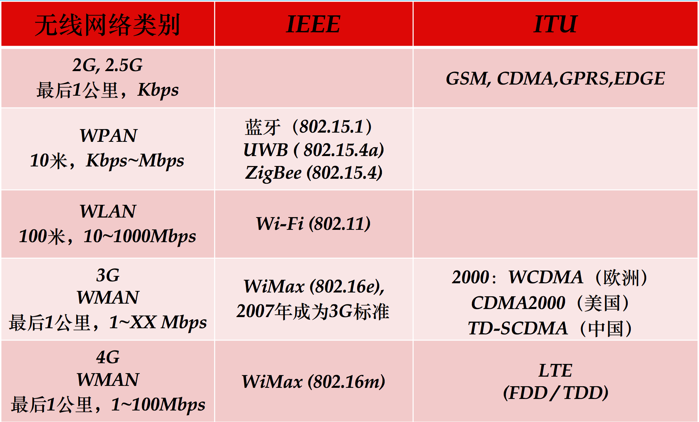

如上图所示是无线网络通信协议家谱，这里列举了常见的**标准**无线网络接入协议。

至此，我们初步认识到了无线网络的主要组成部分。

## IEEE 802.11

### 相关术语

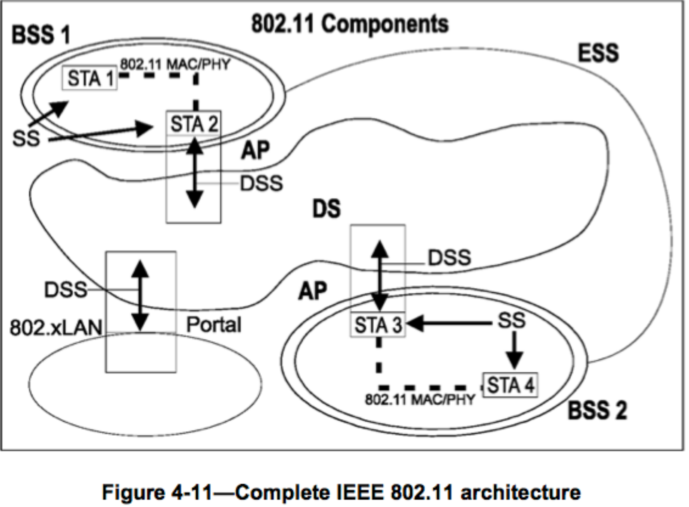

上图来自[《IEEE Standard for Information technology — Telecommunications and information exchange between systems Local and metropolitan area networks— Specific requirements Part 11: Wireless LAN Medium Access Control (MAC) and Physical Layer (PHY) Specifications》](http://ieeexplore.ieee.org/document/6587723/)，该图描述了一个典型的基于IEEE 802.11技术构建的无线局域网所包含的主要组件。下面我们将来逐个学习这些组件术语。

（1）STA，又称为Wireless Station（基站），指的是可以使用802.11协议的设备。由于802.11协议解决的是无线网络构建的物理层和数据链路层协议标准问题，因此所有的STA都是可寻址的设备，这些设备可能有固定地址、可移植地址、动态地址。无线客户端、无线路由器和无线接入点都是STA。

（2）基本服务群，(Basic Service Set, BSS)，是STA加入的集合，STA之间是否可以相互可见（通信）取决于接入点设备的配置。基本服务区域（Basic Service Area, BSA)是指BSS所覆盖的范围。

（3）IBSS这里的**I**指代的是**Independent**，所以IBSS用于指代的是独立BSS。BSS默认就是指的基础设施BSS(Infrastructure BSS)，基础设施BSS需要至少包含一个接入点，Portal（门户）是可选项（无线服务的逻辑接入点，例如学校的无线认证页面）。IBSS模式没有无线基础设施设备，但最少要包含2个STA，且不支持接入分布式系统。

（4）Station服务（Station Service, SS）在一个指定BSS内提供数据链路层通信服务。

（5）扩展服务集合（Extended Service Set, ESS）是由物理上独立的BSS组成的一个逻辑上的独立服务集合。ESS也有一个标识的名称，即ESSID。扩展服务区ESS是指由多个AP以及连接它们的分布式系统组成的结构化网络，所有AP必需共享同一个ESSID。其中包括对CMCC、ChinaNet等无线热点的扩展，同样也支持漫游。

（6）分布式系统（Distribution System，DS）可以通过AP间的无线连接实现BSS连接，从而增加BSS的覆盖范围（面积）。无线DS又被称为WDS（Wireless DS）。DSS的全称是Distribution System Service。

（7）AP

根据前文STA的定义可知，AP也属于STA。AP对已关联（associated）的STA基于⽆线介质（Wireless Medium, WM）提供接⼊分布式服务。

（8）BSSID

BSS模式下，**BSS**ID是AP的MAC地址，对于IBSS模式来说，BSSID是随机产生的MAC地址。

（9）ESSID

**ESS**ID⼀般在网络产品中被简称为SSID，是⽆线⽹络的接⼊唯⼀标识。需要注意的是，ESSID仅作为⼀种网络**声明**方式，在相关协议标准中并没有严格保证如何达到网络的**唯一标识**。事实上，ESSID是可以被任意声明（**伪造**）。

所谓无线网络的接入唯一标识指的是⼯作站与AP关联（Associate）使用的标识，按照802.11标准定义：ESSID取值**区分⼤小写**、**2-32字节**。

单个AP可以支持同时声明多个ESSID，该特性取决于设备与系统的支持情况。常见的多ESSID应用场景是创建一个与主要网络隔离的**客⼈⽹络**。

STA发现无线网络的方式分为主动和被动两种，其中被动发现方式依赖于AP在运行时定时不断广播ESSID，其他STA通过扫描不同频段监听对应广播数据的方式**被动**发现该无线网络标识。如果AP取消了ESSID广播，其他STA则无法通过前述**被动监听**方式“主动发现”网络。有些人认为这种“设置AP取消SSID广播”的方式可以避免攻击者发现网络“入口”，从而避免攻击者的无线入侵，增强无线网络安全性。在这里，我们先给出结论：

> 取消SSID广播，并不能增强无线网络安全性。

具体原因和原理，我们将在第三章详细讲解。

多个AP在构建ESS时，所有的BSS（AP或无线路由器）必须使用相同的ESSID。那么有了ESSID的情况下，BSSID的作用是什么呢？答案是：增强识别BSS的准确性。例如，对于同名ESSID的场景，通过BSSID可以区分不同的BSS。

下面这个例子来自真实世界的无线网络抓包结果：

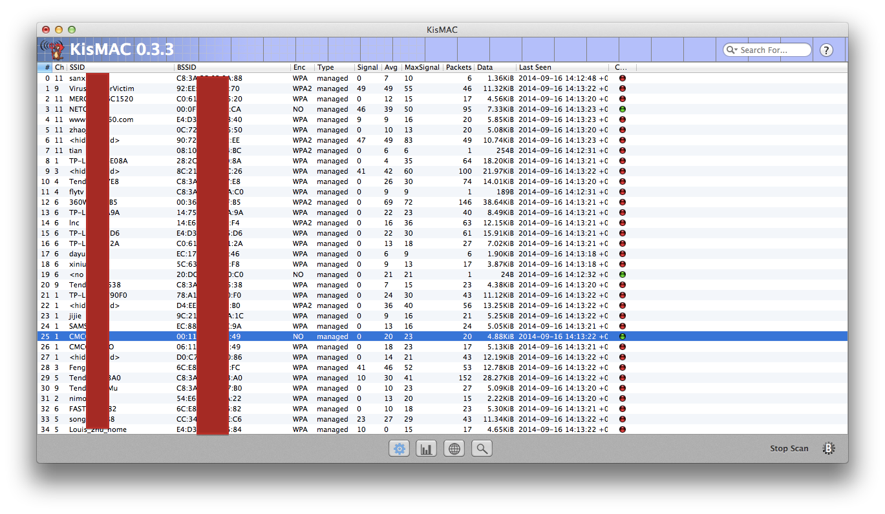

### 系列标准

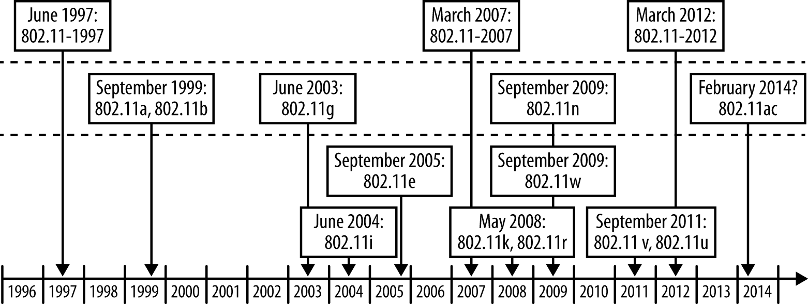

如上图所示，记录了802.11协议家族的相关协议标准的发布时间节点历史时间线。

802.11b和802.11g将2.4 GHz的频段区分为14个重复，标记的信道;每个信道的中心频率相差5兆赫兹（MHz）。一般常常被误认的是信道1，6和11（还有有些地区的信道14）是互不重叠所以利用这些不重叠的信道，多组无线网络的互相涵盖，互不影响，这种看法太过简单。802.11b和802.11g并没有规范每个信道的频宽，规范的是中心频率和频谱屏蔽（spectral mask）。802.11b的频谱屏蔽需求为：在中心频率±11 MHz处，至少衰减30 dB，±22 MHz处要衰减50 dB.

由于频谱屏蔽只规定到±22 MHz处的能量限制，所以通常认定使用频宽不会超过这个范围。实际上，当发射端距离接收端非常近时，接收端接受到的有性能量频谱，有可能会超过22 MHz的区域。所以，一般认定信道1，6和11互不重叠的说法。应该要修正为：信道1，6和11，三个频段互相之间的影响比使用其它频段小。然而，要注意的是，一个使用信道1的高功率发射端，可以轻易的干扰到一个使用信道6的，功率较低的发射站。在实验室的测试中发现，当使用信道11来传递数据时，一个使用信道1的发射台也在通讯时，会影响到信道11的数据传输，让传输速率稍稍降低。所以，即使是频段相差最远的信道1和11，也是会互相干扰的。

虽然信道1、6和11互不重叠的说法是不正确的，但是这个说法至少可以用来说明：信道距离在1，6和11之间虽然会对彼此造成干扰，而却不会强烈地影响到通讯的传输速率。下图是2.4GHz频段802.11g规范中第1-14信道的频谱屏蔽范围定义。

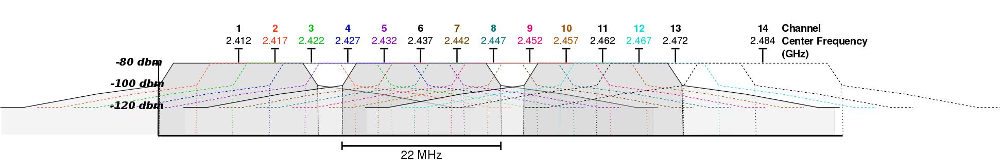

很多国家都有法律规管这些信道的使用，例如在一定频率范围内的最大功率电平等。网络运营商应咨询当地主管部门，因为这些规定可能会过时，世界上绝大多数国家都允许不需要申请许可证使用第1信道到第13信道

<a href="https://www.cisco.com/c/en/us/products/collateral/wireless/aironet-3600-series/white_paper_c11-713103.html">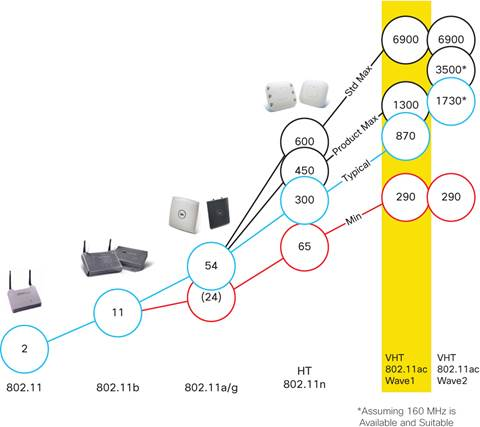</a>

如上图所示，记录了802.11协议主要核心标准对应的最大带宽能力发展历史时间线。以下表格总结了目前不同的 802.11 协议标准在频率范围、带宽和单通道数据传输速率方面的差异。

<table cellspacing="0" style="border-top:thin solid black;" width="99%">
   <colgroup>
      <col>
      <col>
      <col>
      <col>
   </colgroup>
   <thead>
      <tr valign="bottom">
         <th align="left" style="border-bottom:thin solid black;text-align: left;padding-right: 10px;padding-left: 10px;">
            <p class="Para1">802.11 协议标准</p>
         </th>
         <th align="left" style="border-bottom:thin solid black;text-align: left;padding-right: 10px;padding-left: 10px;">
            <p class="Para1">频率范围</p>
         </th>
         <th align="left" style="border-bottom:thin solid black;text-align: left;padding-right: 10px;padding-left: 10px;">
            <p class="Para1">带宽</p>
         </th>
         <th align="left" style="border-bottom:thin solid black;text-align: left;padding-right: 10px;padding-left: 10px;">
            <p class="Para1">单通道数据传输速率</p>
         </th>
      </tr>
   </thead>
   <tbody>
      <tr valign="top">
         <td rowspan="2" align="left" style="border-bottom:thin solid black;text-align: left;padding-right: 10px;padding-left: 10px;">
            <p class="Para1">n</p>
            <p class="Para1">最大支持 4 通道</p>
         </td>
         <td rowspan="2" align="left" style="border-bottom:thin solid black;text-align: left;padding-right: 10px;padding-left: 10px;">
            <p class="Para1">2.4-GHz<br> 5-GHz</p>
         </td>
         <td align="left" style="border-bottom:thin solid black;text-align: left;padding-right: 10px;padding-left: 10px;">
            <p class="Para1"><br><br><br><br><br><br><br><br>20
               MHz
            </p>
         </td>
         <td align="left" style="border-bottom:thin solid black;text-align: left;padding-right: 10px;padding-left: 10px;">
            <p class="Para1">7.2 mbps<br>14.4 mbps, 21.7 mbps<br>28.9
               mbps, 43.3 mbps<br>57.8 mbps, 65 mbps,<br>72.2
               mbps
            </p>
         </td>
      </tr>
      <tr valign="top">
         <td align="left" style="border-bottom:thin solid black;text-align: left;padding-right: 10px;padding-left: 10px;">
            <p class="Para1"><br><br><br><br><br><br><br><br>40&nbsp;MHz</p>
         </td>
         <td align="left" style="border-bottom:thin solid black;text-align: left;padding-right: 10px;padding-left: 10px;">
            <p class="Para1">15 mbps, 30 mbps, <br>45 mbps, 60 mbps,<br>90 mbps, 120 mbps,<br>135 mbps, 150 mbps</p>
         </td>
      </tr>
      <tr valign="top">
         <td align="left" style="border-bottom:thin solid black;text-align: left;padding-right: 10px;padding-left: 10px;">
            <p class="Para1">g</p>
            <p class="Para1">单通道</p>
         </td>
         <td align="left" style="border-bottom:thin solid black;text-align: left;padding-right: 10px;padding-left: 10px;">
            <p class="Para1">2.4-GHz</p>
         </td>
         <td align="left" style="border-bottom:thin solid black;text-align: left;padding-right: 10px;padding-left: 10px;">
            <p class="Para1">20&nbsp;MHz</p>
         </td>
         <td align="left" style="border-bottom:thin solid black;text-align: left;padding-right: 10px;padding-left: 10px;">
            <p class="Para1">6, 9, 12, 18, 24, 36, 48, 54</p>
         </td>
      </tr>
      <tr valign="top">
         <td align="left" style="border-bottom:thin solid black;text-align: left;padding-right: 10px;padding-left: 10px;">
            <p class="Para1">b</p>
            <p class="Para1">单通道</p>
         </td>
         <td align="left" style="border-bottom:thin solid black;text-align: left;padding-right: 10px;padding-left: 10px;">
            <p class="Para1">2.4-GHz</p>
         </td>
         <td align="left" style="border-bottom:thin solid black;text-align: left;padding-right: 10px;padding-left: 10px;">
            <p class="Para1">20&nbsp;MHz</p>
         </td>
         <td align="left" style="border-bottom:thin solid black;text-align: left;padding-right: 10px;padding-left: 10px;">
            <p class="Para1">1 mbps, 2 mbps, 5.5 mbps, 11 mbps</p>
         </td>
      </tr>
      <tr valign="top">
         <td align="left" style="border-bottom:thin solid black;text-align: left;padding-right: 10px;padding-left: 10px;">
            <p class="Para1">a</p>
            <p class="Para1">单通道</p>
         </td>
         <td align="left" style="border-bottom:thin solid black;text-align: left;padding-right: 10px;padding-left: 10px;">
            <p class="Para1">5-GHz<br> 3.7-GHz</p>
         </td>
         <td align="left" style="border-bottom:thin solid black;text-align: left;padding-right: 10px;padding-left: 10px;">
            <p class="Para1">20&nbsp;MHz</p>
         </td>
         <td align="left" style="border-bottom:thin solid black;text-align: left;padding-right: 10px;padding-left: 10px;">
            <p class="Para1">6 mbps, 9 mbps, 12 mbps, 18 mbps, 24 mbps, 36 mbps, 48 mbps,
               54 mbps
            </p>
         </td>
      </tr>
      <tr valign="top">
         <td align="left" style="border-bottom:thin solid black;text-align: left;padding-right: 10px;padding-left: 10px;">
            <p class="Para1">ac</p>
            <p class="Para1">最大支持 8 通道</p>
         </td>
         <td align="left" style="border-bottom:thin solid black;text-align: left;padding-right: 10px;padding-left: 10px;">
            <p class="Para1">5- GHz</p>
         </td>
         <td align="left" style="border-bottom:thin solid black;text-align: left;padding-right: 10px;padding-left: 10px;">
            <p class="Para1">20&nbsp;MHz</p>
            <p class="Para1">40&nbsp;MHz</p>
            <p class="Para1">60&nbsp;MHz</p>
            <p class="Para1">80&nbsp;MHz</p>
         </td>
         <td align="left" style="border-bottom:thin solid black;text-align: left;padding-right: 10px;padding-left: 10px;">
            <p class="Para1">上限 87.6 mbps</p>
            <p class="Para1">上限 200 mbps</p>
            <p class="Para1">上限 433.3 mbps</p>
            <p class="Para1">上限 866.7 mbps</p>
         </td>
      </tr>
   </tbody>
</table>

### 802.x LAN

局域网（Local Area Network, LAN），又称内网。指覆盖小范围、局部区域（如办公室或楼层）的计算机网络。按照网络覆盖的区域（距离）不同，其他的网络类型还包括个人网（Personal Area Network, PAN）、城域网（Metropolitan Area Network, MAN）、广域网（Wide Area Network, WAN）等。

早期的局域网网络技术都是各不同厂家所专有，互不兼容。后来，IEEE（电机电子工程师学会）推动了局域网技术的标准化，由此产生了IEEE 802系列标准。这使得在建设局域网时可以选用不同厂家的设备，并能保证其兼容性。这一系列标准覆盖了双绞线、同轴电缆、光纤和无线等多种传输媒介和组网方式，并包括网络测试和管理的内容。随着新技术的不断出现，这一系列标准仍在不断的更新变化之中。

以太网（IEEE 802.3标准）是最常用的局域网组网方式。以太网使用双绞线作为传输媒介。在没有中继的情况下，最远可以覆盖200米的范围。最普及的以太网类型数据传输速率为100Mb/s，更新的标准则支持1000Mb/s和10000Mb/s的速率。

其他主要的局域网类型有令牌环（Token Ring）和光纤分布数字接口（FDDI，IEEE 802.8）。令牌环网络采用同轴电缆作为传输媒介，具有更好的抗干扰性；但是网络结构不能很容易的改变。FDDI采用光纤传输，网络带宽大，适于用作连接多个局域网的骨干网。

近两年来，随着802.11标准的制定，无线局域网的应用大为普及。这一标准采用2.4GHz 和5GHz 的频段，数据传输速度可以达到11Mbps、54Mbps和1Gbps，覆盖范围为100米。

局域网标准定义了传输媒介、编码和介质访问等底层（一二层）功能。要使数据通过复杂的网络结构传输到达目的地，还需要具有寻址、路由和流量控制等功能的网络协议的支持。TCP/IP（传输控制协议/互联网络协议）是最普遍使用的局域网网络协议。它也是互联网所使用的网络协议。其他常用的局域网协议包括，IPX、AppleTalk等。

如下图所示概括了IEEE 802家族主要协议及其对应OSI模型的归属关系。

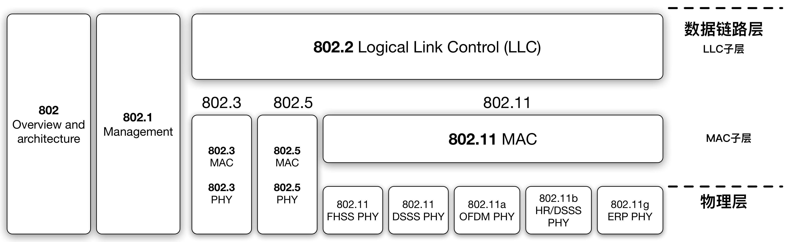

### 802.11 工作模式

802.11协议标准定义了STA的三种主要工作模式：基础设施、Ad-Hoc和监听模式。其中基础设施模式下的网络类型包括BSS和ESS，Ad-Hoc模式相当于是IBSS模式的别名。监听模式下，STA不发射任何无线信号，只被动的接收无线数据帧，我们在第二章会主要讲解监听模式。如下图所示是一个典型的ESS模式网络拓扑。

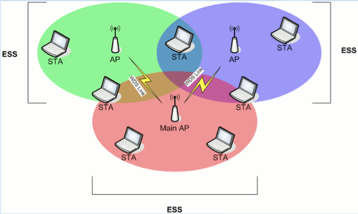

### 802.11 关联过程

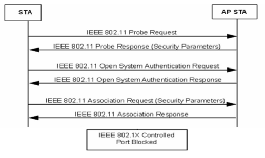

上图是一个典型的无加密、开放认证模式下的 STA 关联（加入）到一个无线网络的交互式过程示意图。这张图上展示的过程跳过了 STA 首次加入无线网络时的获取 AP 的广播 beacon frame 过程，在 AP 的 beacon frame 中 STA 也能找到当前网络的认证和安全配置相关参数信息。

下图来自使用 Wireshark 对一次真实无线网络加入过程的抓包结果的可视化展示：注意相比于我们上面的示意图，此次真实入网过程还包含一个“空”的认证请求 frame。

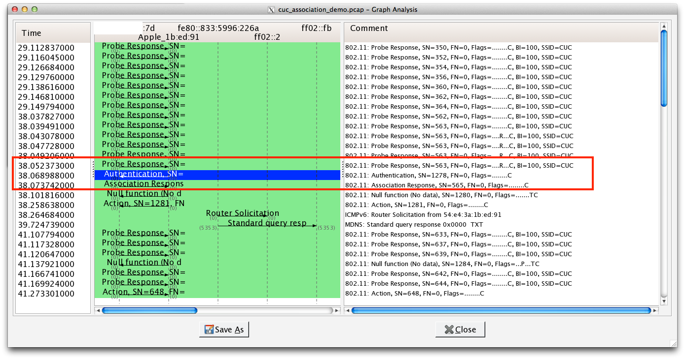

STA 除了通过“被动”方式发现正在广播的无线网络之外，不同的操作系统和无线网络管理应用程序会在 802.11 协议标准的建议基础之上，设计自己的STA加入（关联）AP策略。最常见的策略按照优先级从高到低，如下定义：

* 历史关联记录优先
* 先发现，先关联
* 信号强度⾼者优先

对于无线信号强度的定义，最常见的指标是**接收信号强度指示器**（Received Signal Strength Indicator, RSSI），这是接收信号的强度指示。

在 IEEE 802.11 系统中，RSSI 表征的是一个无线网络环境的**相对**接收信号强度，可以使用任意量纲。RSSI代表的是接收到的信号经由天线和可能的有线损耗之后的功率等级，因此，RSSI的数值越大，说明信号强度越强。考虑到大部分情况下，RSSI取值为负数（例如：-100），因此取值越接近于0，说明接收到的信号越强。

网卡内部可以设定在特定频段的RSSI低于某个特定阈值时来发送CTS数据帧。在CTS数据帧中我们可以观测到当前网络的瞬时RSSI。不同网卡内部的RSSI取值范围会有差异。例如Cisco的网卡使用的RSSI取值范围是从0到100，Atheros的网卡使用的RSSI取值范围是从0到127，其中128表示非法取值。

没有协议标准定义了任何物理参数与RSSI取值的关系。802.11协议没有定义RSSI取值使用毫瓦功率等级或与1毫瓦的比值。网卡芯片厂商制定自己的准确度、精度和取值范围来表示实际接收功率（例如常见使用毫瓦或毫瓦比值）。802.11协议中与RSSI有关的规定只有功率抽样方法：RSSI只有在接收802.11数据帧的前导（preamble）阶段进行测量计算，而不是在接收到完整数据帧的时候。

如下图所示是在Mac电脑上的RSSI实例，注意到这里RSSI的取值是负值、无量纲：

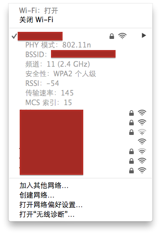

如下图所示是一个真实环境抓包结果中的RSSI数值展示：


注意到，这里的信号强度采用的计量单位是**dBm**：这是功率的绝对值，0表示最强，越近0接收效果越好。与之相关的一个度量单位是**dB**：这是功率相对值。很多软件厂商和硬件厂商为了避免RSSI数值的非标准化解读引起误解，倾向于使用**dBm**来表示RSSI。

如下2张图来自使用Wireshark对一次真实网络的无线抓包结果的RSSI平均值随（抓包）时间变化而变化的可视化展示：

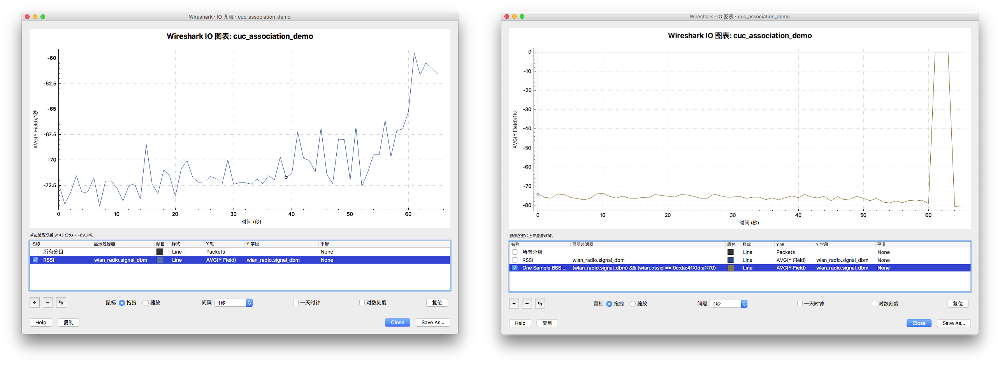

## 无线网络安全实践常见术语与概念

### 网卡芯片

谈到无线网络安全实践，首先要了解的就是网卡芯片类型。并不是所有的无线网卡都支持“监听模式”，而支持“监听模式”的网卡是我们获取无线网络通信数据的一个必备硬件条件。[WikiDevi](https://deviwiki.com/)是一个互联网众包模式的关于无线网络硬件设备参数信息的知识库，在这里我们能查阅到很多网卡所使用的芯片硬件参数信息、操作系统驱动支持情况等。

例如我们的实验器材中用到的数款网卡使用的[Atheros AR9271](../chap0x02/wn722n.md)芯片相关资料就可以在[WikiDevi的Atheros_AR9271](https://deviwiki.com/wiki/Atheros_AR9271)查阅到。

### 厂商

同样的，还是在[WikiDevi](https://deviwiki.com)上，我们能看到无线网卡的芯片提供商有一个汇总列表，如下：

- Atheros
- Broadcom
- Celeno
- Conexant
- Cypress
- Envara
- Intel
- Intersil
- Lantiq
- Marvell
- MediaTek
- Ralink
- Realtek
- Texas Instruments
- Qualcomm Atheros
- Quantenna
- Wilocity

### 驱动程序

在Linux系统中，如果能正常加载网卡驱动，则我们可以通过以下一些常用命令来查看网卡详细信息：

```bash
# 查看PCI接口连接的所有设备信息
lspci

# 查看USB接口连接的所有设备信息
lsusb

# 查看所有无线网卡的硬件参数信息
iw phy

# 查看所有无线网卡的接口标识信息
iw dev

# 查看最近加载的（硬件）驱动日志信息
dmesg
```

我们在这里有一个完整的[iw phy](../chap0x02/rt3572l_explained.md)输出信息加上详细注解的例子，供参考。


### 天线

天线（Antenna）属于无源（电源）器件，通过控制信号发射的角度，来获得信号“增益”。发射信号的总能量由AP决定，天线决定信号如何传播出去。

天线是“无源器件”，所以天线本身并不能给AP的信号增加能量。然而我们一提到天线，最重要的指标就是说天线的“增益”，那么天线是如何获得信号强度的“增益”呢？答案就是，靠控制信号发射的角度。这个原理有些类似于手电筒，手电筒靠一面凹镜，让光线都集中在某一角度，来让光线照到更远的地方。手电筒及电池相当于AP设备本身，而手电筒的灯泡和凹镜就相当于我们的天线。如果摘掉手电筒的凹镜，那么就相当于使用一个增益很小的全向天线，光线照射很分散，覆盖距离很近；有了凹镜，则相当于使用了一个高增益的定向天线，光线集中，覆盖距离很远。

信号总的能量是由AP决定的，天线则决定让这些能量集中在某个角度内，这个角度越小，能量聚集度越高，获得的信号“增益”也就越大，信号覆盖的距离越远；反之，如果覆盖角度越大，能量聚集度越低，信号覆盖的距离越近。这就是天线获得增益的基本原理。

常见的天线类型有全向天线和定向天线两种：

* 全向（Omni）

> 水平各个方向增益相同，全向天线增益越大，水平方向上覆盖的范围也就越大，垂直方向上覆盖的范围越小。一般应用于室内环境。

* 定向（directional）

> 垂直方向和水平方向都不是360度覆盖，一般来说覆盖角度小，覆盖的范围也就越远。大多数情况下，使用定向天线在高处向室外热点区域覆盖，以保证可靠的信号质量。

如果需要满足多个STA，并且这些STA是分布在AP的不同方向时，需要采用全向天线；如果集中在一个方向，建议采用定向天线；另外还要考虑天线的接头形式是否和AP匹配、天线的增益大小等是否符合实际需求。


## 知名的“路由器”操作系统

[OpenWrt](https://www.openwrt.org)基于GNU/Linux的嵌入式设备（主要是无线路由器）操作系统，采用GPL授权协议。[官方硬件兼容性表格](https://wiki.openwrt.org/toh/start)列举了超过600种市面上的无线路由器。

[DD-WRT](https://www.dd-wrt.com/)也是基于GNU/Linux的用于无线路由器的的第三方固件，采用 GPL 协议，支持基于 Broadcom 或 Atheros 芯片参考设计的许多 IEEE 802.11a/b/g/n 无线路由器。固件是由 BrainSlayer 来维护的，放在dd-wrt.com。DD-WRT 的第一个版本基于Sveasoft Inc 公司的 Alchemy 开发出来的, 而 Alchemy 又是基于 GPL 的 Linksys固件及许多其它开源程序。由于后来人们需要向 Sveasoft 支付20美元才能下载Alchemy固件，直接的后果就是发展出了DD-WRT。

DD-WRT 的新版本 (v24) 是一个全新的项目。DD-WRT 提供了在 OEM 固件，甚至 Sveasoft 收费的固件中没有的高级特性。此外它去除了 Sveasoft 固件的产品激活和跟踪功能。

[官方支持设备列表](http://www.dd-wrt.com/wiki/index.php/Supported_Devices)上列举了上百种市面上的无线路由器。

[RouterOS](https://mikrotik.com/software)是MikroTik公司基于Linux内核开发的路由器操作系统，可以安装在其私有硬件产品RouterBOARD系列或标准x86计算机。RouterBOARD系列设备在出厂时即预置了RouterOS产品授权秘钥，PC设备安装RouterOS需要额外获取授权秘钥，授权等级见[官方Wiki](https://wiki.mikrotik.com/wiki/Manual:License#License_Levels)。

在商业路由器领域有RouterOS很多成功案例，国内的很多酒店采用了这个品牌的路由解决方案。

## 无线网络安全的研究范围

网络安全的本质是“持续对抗”，对于无线网络安全来说，我们主要关注10大威胁类型，即：数据拦截（Data Interception）、拒绝服务攻击（DoS）、非法接入点（Rogue APs）、无线闯入者（Wireless Intruders）、配置不当的接入点（Misconfigured APs）、自组织和软接入点（Ad Hoc and soft APs）、恶意同名接入点（Evil Twin APs）、无线钓鱼（Wireless Phishing）、针对终端的攻击（Endpoint Attacks）和异常客户端（Misbehaving Clients）。

### Data Interception

Martin Beck等人在2008年11月发表的[Practical attacks against WEP and WPA](https://dl.aircrack-ng.org/breakingwepandwpa.pdf)中首次公开了针对WPA保护的IEEE 802.11无线网络的非字典类暴力破解方式的高级实用攻击方法（命名为： Beck-Tews 攻击）。该攻击方法主要利用了TKIP加密方式的缺陷，攻击者只需要12-15分钟时间的目标网络无线数据帧嗅探就可以解密目标网络中的ARP请求或响应数据并向目标网络中注入7个**任意**内容数据帧。攻击者借助这种数据注入方式毒化网络通信数据，可以实现对目标网络中的主机通信数据实现中间人攻击。2009年8月，两位来自日本的研究者Toshihiro Ohigashi1和Masakatu Morii在[A Practical Message Falsification Attack on WPA](http://citeseerx.ist.psu.edu/viewdoc/download;jsessionid=C1900E687D98D6663EE32451728A4A35?doi=10.1.1.158.1372&rep=rep1&type=pdf)中公布了一种基于Beck等人的TKIP攻击方法改良：Beck-Tews攻击依赖于目标WPA实现支持IEEE 802.11e QoS机制，改进方法则对任意WPA实现均有效。攻击者通过定向天线或使用更高的发射功率来扮演一个无线中继器（wireless repeater），对AP和客户端之间的通信数据进行拦截和转发（中间人攻击），实现更高效的Beck-Tews攻击（理想情况下，该改良方式1分钟即可完成Beck-Tews攻击）。

现有的大量无线路由器、AP在出厂时的默认配置都是启用的WPA/WPA2混合模式，而对于WPA模式来说默认的数据加密方式正是TKIP，这就给攻击者以可乘之机。为了缓解上述威胁，目前的可行方式是配置AP停用WPA认证和TKIP加密方式，只允许WPA2 + AES/CCMP组合的安全认证和加密模式，Beck-Tews攻击对该模式无效。

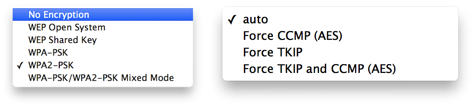

### DoS

无线信号像阳光和空气一样无处不在，我们在[802.11 系列标准](#系列标准)一节已经展示了：使用相近信道（工作频率）的AP之间会产生无意的相互干扰，这种干扰在小范围、高密度AP场景中尤其严重。拒绝服务攻击的效果是服务质量、服务可用性受到影响，非主动的干扰也能被攻击者模仿其原理实现主动的拒绝服务攻击。不仅如此，伪造数据帧强制无线客户端掉线在无线网络中是一种低成本、易实施的攻击方式，目前并没有特别完善的针对此类强制客户端掉线方式攻击的防御方案。除此之外，诸如暴力破解口令过程也会对AP的CPU资源造成性能消耗，进而影响到AP的数据传输性能，拖累网络连接和数据传输质量。

### Rogue APs

攻击者可以通过把自己精心设计定制的AP悄悄接入到有线网络，实现嗅探有线网络流量、建立内网攻击的跳板和立足点、实施远程无线网络攻击等典型**流氓**AP行为。如下图所示，是一个知名的无线网络安全审计定制专用AP，如果这样一个AP被重新包装一下，就能成为攻击者手中的一个有效的Rogue AP。

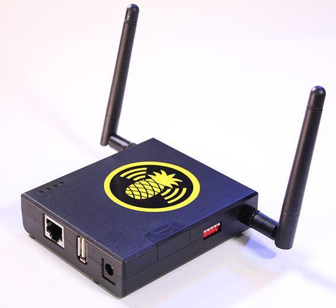

部署无线入侵检测和防护设备来检测企业内部的非授权AP是缓解非法接入点风险的重要手段，同时，合理部署有线网络的802.1X端口认证等手段也可以阻止恶意接入点直接接入到有线网络。

### Wireless Intruders

由于无线网络物理覆盖范围可以达到50米以内，导致网络边界较长，如果配置无线入侵防护设备（WIPS, Wireless Intrusion Prevention System ）需要的设备数量较多。而口令破解、嗅探、DoS等已知无线网络威胁可以随时从任意信号覆盖的位置发起和停止，这就意味着无线闯入者的行踪可以更加隐秘，攻击意图更加难以预测，WIPS需要兼顾部署覆盖率和防御能力的自动更新部署。

### Misconfigured APs

相比较于个人无线网络使用的AP是独立配置和管理的，配置错误只是影响一个无线网络。而企业级无线网络则往往是采用的集中式、批量管理，由于需要兼顾无线客户端设备对新旧无线协议支持程度的差异，在配置AP时可能会启用一些不安全的旧版本协议支持。同时，网络设备的定期更新、安全补丁应急分发等能力，也是考验企业级无线网络部署和管理能力的关键指标。

### Ad Hoc and soft APs

非法接入点对于企业内网安全是一个巨大的威胁，原本通过网络边界访问控制等措施保护得当的有线网络，一个简单的笔记本个人热点、手机个人热点、使用有线网络自建的个人无线网络就可能把一个隔离内网变为脆弱“公”网。

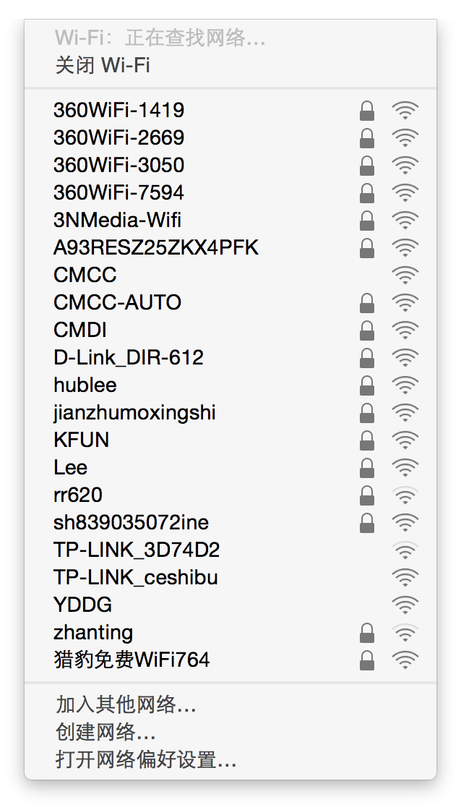

部署无线入侵检测和防护设备来检测企业内部的非授权AP是缓解自建个人无线热点风险的重要手段。

### Evil Twin APs

由于AP可以随意设置ESSID，攻击者利用这个特性可以很容易宣称自己是某个合法AP，诱骗其他无线设备连入。这种**仿冒**AP的行为，被称为**Evil Twin Attack**，实施该行为的AP被称为**Evil Twin AP**。越来越多的便利Evil Twin攻击工具设备和软件的出现恶化了这个问题：基于软件定义驱动的软AP，能够监听无线客户端的无线网络探测请求，主动伪造信号强度更高的**同名**热点强制客户端连入。

基于802.1X的``WPA-企业级``认证是针对这个问题的有效解决方案，但实际配置部署如果不得当（具体查看本书[第三章](../chap0x03/main.md)内容的详解），效果甚至会适得其反：不仅没能阻止客户端**误连**假冒AP，攻击者甚至可以更快的破解掉合法无线网络的认证口令。

### Wireless Phishing

使用Evil Twin AP对连入的客户端投毒一旦成功，可以借助[浏览器缓存](https://www.networkworld.com/article/2243926/wireless/how-wi-fi-attackers-are-poisoning-web-browsers.html)和[DNS解析记录缓存](https://capec.mitre.org/data/definitions/142.html)**投毒**方式实现对目标无线客户端的应用程序更长时间的持久化钓鱼攻击。这就意味着，即使无线客户端脱离了Evil Twin攻击环境，攻击效果依然会持续很长一段时间，与客户端在此之后使用何种联网方式不再有关。

除此之外，一些免费Wi-Fi、公共Wi-Fi由于配置不当，使得内网攻击十分容易得手，内网**投毒**攻击使得无线钓鱼的攻击成功率大大提升。

缓解此类风险的办法主要包括：外出时手机关闭Wi-Fi开关、避免使用免费和公共Wi-Fi、即使使用免费和公共Wi-Fi避免操作金融类应用和网络账户类应用，有条件的情况下在使用安全性不确定的无线网络时开启全局VPN保护数据传输的机密性和完整性。

### Endpoint Attacks

针对无线终端设备的已知攻击方式包括：

* 终端设备的固件（操作系统）漏洞利用
* 终端管理软件漏洞利用
* 无线客户端软件漏洞利用，例如恶意SSID、格式化字符串攻击和XSS/CSRF等等
* 利用无线终端会自动重连已知热点的特性，离线破解该已知热点的PSK口令（详见[第三章](../chap0x03/main.md)相关内容）

缓解此类风险的办法主要包括：外出时手机关闭Wi-Fi开关、保持软件和系统的自动更新。

### Misbehaving Clients

例如很多路由器Web的管理系统存在大量Web应用程序漏洞可被利用，Web管理系统使用弱口令或缺省口令等，一些授权接入到无线网络的客户端会滥用自己的网络连接权限去攻击无线路由器以及内网其他系统和服务。

部署内网安全检测和防护产品，限制和阻止非可信来源的设备访问网络基础设施系统和重要信息系统的管理接口，可以有效的缓解上述内网攻击和滥用行为。


