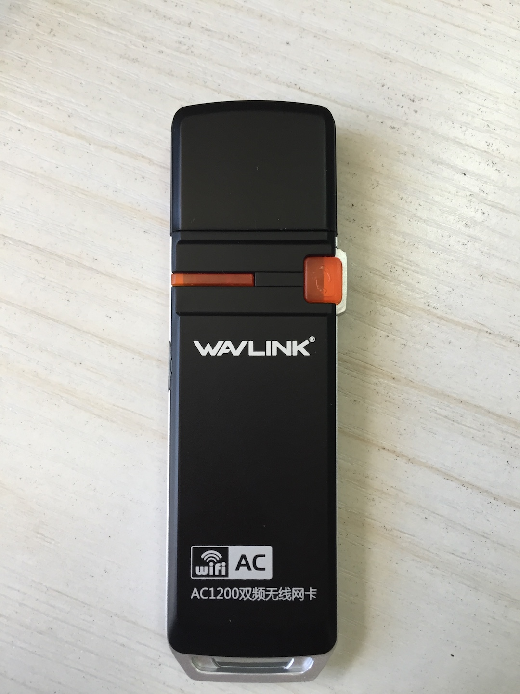
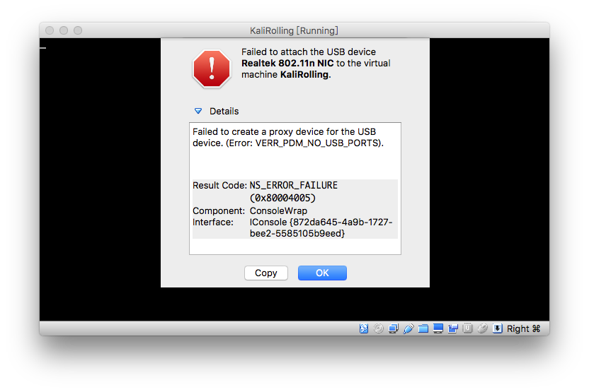

# RTL8812AU

##  睿因（Wavlink） WL-WN688A2



```
Realtek Semiconductor Corp. RTL8812AU 802.11a/b/g/n/ac 2T2R DB WLAN Adapter
```

根据[Kali Linux 2017.1 Release](https://www.kali.org/releases/kali-linux-20171-release/)，该网卡目前已经可以被完美驱动支持了！

需要手工安装驱动

```bash
apt-get update
apt install realtek-rtl88xxau-dkms
```

这个网卡最大的亮点是支持``802.11 AC``，业界首款支持数据帧注入功能、支持``802.11 AC``的无线网卡驱动。

真机测试发现，该网卡连入VirtualBox的Guest OS时必须设置USB控制器为USB 3.0(xHCI)控制器才可以正常连入虚拟机。默认的USB 2.0控制器情况下连入网卡，VirtualBox会报错如下：




```
    max # scan SSIDs: 9
    max scan IEs length: 2304 bytes
    max # sched scan SSIDs: 0
    max # match sets: 0
    max # scan plans: 1
    max scan plan interval: -1
    max scan plan iterations: 0
    Retry short limit: 7
    Retry long limit: 4
    Coverage class: 0 (up to 0m)
    Supported Ciphers:
        * WEP40 (00-0f-ac:1)
        * WEP104 (00-0f-ac:5)
        * TKIP (00-0f-ac:2)
        * CCMP-128 (00-0f-ac:4)
    Available Antennas: TX 0 RX 0
    Supported interface modes:
         * IBSS
         * managed
         * AP
         * monitor
         * P2P-client
         * P2P-GO
    Band 1:
        Capabilities: 0x19e3
            RX LDPC
            HT20/HT40
            Static SM Power Save
            RX HT20 SGI
            RX HT40 SGI
            TX STBC
            RX STBC 1-stream
            Max AMSDU length: 7935 bytes
            DSSS/CCK HT40
        Maximum RX AMPDU length 65535 bytes (exponent: 0x003)
        Minimum RX AMPDU time spacing: 16 usec (0x07)
        HT Max RX data rate: 300 Mbps
        HT TX/RX MCS rate indexes supported: 0-15
        Bitrates (non-HT):
            * 1.0 Mbps
            * 2.0 Mbps
            * 5.5 Mbps
            * 11.0 Mbps
            * 6.0 Mbps
            * 9.0 Mbps
            * 12.0 Mbps
            * 18.0 Mbps
            * 24.0 Mbps
            * 36.0 Mbps
            * 48.0 Mbps
            * 54.0 Mbps
        Frequencies:
            * 2412 MHz [1] (20.0 dBm)
            * 2417 MHz [2] (20.0 dBm)
            * 2422 MHz [3] (20.0 dBm)
            * 2427 MHz [4] (20.0 dBm)
            * 2432 MHz [5] (20.0 dBm)
            * 2437 MHz [6] (20.0 dBm)
            * 2442 MHz [7] (20.0 dBm)
            * 2447 MHz [8] (20.0 dBm)
            * 2452 MHz [9] (20.0 dBm)
            * 2457 MHz [10] (20.0 dBm)
            * 2462 MHz [11] (20.0 dBm)
            * 2467 MHz [12] (20.0 dBm)
            * 2472 MHz [13] (20.0 dBm)
            * 2484 MHz [14] (20.0 dBm)
    Band 2:
        Capabilities: 0x19e3
            RX LDPC
            HT20/HT40
            Static SM Power Save
            RX HT20 SGI
            RX HT40 SGI
            TX STBC
            RX STBC 1-stream
            Max AMSDU length: 7935 bytes
            DSSS/CCK HT40
        Maximum RX AMPDU length 65535 bytes (exponent: 0x003)
        Minimum RX AMPDU time spacing: 16 usec (0x07)
        HT Max RX data rate: 300 Mbps
        HT TX/RX MCS rate indexes supported: 0-15
        VHT Capabilities (0x000010b0):
            Max MPDU length: 3895
            Supported Channel Width: neither 160 nor 80+80
            RX LDPC
            short GI (80 MHz)
            TX STBC
            SU Beamformee
        VHT RX MCS set:
            1 streams: MCS 0-9
            2 streams: MCS 0-9
            3 streams: not supported
            4 streams: not supported
            5 streams: not supported
            6 streams: not supported
            7 streams: not supported
            8 streams: not supported
        VHT RX highest supported: 866 Mbps
        VHT TX MCS set:
            1 streams: MCS 0-9
            2 streams: MCS 0-9
            3 streams: not supported
            4 streams: not supported
            5 streams: not supported
            6 streams: not supported
            7 streams: not supported
            8 streams: not supported
        VHT TX highest supported: 866 Mbps
        Bitrates (non-HT):
            * 6.0 Mbps
            * 9.0 Mbps
            * 12.0 Mbps
            * 18.0 Mbps
            * 24.0 Mbps
            * 36.0 Mbps
            * 48.0 Mbps
            * 54.0 Mbps
        Frequencies:
            * 5170 MHz [34] (30.0 dBm)
            * 5180 MHz [36] (30.0 dBm)
            * 5190 MHz [38] (30.0 dBm)
            * 5200 MHz [40] (30.0 dBm)
            * 5210 MHz [42] (30.0 dBm)
            * 5220 MHz [44] (30.0 dBm)
            * 5230 MHz [46] (30.0 dBm)
            * 5240 MHz [48] (30.0 dBm)
            * 5260 MHz [52] (30.0 dBm) (radar detection)
            * 5280 MHz [56] (30.0 dBm) (radar detection)
            * 5290 MHz [58] (30.0 dBm) (radar detection)
            * 5300 MHz [60] (30.0 dBm) (radar detection)
            * 5310 MHz [62] (30.0 dBm) (radar detection)
            * 5320 MHz [64] (30.0 dBm) (radar detection)
            * 5500 MHz [100] (30.0 dBm) (radar detection)
            * 5520 MHz [104] (30.0 dBm) (radar detection)
            * 5540 MHz [108] (30.0 dBm) (radar detection)
            * 5560 MHz [112] (30.0 dBm) (radar detection)
            * 5580 MHz [116] (30.0 dBm) (radar detection)
            * 5600 MHz [120] (30.0 dBm) (radar detection)
            * 5620 MHz [124] (30.0 dBm) (radar detection)
            * 5640 MHz [128] (30.0 dBm) (radar detection)
            * 5660 MHz [132] (30.0 dBm) (radar detection)
            * 5680 MHz [136] (30.0 dBm) (radar detection)
            * 5700 MHz [140] (30.0 dBm) (radar detection)
            * 5720 MHz [144] (30.0 dBm) (radar detection)
            * 5745 MHz [149] (30.0 dBm)
            * 5765 MHz [153] (30.0 dBm)
            * 5785 MHz [157] (30.0 dBm)
            * 5805 MHz [161] (30.0 dBm)
            * 5825 MHz [165] (30.0 dBm)
            * 5845 MHz [169] (30.0 dBm)
            * 5920 MHz [184] (30.0 dBm)
            * 5940 MHz [188] (30.0 dBm)
            * 5960 MHz [192] (30.0 dBm)
            * 5980 MHz [196] (30.0 dBm)
            * 6000 MHz [200] (30.0 dBm)
            * 6020 MHz [204] (30.0 dBm)
            * 6040 MHz [208] (30.0 dBm)
            * 6060 MHz [212] (30.0 dBm)
            * 6080 MHz [216] (30.0 dBm)
    Supported commands:
         * new_interface
         * set_interface
         * new_key
         * start_ap
         * new_station
         * set_bss
         * join_ibss
         * set_pmksa
         * del_pmksa
         * flush_pmksa
         * remain_on_channel
         * frame
         * set_wiphy_netns
         * set_channel
         * connect
         * disconnect
    Supported TX frame types:
         * IBSS: 0x00 0x10 0x20 0x30 0x40 0x50 0x60 0x70 0x80 0x90 0xa0 0xb0 0xc0 0xd0 0xe0 0xf0
         * managed: 0x00 0x10 0x20 0x30 0x40 0x50 0x60 0x70 0x80 0x90 0xa0 0xb0 0xc0 0xd0 0xe0 0xf0
         * AP: 0x00 0x10 0x20 0x30 0x40 0x50 0x60 0x70 0x80 0x90 0xa0 0xb0 0xc0 0xd0 0xe0 0xf0
         * AP/VLAN: 0x00 0x10 0x20 0x30 0x40 0x50 0x60 0x70 0x80 0x90 0xa0 0xb0 0xc0 0xd0 0xe0 0xf0
         * P2P-client: 0x00 0x10 0x20 0x30 0x40 0x50 0x60 0x70 0x80 0x90 0xa0 0xb0 0xc0 0xd0 0xe0 0xf0
         * P2P-GO: 0x00 0x10 0x20 0x30 0x40 0x50 0x60 0x70 0x80 0x90 0xa0 0xb0 0xc0 0xd0 0xe0 0xf0
    Supported RX frame types:
         * IBSS: 0xd0
         * managed: 0x40 0xd0
         * AP: 0x00 0x20 0x40 0xa0 0xb0 0xc0 0xd0
         * AP/VLAN: 0x00 0x20 0x40 0xa0 0xb0 0xc0 0xd0
         * P2P-client: 0x40 0xd0
         * P2P-GO: 0x00 0x20 0x40 0xa0 0xb0 0xc0 0xd0
    WoWLAN support:
         * wake up on anything (device continues operating normally)
    software interface modes (can always be added):
         * monitor
    interface combinations are not supported
    Device supports scan flush.
```

```bash
# lsusb -t
/:  Bus 02.Port 1: Dev 1, Class=root_hub, Driver=xhci_hcd/6p, 5000M
    |__ Port 1: Dev 2, If 0, Class=Vendor Specific Class, Driver=8812au, 5000M

# lshw -class bus
     *-usbhost:0
          product: xHCI Host Controller
          vendor: Linux 4.9.0-kali4-amd64 xhci-hcd
          physical id: 0
          bus info: usb@1
          logical name: usb1
          version: 4.09
          capabilities: usb-2.00
          configuration: driver=hub slots=8 speed=480Mbit/s

# uname -a
Linux KaliRolling 4.9.0-kali4-amd64 #1 SMP Debian 4.9.30-2kali1 (2017-06-22) x86_64 GNU/Linux


# dkms status
realtek-rtl88xxau, 4.3.21~20170330, 4.9.0-kali4-amd64, x86_64: installed (original_module exists)
rtl8812AU, 4.3.14, 4.6.0-kali1-amd64, x86_64: installed
rtl8812AU, 4.3.14, 4.9.0-kali4-amd64, x86_64: built
virtualbox-guest, 5.1.18, 4.6.0-kali1-amd64, x86_64: installed
virtualbox-guest, 5.1.18, 4.9.0-kali4-amd64, x86_64: installed
```


## 以下内容已过时（2017-08-02）

Kali 2.0（Linux kali 4.0.0-kali1-amd64 #1 SMP Debian 4.0.4-1+kali2 (2015-06-03) x86_64 GNU/Linux）原生并没有包含支持该网卡的驱动，经过研究和实验，最终使用了以下方案不完美的搞定了该网卡在Kali 2.0下的驱动：

可以实现的特性：

* ifconfig可见网卡
* iw可以查看和管理无线网卡
* 可以设置为AP模式（hostapd）

暂时不支持的特性：

* 无法设置为监听模式

```bash
apt-get update && apt-get install dkms
git clone https://github.com/abperiasamy/rtl8812AU_8821AU_linux
cd rtl8812AU_8821AU_linux && cp -R . /usr/src/rtl8812AU_8821AU_linux-1.0
dkms add -m rtl8812AU_8821AU_linux -v 1.0
dkms build -m rtl8812AU_8821AU_linux -v 1.0
dkms install -m rtl8812AU_8821AU_linux -v 1.0
modprobe -a 8812au
```

```
    max # scan SSIDs: 9
    max scan IEs length: 2304 bytes
    Retry short limit: 7
    Retry long limit: 4
    Coverage class: 0 (up to 0m)
    Supported Ciphers:
        * WEP40 (00-0f-ac:1)
        * WEP104 (00-0f-ac:5)
        * TKIP (00-0f-ac:2)
        * CCMP (00-0f-ac:4)
    Available Antennas: TX 0 RX 0
    Supported interface modes:
         * IBSS
         * managed
         * AP
         * monitor
         * P2P-client
         * P2P-GO
    Band 1:
        Capabilities: 0x1862
            HT20/HT40
            Static SM Power Save
            RX HT20 SGI
            RX HT40 SGI
            No RX STBC
            Max AMSDU length: 7935 bytes
            DSSS/CCK HT40
        Maximum RX AMPDU length 65535 bytes (exponent: 0x003)
        Minimum RX AMPDU time spacing: 16 usec (0x07)
        HT TX/RX MCS rate indexes supported: 0-15, 32
        Bitrates (non-HT):
            * 1.0 Mbps
            * 2.0 Mbps
            * 5.5 Mbps
            * 11.0 Mbps
            * 6.0 Mbps
            * 9.0 Mbps
            * 12.0 Mbps
            * 18.0 Mbps
            * 24.0 Mbps
            * 36.0 Mbps
            * 48.0 Mbps
            * 54.0 Mbps
        Frequencies:
            * 2412 MHz [1] (20.0 dBm)
            * 2417 MHz [2] (20.0 dBm)
            * 2422 MHz [3] (20.0 dBm)
            * 2427 MHz [4] (20.0 dBm)
            * 2432 MHz [5] (20.0 dBm)
            * 2437 MHz [6] (20.0 dBm)
            * 2442 MHz [7] (20.0 dBm)
            * 2447 MHz [8] (20.0 dBm)
            * 2452 MHz [9] (20.0 dBm)
            * 2457 MHz [10] (20.0 dBm)
            * 2462 MHz [11] (20.0 dBm)
            * 2467 MHz [12] (20.0 dBm) (no IR)
            * 2472 MHz [13] (20.0 dBm)
            * 2484 MHz [14] (20.0 dBm) (no IR)
    Band 2:
        Capabilities: 0x1862
            HT20/HT40
            Static SM Power Save
            RX HT20 SGI
            RX HT40 SGI
            No RX STBC
            Max AMSDU length: 7935 bytes
            DSSS/CCK HT40
        Maximum RX AMPDU length 65535 bytes (exponent: 0x003)
        Minimum RX AMPDU time spacing: 16 usec (0x07)
        HT TX/RX MCS rate indexes supported: 0-15, 32
        Bitrates (non-HT):
            * 6.0 Mbps
            * 9.0 Mbps
            * 12.0 Mbps
            * 18.0 Mbps
            * 24.0 Mbps
            * 36.0 Mbps
            * 48.0 Mbps
            * 54.0 Mbps
        Frequencies:
            * 5170 MHz [34] (disabled)
            * 5180 MHz [36] (20.0 dBm) (no IR)
            * 5190 MHz [38] (20.0 dBm) (no IR)
            * 5200 MHz [40] (20.0 dBm) (no IR)
            * 5210 MHz [42] (20.0 dBm) (no IR)
            * 5220 MHz [44] (20.0 dBm) (no IR)
            * 5230 MHz [46] (20.0 dBm) (no IR)
            * 5240 MHz [48] (20.0 dBm) (no IR)
            * 5260 MHz [52] (20.0 dBm) (no IR, radar detection)
              DFS state: usable (for 784 sec)
              DFS CAC time: 60000 ms
            * 5280 MHz [56] (20.0 dBm) (no IR, radar detection)
              DFS state: usable (for 784 sec)
              DFS CAC time: 60000 ms
            * 5300 MHz [60] (20.0 dBm) (no IR, radar detection)
              DFS state: usable (for 784 sec)
              DFS CAC time: 60000 ms
            * 5320 MHz [64] (20.0 dBm) (no IR, radar detection)
              DFS state: usable (for 784 sec)
              DFS CAC time: 60000 ms
            * 5500 MHz [100] (20.0 dBm) (no IR, radar detection)
              DFS state: usable (for 784 sec)
              DFS CAC time: 60000 ms
            * 5520 MHz [104] (20.0 dBm) (no IR, radar detection)
              DFS state: usable (for 784 sec)
              DFS CAC time: 60000 ms
            * 5540 MHz [108] (20.0 dBm) (no IR, radar detection)
              DFS state: usable (for 784 sec)
              DFS CAC time: 60000 ms
            * 5560 MHz [112] (20.0 dBm) (no IR, radar detection)
              DFS state: usable (for 784 sec)
              DFS CAC time: 60000 ms
            * 5580 MHz [116] (20.0 dBm) (no IR, radar detection)
              DFS state: usable (for 784 sec)
              DFS CAC time: 60000 ms
            * 5600 MHz [120] (20.0 dBm) (no IR, radar detection)
              DFS state: usable (for 784 sec)
              DFS CAC time: 60000 ms
            * 5620 MHz [124] (20.0 dBm) (no IR, radar detection)
              DFS state: usable (for 784 sec)
              DFS CAC time: 60000 ms
            * 5640 MHz [128] (20.0 dBm) (no IR, radar detection)
              DFS state: usable (for 784 sec)
              DFS CAC time: 60000 ms
            * 5660 MHz [132] (20.0 dBm) (no IR, radar detection)
              DFS state: usable (for 784 sec)
              DFS CAC time: 60000 ms
            * 5680 MHz [136] (20.0 dBm) (no IR, radar detection)
              DFS state: usable (for 784 sec)
              DFS CAC time: 60000 ms
            * 5700 MHz [140] (20.0 dBm) (no IR, radar detection)
              DFS state: usable (for 784 sec)
              DFS CAC time: 60000 ms
            * 5745 MHz [149] (20.0 dBm) (no IR)
            * 5765 MHz [153] (20.0 dBm) (no IR)
            * 5785 MHz [157] (20.0 dBm) (no IR)
            * 5805 MHz [161] (20.0 dBm) (no IR)
            * 5825 MHz [165] (20.0 dBm) (no IR)
            * 5920 MHz [184] (disabled)
            * 5940 MHz [188] (disabled)
            * 5960 MHz [192] (disabled)
            * 5980 MHz [196] (disabled)
            * 6000 MHz [200] (disabled)
            * 6020 MHz [204] (disabled)
            * 6040 MHz [208] (disabled)
            * 6060 MHz [212] (disabled)
            * 6080 MHz [216] (disabled)
    Supported commands:
         * new_interface
         * set_interface
         * new_key
         * start_ap
         * new_station
         * set_bss
         * join_ibss
         * set_pmksa
         * del_pmksa
         * flush_pmksa
         * remain_on_channel
         * frame
         * set_channel
         * connect
         * disconnect
    Supported TX frame types:
         * IBSS: 0x00 0x10 0x20 0x30 0x40 0x50 0x60 0x70 0x80 0x90 0xa0 0xb0 0xc0 0xd0 0xe0 0xf0
         * managed: 0x00 0x10 0x20 0x30 0x40 0x50 0x60 0x70 0x80 0x90 0xa0 0xb0 0xc0 0xd0 0xe0 0xf0
         * AP: 0x00 0x10 0x20 0x30 0x40 0x50 0x60 0x70 0x80 0x90 0xa0 0xb0 0xc0 0xd0 0xe0 0xf0
         * AP/VLAN: 0x00 0x10 0x20 0x30 0x40 0x50 0x60 0x70 0x80 0x90 0xa0 0xb0 0xc0 0xd0 0xe0 0xf0
         * P2P-client: 0x00 0x10 0x20 0x30 0x40 0x50 0x60 0x70 0x80 0x90 0xa0 0xb0 0xc0 0xd0 0xe0 0xf0
         * P2P-GO: 0x00 0x10 0x20 0x30 0x40 0x50 0x60 0x70 0x80 0x90 0xa0 0xb0 0xc0 0xd0 0xe0 0xf0
    Supported RX frame types:
         * IBSS: 0xd0
         * managed: 0x40 0xd0
         * AP: 0x00 0x20 0x40 0xa0 0xb0 0xc0 0xd0
         * AP/VLAN: 0x00 0x20 0x40 0xa0 0xb0 0xc0 0xd0
         * P2P-client: 0x40 0xd0
         * P2P-GO: 0x00 0x20 0x40 0xa0 0xb0 0xc0 0xd0
    software interface modes (can always be added):
         * monitor
    interface combinations are not supported
    Device supports scan flush.
```


