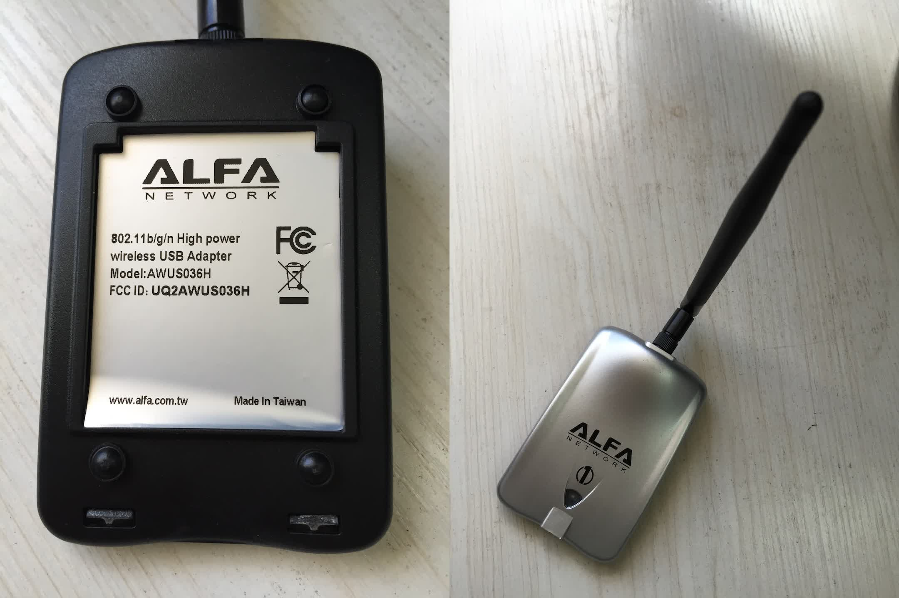

# ALFA-AWUS036H




```
	max # scan SSIDs: 4
	max scan IEs length: 2257 bytes
	Retry short limit: 7
	Retry long limit: 4
	Coverage class: 0 (up to 0m)
	Device supports RSN-IBSS.
	Supported Ciphers:
		* WEP40 (00-0f-ac:1)
		* WEP104 (00-0f-ac:5)
		* TKIP (00-0f-ac:2)
		* CCMP (00-0f-ac:4)
		* 00-0f-ac:10
		* GCMP (00-0f-ac:8)
		* 00-0f-ac:9
	Available Antennas: TX 0 RX 0
	Supported interface modes:
		 * IBSS
		 * managed
		 * AP
		 * AP/VLAN
		 * WDS
		 * monitor
		 * mesh point
	Band 1:
		Capabilities: 0x172
			HT20/HT40
			Static SM Power Save
			RX Greenfield
			RX HT20 SGI
			RX HT40 SGI
			RX STBC 1-stream
			Max AMSDU length: 3839 bytes
			No DSSS/CCK HT40
		Maximum RX AMPDU length 65535 bytes (exponent: 0x003)
		Minimum RX AMPDU time spacing: 2 usec (0x04)
		HT RX MCS rate indexes supported: 0-7, 32
		TX unequal modulation not supported
		HT TX Max spatial streams: 1
		HT TX MCS rate indexes supported may differ
		Bitrates (non-HT):
			* 1.0 Mbps
			* 2.0 Mbps (short preamble supported)
			* 5.5 Mbps (short preamble supported)
			* 11.0 Mbps (short preamble supported)
			* 6.0 Mbps
			* 9.0 Mbps
			* 12.0 Mbps
			* 18.0 Mbps
			* 24.0 Mbps
```
