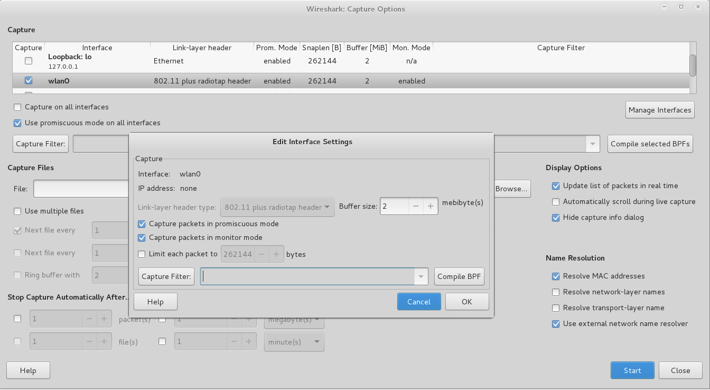

# 实验

## 无线网卡配置与使用

```bash
# 查看和修改无线网卡参数配置
iw

# 无线网卡参数配置命令
iwconfig

# 查看所有活动（不包括被禁用）网卡
ifconfig

# 查看所有（包括被禁用）网卡
ifconfig -a

# 查看物理网卡的硬件和软件特性支持情况
iw phy
iw list

# 命令行下扫描附近的无线网络，注意自行替换wlan0为当前主机识别出的可用网卡
# 确保无线网卡的工作模式是managed，且Access Poit值为Not-Associated
iw dev wlan0 scan

# 仅查看附近无线网络的SSID
iw dev wlan0 scan | grep SSID

# 仅查看附近无线网络的SSID，自动处理UTF-8编码的SSID名称
iw dev wlan0 scan | grep SSID | xargs -0 echo -e

# 查看USB设备所使用的驱动信息及其他详细信息（即使系统没有支持当前无线网卡的驱动程序，但通过该命令可以看到所有连接成功的USB设备）
lsusb -v

# 以树形结构打印输出USB设备基本信息及其驱动加载情况
lsusb -t

# 查看PCI接口设备所使用驱动的详细信息
lspci -k

# 查看硬件驱动和配置详细信息
# 需要手工安装： apt-get install lshw
lshw

# 简要模式打印输出设备中的所有硬件设备及其对应驱动信息
lshw -short

# 上一条命令输出结果里的class字段标识的设备类型，在此处可以作为筛选条件过滤输出结果
lshw -class bus

# 无线设备（启用或禁用）管理
# 查看无线设备的软硬件开关禁用状态，输出结果的第一列数字是指定设备的唯一编号
rfkill list

# 如果无线设备的Soft blocked状态为yes，则可以通过以下命令解除禁用状态
rfkill unblock 0

# 查看指定无线网卡的当前工作模式（如果是Monitor Mode，则可以查看当前无线网卡的监听channel）
iw dev wlan0mon info
```

### 查看无线网卡支持的无线协议类型

```bash
# 查看当前网卡支持的监听 channel
# iw phy <phy_name> channels 
# 使用 iw phy 可以查看到 <phy_name>
iw phy phy1 channels
```

支持双频（2.4GHz/5GHz）无线网卡的典型输出如下：

```bash
# 上述命令的示例输出信息如下
Band 1:
        * 2412 MHz [1]
          Maximum TX power: 20.0 dBm
# Channel widths 字段中的 HT40+/HT40-/VHT80 取值含义参考如下链接
# https://wiki.openwrt.org/doc/uci/wireless
# HT20 (single 20MHz channel),
# HT40- (2x 20MHz channels, primary/control channel is upper, secondary channel is below)
# HT40+ (2x 20MHz channels, primary/control channel is lower, secondary channel is above).
# HT40 (2x 20Mz channels, auto selection of upper or lower secondary channel on versions 14.07 and above). 
# NONE (disables 802.11n rates and enforce the usage of legacy 802.11 b/g/a rates)
# VHT20 / VHT40 / VHT80 / VHT160 (channel width in 802.11ac, extra channels are picked according to the specification) 
          Channel widths: 20MHz HT40+
        * 2432 MHz [5]
          Maximum TX power: 20.0 dBm
          Channel widths: 20MHz HT40- HT40+
        * 2472 MHz [13]
          Maximum TX power: 20.0 dBm
          Channel widths: 20MHz HT40-
        * 2484 MHz [14]
          Maximum TX power: 20.0 dBm
          No IR
          Channel widths: 20MHz
Band 2:
        * 5180 MHz [36]
          Maximum TX power: 20.0 dBm
          Channel widths: 20MHz HT40+ VHT80
        * 5200 MHz [40]
          Maximum TX power: 20.0 dBm
          No IR
          Channel widths: 20MHz HT40- HT40+ VHT80
        * 5220 MHz [44]
          Maximum TX power: 20.0 dBm
          No IR
          Channel widths: 20MHz HT40- HT40+ VHT80
        * 5240 MHz [48]
          Maximum TX power: 20.0 dBm
          No IR
          Channel widths: 20MHz HT40- HT40+ VHT80
        * 5260 MHz [52]
          Maximum TX power: 20.0 dBm
          No IR
          Radar detection
          Channel widths: 20MHz HT40- HT40+ VHT80
          DFS state: usable (for 1852 sec)
          DFS CAC time: 60000 ms
        * 5280 MHz [56]
          Maximum TX power: 20.0 dBm
          No IR
          Radar detection
          Channel widths: 20MHz HT40- HT40+ VHT80
          DFS state: usable (for 1852 sec)
          DFS CAC time: 60000 ms
```

以上输出信息中可以发现同时支持 2.4 GHz 和 5 GHz 以及 2 种频率模式下都支持 HT 模式，说明该网卡支持 802.11 a/b/g/n/ac 。

支持单频（2.4GHz）无线网卡的典型输出如下：

```bash
Band 1:
        * 2412 MHz [1]
          Maximum TX power: 20.0 dBm
          Channel widths: 20MHz HT40+
        * 2417 MHz [2]
          Maximum TX power: 20.0 dBm
          Channel widths: 20MHz HT40+
        * 2422 MHz [3]
          Maximum TX power: 20.0 dBm
          Channel widths: 20MHz HT40+
        * 2427 MHz [4]
          Maximum TX power: 20.0 dBm
          Channel widths: 20MHz HT40+
        * 2432 MHz [5]
          Maximum TX power: 20.0 dBm
          Channel widths: 20MHz HT40- HT40+
        * 2437 MHz [6]
          Maximum TX power: 20.0 dBm
          Channel widths: 20MHz HT40- HT40+
        * 2442 MHz [7]
          Maximum TX power: 20.0 dBm
          Channel widths: 20MHz HT40- HT40+
        * 2447 MHz [8]
          Maximum TX power: 20.0 dBm
          Channel widths: 20MHz HT40- HT40+
        * 2452 MHz [9]
          Maximum TX power: 20.0 dBm
          Channel widths: 20MHz HT40- HT40+
        * 2457 MHz [10]
          Maximum TX power: 20.0 dBm
          Channel widths: 20MHz HT40-
        * 2462 MHz [11]
          Maximum TX power: 20.0 dBm
          Channel widths: 20MHz HT40-
        * 2467 MHz [12]
          Maximum TX power: 20.0 dBm
          Channel widths: 20MHz HT40-
        * 2472 MHz [13]
          Maximum TX power: 20.0 dBm
          Channel widths: 20MHz HT40-
        * 2484 MHz [14] (disabled)
```

以上输出信息中可以发现仅支持 2.4 GHz 但同时支持 HT 模式，说明该网卡支持 802.11 b/g/n。如果上述命令的输出信息中不支持 HT 模式，则说明该网卡不支持 802.11n，仅支持 802.11 b/g。

## 无线数据抓包

3种不同的无线数据抓包方式（wireshark、tshark、airodump-ng）都可以抓取包含802.11完整帧结构的数据报文（Monitor模式下）或仅抓取802.11帧payload信息部分（Managed模式下）。

注意，只有使用wireshark或tshark才能捕获物理层信息（[radiotap](radiotap.md)，包含无线数据帧所工作的channel）。airodump-ng经过实际抓包测试发现在捕获的数据帧中并不包含radiotap帧结构。

为了获得指定STA（例如手机、笔记本电脑等）和AP之间的完整通信数据，需要设置无线网卡工作在指定channel（例如对于airodump-ng来说，可以指定--channel N来强制网卡仅监听在channel N），要避免无线网卡工作在channel hopping模式。

### wireshark

[](attach/chap0x02/media/wireshark_turn_on_monitor_mode.png)

在确保wireshark已将指定网卡开启为监听模式的情况下，在命令行输入以下命令，查看无线网卡Mode是不是已经设置为：Monitor。

> 提示：双击网卡列表中的指定网卡即可以编辑该无线网卡是否开启监听模式，如上图所示。

```bash
iwconfig
```


### tshark / tcpdump

```bash
# 自行查阅帮助手册
tshark -h
man tshark
tcpdump -h
man tcpdump
```

### airodump-ng

```bash
# 自行查阅帮助手册
airodump-ng --help
man airodump-ng
```

一个典型的抓包流程（root权限）如下：

```bash
# 解决部分无线网卡在Kali 2.0系统中设置监听模式失败，杀死可能会导致aircrack-ng套件工作异常的相关进程
airmon-ng check kill

# 设置wlan0工作在监听模式
airmon-ng start wlan0

# 检查无线网卡是否已处于启用状态，以下命令的输出中应出现网卡名：wlan0mon
ifconfig

# 检查无线网卡是否已切换到监听模式，wlan0mon的Mode应显示为：Monitor
iwconfig 

# 或者可以用这一条命令代替上述3条命令（杀死可能影响抓包稳定性的进程）
airmon-ng check kill

# 开始以channel hopping模式抓包
airodump-ng wlan0mon
# CTRL-C退出当前抓包

# 选择一个"感兴趣"的目标AP进行定向（指定工作channel）监听并将结果保存到本地文件
airodump-ng wlan0mon --channel 13 -w saved --beacons --wps
# 以上命令会在当前目录保存文件名为saved-NN的几个文件：.cap、.csv、.kismet.csv、.kismet.netxml
# 其中NN按照从01开始编号，重复执行上述命令多次，捕获到的数据报文会保存在不同编号的.cap文件中
# 使用 --beacons 参数可以记录每一个独立BSSID发送的所有beacon frame
# 如果不使用上述参数，airodump-ng 默认对一个独立BSSID只记录一个beacon frame
# 假如某个AP在抓包过程中更换了ESSID，则抓包结果会遗失大部分ESSID
# 不使用 --beacons 参数可以减少大量的I/O写磁盘次数（大部分AP每秒会发送10个beacon frame）
# --wps 可以显示开启了WPS功能的AP的WPS相关信息

# 如果希望只监听指定AP的所有通信数据报文，可以使用以下命令
airodump-ng -c 8 --bssid <bssid> -w saved wlan0mon
# 上述命令中<bssid>替换为实际目标AP的BSSID值即可
```

除了使用 `airmon-ng` 开启网卡的监听模式之外，还可以使用 [iw](https://wireless.wiki.kernel.org/en/users/documentation/iw) 对网卡的运行时参数进行深度配置。

```bash
# 增加（若干）虚拟网卡工作在监听模式（部分网卡支持虚拟网卡独立于主网卡的工作模式
# iw dev <interface_name> interface add <virtual_if_name> type monitor flags <flag_options>
# none:     no special flags
# fcsfail:  show frames with FCS errors
# control:  show control frames
# otherbss: show frames from other BSSes
# cook:     use cooked mode
# active:   use active mode (ACK incoming unicast packets)
iw dev wlan0 interface add mon0 type monitor flags none

# 开启第 2 块虚拟网卡用于监听模式，部分网卡可能会开启失败，取决于硬件和驱动支持
iw dev wlan0 interface add mon1 type monitor flags none

# （可选）如果添加虚拟网卡开启监听模式失败，可以直接对物理网卡设置监听模式
iw dev wlan0 set monitor none

# 定时更改虚拟网卡的监听 channel
# 2.4 GHz 网卡
for i in $(seq 0 1000);do echo $(($i % 13 + 1)) && iwconfig wlan0 channel $(($i % 13 + 1)) && sleep 2;done
```

命令行模式的键盘交互快捷键定义

```
[a]: Select active areas by cycling through these display options: AP+STA; AP+STA+ACK; AP only; STA only
[d]: Reset sorting to defaults (Power)
[i]: Invert sorting algorithm
[m]: Mark the selected AP or cycle through different colors if the selected AP is already marked
[r]: (De-)Activate realtime sorting - applies sorting algorithm everytime the display will be redrawn
[s]: Change column to sort by, which currently includes: First seen; BSSID; PWR level; Beacons; Data packets; Packet rate; Channel; Max. data rate; Encryption; Strongest Ciphersuite; Strongest Authentication; ESSID
[SPACE]: Pause display redrawing/ Resume redrawing
[TAB]: Enable/Disable scrolling through AP list
[UP]: Select the AP prior to the currently marked AP in the displayed list if available
[DOWN]: Select the AP after the currently marked AP if available
```

## Wireshark的802.11 PSK解密功能

Edit->Preferences->Protocol->IEEE 802.11->Enable decryption->descryption keys选择wpa-pwd ，填入已知共享密钥保存。

在IEEE 802.11的首选项设置面板，勾选启用：Enable decryption功能。

## 实验练习题

通过分析抓包保存的pcap文件：

* 查看统计当前信号覆盖范围内一共有多少独立的SSID？其中是否包括隐藏SSID？哪些无线热点是加密/非加密的？加密方式是否可知？
* 如何分析出一个指定手机在抓包时间窗口内在手机端的无线网络列表可以看到哪些SSID？这台手机尝试连接了哪些SSID？最终加入了哪些SSID？
* SSID包含在哪些类型的802.11帧？

## 参考资料

- [Wireless Sniffing with Wireshark](http://sec.cuc.edu.cn/huangwei/wiki/attachments/textbook/mis/chap0x02/Wireless Sniffing with Wireshark.pdf)
- [IEEE 802.11 frame format (PPT)](http://sec.cuc.edu.cn/huangwei/wiki/attachments/textbook/mis/chap0x02/802-11-Frame_E_C.pdf)
- [https://wiki.wireshark.org/Wi-Fi](https://wiki.wireshark.org/Wi-Fi)
- [https://www.wireshark.org/docs/dfref/r/radio.html](https://www.wireshark.org/docs/dfref/r/radio.html)
- [https://www.wireshark.org/docs/dfref/w/wlan.html](https://www.wireshark.org/docs/dfref/w/wlan.html)
- [https://www.wireshark.org/docs/dfref/w/wlan_mgt.html](https://www.wireshark.org/docs/dfref/w/wlan_mgt.html)
- [airodump-ng的官方使用手册](http://www.aircrack-ng.org/doku.php?id=airodump-ng)
- [Aircrack-ng Newbie Guide for Linux](https://www.aircrack-ng.org/doku.php?id=newbie_guide)

