# 第二章 无线接入网监听

## 实战无线网络监听

### 无线网络监听的基本条件

无线网络监听的基本条件首先是能获取到原始的无线数据，具体来说又分为硬件和软件依赖条件。硬件上来说，我们需要支持可以工作在``监听模式``的[无线网卡（通常我们会使用USB接口的无线网卡）](wifi_card_list.md)。软件上来说，需要可以对该无线网卡识别和配置的底层驱动和用户态的配置软件或API。在满足了原始无线数据获取能力之后，我们就可以像在有线网络中一样使用抓包软件（例如，wireshark、tshark、airodump-ng等）进行无线数据的获取和转存（通常保存为pcap格式文件）了。

802.11无线网络中，由于STA的工作模式限制，无线网卡需要通过``channel hopping``技术在多个信道之间切换才能尽可能的去模拟对所有信道的数据获取（监听），由于``channel hopping``的技术限制，事实上对于任意一个指定的信道，在一个完整的抓包周期内是无法获取到所有的通信数据的（只有在网卡监听在指定信道的时隙内才能监听到该信道在该监听时隙上的通信数据，一旦切换到下一个其他信道，则上一个信道的通信数据就不再能收集到，直到重新又监听到该指定信道时）。在实战中，我们通过``channel hopping``来摸清当前所在位置有哪些无线网络可用、可被监听到，一旦确认了具体的监听目标网络，会放弃使用``channel hopping``技术，改为指定监听信道方式来进行``定向``抓包。除此之外还需要注意的是，不同无线网卡对802.11协议的支持也有硬件差异，对于802.11协议家族来说，支持``802.11 b/g``协议规范的USB无线网卡是最普遍的，其他诸如``802.11 a/n/ac``协议规范的支持则需要看具体网卡的硬件实现情况。本书的[无线网卡（通常我们会使用USB接口的无线网卡）](wifi_card_list.md)一节记录了本书写作过程中实际采购并测试过的十几种USB无线网卡的硬件能力，供需要动手实践无线网络监听的读者们参考。

在⽆线⽹络安全实验的操作系统选择方面本书选择的是Linux发行版[Kali](https://www.kali.org/)，主要原因是这是一个为渗透测试研究为主的安全研究人员专门量身定制的操作系统，该系统内置了很多信息安全从业人员常用的工具软件和驱动程序。特别对于我们的无线网络监听实战来说，把USB无线网卡接入到Kali之中，你不必再考虑安装驱动程序和相关工具软件的问题，基本可以做到``开箱即用``。

### 无线网卡设置查看基本工具

本节内容涉及到的常用工具使用方法请直接查阅[本章实验指导](exp.md)，概括来说一次无线数据嗅探实验包括以下几个主要步骤：

* 设置网卡进入``监听模式``
* 使用抓包器对指定的``监听模式``无线网卡进行抓包
    * channel hopping模式收集附近无线网络信息
    * 确定抓包目标，进行定向抓包
* 使用报文分析软件对抓包结果文件进行离线分析

在实战无线数据监听时，如果遇到抓不到数据包的情况，建议按照以下故障排除的思路和操作顺序依次排查：

* 硬件相关常见故障排查
    * 更换USB连接接口，有些电脑的不同USB口由于供电能力差异，部分耗电量较大的USB无线网卡可能只能在电脑的特定USB接口上可以正常工作；
    * 对应上一条排查建议，还可以尝试更换USB无线网卡的USB连接线，排除连接线故障原因；
    * 如果是使用的虚拟机环境，建议检查虚拟机的USB设备共享设置。必要时可以启用``USB 3.0兼容``选项或者如果``USB 3.0兼容模式``无法正常识别网卡或网卡无法抓包，可以降级为``USB 2.0兼容模式``尝试故障排查；
* 软件相关常见故障排查
    * ``重启``大法好。无论是虚拟机还是物理主机，有时可能是由于新安装了USB驱动或其他未知不可描述原因，重启或关闭系统再启动（冷启动）就可以解决问题；
    * 使用``tail -F /var/log/messages``，重新连接USB无线网卡，检查该日志中的消息是否有出现一些故障信息报错。尝试在搜索引擎中搜索相关报错信息关键词；
    * 参考[本章实验指导](exp.md)中的其他故障排查建议；

本书推荐的命令行方式进行无线数据监听使用到的主要工具来自于[aircrack-ng工具套装](https://www.aircrack-ng.org/)，这是一个无线网络安全审计的``瑞士军刀``，包含一系列小工具。根据该软件的官网信息，该软件的主要特性如下：

> Monitoring: Packet capture and export of data to text files for further processing by third party tools.

> Attacking: Replay attacks, deauthentication, fake access points and others via packet injection.

> Testing: Checking WiFi cards and driver capabilities (capture and injection).

> Cracking: WEP and WPA PSK (WPA 1 and 2).

在[Kali](https://www.kali.org)中我们可以通过``dpkg -L aircrack-ng``查看当前系统上安装了哪些具体的``aircrack-ng``小工具。

```bash
$ dpkg -L aircrack-ng | grep bin
/usr/bin/aircrack-ng
/usr/bin/airdecap-ng
/usr/bin/airdecloak-ng
/usr/bin/airolib-ng
/usr/bin/besside-ng-crawler
/usr/bin/buddy-ng
/usr/bin/ivstools
/usr/bin/kstats
/usr/bin/makeivs-ng
/usr/bin/packetforge-ng
/usr/bin/wpaclean
/usr/sbin/airbase-ng
/usr/sbin/aireplay-ng
/usr/sbin/airmon-ng
/usr/sbin/airodump-ng
/usr/sbin/airodump-ng-oui-update
/usr/sbin/airserv-ng
/usr/sbin/airtun-ng
/usr/sbin/besside-ng
/usr/sbin/easside-ng
/usr/sbin/tkiptun-ng
/usr/sbin/wesside-ng
```

在完成无线通信数据报文的捕获之后，我们的工作焦点将转移到[⽆线通信数据报⽂分析](#无线通信数据报文分析)。

## ⽆线通信数据报⽂分析

### 802.11 协议提供的⽹络服务类型

基于IEEE 802.11协议构建的无线网络提供的基本服务群（Basic Service Set, BSS）是由许多主机所构成的集合，在这个服务群中的主机之间可以相互通信且拥有相同的基本服务群标识码（BSSID）供这些用户组建一个无线局域网使用。根据[第一章](../chap0x01/main.md)的介绍我们知道，可以是基础设施架构网络（BSS）或独立BSS（IBSS）。

独立BSS架构的无线局域网又称为AdHoc无线网络，可以让不限量的主机实时地架设起无线通信网络。在这种架构中，主机彼此之间可以直接通信，通常情况下都是临时通信需求驱动而搭建。而基础设施架构网络中通常会包含一个访问接入点（AP），它可以将一个或多个WLAN与已有的有线网络进行分布式连接，以提供某个WLAN中两个主机间的通信数据交换，另一方面也使得WLAN中的主机能存取有线网络中的资源。两个或多个BSS通过设置相同的ESSID可以组成一个信号覆盖范围更大的ESS。

在上述两种架构中，IEEE 802.11提供两类共9种网络服务。

#### 主机服务

主机服务让主机（STA）具有正确的收发数据能力，同时也能保证数据传送的安全性。

* **数据封包传送**服务为最基本的网络功能，IEEE 802.11使用自身协议（链路层）将（链路层以上）数据进行封装和传送。
* **身份验证**服务主要用来确认每个主机（STA）的身份。IEEE 802.11通常要求双向式的身份确认，它也允许同一时间一个主机和多个主机（包括AP）进行身份验证。
* 已完成身份认证的STA可以用**解除验证**服务来取消身份认证，一旦取消后连接也同时被取消。
* **隐私保护**服务通过加密机制保护通信数据的机密性。

#### 分布式系统服务

分布式系统服务由分布在不同位置的系统（通常是AP）提供，使IEEE 802.11的封包可以在同一个ESS中的不同BSS间传送，无论主机移动到ESS中的哪个地方都能收到属于它的数据。AP是**唯一**同时提供主机（STA）服务和分布式系统服务的无线网络组件，也是主机与分布式系统间的桥梁。分布式系统服务提供下列5种服务：

* **连接服务**。目的是在STA和AP之间建立一个通信链路。当分布式系统要将数据传送给主机时，必须事先知道这个主机目前是通过哪个AP接入分布式系统的，这些信息都可以由连接服务提供一个主机在被允许经由某个AP传送数据给分布式系统前，必须先和此AP进行连接。通常在一个BS内有一个AP，因此在这个区域内的任意主机若想要与外界进行通信，就必须先与此AP进行连接。这个过程类似注册，当主机完成连接后，AP就会记住这台主机目前在它的管辖范围之内。连接服务通常都由主机启动，用它来与AP进行连接。（注意，在任何时刻一台主机只会和一个AP进行连接，这样才能使分布式系统知道哪个主机是由哪个AP所管辖的，然而一个AP却可以同时与多台主机进行连接。）
* **重连服务**。目的是将一个移动中的主机连接由一个AP转移至另一个AP。当主机从一个服务区移动到另一个服务区时，它将启动重连服务。重连服务会将主机与它所移入的服务区内的AP进行连接，使分布式系统知道此主机已经转移至另一个AP的管辖区域内。重连服务通常也是由主机启动。
* **取消连接服务**。当一台主机数据传送结束时，可以使用取消连接服务对当前已有的连接进行取消。当主机在服务区内移动时，它除了会对新的AP启动重连服务外，还会对旧的AP启动取消连接服务。此服务可以由主机或AP任一方来启动，不论是哪一方启动的另一方都不能拒绝。（需要注意的是AP可能因网络负荷过重而是用取消连接服务对主机取消连接）。
* **分发服务**。此服务主要由BSS中的主机使用。当主机需要传送数据时，会先将数据传送至AP，再由AP通过分布式系统传送至目的地。IEEE802.11并没有规定分布式系统要如何将数据正确的送至目的地，但它说明了在连接、取消连接和重连等服务中，数据应该由哪个AP进行输出以将数据送达至正确的目标地点
* **整合服务**。目的是让数据能够在分布式系统和现有的局域网之间进行传送。整合服务的任务就是将数据从分布式系统转送到相连的局域网络媒介，其主要工作就是将不同的地址空间做一个转换。

### 802.11 协议中的重要理论基础

#### CSMA/CA

IEEE 802.11不采用有线网络中的基于碰撞**检测**的载波监听多路访问（Carrier Sense Multiple Access With Collision Detection, CSMA/CD）技术，而采用了基于碰撞**规避**的载波监听多路访问技术（Carrier Sense Multiple Access with Collision Avoidance, CSMA/CA）。这是WLAN链路层最基本的接入方法，如下图所示是一个简易流程：


* STA发送信息之前，检测信道是否空闲以及空闲的时间是大于IEEE802.11规定的帧间隔时间
* 如果否，该STA就延迟接入，直到当前的传输结束
* 之后，也就是一次成功的传输刚结束，这时碰撞发生率最高，因为所有的STA都延迟等待这一时刻的到来，为进一步减少碰撞，STA选择随机退避再次延迟接入
* 在检测信道的同时倒数计数器，直到其值为0
* 这时，如果其它的Backoff计时器的数值更短，它就赢得了信道的占用权
* 其他的STA检测到信道忙，只有再次延迟接入
* 否则，只有在信道空闲时再发送信息

#### 四次握手协议

IEEE 802.11在CSMA/CA的基础上提供了确认帧ACK，保证在链路层对帧丢失可以检测并重新发送。为了进一步规避碰撞，又引入了RTS/CTS + ACK协议。STA在发送信息之前先发送一个**发送请求控制**（Request to Send, RTS）包给目的STA。如果信道空闲，则目的STA回应一个**清除发送控制**（Clear to Send, CTS）包。如果信道忙，不发送CTS，这样就可以避免不同STA同时向同一STA发送信息。如果源站收到CTS，证明信道空闲，它就可以继续发送有用**数据**。如果该数据需要，目的STA在成功接收后，经过最短帧间隔时隙后就回发确认帧ACK。如果在规定的时间间隙后，源站未收到ACK，则源站就可以判定信息发送失败，可根据需要重发，这样可避免数据丢失。

如下图所示分别展示了在Wireshark中如何通过**显示过滤器**（Display Filter）语法过滤出RTS、CTS和ACK数据帧，并查看数据帧详情信息。

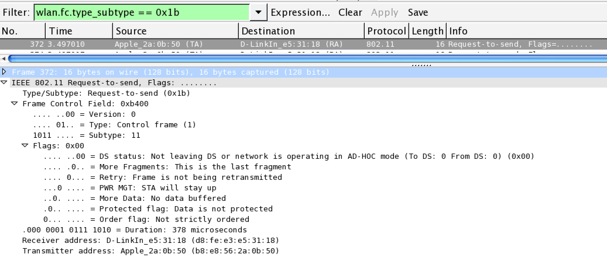

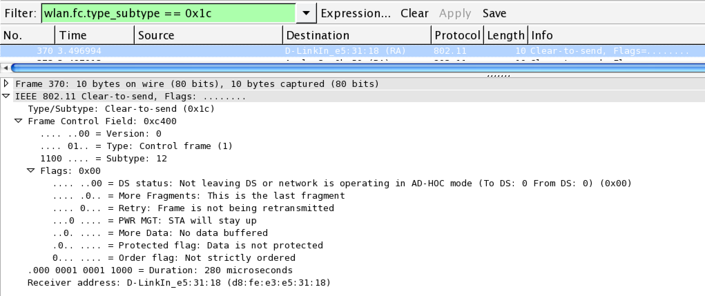

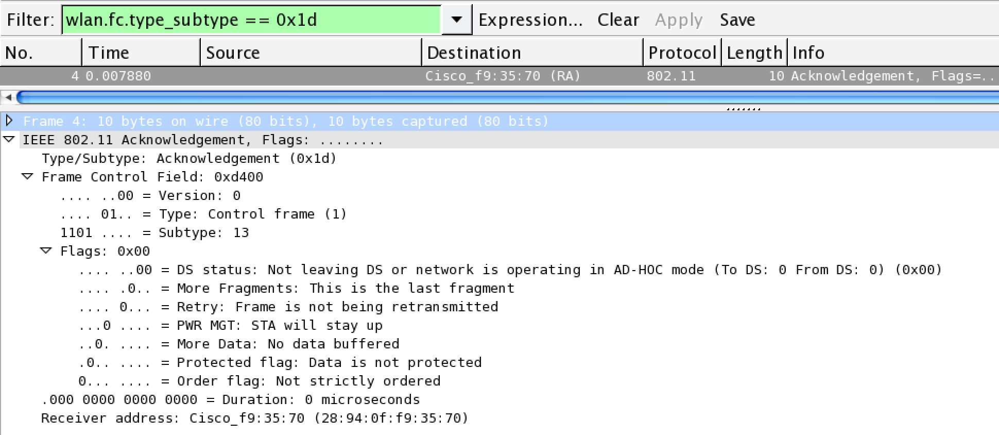

### 802.11 帧结构与Wireshark过滤器语法

IEEE 802.11定义了三大类帧，分别是：管理帧、控制帧和数据帧。每个大类下，又包含了多个子类型。

* **管理帧**。管理帧负责监督无线网络状态，它主要用于建立第二层，即链路层，主机间的连接，管理数据包包括身份认证数据包、关联数据包和Beacon数据包等。（为了限制广播或组播管理帧所造成的副作用，收到管理帧后，必须加以查验。只有广播或者组播帧来自工作站当前所关联的BSSID时，它们才会被送至MAC管理层，唯一例外的是Beacon帧。）

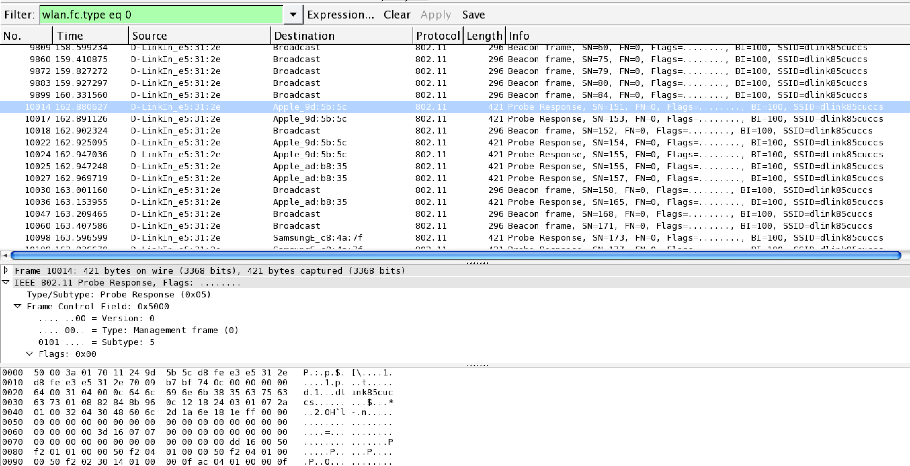

* **控制帧**。控制帧通常与数据帧搭配使用，负责清空区域、获取信道和载波监听的维护，并在收到数据时予以确认以提高工作站之间数据传送的可靠性。（因为无线收发器通常只有半双工工作模式，即无法同时收发数据，为防止冲突，802.11允许工作站使用request to send和clear to send信号来清空传送区域）

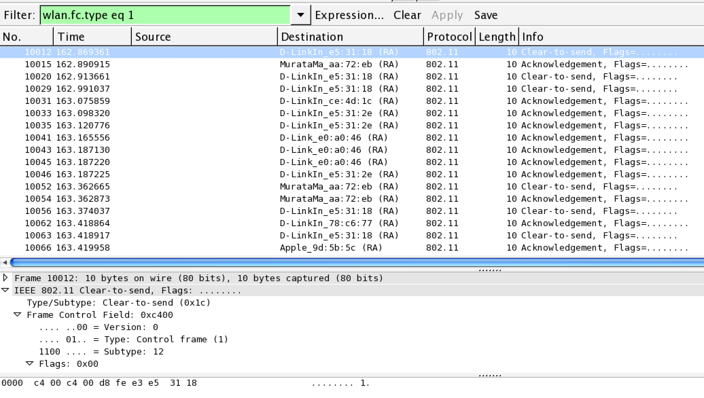

* **数据帧**。数据帧中包含实际需要传送的数据，并且是能够从无线网络转发到有线网络的唯一帧类型。

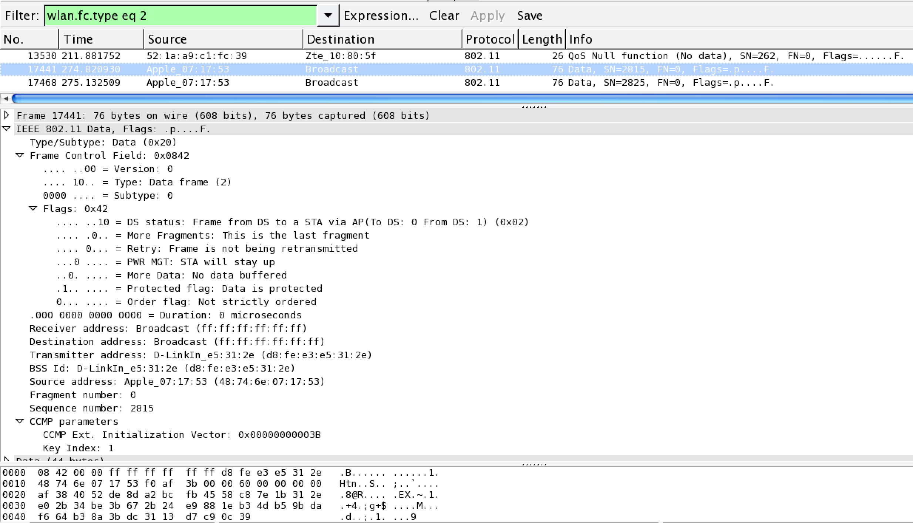

通过[Wireshark的I/O统计图功能](https://www.wireshark.org/docs/wsug_html_chunked/ChStatIOGraphs.html)可以直观的查看在指定时间段内满足Wireshark设置的Display Filter的所有802.11报文的三大类帧占比情况，结合上述关于802.11中的重要理论基础知识，我们可以分析出目标无线网络的繁忙程度和有效数据通信效率。

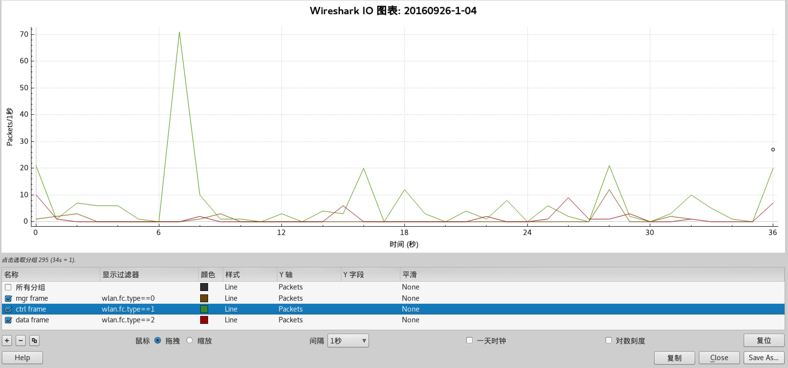

### 802.11 MAC地址类型

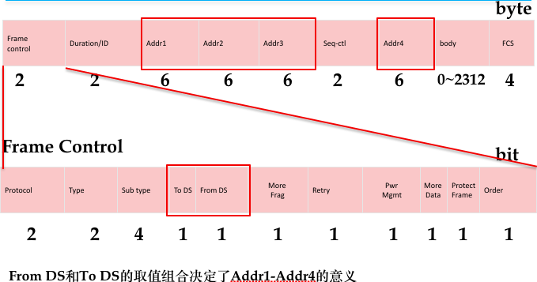

如上图所示是IEEE 802.11帧头部字段定义示意图，上图中的Addr1 ~ Addr4的取值含义主要包括以下5种：

* DA = Destination MAC Address
* SA = Source MAC Address
* RA = Receiver Address indicate MAC Address of station in WM that have to receive frame
* TA = Transmitter Address indicate station which have transmitted frame in WM
* BSSID 

具体每个Addr取何值主要取决于``To DS``和``From DS``这2个比特位的取值组合，参见下表。

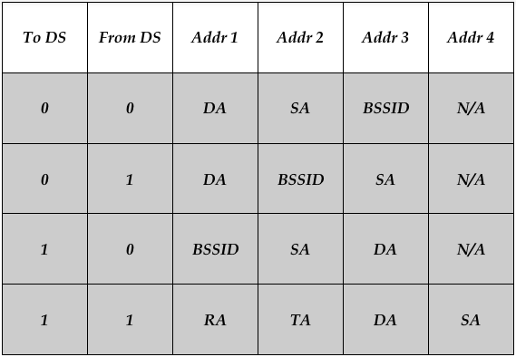

> 注意在wireshark的packet字段解析时，同一个字段地址可能会显示2个或多个等价地址类型名称。

更多的在分析802.11帧结构时常用的Wireshark Display Filter可以使用这2个过滤器前缀：[wlan.*](https://www.wireshark.org/docs/dfref/w/wlan.html)和[wlan_mgt.*](https://www.wireshark.org/docs/dfref/w/wlan_mgt.html)。

### 802.11 加密与认证机制原理

#### 开放式认证

开放式认证本身是⼀种⽆效的认证算法，如果没有配合数据加密技术AP将会准许任何来自客户端的认证要求，即任何知道基站SSID的客户端都可以连接到此⽹络。 但如果基站使用WEP加密算法对数据进⾏加密，WEP密钥就成为了另⼀种存取控制机制，即客户端即使通过了认证，但若没有WEP密钥也⽆法将资料传送到基站亦或是将基站传送出的数据进⾏解码。

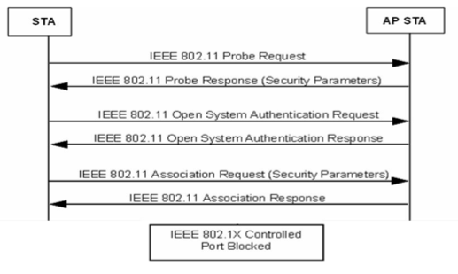

如上图所示是一个STA加入一个曾经连接过的无线网络时的开放式认证和关联加入网络的步骤示意图，图中的STA发送``Probe Request``帧是一个可选步骤。AP如果开启了SSID⼴播，则STA可以通过``beacon frame``得到认证相关信息。

#### WPA/WPA2

在无线网络领域中，广播(broadcast)一词具有崭新的意义。无线网络使用开放性介质， 如果传输链路没有采取适当的加密保护，使用上的风险就会大幅增加。既然是开放性的网络介质，只要拥有适当的设备，任何人都可以偷窥未经保护的数据。本章伊始已经通过实战的方式，介绍了实施无线网络监听的软硬件条件，就目前的技术和产品发展成熟度来说，任何人都可以非常低的成本来监听无线网络通信数据。

防范数据免受中间人攻击（监听和篡改）是一个典型的信息安全问题范畴。起初，有线等级隐私(WEP)标准被视为无线安全的解决方案。不过在 802.11 问世的前四年，研究人员就已经发现 WEP 并不安全。考虑到目前市面上我们可以见到的无线网络设备已经很难再看到启用WEP安全机制的了，本书不再深究WEP，转而介绍目前最主要的无线安全机制：WPA和WPA2。

802.11i工作组采用双轨并行的方式以解决链路层加密协议的弱点，先后设计了两种新的链路层加密协议。第一种称为``临时密钥完整性协议``（Temporal Key Integrity Protocol, TKIP）， 被设计来尽可能强化 ``pre-802.11i`` 硬件的安全性，向后兼容（backward compatible）所有支持WEP机制的硬件设备。另外一种则是重新打造的加密协议，称为``「计数器模式」搭配「区块密码锁链-信息真实性检查码」协议`` （Counter Cipher Mode with block chaining message authentication code Protocol, CCMP），被设计来提供最高等级的安全性，不向后兼容老旧设备。所有新设备获得Wi-Fi认证标志必须支持CCMP协议。前者被称为WPA，后者则被称为WPA2。

#### RSN

除了 TKIP 与 CCMP，802.11i 还定义了一组程序，称为``健壮安全网络``（Robust SecurityNetwork, RSN）。这组程序主要定义了密钥的产生与传递方式。 

802.11链路层加密协议使用了两种密钥。``成对密钥``（pairwise keys）用来保护工作站与 AP 之间 往来的数据。``群组密钥``（group keys）用来保护 AP 至所连接工作站之间的广播或组播数据。成对密钥系产生自身份认证信息，群组密钥是由基站动态产生然后传递给各工作站的。

TKIP 与 CCMP 均使用预先生成的单一主密钥（``预共享密钥（Pre-Shared Key, PSK）``）来产生帧保护过程所需要的其他密钥。利用衍生密钥，工作站 得以更新加密密钥，无需重新执行整个认证程序。主密钥本身扮演着秘密根源的角色，必须小心保护，因为所有后续会话密钥均衍生于此。密钥分级（key hierarchy）的部分目的是为了衍生**用来保护临时密钥之传送**的密钥。

配钥是从主钥开始。在成对密钥体系中，主钥称为``成对主钥``(Pairwise Master Key, PMK)，长度为 256 个比特，如下图所示。

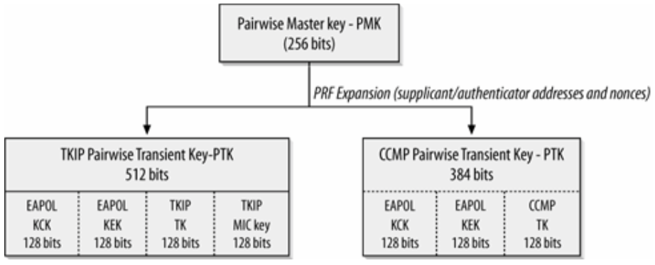

PMK 必然有其来源。在 ``WPA-个人模式`` 中便是使用``成对主钥``。在``WPA-企业级模式``使用认证服务器的情况下，主钥是计算产生自 RADIUS 服务器中，然后以MPPE（Microsoft Point-to-Point Encryption）这个厂商特有的 RADIUS 属性，送给基站。

为了得到前述临时密钥，必须使用预先定义好的伪随机函数来展开 PMK。为了使数据更为随机，此一展开过程是根据PMK、 申请者（supplicant ）与认证者(authenticator）的 MAC 地址以及两个作为四次密钥交换协商 (four-way key exchange handshake)的随机 nonce 值，展开结果我们称为``成对临时秘钥``，记为PTK（Pairwise Transient Key）。

> PTK = Function(PMK, A-nonce, S-nonce, Authenticator MAC, Supplicant MAC)

>     = Hash(PMK||A-nonce|| S-nonce || AP MAC || STA MAC)

TKIP 的临时密钥总长度为 512 个比特，PMK自身的 256 比特之外的 256 个比特，一半作为 TKIP 数据处理时所使用的 128 比特临时密钥，一半用于 Michael 完整性检验（MIC）。TKIP 之所以需要两把额外的密钥，是因为它使用了传统的加密与认证机制，会严格区分加密与认证。CCMP 的临时密钥只有 384 个比特，因为它只使用一把 128 比特密钥来进行认证与加密。

TKIP 与 CCMP 均会使用伪随机函数将 256 比特的 PMK 展开为成对临时密钥。在 TKIP 与 CCMP 体系中，临时密钥的两组 128 比特区块，在传递过程中被用来保护临时密钥。

这两种密钥体系均始于两把 EAPOL 密钥，通过 EAPOL-Key 信息，保护衍生密钥的传输安全。其中使用了两把 128 比特的密钥。第一把是 EAPOL 密钥确认密钥（EAPOL Key Confirmation Key, KCK），用来计算配钥信息（keying message）的信息完整性检验值。 第二把 EAPOL 密钥加密密钥（EAPOL Key Encryption Key, KEK），用来加密配钥信息。这2个密钥在接下来的**四次握手认证**中会详细讲解。

链路层安全协议为广播与组播使用了另一组不同的密钥。已连接的各工作站均拥有不同的预设主钥（pre-master key），因此无法从认证过程中推衍出组播所需要的密钥。事实上，认证者拥有群组主钥（Group Master Key, GMK)，以作为临时密钥的基础。通过伪随机函数，群组主钥会被展开成群组密钥体系，如下图所示。在此并未产生密钥加密或密钥确认密钥，因为密钥交换系以**成对 EAPOL 密钥**来传递密钥。

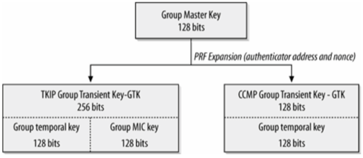

当工作站离开网络，不论是使用完毕或被踢出网络，网络系统即可更新群组密钥。在 TKIP 中，反制措施也会导致系统重新产生群组密钥。

#### 四次握手认证

802.11i 规范了一种衍生密钥的机制，而不仅是采用主钥并以之为加密协议的输入项。为了防范重放攻击，密钥的交换使用了随机乱数，并且需要经过协商。成对与群组密钥系分别通过各 自的协商加以更新，如下图所示：

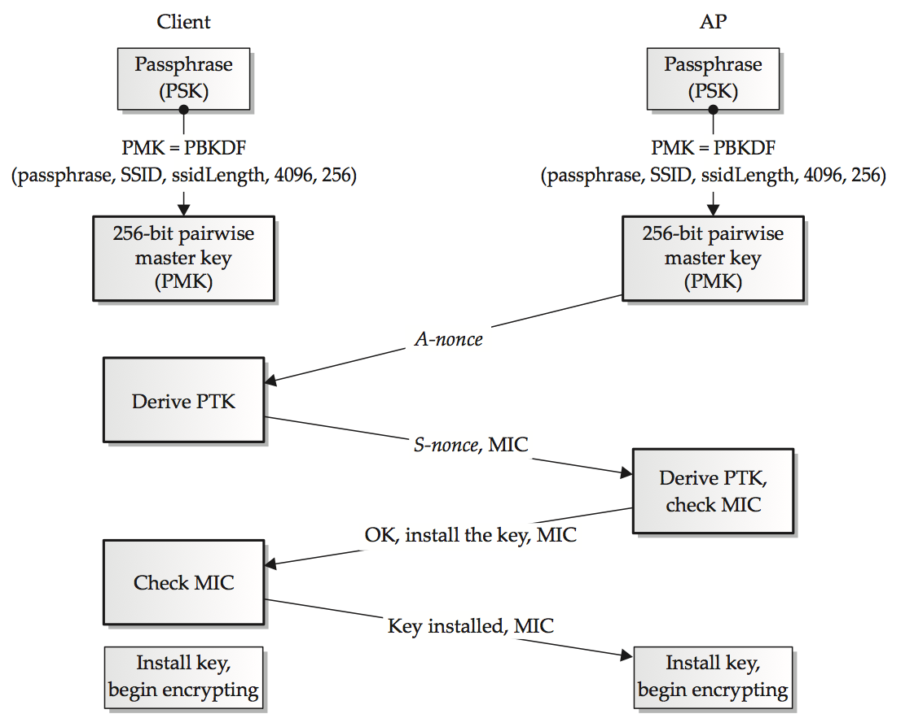

成对（pairwise）或点播（unicast）密钥是通过所谓的四次握手认证（four-way handshake）加以传递，如上图所示。申请者（supplicant，在此处为Client）与认证者（authenticator，在此处为AP）均持有一把共享 的成对主钥PSK。四次握手交换用以产生临时密钥的参数，以及确认双方均已准备就绪，可以开始进行加密传输。依序传送的信息是由下一个信息来代表回应。

1. 认证者将 nonce 传给申请者。nonce 是防范重放攻击的随机值，信息本身并未经过认证，但并没有被篡改的危险。如果信息遭人更改，协商就会失败并重新执行。至此，申请者就可以将成对主钥展开成完整的成对密钥阶层体系。展开的过程中，需要用到申请者与认证者的 MAC 地址、成对主钥以及两个 nonce。
2. 申请者所送出的信息中包含申请者的 nonce 以及初次与网络连接时所取得的安全参数副本（目标网络支持的安全特性信息）。整个信息系经过**以 EAPOL 密钥确认密钥**计算而来的**完整性检验值**的验证。认证者接收到信息，取出申请者的 nonce，依此衍生出完整的密钥阶层体系。此密钥体系中，包含用来**签证（sign）**信息的密钥。如果认证者无法验证此信息，整个协商即告失败。
3. 此时协商双方的密钥均已就绪，但仍需要确认。认证者会将一个信息传给申请者。此信息代表将被加入之成对密钥的序号，它同时包含了目前的群组临时密钥（Group Transient Key, GTK），以便后续能够更新群组密钥。GTK 经过**EAPOL 密钥加密**密钥的加密，整个信息系经过**密钥确认**密钥的认证。
4. 申请者最后会送出确认信息给认证者，告诉认证者已经接收到配钥信息，可以开始使用这些密钥。此信息系经过**密钥确认**密钥的认证。

成对主钥计算使用的函数被称为**基于密码的密钥衍生函数**（Password-Based Key Derivation Function, PBKDF，如下图所示是其基本算法工作原理），``PMK = PBKDF(Passphrase, ESSID, ssidLength, c)``，其中``c``是``迭代次数``。对于 ``WPA-个人模式`` 来说，``c = 4096``。``ssidLength``是目标网络的``ESSID``长度。

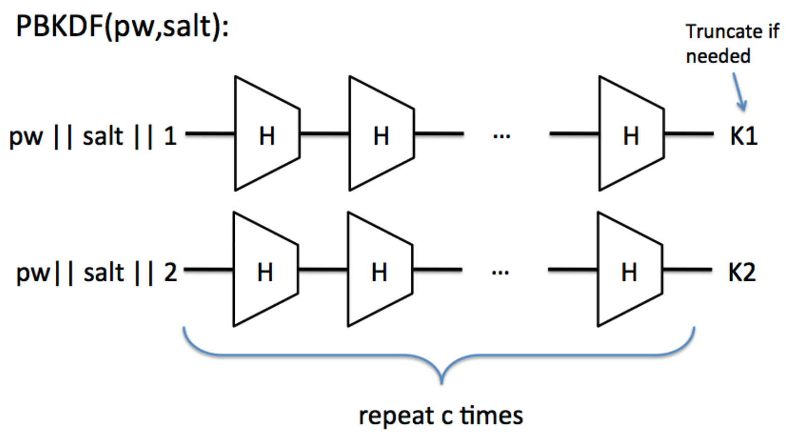

PBKDF的密码学意义在于：

* 相同的密码输⼊，经过PBKDF运算之后每次的结果都不相同
* 通过增⼤迭代参数c，降低暴⼒破解的速度
* salt的选择如果做到不可预测，则可以抵御预先计算PBKDF字典的加速暴⼒破解攻击⽅法
    * WPA/WPA2 PSK使用的salt是ESSID和ssidLength。一些老旧的无线路由器和AP，在出厂时设置的默认SSID名称是唯一的，例如``dlink``。而现在我们从市场上购买到的无线路由器和AP，在出厂时设置的默认SSID则通常会使用到设备本身的部分MAC地址值来确保不同设备的默认SSID名称均不相同。这就是默认安全水平在提高的一个表现，老旧设备的这种简易默认设置，很容易遭到基于预先计算好的PMK字典的认证破解攻击，而新设备则很好的规避了这个默认值风险。

## Wi-Fi Direct

Wi-Fi CERTIFIED Wi-Fi Direct®（Wi-Fi直连）是一种认证标志，表示设备间支持Wi-Fi直接互联，帮助用户以更为简单而便捷的方式完成打印、共享、同步和显示等任务。带有Wi-Fi Direct标志的产品可以在不加入传统的家庭、办公或热点网络的情况下互相连接。支撑Wi-Fi Direct认证标志的技术规范名称为：Wi-Fi Peer-to-Peer（简写为Wi-Fi P2P）。

利用这种技术，手机、照相机、打印机、个人电脑和游戏设备将能够直接互连，以迅速而轻松的方式传输内容、共享应用。Wi-Fi Direct可以支持一对一直连，也可以实现多台设备同时连接。连接Wi-Fi Direct认证设备的操作简单方便，按下按钮、同时点击两个支持NFC的设备，或输入PIN码这三种方法（Wi-Fi Protected Setup, WPS）均可实现连接。此外，所有的Wi-Fi Direct连接都采用WPA2™加密方式。

Wi-Fi Direct发展自Ad-hoc模式，但又有所区别。在安全性方面，Ad-hoc 默认WEP，⽽Wi-Fi Direct默认WPA2。在连接方式上，Wi-Fi Direct支持连接Wi-Fi Direct同时连接已存在的⽹络，Ad-hoc只能⼯作在其中⼀种。

## Wi-Fi Protected Setup (WPS)

Wi-Fi Protected Setup（WPS）是Wi-Fi联盟的一项可选认证项目，以专为简化家庭和小型办公环境中安全Wi-Fi网络设置的技术为基础。Wi-Fi Protected Setup支持大多数用户所熟悉的方式（按下按钮、输入PIN码，或者使用NFC）来配置网络，启用安全功能。传统方式（以WPA-个人模式为例）加入一个无线局域网需要手动输入SSID和密码，WPS能帮助用户自动获得并设置SSID、认证⽅式和密钥。无线设备制造商为了让用户能更快理解产品功能特点，对WPS这一标准功能采用了各自的别名。例如``QSS - Quick Secure Setup``是TP-Link设备的功能别名。``Push 'N’ Connect`` 是Netgear设备的功能别名。WPS来自于协议规范：[《Wi-Fi Simple Configuration Technical Specification》](attach/chap0x02/media/Wi-Fi_Simple_Configuration_Technical_Specification_v2.0.5.pdf)（以下简称为WSC规范），目前的最新版本是2014年8月发布的2.0.5版。

WPS改进了用户使用无线网络的体验，但目前的认证机制已经被发现存在协议漏洞，大大降低了网络接入认证的保护强度。我们将在第3章详细讲解目前WPS协议和产品的已知漏洞原理和具体利用方式。

### 支持的应用场景

根据WSC规范，Wi-Fi Simple Configuration 2.0.5版主要面向家庭和小企业无线网络和P2P协议族。支持如下两大类应用模型：

* 主要应用模型
    * 设置一个新的安全的 WLAN，实现开箱即用（基础设施模式）
    * 为该 WLAN 添加无线设备
* 次要应用模型
    * 从 WLAN 中移除某个无线设备
    * 访客上网
    * 密钥信息更换（Re-keying credentials）
    * 通过添加新的 AP或路由器来扩充 WLAN 的覆盖范围
    * 更改网络名称、无线频段和安全、初始化连接配置之外的其他参数
    * 使用NFC接口或标签在“带外”交换认证凭据

### 典型用户体验

> 场景1: 用户用一个手机去配置一个新购买的AP来提供无线网络服务。AP的通信信道只有以太网和无线网络。

配置步骤如下：

* 用户给AP上电；
* 手机上的软件自动检测到了AP并询问用户是否要配置这个AP；
* 手机上提示用户输入AP上的``PIN``（通常是打印在AP上的一个贴纸）。用户输入``PIN``，接受默认配置，确认AP已成功配置完毕；

> 此时用户需要添加一台打印机到该无线网络

* 用户给打印机上电开机；
* 手机检测到新的无线设备并且提示用户把该设备添加到网络。用户查看打印机显示屏上的``PIN``码并将其输入手机；
* 当打印机添加到前述配置好的无线网络之后手机和打印机显示屏上同时显示确认信息；

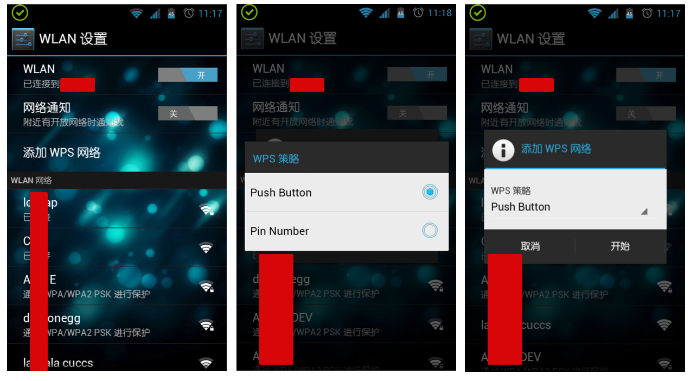

> 场景2: 用户有一个移动游戏机希望添加到一个配置好的无线网络。用户认为便利性比安全性更重要，因此他决定使用PBC方式配置他的游戏机联入无线网络。

配置步骤如下：

* 用户按下游戏机上的PBC按钮；
* 用户按下AP上的PBC按钮；
* 游戏机和AP在其各自用户界面上显示着联网进度。当联网成功完成时，都会给出“连接成功”的提示。

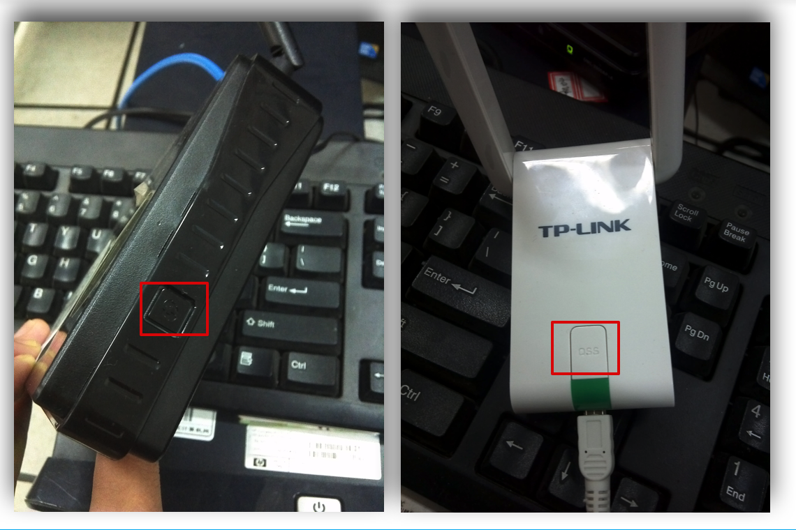

### 术语定义

* AP: An infrastructure-mode 802.11 Access Point. 
* Credential: A data structure issued by a Registrar to an Enrollee, allowing the latter to gain access to the network.
* Device: An independent physical or logical entity capable of communicating with other Devices across a LAN or WLAN. 
* Device Password: A shared secret that may be used to authenticate the in-band exchange between the Registrar and Enrollee. 
* Discovery Protocol: A protocol informing the Enrollee and the Registrar of each others presence and capabilities.  
* DMG (Directional Multi-Gigabit): A frequency band wherein the operating channel center frequency is above 45 GHz. 
* Domain: A set of one or more Devices governed by a common authority for the purpose of gaining access to one or more WLANs.
* *** Enrollee: A Device seeking to join a WLAN Domain. *** Once an Enrollee obtains a valid credential, it becomes a Member.
* External Registrar: A Registrar for an AP’s Domain that runs on a device separate from the AP. 
* Guest: A Member with credentials that provide only temporary or otherwise limited access to a WLAN. 
* **In-band**: Data transfer using the WLAN communication channel, including WLAN multiband devices (e.g. 2.4GHz, 5GHz, and 60GHz).  
* Internal Registrar: A Registrar that is embedded in an AP.  All APs shall include an Internal Registrar. 
* Member: A WLAN Device possessing Domain credentials. 
* NFC Device: NFC Forum compliant contactless device that support the following Modus Operandi: Initiator, Target, and Reader/Writer. It may also support card emulator.  
* NFC Interface: Contactless interface of an NFC Device. 
* NFC LLCP: The Logical Link Control Protocol (LLCP) specification between two NFC Forum Devices. 
* NFC Tag: NFC Forum compliant contactless memory card that can be read or written by an NFC Device and may be powered by the RF field.  
* **Out-of-Band**: Data transfer using a communication channel other than the WLAN.  
* **PIN (Personal Identification Number)**: A 4 or 8 digit device password. 
* **Registration Protocol**: A Registration Protocol is a (logically) three party in-band protocol to assign a Credential to the Enrollee. The protocol operates between the Enrollee and the Registrar and may receive support through a proxy.
* *** Registrar: An entity with the authority to issue and revoke Domain Credentials.*** A Registrar may be integrated into an AP, or it may be separate from the AP.  A Registrar may not have WLAN capability.  A given Domain may have multiple Registrars.  
* PCP: A Personal basic service set (PBSS) Control Point, peer-to-peer functionality in a 60GHz device, mandatory for all Wi-Fi CERTIFIED 60GHz Stations. 
* **Push Button Configuration (PBC)**: A configuration method triggered by pressing a physical or logical button on the Enrollee and on the Registrar. 
* Stand-Alone External Registrar (SAER):  An External Registrar that is not embedded in a wireless STA.  For example, may be embedded in an Ethernet connected device, or may be software installed on any networking device. 

### WPS核心架构

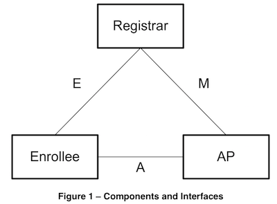

如上图所示是WSC规范定义的主要组件和它们的接口。WSC中一共涉及到3个逻辑组件：Registrar（注册者）、AP和Enrollee（登记者）。通常情况下这些逻辑组件有可能是合并在一起的。例如，AP通常有一个内置的Registrar用来以独立模式添加Enrollee，可以用也可以不用到Web浏览器。

一个新的无线网络建立是通过上电AP和将AP接入一个外部网络（例如将AP连入一个有线网络），这时（无线）网络中还没有其他设备。下一步就是添加一个Enrollee或Registrar设备到网络。这里会用到AP和新设备之间的``Registration Protocol``。如果新设备是添加为一个外部的Registrar，那么后续的Enrollee可以通过该Registrar添加到无线网络。

WSC定义了新的802.11信息元素（IE, Information Elements）包含在``beacon``，``probe request``和``probe response``消息中。该IE的作用是宣告设备具备Wi-Fi Simple Configuration功能，需要注意的是，该IE中的信息是无需认证即可获取到的。

#### 接口E

这是Enrollee和Registrar之间的逻辑接口（物理上，AP可以扮演一个消息传送代理的角色）。接口E的目的是让Registrar来发现和签发无线网络认证凭据给Enrollee。接口E可能只有无线通信数据或通过带外方式进行数据通信。

Enrollee通过以下方式实现接口E：

1. 在802.11 probe request消息中包含一个Wi-Fi Simple Configuration IE；
2. 包含一个唯一、随机产生的设备密码显示在显示屏上或打印在贴纸上。设备密码用来在Registrar和Enrollee之间的带内交换认证；
3. 可选支持一个或多个带外信道用于更简单和更安全的配置；
4. 实现``注册协议``的``Enrollee``部分；

Registrar通过以下方式实现接口E：

1. 处理Enrollee（设备或AP）在Probe消息（对于无线Registrars来说）或UPnP（对于基于IP的Registrars来说）中的（能力）发现数据；
2. 实现``注册协议``的``Registrar``部分；
3. 可选支持一个或多个带外信道用于更简单和更安全的配置；
4. 如果需要的话，通过``接口M``使用Enrollee的MAC地址和认证凭据配置AP；
5. 如果Registrar是一个AP则通过Probe-Responses响应Enrollee的Probe-Requests；

#### 接口M

接口M是AP和Registrar之间的接口。使得外部Registrar能管理⼀个WSC AP。WSC使用相同协议配置AP管理接⼝用于向Enrollee设备发送认证凭据。

AP通过以下方式实现接口M：

1. Acting as the Enrollee in the Registration Protocol, sending its own Discovery message across both 802.11 and UPnP.  Support for at least three external Registrars is required. 
2. Implementing the Management Interface described in the WFADevice and WFAWLANConfiguration Service documents.  The AP is required to be a UPnP device that includes support for the Wi-Fi Simple Configuration proxy service. 
3. Monitoring 802.11 probe request and EAP messages from Enrollees and converting them to UPnP Event messages.  It also accepts UPnP actions and converts them to EAP messages according to the proxy function described in the WFAWLANConfiguration Service document.

Registrar通过以下方式实现接口M：

1. Processing AP Discovery messages across 802.11 and/or UPnP.
2. Subscribing to proxy events, receiving and processing Enrollee Discovery and Registration messages from the UPnP proxy and continuing the Registration protocol message exchange via UPnP actions. 
3. Implementing the Registrar side of the Registration Protocol to gain management rights over the AP or to issue WLAN credentials to Enrollees 
4. Configuring the AP with the MAC address and/or the per-device Credential of the Enrollee. 
5. Implementing the Management Interface described in the WFADevice and WFAWLANConfiguration Service documents.  This implementation requires the Registrar to function as a UPnP control point.   

#### 接口A

AP和Enrollee之间的接⼝。接口A的功能是支持WSC WLAN发现以及支持Enrollee和IP协议Registrar设备之间的通信。

AP通过以下方式实现接口A：

1. Sending out 802.11 beacons indicating support for Wi-Fi Simple Configuration and generating Probe Response messages containing a description of the AP. 
2. Implementing an 802.1X authenticator and the Wi-Fi Simple Configuration EAP method. 
3. Proxying 802.11 probe request and EAP messages between Enrollees and external Registrars as described in the WFADevice and WFAWLANConfiguration Service documents. 

Enrollee通过以下方式实现接口A：

1. Discovering a Wi-Fi Simple Configuration AP and/or wireless external Registrar and sending it 802.11 probe requests including the Enrollee Discovery data.    
2. Implementing an 802.1X supplicant and the Wi-Fi Simple Configuration EAP method.

#### 注册协议

注册协议完成以下目的：

1. 用于故障排查⽆线传输通道的基本连接问题；
2. 使用带外（out-of-band）信息提供Enrollee和Registrar之间双向识别，支持认证凭据配置；
3. 建立起每个设备的角色（AP，Registrar或Enrollee）；
4. 从Registrar向Enrollee安全传输WLAN配置和其他配置信息 ；
5. 建立起扩展主会话密钥（EMSK，Extended Master Session Key），可以用于保护其他应用层相关配置函数的安全性；

注册协议可以完全运行在带内，也可以完全运行在带外，也可以混用两种通信信道。这种灵活性使得协议能够充分快速适配利用不同带外传输机制的优势。

注册协议分为2个阶段，第一个阶段又被称为``发现``阶段，用于在Registrar和Enrollee之间交换描述信息。注册协议的发现阶段是必需的。

以基站作为Enrollee为例，发现阶段达成了2个目的：

* 允许Enrollee发现可用于注册的Registrar；
* 允许Enrollee设置自己为可发现的进而Registrar可以发现预期可注册的候选；

基站Enrollee可任选以下两种方法之一来完成发现阶段：

* 在扫描过程中基站Enrollee可以使用主动扫描发送包含``WSC IE``的``probe request``到AP。AP通过包含``WSC IE``的``probe response``进行响应。考虑到``probe response``中包含的``WSC IE``可能包含来自一个或多个Registrar（作为一个集群），这个方法仅限于如果Enrollee设置自己为可发现但不打算同时也发现外部Registrar的详细信息时的推荐。注意：基站Enrollee可选不关联到指定WSC配置（provisioning）如果包含基站MAC地址或通配MAC地址（ff:ff:ff:ff:ff:ff）的授权MAC地址子元素没有包含在``Beacon``或``Probe Response``帧中。
* 基站Enrollee可以选择关联到一个``支持WSC``的AP然后通过发送消息``M1``到Registrar来初始化``注册协议``。假设Registrar没有准备好注册候选Enrollee则会响应消息``M2D``。如果Enrollee打算在设置自己为可发现的基础之上发现可用的Registrar则推荐使用本方法。

如果是AP作为一个Enrollee，则发现过程由Registrar发起：

* 一个无线外部Registrar发送包含``WSC IE``并且请求类型属性设置为``Registrar``或``WLAN Manager Registrar``的``probe request``。AP响应包含``WSC IE``并且响应类型属性设置为``AP``的``probe response``；
* 一个有线外部Registrar使用合适的``UPnP``发现机制来识别AP。

在发现阶段Enrollee可以和网络中的多个AP或Registrar交换信息。在发现阶段结束之后，如果Enrollee和Registrar打算继续完成注册过程，注册协议的第二个阶段即行开始。第二个阶段的重头戏是认证凭据签发。

注册协议以``锁定步骤``方式工作，以M2、M2D或M8消息终结。终结消息如下描述：

* M2D：这个消息代表Registrar无法认证Enrollee，但愿意给Enrollee提供有关Registrar的描述信息；
* M2：这个消息可能包含来自Registrar的``配置数据``，在这种情况下整个注册协议终止。物理层连接隐式认证了其承载发送的数据。在这种情况下，注册协议的第一和第二阶段就合二为一了，只需要一个回合就可以完成注册协议；
* M8：这个消息是注册协议第二阶段第3次握手的结果。第二阶段3次握手用于逐步完成基于Enrollee设备密码的Enrollee和Registrar的双向认证。WLAN认证凭据包含在发送给Enrollee的消息M8之中。

注册协议的执行可能因为错误或超时而终结。详细的注册协议描述请查阅[《Wi-Fi Simple Configuration Technical Specification》](attach/chap0x02/media/Wi-Fi_Simple_Configuration_Technical_Specification_v2.0.5.pdf)的第7节。


### 风险分析与安全机制设计

WSC为设备制造商提供了一系列选择，每种选择对应了不同的安全等级。系统的安全性取决于其最弱组件，因此，当使用WSC来构建一个无线网络时的有效安全强度取决于该无线网络中任意设备配网方式中安全性最弱的一种方法。目前主要有两种WSC配置模式：带内配置和带外配置。

对于带内配置来说，用到了``Diffie-Hellman``密钥交换和使用“设备密码”作为共享密钥的认证。设备密码可以取自Enrollee输入到Registrar，或者取自Registrar输入到Enrollee。输入设备密码的方式可以是手工输入或通过一个WSC NFC密码令牌的方式NFC录入。如果使用NFC输入设备密码，Registrar会得到Enrollee的DH公钥散列值。这显著加固了从Enrollee到Registrar的认证强度同时减少了攻击者盗取NFC标签来配置无线网络的风险。

使用带外配置时，无线认证凭据通过带外信道传输到Enrollee。认证凭据和配置通过带外信道传输时可以选择加密传输。当前版本的WSC规范支持的带外传输信道是使用WSC NFC配置令牌的NFC方式。

WSC带内注册协议设计用于提供对抗被动式监听攻击并且同时可以检测和保护系统免受主动暴力破解攻击。这就意味着如果Registrar遇到一个被判定为合法Enrollee的攻击者，它首先会检测到攻击者其实并不知道密码。这个检测发生在已经提供了足够多信息给暴力破解攻击尝试破解密码之前。尽管如此，如果Registrar多次使用相同PIN来运行和一个攻击者之间的注册协议，则攻击者有可能通过离线攻击发现PIN进而通过再次运行注册协议获得网络配置信息。为了堵上这个漏洞，如果在发送消息M6之后发生PIN认证或通信错误，Registrar应警告用户，并且不得自动重复使用该PIN。此外，如果Registrar检测到前述情况并提示用户从Enrollee设备获得一个新PIN码，则不应在未警告用户面临的可能攻击情况下再次接受相同的PIN码。如果使用了一个至少32字节随机产生的强设备密码（例如带外设备密码或设备专用密码）而不是PIN码，Registrar允许在发生错误时无需警告用户的情况下重复多次使用该强密码。PIN码重用的要求不适用于PBC（按钮）方法。

PIN码认证方式是WSC规范中强制要求所有设备必须支持的一种WPS初始化工作模式，并且规范原文中特别强调了PIN码（设备密码）的产生绝不应该依赖于设备特征（例如MAC地址或序列号）。按下按钮方式的WPS网络配置方法在WSC规范中被命名为``Push Button Configuration``，简称为``PBC``，这是一种``可选``的WPS工作模式。除此之外，如果设备支持NFC，则可以使用带外（out-of-band）方法来在待认证设备和注册服务器之间传输强口令（例如256bit随机值）。

> All devices supporting Wi-Fi Simple Configuration **shall** provide at least one numeric Device Password (PIN) for initial setup that is unique and randomly generated per device. Although it is possible and permitted for two devices to have the same Device Password, a group of devices should not intentionally be assigned the same Device Password, and the Device Password **SHALL not** be based on other characteristics of the device, ***such as MAC address or serial number***.

WSC规范要求无头（例如那些没有显示屏的）设备必需包含一个**8位数字**设备密码，被称为PIN码（通常是打印在一张设备贴纸上或物理雕刻在设备上）。无头设备的PIN码同样应该被配置到设备中，一般是在设备生产过程中完成的。

基于PIN码的设备密码是WSC的基础安全等级。由于8位数字PIN码中的其中1位被用于校验和位，因此PIN码包含大约23bit的信息熵。这种机制本身不是一个大问题，但最大的限制是PIN码可能是一个固定值（如果是静态的，通常是直接显示在一个标签纸上）。对于有显示屏的设备可以使用4位数字PIN码，4位数字PIN码没有使用校验和位。因为一个固定的PIN码会被重复使用，这就意味着易遭受主动攻击。WSC协议允许用户设置一个新的设备密码来代替默认的设备密码，虽然没有从本质上提升PIN码的安全性，但可以起到“安慰”和“缓解”部分用户的“安全感”焦虑。

无线网络中最主要的一类无头设备是AP。如果可能的情况下，每次运行注册协议时，PIN码都应该是新产生、仅使用一次的临时PIN用于建立和外部Registrar注册（此时AP扮演的是Enrollee角色）。但如果使用的是静态PIN码，AP应把多次失败认证尝试记录下来并进入``锁定``（locked down）状态（这个状态通过设置AP**配置锁定**状态为真来表示）。最多10次连续失败尝试，没有时间限制，来自任意数量的外部Registrar，AP就应强制回复到``锁定``状态，并且AP将无限期锁定下去（例如，直到用户主动解锁AP的用于外部Registrar的PIN）。

在``锁定``状态下，AP应拒绝以``初始化AP配置``模式与任何外部Registrar运行注册协议。这种技术保护AP的PIN码免受攻击者通过暴力破解攻击强制指定一个新的外部Registrar。在AP配置锁定状态，依然可以添加新的Enrollee设备到无线网络，但无法使用AP的PIN添加新外部Registrar。

AP可能通过其他方式进入锁定状态。例如，AP可以实现一个``增量式临时锁定``(incremental and/or temporary lockout)过程增加失败PIN尝试时的锁定时间。然而，即使实现了这些额外方法，AP仍然应该在遇到如上描述情况时进入无限期锁定状态。

AP应提供给用户解除锁定状态的方法。例如，可以通过AP的网页管理界面来解除锁定状态或重启AP电源来恢复PIN码可用于外部Registrar注册。

除了PIN码方式之外，无头设备还可以实现PBC（具备丰富用户界面的设备也可以支持PBC方法）。PBC方法的信息熵为0比特，仅可用于对抗被动式监听攻击。PBC方法仅可在没有支持PIN码的Registrar可用时并且无线网络用户愿意接受使用PBC带来的安全风险。PBC方式的安全性弱于其他方法，但可以用于兼容没有显示屏或其他带外传输机制的设备加入无线网络。

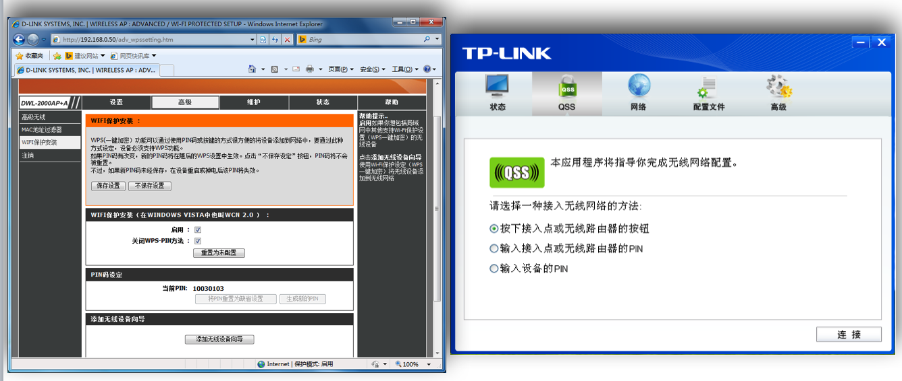

#### 设置一个新的无线网络

设置一个新的无线网络主要有两种场景：独立AP和使用外部Registrar。独立AP意味着Registrar内置在AP之中，使用外部Registrar可以支持一个或多个Registrar。

开启WSC支持的AP应开启SSID广播，如果SSID广播被禁用则对应的WSC功能会被禁用。如果开启了WSC，则AP不应阻止基于其他访问控制机制（如MAC地址过滤）的注册或阻止通信。

独立AP应自动选择一个SSID（通常是一个随机产生的SSID）和信道，并应同时默认开启WPA2-个人模式和设置一个健壮、随机产生的PSK。如果需要后向兼容不支持WPA2-个人模式的客户端则可以使用WPA混合模式。独立AP使用内置的Registrar来通过``注册协议``向Enrollee签发密钥。独立AP同样可以启用或关闭安全机制。AP也应提供恢复出厂设置选项来清除任何用户自定义的配置和密钥。

使用外部Registrar方式的AP设置一个新的无线网络的详细方式请查阅[《Wi-Fi Simple Configuration Technical Specification》](attach/chap0x02/media/Wi-Fi_Simple_Configuration_Technical_Specification_v2.0.5.pdf)的第5节。

#### 为该无线网络添加新成员设备

理想情况下，一个支持WSC的AP应支持多密钥模式。但实际情况是，AP也允许使用一个所有设备共享的单一``WPA2-个人``模式密钥。和设置一个新的无线网络类似，为该无线网络添加新成员设备也会根据AP使用的是内置还是外部Registrar而分为多种不同的添加流程。除此之外，还要考虑带内和带外两种数据交换通道模式下的流程差异。以下用“标准AP内置Registrar带内设备注册”为例说明新设备如何通过WSC加入到一个无线网络。

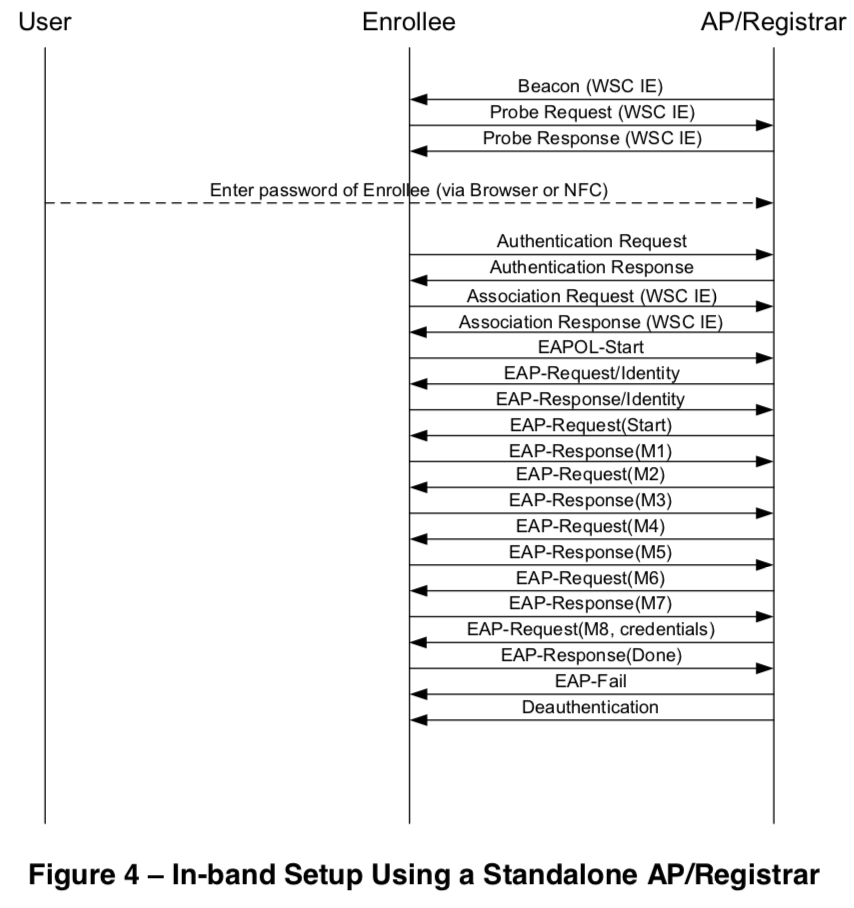

上述流程图中我们可以看到：用户需要把Enrollee的设备密码**录入**到AP/Registrar中，可以是键盘录入也可以是带外信道。上述流程图没有展示probe消息交换之后因为Enrollee在等待用户把Enrollee的设备密码配置到AP/Registrar内而可能发生的M1和M2D消息交换，。

1. Enrollee通过``probe request``发送``发现``（Discovery）数据到WSC AP。AP或无线Registrar在``probe response``中响应它自己的发现数据；
2. 用户按照提示使用键盘界面或带外信道输入Enrollee的设备密码到AP/Registrar；
3. Enrollee使用“WFA-SimpleConfig-Enrollee-1-0”标识连接和发起802.1x认证过程；
4. Enrollee和Registrar通过``注册协议``完成M1~M8消息交换来配置Enrollee；
5. Enrollee断开连接再使用上一步得到的无线网络认证凭据重新连接加入目标无线网络。

其中的M1~M8消息格式基本结构如下：

* M1 = Version || N1 || Description || PK_E
* M2 = Version || N1 || N2 || Description || PK_R [ || ConfigData ] || HMAC_AuthKey(M1 || M2*)
* M3 = Version || N2 || E-Hash1 || E-Hash2 || HMAC_AuthKey(M2 || M3*)
* M4 = Version || N1 || R-Hash1 || R-Hash2 || ENC_KeyWrapKey(R-S1) || HMAC_AuthKey (M3 || M4*)
* M5 = Version || N2 || ENC_KeyWrapKey(E-S1) || HMAC_AuthKey (M4 || M5*)
* M6 = Version || N1 || ENC_KeyWrapKey(R-S2) || HMAC_AuthKey (M5 || M6*)
* M7 = Version || N2 || ENC_KeyWrapKey(E-S2 [||ConfigData]) || HMAC_AuthKey (M6 || M7*)
* M8 = Version || N1 || [ ENC_KeyWrapKey(ConfigData) ] || HMAC_AuthKey (M7 || M8*)

上述结构定义中的符号使用说明如下：

* || 消息中的参数（字符串）拼接操作
* 密码学函数名右侧``_``紧跟的是该算法使用的密钥
* Mn* 不包含HMAC-SHA-256签名值的Mn消息
* Version 对应注册协议消息版本号
* N1 Enrollee设置的128bit随机数。每次注册协议实例都应该使用新随机值，Registrar应使用关联Enrollee的M1消息中的N1值。
* N2 Registrar设置的128bit随机数。每次注册协议实例都应该使用新随机值，Enrollee应使用关联Registrar的M2D/M2消息中的N2值。
* Description 包含一个人类可读的发送设备描述信息（UUID，设备商名称，型号，MAC地址等）和设备能力信息（支持算法范围，I/O信道，注册协议角色等等）。在802.11 probe request和probe response消息中也有
* PK_E和PK_R分别是 **E**nrollee 和 **R**egistrar 的 Diffie-Hellman 公钥。如果在未来使用了新的密钥交换算法（例如椭圆曲线），则会使用不同的协议版本号标识
* AuthKey由DH算法中产生的会话密钥、随机值N1和N2以及Enrollee的MAC地址计算推导出。如果M1和M2通过不受中间人攻击威胁的通道传输，Enrollee的设备密码可以在密钥推导过程中被省略
* E-Hash1和E-Hash2是Enrollee用于证明它掌握它自己的设备密码（分别对应**前半部分**和**后半部分**）
    * E-Hash1 = HMAC_AuthKey(E-S1 || **PSK1** || PK_E || PK_R) 
    * E-Hash2 = HMAC_AuthKey(E-S2 || **PSK2** || PK_E || PK_R) 
* R-Hash1和R-Hash2是Registrar用于证明它掌握Enrollee的设备密码（分别对应**前半部分**和**后半部分**）
    * R-Hash1 = HMAC_AuthKey(R-S1 || **PSK1** || PK_E || PK_R)
    * R-Hash2 = HMAC_AuthKey(R-S2 || **PSK2** || PK_E || PK_R) 
* 任何一方证明自己掌握设备密码时，设备密码首先被转换格式为2个128bit的PSK
    * PSK1 = first 128 bits of HMAC_AuthKey(1st half of **DevicePassword**) 
    * PSK2 = first 128 bits of HMAC_AuthKey(2nd half of **DevicePassword**) 
       * 例如，如果PIN码是39358448，则转换之后的存储数据结构是8字节ASCII字符串``39358448``。PSK1来自于对``3935``计算HMAC取前128bit，PSK2来自于对``8448``计算HMAC取前128bit
* HMAC_AuthKey(…) 使用AuthKey作为密钥的HMAC函数。为了减小消息长度，256bit HMAC输出的前64bit被包含在认证属性字段，默认使用 HMAC-SHA-256 per FIPS 180-2 and RFC-2104. 
* ENC_KeyWrapKey(…) 使用KeyWrapKey作为对称加密密钥的对称加密函数，默认使用AES-CBC per FIPS 197, with PKCS#5 v2.0 padding； 
* ConfigData 包含提供给 Enrollee 的 WLAN 配置和认证凭据，其他配置信息也可能包含于此。虽然 ConfigData 在这里被定义为加密存储，但只有密钥和密钥绑定信息是强制要求加密的。其他配置数据可选择加密。发送者自行决定是否加密 ConfigData 哪一部分。

关于注册协议、消息验证等更多详细描述请查阅[《Wi-Fi Simple Configuration Technical Specification》](attach/chap0x02/media/Wi-Fi_Simple_Configuration_Technical_Specification_v2.0.5.pdf)的第6节。

## WPA/WPA2 企业级认证

Wi-Fi联盟把使用“预共享秘钥”的WPA或WPA2版本叫做“WPA-个人版”或“WPA2-个人版”（WPA-Personal or WPA2-Personal），用802.1X认证的版本叫做“WPA-企业版”或“WPA2-企业版”（WPA-Enterprise or WPA2-Enterprise）。

802.1X 复杂之处，在于它本身只是一套架构。它是 IEEE 采用 IETF 的可延伸身份认证协议 (Extensible Authentication Protocol，简称 EAP)制定而成。EAP 属于一种架构协议，最初规范于RFC 2284，后来经由RFC 3748的更新。EAP本身并未规范如何辨识使用者，但允许协议设计人员打造自己的 EAP 认证方式(EAP method)，亦即用来进行交换过程的子协议。EAP 认证方式可以有不同目的，因此通常根据特殊情况的需求，采用不同的方式来辨识使用者的身份。不过在详细探讨不同认证方式之前，必须先了解 EAP 的运作方式。

> 注释：802.1X 里的 X 以大写表示。在 IEEE 的命名原则里，小写字母(比如 802.11a 和 802.11b)保留给修订既有标准的附加规格使用。大写字母则用加独立的规格。既然 802.1X 本身是个完整独立的协议规格，因此以大写字母来表示。

### 可延伸身份认证协议（EAP）

802.1X 的基础是 EAP。由于近来无线网络的发展，原本的 EAP 标准已经不再使用，更新后的版本见于RFC 3748。当PPP在1990年代初期间世时，有两种协议可用来辨识使用者的身份，两者都会用到 PPP 协议编号。身份认证不可能“一体适用”，当时算是相当宽泛的研究领域。IETF 并未废弃可能就此无用的 PPP 协议编号，而是制定了 EAP 标准。 EAP 是一种简单的封装方式，可以执行于任何的链路层，不过它在 PPP 链路上并未广泛使用。 EAP 的基本架构如下图所示，在设计上是为了能够执行于任何的链路层，以及使用各种的身份认证方式。

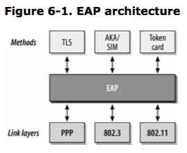

除了流量控制与协商信息，EAP 也会为身份认证的方式指定类型代码。EAP 会把证明使用者身份的过程，授权给一个称为 EAP method 的附属协议，EAP method 是一组验证使用者身份的规则。

使用 EAP method 的优点是：EAP 从此可以不用去管验证使用者的细节。如果需求改变，这是无线网络普及之后常有的状况，就可以开发新的 EAP method 来满足这个需求。以下列出了 一些 EAP method 以及它们的类型代码。无线局域网络常用的 EAP method 将于本章稍后详细说明。

| 类型代码 | 身份认证协议 | 说明 |
|----------|--------------|------|
| 4 | MD5 challenge | EAP 中类似 CHAP 的认证方式 |
| 6 | GTC | 原本打算搭配 RSA SecurID5 之类的标记卡(token card) 一起使用 |
| 13 | EAP-TLS | 以数字证书相互认证 |
| 21 | TTLS | 管道式 TLS; 以 TLS 加密保护较脆弱的身份认证方式 |
| 25 | PEAP |  防护型 EAP; 以 TLS 加密保护较脆弱的 EAP 认证方式 | 
| 18 | EAP-SIM | 使用移动电话的SIM卡进行身份认证 |
| 29 | MS-CHAP-V2 | Microsoft 之经加密的密码身份认证; 兼容于 Windows 网络 |

可延伸性(EAP 当中的 E)既是 EAP 最大的优点也是最大的缺点。可延伸性让协议得以在新的需求出现时开发新的功能，同时正因为本身的可延伸性，EAP 已经从保留 PPP 协议编号的方式，转变为无线局域网络的安全防护基础。不过，要正确部署 EAP 可能不容易，因为要选择正确的协议选项之前必须先理清一大堆问题。EAP 之所以具有弹性，关键在于它本身只是一个架构。当新的 需求出现，就可以设计出新的认证方式，就算要用于无线局域网络也不成问题。

无线局域网络之安全防护协议这个议题十分广泛，本章试图一点一滴逐步勾勒出协议运作机制的细节。很多复杂的细节只会以文字来描述，不会用详细的封包格式图来说明。

#### 加密的方式

EAP method 的选择通常取决于后端所使用的身份认证系统。早期的 EAP method 主要将焦点摆在如何提供与认证服务器间的传输管道。针对无线网络所设计的新型认证方式，除了可以跟认证服务器进行沟通，也符合无线局域网络特有的三项要求:

*  为使用者的数据提供坚固的加密防护

定义上，无线局域网络应该被视为一种开放介质。若要确保安全，任何通过无线网络传送的数据均须加以保护。大多数针对无线局域网络所设计的 EAP method 均采用 TLS 来提供私密数据的加密防护。

早期无线局域网络协议的设计，将身分认证视为基站对使用者提出的要求。随着基站价格的滑落，如今攻击者已经能够部署「伪装」的基站，用来窃取用户的私密数据。依常理判断，除了使用者的身份认证，用户端设备还必须验证它们所连接的网络是否正确无误。

衍生密钥使用事先约定密钥的 WEP 机制，无法为电波链路上的帧提供多少保护。较坚固的安全防护协议必须使用由乱数集区(entropy pool)衍生而成的动态密钥。提供坚固之加密防护的副作用是，此类协议还会产生一份共享的加密串流，可用来传递密钥给链路层安全防护协议。

> LEAP

Cisco 专属的 Lightweight LAP(轻量级 EAP，简称 LEAP)是最早广泛使用的无线网络身份认证方式。相对于通过手动方式设置密钥的 WEP，LEAP 可说是往前迈进了一大步，虽然它还有很多地方有待改进。基本上，LEAP 进行了两次 MS-CHAP Version 1 交换程序。第一次由使用 者对网络进行验证，第二次由网络对使用者进行身分认证。动态密钥是衍生自 MS-CHAP 交换程序。

一些最糟糕的安全问题都是由 MS-CHAP version 1 所引起的。MS-CHAP version 1 有一些安全上的问题，容易导致字典式攻击。攻击 LEAP 弱点的漏洞利用代码目前已经广泛流传。

LEAP 算是一种过渡性的解决方案，虽然相较于手动设置密钥的 WEP 在安全性上有显著的优点，不过使用过时的 MS-CHAP 作为核心反而缩短了它的使用寿命。等到其他协议陆续问世，LEAP 就没有存在的必要了。

> EAP-TLS

Transport Layer Security(简称 TLS)协议原本就是设计来用在易遭窥视的链路层上。TLS 的前身是保护网际网络交易安全的协议 Secure Socket Layer(简称SSL)。从许多方面来看，无线局域网络的使用案例与网际网络类似。数据必须在完全不可信赖甚至是攻击者建立的网络环境中进行传送。TLS 的目的就是在不可信赖的网络环境中建立一条可信赖的通信信道。

TLS 通过证书交换来进行相互认证。使用者必须将数字证书送交认证服务器以进行验证，但是认证服务器也必须提供自身的证书。通过可信赖的证书发行机构验证服务器的证书真伪，用户端就可以确定所连接的网络经过证书发行机构授权无误。

EAP-TLS 是第一个符合无线网络三项要求的身份认证方式。证书提供可靠的“使用者对网络”以及“网络对使用者”双向认证。相互认证可以防范所谓的“假”（rogue）基站，让用户端得以判定基站是否由正确的部门而非为了窃取密码的攻击者所设立。TLS 还会建立一组主秘钥，用来衍生出链路层安全防护协议所需要的密钥。

EAP-TLS 虽然安全，不过并未被广泛使用。无线网络中任何潜在的用户都必须配备自身的数字证书。产生与传递证书以及遵循验证程序都是较大的挑战。已经采用公开密钥基础建设的机构如要使用 EAP-TLS 就相当容易。有些机构并不想组建 PKI，而另外选用别种方式。

> EAP-TTLS与EAP-PEAP

实际上，需要使用 PKI 是无线局域网络上推行坚固的身份认证时主要的障碍。PKI 不论在技术或者程序上都是一项艰巨的任务。大多数的组织宁可利用现有的身份认证系统，例如 Windows 域控制或 活动目录，轻量级目录访问控制协议，或者 Kerberos域 。使用现成的帐号比起重新建立一套并行的身份认证系统来得简单。有两种 EAP method 能够搭配所谓的“传统（legacy）身份认证方式”一起使用，分别是管道式 TLS（Tunneled TLS，简称 TTLS）与防护型 EAP（Protected EAP， 简称 PEAP）。

TTLS 与 PEAP 的运作方式类似。首先，协议会使用类似 EAP-TLS 的方式建立起一个 TLS 管道。进行下一个步骤之前，会先使用认证服务器的数字证书来验证此网络是否可受信赖。第二个步骤是使用 TLS 管道为传统的身份认证协议加密，然后以之验证使用者身份。有时候第一个步骤也称为**外层**（outer）身份认证，因为它是用来保护第二个或者**内层**（inner）身份认证的管道。

认证还是免不了，但只有外层身份认证需要用到。TTLS 与 PEAP 将证书数目从千百张缩减为屈指可数，只有认证服务器需要使用证书。这就是为什么 TTLS 与 PEAP 远比 EAP-TLS 受到欢迎。一般机构可以自行设立小型的证书管理中心，不必依赖外部证书机构所签发的昂贵证书。

TTLS 与 PEAP 之间有些微的差异，在于内层身份认证的处理方式。TTLS 使用加密管道来交换**属性-值**对（Attribute Value Pair，简称 AVP）, PEAP 则是在管道内进行第二次 EAP 交换程序。采用 AVP 使得 TTLS 较具弹性，因为 AVP 可用来执行 EAP method 未提供的身份认证方式。

使用 TTLS 与 PEAP 的好处是，内层与外层身份认证可以使用不同的使用者名称。这两种协议在进行外层身份认证时可以匿名进行，只有在加密管道中才会显示使用者的真实身份，如此一来就不会在未经加密的帧中暴露使用者名称。不过并非所有用户端软件均可隐藏使用者的身份。


#### 非加密式EAP认证方式

若无坚固的加密防护，有些 EAP method 并不适合直接用于无线网络。不过，它们可以作为PEAP 或 TTLS 的内层身份认证方式。

> MD-5 Challenge

MD-5 挑战相当于 RFC 1994 所规范的 CHAP 协议。身份认证要求中包含了给用户端的挑战。用户端只要能够成功回应挑战，就可以证明它的确握有共享密钥。所有的 EAP 实现必须支持 MD-5 Challenge。不过，它在无线网络领域并末得到广泛使用，因为它无法在无线网络上提供动态密钥。

> Microsoft CHAP version 2

简称 MS-CHAP-V2，最早出现在 Windows 2000 操作系统，规范于 RFC 2759。它被设计来解决 MS-CHAP的缺陷，除了移除旧式用户端进行密码编码时的弱点，还提供相互认证以及改善密钥产生与更换的机制。

MS-CHAP-V2 广泛使用于微软工作站，通常作为内层身份认证方式，并搭配 PEAP 一起使用。MS-CHAP-V2 是 Windows 网络最常见的内层身份认证方式。当作 EAP 认证方式使用时，EAP-MSCHAP-V2 可以搭配 TTLS 或者 PEAP 一起使用。

### 802.1X 网络端口身份认证

在链路层采用身份认证机制并不是什么新鲜事。网络连接基于端口的身份认证在拨号访问服务器上已经使用多年。大部分的机构早已采用各种机制，作为使用者身份认证之用，例如 RADIUS 服务器与 LDAP 目录服务。以 PPP over Ethernet(简称 PPPoE)的使用者认证，为以太网访问进行把关的做法并不难理解，不过如此一来会增加系统的负载与复杂度。因此，IEEE 采用 PPP 认证协议，据以开发针对局域网络的版本。最后出炉的标准称为 802.1X，即**基于端口的网络访问控制**（Port-Based Network Access Control）。

802.1X 为认证对话程序定义了三个组件，如图 6-6(a)所示。申请者（supplicant）是寻求访问网络资源的使用者机器。网络访问由认证者（authenticator）所控制，它扮演着传统拨号网络中访问服务器一样的角色。申请者与认证者在协议规范中称为端口认证实体（Port Authentication Entities，简称PAE）。认证者只负责链路层的身份认证交换程序，并不维护任何使用者信息。任何认证要求均会被转送至认证服务器（例如 RADIUS）进行实际的处理。

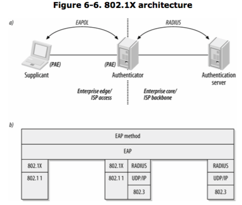

支持 802.1X 的设备上，各个端口若非处于**授权**状态（亦即可以使用该端口），就是处于**未授权**状态（亦即无法使用该端口）。不过就算处于未授权状态，协议规范中还是允许使用 DHCP 以及其他初始化信息，如果网络管理人员允许的话。

整个身份认证交换程序在逻辑上是通过申请者与认证服务器来完成的，认证者只是扮演代理服务器的角色。图 6-6(b)所示为逻辑上的协议架构。申请者与认证者之间（即前端），使用由 802.1X 所定义的 EAP over LAN（简称 EAPOL）协议。在后端，则是通过 RADIUS 封包来传递 EAP。有些文献称之为 EAP over RADIUS。就算端口尚未得到授权，也尚未取得 IP 地址，申请者还是能够持续与 RADIUS 服务器进行 EAP 交换程序。

图 6-6 可以有两种不同的解读方式。在企业场合中，申请者乃是位于企业网络边界的一部主机，而 RADIUS 服务器则位于企业核心。本图同时显示了一家以 802.1X 认证使用者身份的 ISP，图左为 ISP 的访问范围，而图右则是 ISP 的骨干网络。

RADIUS 的好处是支持多种使用者数据库。除了本地的数据库，RADIUS 服务器也可以当成通往 LDAP 目录、Unix NIS 或 PAM、Kerboros realms、Windows 使用者帐号、甚至是其他 RADIUS服务器的网关。RADIUS 相当有弹性，甚至可以用统一格式整合截然不同的使用者数据库。

802.1X 只是一个架构，并非一套完整的规范。实际的认证机制，其实是通过认证服务器来完成的。802.1X 所提供的机制，主要是用来发出挑战信息以及确认或拒绝访问，实际上并不负责判断对方是否有权访问。改变认证的方式不需要大幅更动使用者的设备，或整个网络的基础建设。认证服务器可以重新设置配置，以便外挂其他新的认证服务，不必更换使用者所使用的驱动程序或交换机的固件。

802.1X 为任何局域网络，包括无线局域网络，提供了一个使用者身份认证的架构。就本书的目的而言，无线网络上 802.1X 中的端口，相当于无线设备与基站间的连接（association）。 当链路层开始作用时，Association Request 与 Association Response 帧交换成功的信息会告知 802.1X 状态引擎（state engine，如下图所示）。一旦连接成功，工作站就可以开始进行 802.1X 帧交换程序，尝试取得授权。802.1X 身份认证交换程序与密钥传递完成后，使用者就会收到网卡已经连接的信息。

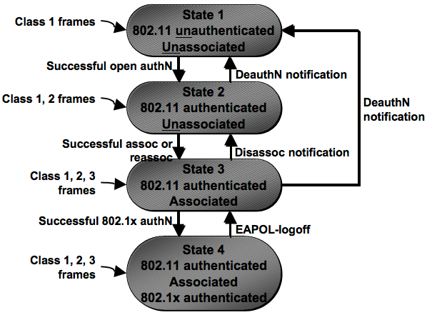

