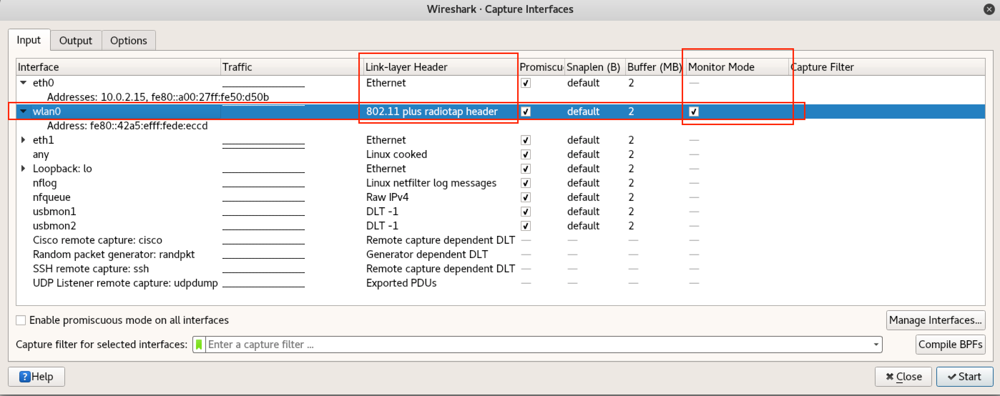
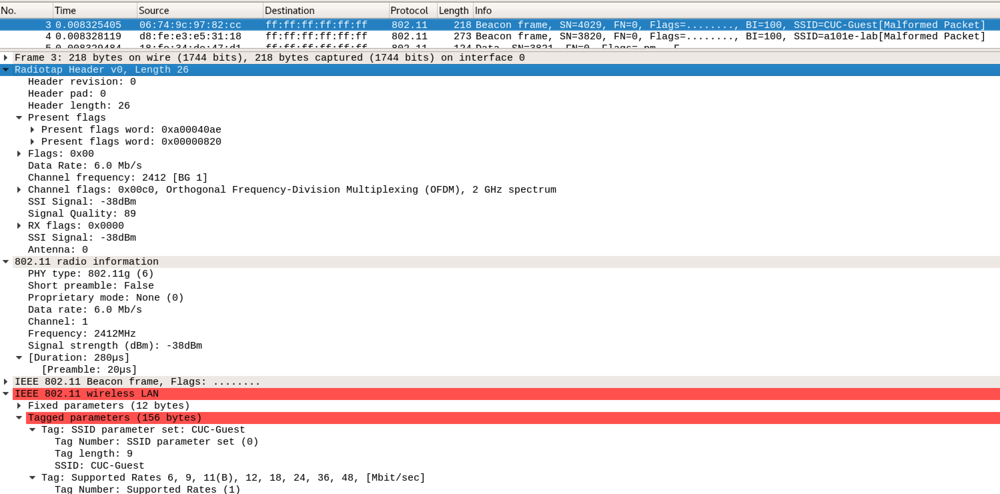
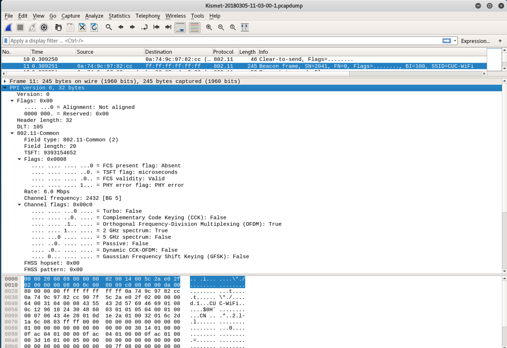

# RadioTap

RadioTap 是 IEEE 802.11 帧注入和接收的 **事实** 标准。radiotap 头格式用于提供关于数据帧的一些附加信息，诸如驱动层（例如：libpcap）向用户态程序提供信息和用户态应用程序利用这些附加信息来控制驱动进行数据传输。最初是 David Young 设计用于 NetBSD 系统，radiotap 报文头格式相比于 ``Prism`` 或 ``AVS`` 格式头提供的信息更灵活，可以支持驱动开发者通过在 radiotap 头设置比特掩码的方式定义任意数量的附加信息。

```bash
# Mac 上的 tshark 和 tcpdump 支持的抓包格式如下：
# -I 参数用于指定网卡使用 监听模式，目前仅无线网卡支持该模式
# 部分无线网卡可能不支持 -I 参数，例如 Comfast CF-916AC
# -L 列出当前网卡支持的链路层封包格式
sudo tshark -i en0 -I -L
Data link types of interface en0 when in monitor mode (use option -y to set):
  IEEE802_11_RADIO (802.11 plus radiotap header)
  RAW (Raw IP)
  IEEE802_11_RADIO_AVS (802.11 plus AVS radio information header)
  IEEE802_11 (802.11)
  PPI (Per-Packet Information)
```

RadioTap 是由提供无线网卡的抓包驱动在捕获数据帧时 **实时** 添加的，并不是所有的抓包驱动都会添加 RadioTap 头。所以，需要特别注意的是：RadioTap 并不是 IEEE 802.11 数据帧格式规范的组成部分，实际传输的 802.11 帧并不包含所谓的 RadioTap 头部。

以 Wireshark 为例，在进行无线数据嗅探时，需要设置网卡启用 ``监听模式`` 。此时，Wireshark 会自动将网卡的 ``Link-layer Header`` 设置为 ``802.11 plus radiotap header``。



有时，``airmon-ng start wlan0`` 可能会遇到无法设置网卡为 ``监听模式`` 的情况，例如：[Rtl 8811](rtl8811au.md) 系列网卡，可以通过 ``iw`` 或 ``iwconfig`` 进行手工设置：

```bash
iwconfig wlan0 mode monitor
# 设置网卡监听 channel
iwconfig wlan0 channel 11

# 支持更精细化的监听模式特殊参数设置
iw dev wlan0 set mode monitor none
```

Kali 上的 ``tcpdump`` 默认对无线抓包已经启动了 ``802.11 plus radiotap header``，``tcpdump`` 支持的链路层数据封装格式完整定义见[官方文档](http://www.tcpdump.org/linktypes.html)，不同平台上的 ``tcpdump`` 二进制程序可能支持的格式有差异。 

目前官方认可的[附加信息字段参见如下](http://www.radiotap.org/fields/defined)：

* A-MPDU status
* Antenna noise
* Antenna signal
* Antenna
* Channel
* FHSS
* Flags
* Lock quality
* MCS
* RX flags
* Radiotap Namespace
* Rate
* TSFT
* TX attenuation
* VHT
* Vendor Namespace
* dB TX attenuation
* dB antenna noise
* dB antenna signal
* dBm TX power
* timestamp

目前还在讨论中的字段类型定义如下：

* HE-MU-other-user
* HE-MU
* HE
* RSSI
* RTS retries
* TX flags
* XChannel
* data retries
* extended flags
* hardware queue

如下图所示是用 Wireshark 无线抓包获得的一个 ``Beacon frame`` 截图，从图中我们可以看到：

* 该数据帧来自 ``2.4 GHZ channel 1``
* 无线网卡获取到该帧时的传输速率是：``6.0 Mb/s``
* 信号质量是：``89``
* 信号强度是：``-38 dBm``



Kismet 嗅探时采用 [PPI](https://www.ikeriri.ne.jp/download/airpcap/ppi%20header%20format%201.0.9.pdf) 格式代替 RadioTap 来保存无线嗅探时的附加信息，如下图所示：



## 参考资料

* [RadioTap官网](http://www.radiotap.org/)
* [What are RadioTap Headers?](http://wifinigel.blogspot.jp/2013/11/what-are-radiotap-headers.html)
* [Link-layer header types: what do I need to know?](https://www.adriangranados.com/blog/link-layer-header-types)

