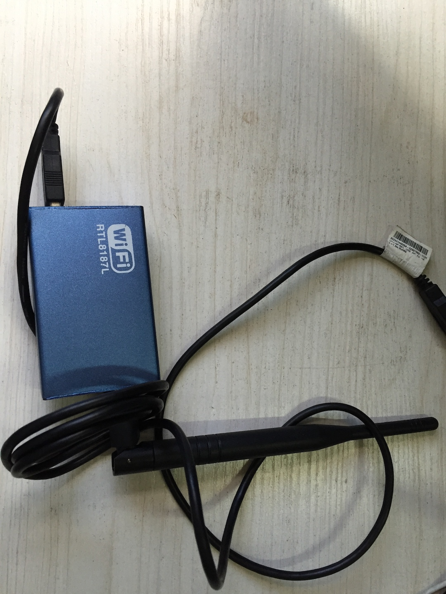
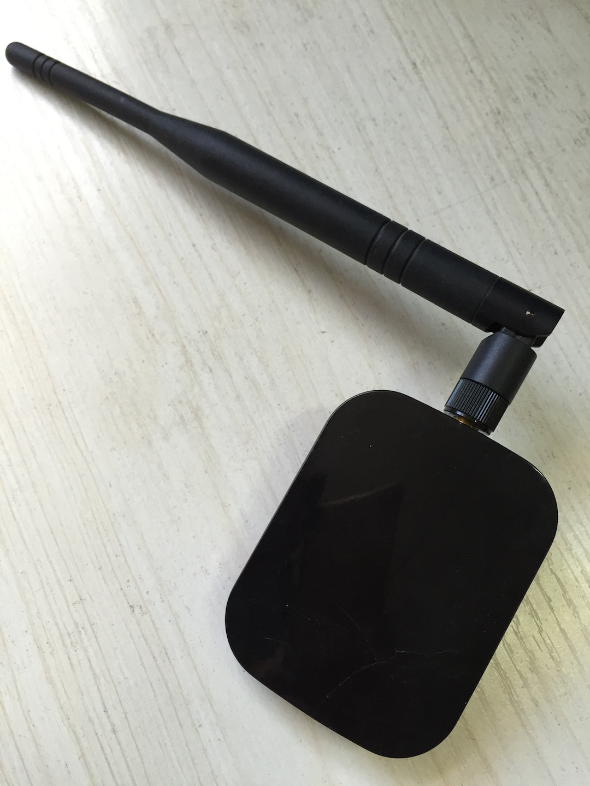
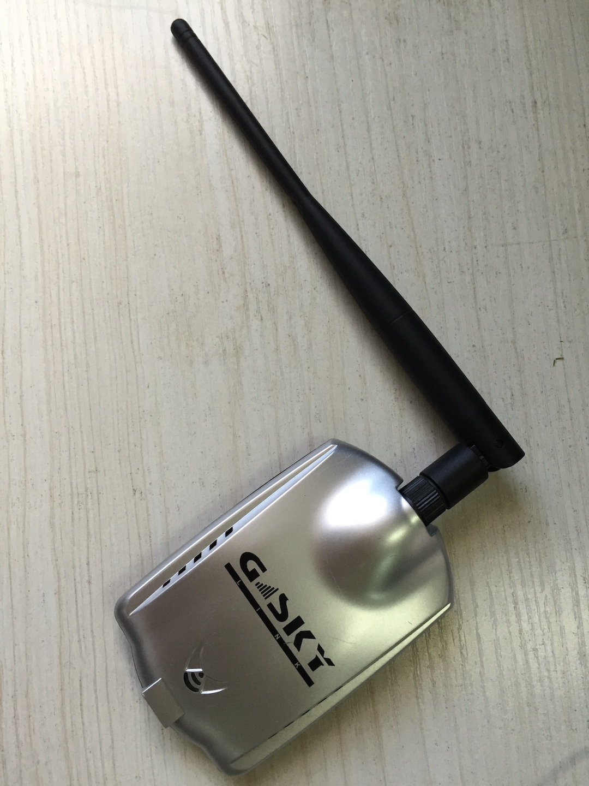
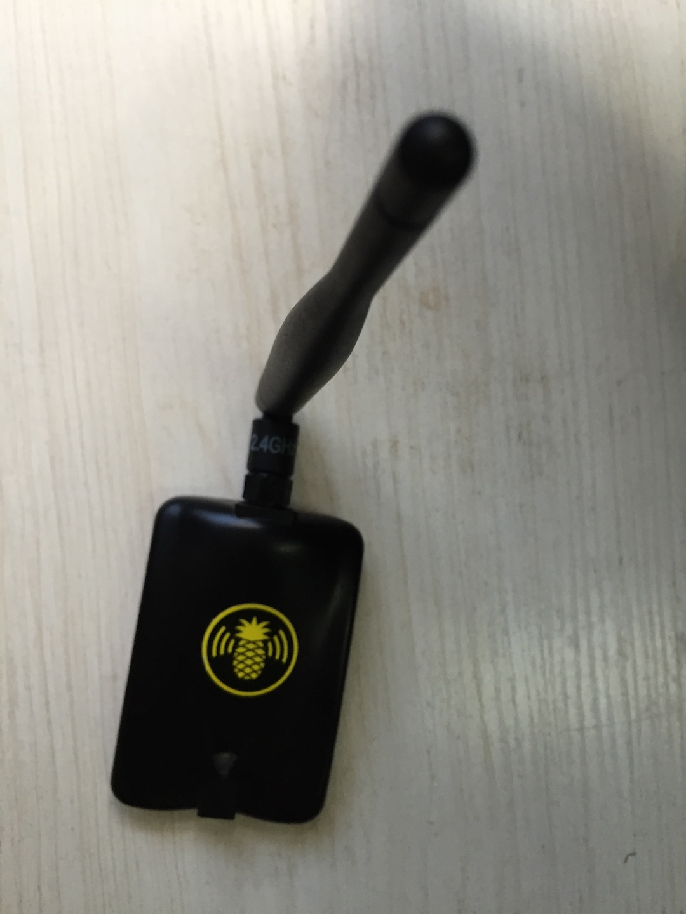

# RTL-8187

## 纯蓝（杂牌）



```
	max # scan SSIDs: 4
	max scan IEs length: 2285 bytes
	Retry short limit: 7
	Retry long limit: 4
	Coverage class: 0 (up to 0m)
	Device supports RSN-IBSS.
	Supported Ciphers:
		* WEP40 (00-0f-ac:1)
		* WEP104 (00-0f-ac:5)
		* TKIP (00-0f-ac:2)
		* CCMP (00-0f-ac:4)
		* 00-0f-ac:10
		* GCMP (00-0f-ac:8)
		* 00-0f-ac:9
	Available Antennas: TX 0 RX 0
	Supported interface modes:
		 * IBSS
		 * managed
		 * monitor
	Band 1:
		Bitrates (non-HT):
			* 1.0 Mbps
			* 2.0 Mbps
			* 5.5 Mbps
			* 11.0 Mbps
			* 6.0 Mbps
			* 9.0 Mbps
			* 12.0 Mbps
			* 18.0 Mbps
			* 24.0 Mbps
			* 36.0 Mbps
			* 48.0 Mbps
			* 54.0 Mbps
		Frequencies:
			* 2412 MHz [1] (20.0 dBm)
			* 2417 MHz [2] (20.0 dBm)
			* 2422 MHz [3] (20.0 dBm)
			* 2427 MHz [4] (20.0 dBm)
			* 2432 MHz [5] (20.0 dBm)
			* 2437 MHz [6] (20.0 dBm)
			* 2442 MHz [7] (20.0 dBm)
			* 2447 MHz [8] (20.0 dBm)
			* 2452 MHz [9] (20.0 dBm)
			* 2457 MHz [10] (20.0 dBm)
			* 2462 MHz [11] (20.0 dBm)
			* 2467 MHz [12] (20.0 dBm)
			* 2472 MHz [13] (20.0 dBm)
			* 2484 MHz [14] (disabled)
	Supported commands:
		 * new_interface
		 * set_interface
		 * new_key
		 * start_ap
		 * new_station
		 * new_mpath
		 * set_mesh_config
		 * set_bss
		 * authenticate
		 * associate
		 * deauthenticate
		 * disassociate
		 * join_ibss
		 * join_mesh
		 * set_tx_bitrate_mask
		 * frame
		 * frame_wait_cancel
		 * set_wiphy_netns
		 * set_channel
		 * set_wds_peer
		 * probe_client
		 * set_noack_map
		 * register_beacons
		 * start_p2p_device
		 * set_mcast_rate
		 * Unknown command (104)
		 * connect
		 * disconnect
	Supported TX frame types:
		 * IBSS: 0x00 0x10 0x20 0x30 0x40 0x50 0x60 0x70 0x80 0x90 0xa0 0xb0 0xc0 0xd0 0xe0 0xf0
		 * managed: 0x00 0x10 0x20 0x30 0x40 0x50 0x60 0x70 0x80 0x90 0xa0 0xb0 0xc0 0xd0 0xe0 0xf0
		 * AP: 0x00 0x10 0x20 0x30 0x40 0x50 0x60 0x70 0x80 0x90 0xa0 0xb0 0xc0 0xd0 0xe0 0xf0
		 * AP/VLAN: 0x00 0x10 0x20 0x30 0x40 0x50 0x60 0x70 0x80 0x90 0xa0 0xb0 0xc0 0xd0 0xe0 0xf0
		 * mesh point: 0x00 0x10 0x20 0x30 0x40 0x50 0x60 0x70 0x80 0x90 0xa0 0xb0 0xc0 0xd0 0xe0 0xf0
		 * P2P-client: 0x00 0x10 0x20 0x30 0x40 0x50 0x60 0x70 0x80 0x90 0xa0 0xb0 0xc0 0xd0 0xe0 0xf0
		 * P2P-GO: 0x00 0x10 0x20 0x30 0x40 0x50 0x60 0x70 0x80 0x90 0xa0 0xb0 0xc0 0xd0 0xe0 0xf0
		 * P2P-device: 0x00 0x10 0x20 0x30 0x40 0x50 0x60 0x70 0x80 0x90 0xa0 0xb0 0xc0 0xd0 0xe0 0xf0
	Supported RX frame types:
		 * IBSS: 0x40 0xb0 0xc0 0xd0
		 * managed: 0x40 0xd0
		 * AP: 0x00 0x20 0x40 0xa0 0xb0 0xc0 0xd0
		 * AP/VLAN: 0x00 0x20 0x40 0xa0 0xb0 0xc0 0xd0
		 * mesh point: 0xb0 0xc0 0xd0
		 * P2P-client: 0x40 0xd0
		 * P2P-GO: 0x00 0x20 0x40 0xa0 0xb0 0xc0 0xd0
		 * P2P-device: 0x40 0xd0
	software interface modes (can always be added):
		 * monitor
	interface combinations are not supported
	HT Capability overrides:
		 * MCS: ff ff ff ff ff ff ff ff ff ff
		 * maximum A-MSDU length
		 * supported channel width
		 * short GI for 40 MHz
		 * max A-MPDU length exponent
		 * min MPDU start spacing
	Device supports TX status socket option.
	Device supports HT-IBSS.
	Device supports SAE with AUTHENTICATE command
	Device supports low priority scan.
	Device supports scan flush.
	Device supports AP scan.
	Device supports per-vif TX power setting
	Driver supports a userspace MPM
```

## 纯黑（杂牌）



```
	max # scan SSIDs: 4
	max scan IEs length: 2285 bytes
	Retry short limit: 7
	Retry long limit: 4
	Coverage class: 0 (up to 0m)
	Device supports RSN-IBSS.
	Supported Ciphers:
		* WEP40 (00-0f-ac:1)
		* WEP104 (00-0f-ac:5)
		* TKIP (00-0f-ac:2)
		* CCMP (00-0f-ac:4)
		* 00-0f-ac:10
		* GCMP (00-0f-ac:8)
		* 00-0f-ac:9
	Available Antennas: TX 0 RX 0
	Supported interface modes:
		 * IBSS
		 * managed
		 * monitor
	Band 1:
		Bitrates (non-HT):
			* 1.0 Mbps
			* 2.0 Mbps
			* 5.5 Mbps
			* 11.0 Mbps
			* 6.0 Mbps
			* 9.0 Mbps
			* 12.0 Mbps
			* 18.0 Mbps
			* 24.0 Mbps
			* 36.0 Mbps
			* 48.0 Mbps
			* 54.0 Mbps
		Frequencies:
			* 2412 MHz [1] (20.0 dBm)
			* 2417 MHz [2] (20.0 dBm)
			* 2422 MHz [3] (20.0 dBm)
			* 2427 MHz [4] (20.0 dBm)
			* 2432 MHz [5] (20.0 dBm)
			* 2437 MHz [6] (20.0 dBm)
			* 2442 MHz [7] (20.0 dBm)
			* 2447 MHz [8] (20.0 dBm)
			* 2452 MHz [9] (20.0 dBm)
			* 2457 MHz [10] (20.0 dBm)
			* 2462 MHz [11] (20.0 dBm)
			* 2467 MHz [12] (20.0 dBm) (no IR)
			* 2472 MHz [13] (20.0 dBm)
			* 2484 MHz [14] (20.0 dBm) (no IR)
	Supported commands:
		 * new_interface
		 * set_interface
		 * new_key
		 * start_ap
		 * new_station
		 * new_mpath
		 * set_mesh_config
		 * set_bss
		 * authenticate
		 * associate
		 * deauthenticate
		 * disassociate
		 * join_ibss
		 * join_mesh
		 * set_tx_bitrate_mask
		 * frame
		 * frame_wait_cancel
		 * set_wiphy_netns
		 * set_channel
		 * set_wds_peer
		 * probe_client
		 * set_noack_map
		 * register_beacons
		 * start_p2p_device
		 * set_mcast_rate
		 * Unknown command (104)
		 * connect
		 * disconnect
	Supported TX frame types:
		 * IBSS: 0x00 0x10 0x20 0x30 0x40 0x50 0x60 0x70 0x80 0x90 0xa0 0xb0 0xc0 0xd0 0xe0 0xf0
		 * managed: 0x00 0x10 0x20 0x30 0x40 0x50 0x60 0x70 0x80 0x90 0xa0 0xb0 0xc0 0xd0 0xe0 0xf0
		 * AP: 0x00 0x10 0x20 0x30 0x40 0x50 0x60 0x70 0x80 0x90 0xa0 0xb0 0xc0 0xd0 0xe0 0xf0
		 * AP/VLAN: 0x00 0x10 0x20 0x30 0x40 0x50 0x60 0x70 0x80 0x90 0xa0 0xb0 0xc0 0xd0 0xe0 0xf0
		 * mesh point: 0x00 0x10 0x20 0x30 0x40 0x50 0x60 0x70 0x80 0x90 0xa0 0xb0 0xc0 0xd0 0xe0 0xf0
		 * P2P-client: 0x00 0x10 0x20 0x30 0x40 0x50 0x60 0x70 0x80 0x90 0xa0 0xb0 0xc0 0xd0 0xe0 0xf0
		 * P2P-GO: 0x00 0x10 0x20 0x30 0x40 0x50 0x60 0x70 0x80 0x90 0xa0 0xb0 0xc0 0xd0 0xe0 0xf0
		 * P2P-device: 0x00 0x10 0x20 0x30 0x40 0x50 0x60 0x70 0x80 0x90 0xa0 0xb0 0xc0 0xd0 0xe0 0xf0
	Supported RX frame types:
		 * IBSS: 0x40 0xb0 0xc0 0xd0
		 * managed: 0x40 0xd0
		 * AP: 0x00 0x20 0x40 0xa0 0xb0 0xc0 0xd0
		 * AP/VLAN: 0x00 0x20 0x40 0xa0 0xb0 0xc0 0xd0
		 * mesh point: 0xb0 0xc0 0xd0
		 * P2P-client: 0x40 0xd0
		 * P2P-GO: 0x00 0x20 0x40 0xa0 0xb0 0xc0 0xd0
		 * P2P-device: 0x40 0xd0
	software interface modes (can always be added):
		 * monitor
	interface combinations are not supported
	HT Capability overrides:
		 * MCS: ff ff ff ff ff ff ff ff ff ff
		 * maximum A-MSDU length
		 * supported channel width
		 * short GI for 40 MHz
		 * max A-MPDU length exponent
		 * min MPDU start spacing
	Device supports TX status socket option.
	Device supports HT-IBSS.
	Device supports SAE with AUTHENTICATE command
	Device supports low priority scan.
	Device supports scan flush.
	Device supports AP scan.
	Device supports per-vif TX power setting
	Driver supports a userspace MPM
```


## G_SKY



```
	max # scan SSIDs: 4
	max scan IEs length: 2285 bytes
	Retry short limit: 7
	Retry long limit: 4
	Coverage class: 0 (up to 0m)
	Device supports RSN-IBSS.
	Supported Ciphers:
		* WEP40 (00-0f-ac:1)
		* WEP104 (00-0f-ac:5)
		* TKIP (00-0f-ac:2)
		* CCMP (00-0f-ac:4)
		* 00-0f-ac:10
		* GCMP (00-0f-ac:8)
		* 00-0f-ac:9
	Available Antennas: TX 0 RX 0
	Supported interface modes:
		 * IBSS
		 * managed
		 * monitor
	Band 1:
		Bitrates (non-HT):
			* 1.0 Mbps
			* 2.0 Mbps
			* 5.5 Mbps
			* 11.0 Mbps
			* 6.0 Mbps
			* 9.0 Mbps
			* 12.0 Mbps
			* 18.0 Mbps
			* 24.0 Mbps
			* 36.0 Mbps
			* 48.0 Mbps
			* 54.0 Mbps
		Frequencies:
			* 2412 MHz [1] (20.0 dBm)
			* 2417 MHz [2] (20.0 dBm)
			* 2422 MHz [3] (20.0 dBm)
			* 2427 MHz [4] (20.0 dBm)
			* 2432 MHz [5] (20.0 dBm)
			* 2437 MHz [6] (20.0 dBm)
			* 2442 MHz [7] (20.0 dBm)
			* 2447 MHz [8] (20.0 dBm)
			* 2452 MHz [9] (20.0 dBm)
			* 2457 MHz [10] (20.0 dBm)
			* 2462 MHz [11] (20.0 dBm)
			* 2467 MHz [12] (20.0 dBm)
			* 2472 MHz [13] (20.0 dBm)
			* 2484 MHz [14] (disabled)
	Supported commands:
		 * new_interface
		 * set_interface
		 * new_key
		 * start_ap
		 * new_station
		 * new_mpath
		 * set_mesh_config
		 * set_bss
		 * authenticate
		 * associate
		 * deauthenticate
		 * disassociate
		 * join_ibss
		 * join_mesh
		 * set_tx_bitrate_mask
		 * frame
		 * frame_wait_cancel
		 * set_wiphy_netns
		 * set_channel
		 * set_wds_peer
		 * probe_client
		 * set_noack_map
		 * register_beacons
		 * start_p2p_device
		 * set_mcast_rate
		 * Unknown command (104)
		 * connect
		 * disconnect
	Supported TX frame types:
		 * IBSS: 0x00 0x10 0x20 0x30 0x40 0x50 0x60 0x70 0x80 0x90 0xa0 0xb0 0xc0 0xd0 0xe0 0xf0
		 * managed: 0x00 0x10 0x20 0x30 0x40 0x50 0x60 0x70 0x80 0x90 0xa0 0xb0 0xc0 0xd0 0xe0 0xf0
		 * AP: 0x00 0x10 0x20 0x30 0x40 0x50 0x60 0x70 0x80 0x90 0xa0 0xb0 0xc0 0xd0 0xe0 0xf0
		 * AP/VLAN: 0x00 0x10 0x20 0x30 0x40 0x50 0x60 0x70 0x80 0x90 0xa0 0xb0 0xc0 0xd0 0xe0 0xf0
		 * mesh point: 0x00 0x10 0x20 0x30 0x40 0x50 0x60 0x70 0x80 0x90 0xa0 0xb0 0xc0 0xd0 0xe0 0xf0
		 * P2P-client: 0x00 0x10 0x20 0x30 0x40 0x50 0x60 0x70 0x80 0x90 0xa0 0xb0 0xc0 0xd0 0xe0 0xf0
		 * P2P-GO: 0x00 0x10 0x20 0x30 0x40 0x50 0x60 0x70 0x80 0x90 0xa0 0xb0 0xc0 0xd0 0xe0 0xf0
		 * P2P-device: 0x00 0x10 0x20 0x30 0x40 0x50 0x60 0x70 0x80 0x90 0xa0 0xb0 0xc0 0xd0 0xe0 0xf0
	Supported RX frame types:
		 * IBSS: 0x40 0xb0 0xc0 0xd0
		 * managed: 0x40 0xd0
		 * AP: 0x00 0x20 0x40 0xa0 0xb0 0xc0 0xd0
		 * AP/VLAN: 0x00 0x20 0x40 0xa0 0xb0 0xc0 0xd0
		 * mesh point: 0xb0 0xc0 0xd0
		 * P2P-client: 0x40 0xd0
		 * P2P-GO: 0x00 0x20 0x40 0xa0 0xb0 0xc0 0xd0
		 * P2P-device: 0x40 0xd0
	software interface modes (can always be added):
		 * monitor
	interface combinations are not supported
	HT Capability overrides:
		 * MCS: ff ff ff ff ff ff ff ff ff ff
		 * maximum A-MSDU length
		 * supported channel width
		 * short GI for 40 MHz
		 * max A-MPDU length exponent
		 * min MPDU start spacing
	Device supports TX status socket option.
	Device supports HT-IBSS.
	Device supports SAE with AUTHENTICATE command
	Device supports low priority scan.
	Device supports scan flush.
	Device supports AP scan.
	Device supports per-vif TX power setting
	Driver supports a userspace MPM
```

## pineable



```
max # scan SSIDs: 4
	max scan IEs length: 2285 bytes
	Retry short limit: 7
	Retry long limit: 4
	Coverage class: 0 (up to 0m)
	Device supports RSN-IBSS.
	Supported Ciphers:
		* WEP40 (00-0f-ac:1)
		* WEP104 (00-0f-ac:5)
		* TKIP (00-0f-ac:2)
		* CCMP (00-0f-ac:4)
		* 00-0f-ac:10
		* GCMP (00-0f-ac:8)
		* 00-0f-ac:9
	Available Antennas: TX 0 RX 0
	Supported interface modes:
		 * IBSS
		 * managed
		 * monitor
	Band 1:
		Bitrates (non-HT):
			* 1.0 Mbps
			* 2.0 Mbps
			* 5.5 Mbps
			* 11.0 Mbps
			* 6.0 Mbps
			* 9.0 Mbps
			* 12.0 Mbps
			* 18.0 Mbps
			* 24.0 Mbps
			* 36.0 Mbps
			* 48.0 Mbps
			* 54.0 Mbps
		Frequencies:
			* 2412 MHz [1] (20.0 dBm)
			* 2417 MHz [2] (20.0 dBm)
			* 2422 MHz [3] (20.0 dBm)
			* 2427 MHz [4] (20.0 dBm)
			* 2432 MHz [5] (20.0 dBm)
			* 2437 MHz [6] (20.0 dBm)
			* 2442 MHz [7] (20.0 dBm)
			* 2447 MHz [8] (20.0 dBm)
			* 2452 MHz [9] (20.0 dBm)
			* 2457 MHz [10] (20.0 dBm)
			* 2462 MHz [11] (20.0 dBm)
			* 2467 MHz [12] (20.0 dBm)
			* 2472 MHz [13] (20.0 dBm)
			* 2484 MHz [14] (disabled)
	Supported commands:
		 * new_interface
		 * set_interface
		 * new_key
		 * start_ap
		 * new_station
		 * new_mpath
		 * set_mesh_config
		 * set_bss
		 * authenticate
		 * associate
		 * deauthenticate
		 * disassociate
		 * join_ibss
		 * join_mesh
		 * set_tx_bitrate_mask
		 * frame
		 * frame_wait_cancel
		 * set_wiphy_netns
		 * set_channel
		 * set_wds_peer
		 * probe_client
		 * set_noack_map
		 * register_beacons
		 * start_p2p_device
		 * set_mcast_rate
		 * Unknown command (104)
		 * connect
		 * disconnect
	Supported TX frame types:
		 * IBSS: 0x00 0x10 0x20 0x30 0x40 0x50 0x60 0x70 0x80 0x90 0xa0 0xb0 0xc0 0xd0 0xe0 0xf0
		 * managed: 0x00 0x10 0x20 0x30 0x40 0x50 0x60 0x70 0x80 0x90 0xa0 0xb0 0xc0 0xd0 0xe0 0xf0
		 * AP: 0x00 0x10 0x20 0x30 0x40 0x50 0x60 0x70 0x80 0x90 0xa0 0xb0 0xc0 0xd0 0xe0 0xf0
		 * AP/VLAN: 0x00 0x10 0x20 0x30 0x40 0x50 0x60 0x70 0x80 0x90 0xa0 0xb0 0xc0 0xd0 0xe0 0xf0
		 * mesh point: 0x00 0x10 0x20 0x30 0x40 0x50 0x60 0x70 0x80 0x90 0xa0 0xb0 0xc0 0xd0 0xe0 0xf0
		 * P2P-client: 0x00 0x10 0x20 0x30 0x40 0x50 0x60 0x70 0x80 0x90 0xa0 0xb0 0xc0 0xd0 0xe0 0xf0
		 * P2P-GO: 0x00 0x10 0x20 0x30 0x40 0x50 0x60 0x70 0x80 0x90 0xa0 0xb0 0xc0 0xd0 0xe0 0xf0
		 * P2P-device: 0x00 0x10 0x20 0x30 0x40 0x50 0x60 0x70 0x80 0x90 0xa0 0xb0 0xc0 0xd0 0xe0 0xf0
	Supported RX frame types:
		 * IBSS: 0x40 0xb0 0xc0 0xd0
		 * managed: 0x40 0xd0
		 * AP: 0x00 0x20 0x40 0xa0 0xb0 0xc0 0xd0
		 * AP/VLAN: 0x00 0x20 0x40 0xa0 0xb0 0xc0 0xd0
		 * mesh point: 0xb0 0xc0 0xd0
		 * P2P-client: 0x40 0xd0
		 * P2P-GO: 0x00 0x20 0x40 0xa0 0xb0 0xc0 0xd0
		 * P2P-device: 0x40 0xd0
	software interface modes (can always be added):
		 * monitor
	interface combinations are not supported
	HT Capability overrides:
		 * MCS: ff ff ff ff ff ff ff ff ff ff
		 * maximum A-MSDU length
		 * supported channel width
		 * short GI for 40 MHz
		 * max A-MPDU length exponent
		 * min MPDU start spacing
	Device supports TX status socket option.
	Device supports HT-IBSS.
	Device supports SAE with AUTHENTICATE command
	Device supports low priority scan.
	Device supports scan flush.
	Device supports AP scan.
	Device supports per-vif TX power setting
	Driver supports a userspace MPM
```


