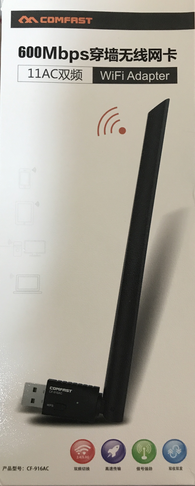
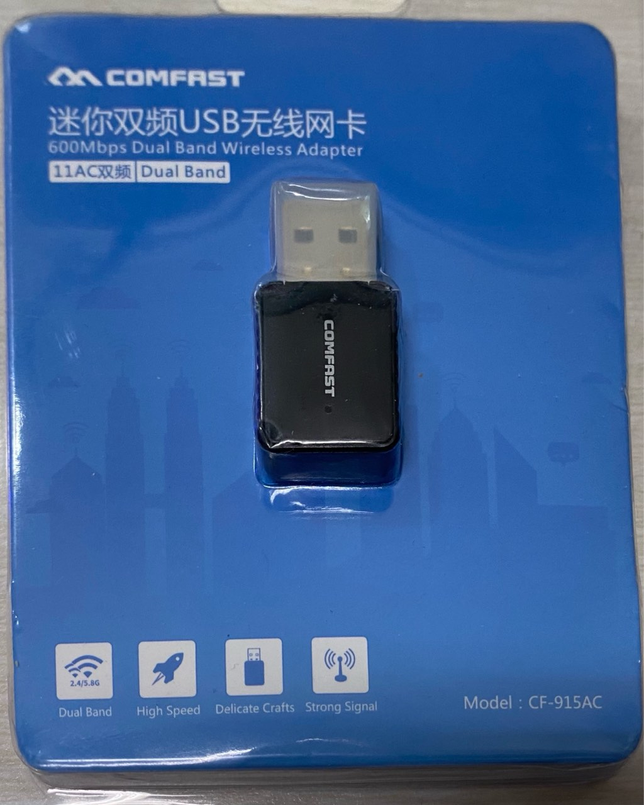
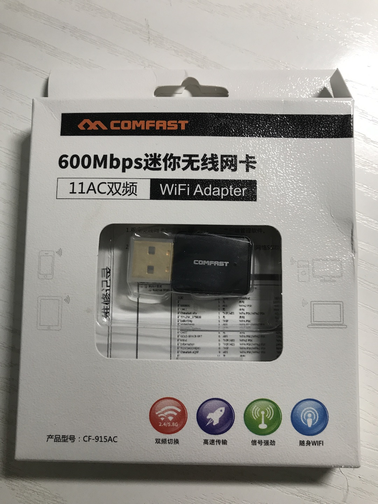
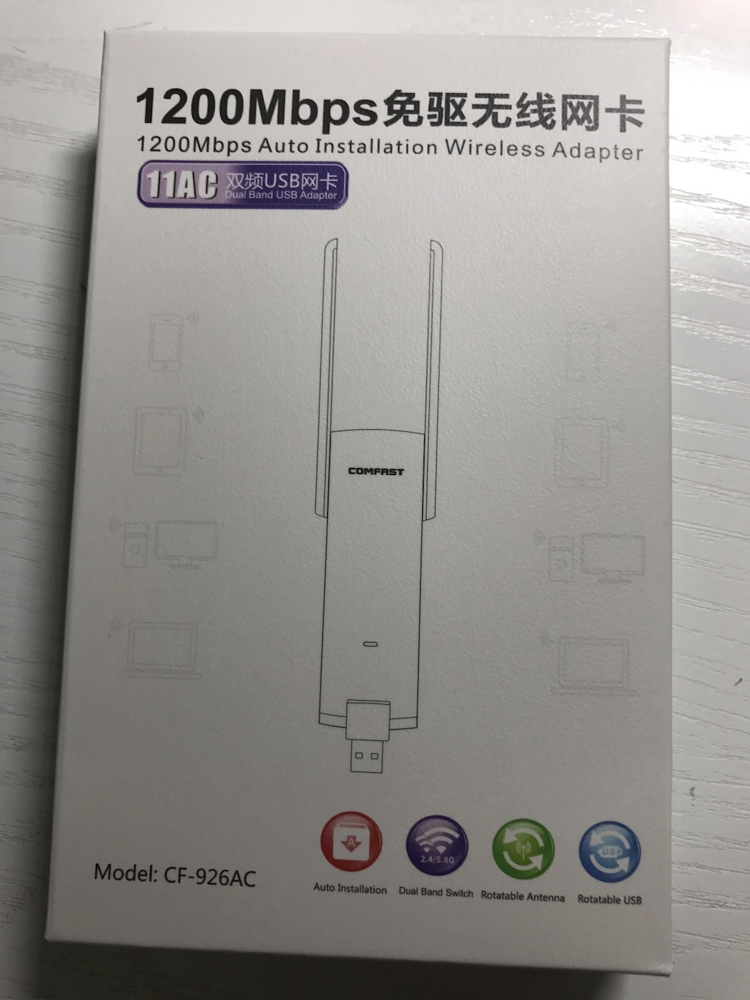
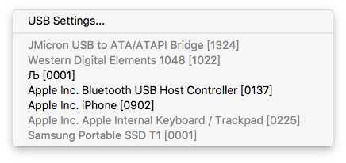
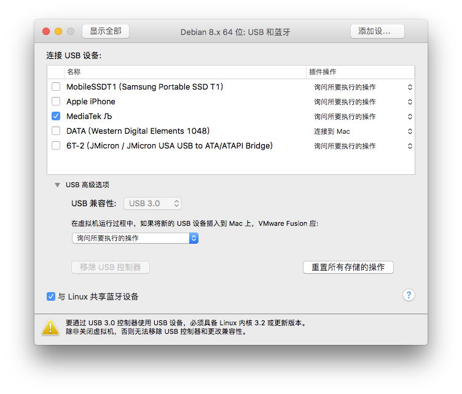

# RTL8811AU

## Comfast CF-916AC




根据[Kali Linux 2017.1 Release](https://www.kali.org/releases/kali-linux-20171-release/)，该网卡目前已经可以被完美驱动支持了！

需要手工安装驱动，虚拟机的USB连接设置应设置为USB 3.0兼容模式。

```bash
apt-get update
apt install realtek-rtl88xxau-dkms
```

如果你在``Kali 2017.1``上执行以下``lsusb -v``的输出结果和我这里的不同，可能需要先升级一下``lsusb``所使用的USB设备标识数据库。

```bash
update-usbids
```

```
# lsusb -v
Bus 001 Device 006: ID 0bda:a811 Realtek Semiconductor Corp. RTL8811AU 802.11a/b/g/n/ac WLAN Adapter
Device Descriptor:
  bLength                18
  bDescriptorType         1
  bcdUSB               2.10
  bDeviceClass            0 (Defined at Interface level)
  bDeviceSubClass         0
  bDeviceProtocol         0
  bMaxPacketSize0        64
  idVendor           0x0bda Realtek Semiconductor Corp.
  idProduct          0xa811 RTL8811AU 802.11a/b/g/n/ac WLAN Adapter
  bcdDevice            2.00
  iManufacturer           1 Realtek
  iProduct                2 802.11ac WLAN Adapter
  iSerial                 3 00e04c000001
  bNumConfigurations      1
  Configuration Descriptor:
    bLength                 9
    bDescriptorType         2
    wTotalLength           60
    bNumInterfaces          1
    bConfigurationValue     1
    iConfiguration          0
    bmAttributes         0xe0
      Self Powered
      Remote Wakeup
    MaxPower              500mA
    Interface Descriptor:
      bLength                 9
      bDescriptorType         4
      bInterfaceNumber        0
      bAlternateSetting       0
      bNumEndpoints           6
      bInterfaceClass       255 Vendor Specific Class
      bInterfaceSubClass    255 Vendor Specific Subclass
      bInterfaceProtocol    255 Vendor Specific Protocol
      iInterface              2 802.11ac WLAN Adapter
      Endpoint Descriptor:
        bLength                 7
        bDescriptorType         5
        bEndpointAddress     0x84  EP 4 IN
        bmAttributes            2
          Transfer Type            Bulk
          Synch Type               None
          Usage Type               Data
        wMaxPacketSize     0x0200  1x 512 bytes
        bInterval               0
      Endpoint Descriptor:
        bLength                 7
        bDescriptorType         5
        bEndpointAddress     0x05  EP 5 OUT
        bmAttributes            2
          Transfer Type            Bulk
          Synch Type               None
          Usage Type               Data
        wMaxPacketSize     0x0200  1x 512 bytes
        bInterval               0
      Endpoint Descriptor:
        bLength                 7
        bDescriptorType         5
        bEndpointAddress     0x06  EP 6 OUT
        bmAttributes            2
          Transfer Type            Bulk
          Synch Type               None
          Usage Type               Data
        wMaxPacketSize     0x0200  1x 512 bytes
        bInterval               0
      Endpoint Descriptor:
        bLength                 7
        bDescriptorType         5
        bEndpointAddress     0x87  EP 7 IN
        bmAttributes            3
          Transfer Type            Interrupt
          Synch Type               None
          Usage Type               Data
        wMaxPacketSize     0x0040  1x 64 bytes
        bInterval               3
      Endpoint Descriptor:
        bLength                 7
        bDescriptorType         5
        bEndpointAddress     0x08  EP 8 OUT
        bmAttributes            2
          Transfer Type            Bulk
          Synch Type               None
          Usage Type               Data
        wMaxPacketSize     0x0200  1x 512 bytes
        bInterval               0
      Endpoint Descriptor:
        bLength                 7
        bDescriptorType         5
        bEndpointAddress     0x09  EP 9 OUT
        bmAttributes            2
          Transfer Type            Bulk
          Synch Type               None
          Usage Type               Data
        wMaxPacketSize     0x0200  1x 512 bytes
        bInterval               0
Binary Object Store Descriptor:
  bLength                 5
  bDescriptorType        15
  wTotalLength           12
  bNumDeviceCaps          1
  USB 2.0 Extension Device Capability:
    bLength                 7
    bDescriptorType        16
    bDevCapabilityType      2
    bmAttributes   0x00000002
      Link Power Management (LPM) Supported
Device Status:     0x0001
  Self Powered
```

``iw phy``的输出结果如下所示：

```
    max # scan SSIDs: 9
    max scan IEs length: 2304 bytes
    max # sched scan SSIDs: 0
    max # match sets: 0
    max # scan plans: 1
    max scan plan interval: -1
    max scan plan iterations: 0
    Retry short limit: 7
    Retry long limit: 4
    Coverage class: 0 (up to 0m)
    Supported Ciphers:
        * WEP40 (00-0f-ac:1)
        * WEP104 (00-0f-ac:5)
        * TKIP (00-0f-ac:2)
        * CCMP-128 (00-0f-ac:4)
    Available Antennas: TX 0 RX 0
    Supported interface modes:
         * IBSS
         * managed
         * AP
         * monitor
         * P2P-client
         * P2P-GO
    Band 1:
        Bitrates (non-HT):
            * 1.0 Mbps
            * 2.0 Mbps
            * 5.5 Mbps
            * 11.0 Mbps
            * 6.0 Mbps
            * 9.0 Mbps
            * 12.0 Mbps
            * 18.0 Mbps
            * 24.0 Mbps
            * 36.0 Mbps
            * 48.0 Mbps
            * 54.0 Mbps
        Frequencies:
            * 2412 MHz [1] (20.0 dBm)
            * 2417 MHz [2] (20.0 dBm)
            * 2422 MHz [3] (20.0 dBm)
            * 2427 MHz [4] (20.0 dBm)
            * 2432 MHz [5] (20.0 dBm)
            * 2437 MHz [6] (20.0 dBm)
            * 2442 MHz [7] (20.0 dBm)
            * 2447 MHz [8] (20.0 dBm)
            * 2452 MHz [9] (20.0 dBm)
            * 2457 MHz [10] (20.0 dBm)
            * 2462 MHz [11] (20.0 dBm)
            * 2467 MHz [12] (20.0 dBm)
            * 2472 MHz [13] (20.0 dBm)
            * 2484 MHz [14] (disabled)
    Band 2:
        Bitrates (non-HT):
            * 6.0 Mbps
            * 9.0 Mbps
            * 12.0 Mbps
            * 18.0 Mbps
            * 24.0 Mbps
            * 36.0 Mbps
            * 48.0 Mbps
            * 54.0 Mbps
        Frequencies:
            * 5170 MHz [34] (disabled)
            * 5180 MHz [36] (17.0 dBm)
            * 5190 MHz [38] (17.0 dBm)
            * 5200 MHz [40] (17.0 dBm)
            * 5210 MHz [42] (17.0 dBm)
            * 5220 MHz [44] (17.0 dBm)
            * 5230 MHz [46] (17.0 dBm)
            * 5240 MHz [48] (17.0 dBm)
            * 5260 MHz [52] (24.0 dBm) (radar detection)
            * 5280 MHz [56] (24.0 dBm) (radar detection)
            * 5290 MHz [58] (24.0 dBm) (radar detection)
            * 5300 MHz [60] (24.0 dBm) (radar detection)
            * 5310 MHz [62] (24.0 dBm) (radar detection)
            * 5320 MHz [64] (24.0 dBm) (radar detection)
            * 5500 MHz [100] (24.0 dBm) (radar detection)
            * 5520 MHz [104] (24.0 dBm) (radar detection)
            * 5540 MHz [108] (24.0 dBm) (radar detection)
            * 5560 MHz [112] (24.0 dBm) (radar detection)
            * 5580 MHz [116] (24.0 dBm) (radar detection)
            * 5600 MHz [120] (24.0 dBm) (radar detection)
            * 5620 MHz [124] (24.0 dBm) (radar detection)
            * 5640 MHz [128] (24.0 dBm) (radar detection)
            * 5660 MHz [132] (24.0 dBm) (radar detection)
            * 5680 MHz [136] (24.0 dBm) (radar detection)
            * 5700 MHz [140] (24.0 dBm) (radar detection)
            * 5720 MHz [144] (24.0 dBm) (radar detection)
            * 5745 MHz [149] (30.0 dBm)
            * 5765 MHz [153] (30.0 dBm)
            * 5785 MHz [157] (30.0 dBm)
            * 5805 MHz [161] (30.0 dBm)
            * 5825 MHz [165] (30.0 dBm)
            * 5845 MHz [169] (disabled)
            * 5920 MHz [184] (disabled)
            * 5940 MHz [188] (disabled)
            * 5960 MHz [192] (disabled)
            * 5980 MHz [196] (disabled)
            * 6000 MHz [200] (disabled)
            * 6020 MHz [204] (disabled)
            * 6040 MHz [208] (disabled)
            * 6060 MHz [212] (disabled)
            * 6080 MHz [216] (disabled)
    Supported commands:
         * new_interface
         * set_interface
         * new_key
         * start_ap
         * new_station
         * set_bss
         * join_ibss
         * set_pmksa
         * del_pmksa
         * flush_pmksa
         * remain_on_channel
         * frame
         * set_wiphy_netns
         * set_channel
         * connect
         * disconnect
    Supported TX frame types:
         * IBSS: 0x00 0x10 0x20 0x30 0x40 0x50 0x60 0x70 0x80 0x90 0xa0 0xb0 0xc0 0xd0 0xe0 0xf0
         * managed: 0x00 0x10 0x20 0x30 0x40 0x50 0x60 0x70 0x80 0x90 0xa0 0xb0 0xc0 0xd0 0xe0 0xf0
         * AP: 0x00 0x10 0x20 0x30 0x40 0x50 0x60 0x70 0x80 0x90 0xa0 0xb0 0xc0 0xd0 0xe0 0xf0
         * AP/VLAN: 0x00 0x10 0x20 0x30 0x40 0x50 0x60 0x70 0x80 0x90 0xa0 0xb0 0xc0 0xd0 0xe0 0xf0
         * P2P-client: 0x00 0x10 0x20 0x30 0x40 0x50 0x60 0x70 0x80 0x90 0xa0 0xb0 0xc0 0xd0 0xe0 0xf0
         * P2P-GO: 0x00 0x10 0x20 0x30 0x40 0x50 0x60 0x70 0x80 0x90 0xa0 0xb0 0xc0 0xd0 0xe0 0xf0
    Supported RX frame types:
         * IBSS: 0xd0
         * managed: 0x40 0xd0
         * AP: 0x00 0x20 0x40 0xa0 0xb0 0xc0 0xd0
         * AP/VLAN: 0x00 0x20 0x40 0xa0 0xb0 0xc0 0xd0
         * P2P-client: 0x40 0xd0
         * P2P-GO: 0x00 0x20 0x40 0xa0 0xb0 0xc0 0xd0
    WoWLAN support:
         * wake up on anything (device continues operating normally)
    software interface modes (can always be added):
         * monitor
    interface combinations are not supported
    Device supports scan flush.
```

经过真机测试发现，直接使用``airmon-ng start wlan0``无法将该网卡设置为监听模式。错误信息如下：

```
# airmon-ng start wlan0

Found 4 processes that could cause trouble.
If airodump-ng, aireplay-ng or airtun-ng stops working after
a short period of time, you may want to run 'airmon-ng check kill'

  PID Name
  396 NetworkManager
  448 wpa_supplicant
  547 dhclient
  648 dhclient

PHY Interface   Driver      Chipset

phy0    wlan0       8812au      Realtek Semiconductor Corp. RTL8811AU 802.11a/b/g/n/ac WLAN Adapter
cat: /sys/class/ieee80211/phy0/device/net/wlan0mon/type: No such file or directory

Newly created monitor mode interface wlan0mon is *NOT* in monitor mode.
Removing non-monitor wlan0mon interface...

WARNING: unable to start monitor mode, please run "airmon-ng check kill"
```

使用底层的网卡设置工具``iw``可以将该网卡设置为监听模式，并能正常使用``airodump-ng``进行无线抓包（支持channel hopping）。

```
# iw dev wlan0 set monitor none
# airodump-ng wlan0 --band a
# airodump-ng wlan0 
```

使用``iw``查看网卡基本信息：

```
# iw dev
phy#1
    Interface wlan0
        ifindex 6
        wdev 0x100000001
        addr 56:88:59:xx:xx:xx
        type monitor
        channel 112 (5560 MHz), width: 20 MHz, center1: 5560 MHz
        txpower 18.00 dBm
```

## Comfast CF-915AC

### 2020 年款



```
Bus 001 Device 003: ID 0bda:a811 Realtek Semiconductor Corp. RTL8811AU 802.11a/b/g/n/ac WLAN Adapter
```

`iw phy` 输出结果如下：

```
Wiphy phy3
	wiphy index: 3
	max # scan SSIDs: 9
	max scan IEs length: 2304 bytes
	max # sched scan SSIDs: 0
	max # match sets: 0
	max # scan plans: 1
	max scan plan interval: -1
	max scan plan iterations: 0
	Retry short limit: 7
	Retry long limit: 4
	Coverage class: 0 (up to 0m)
	Supported Ciphers:
		* WEP40 (00-0f-ac:1)
		* WEP104 (00-0f-ac:5)
		* TKIP (00-0f-ac:2)
		* CCMP-128 (00-0f-ac:4)
		* CMAC (00-0f-ac:6)
	Available Antennas: TX 0x1 RX 0x1
	Supported interface modes:
		 * IBSS
		 * managed
		 * AP
		 * monitor
	Band 1:
		Capabilities: 0x1972
			HT20/HT40
			Static SM Power Save
			RX Greenfield
			RX HT20 SGI
			RX HT40 SGI
			RX STBC 1-stream
			Max AMSDU length: 7935 bytes
			DSSS/CCK HT40
		Maximum RX AMPDU length 65535 bytes (exponent: 0x003)
		Minimum RX AMPDU time spacing: 16 usec (0x07)
		HT Max RX data rate: 150 Mbps
		HT TX/RX MCS rate indexes supported: 0-7
		Bitrates (non-HT):
			* 1.0 Mbps
			* 2.0 Mbps
			* 5.5 Mbps
			* 11.0 Mbps
			* 6.0 Mbps
			* 9.0 Mbps
			* 12.0 Mbps
			* 18.0 Mbps
			* 24.0 Mbps
			* 36.0 Mbps
			* 48.0 Mbps
			* 54.0 Mbps
		Frequencies:
			* 2412 MHz [1] (20.0 dBm)
			* 2417 MHz [2] (20.0 dBm)
			* 2422 MHz [3] (20.0 dBm)
			* 2427 MHz [4] (20.0 dBm)
			* 2432 MHz [5] (20.0 dBm)
			* 2437 MHz [6] (20.0 dBm)
			* 2442 MHz [7] (20.0 dBm)
			* 2447 MHz [8] (20.0 dBm)
			* 2452 MHz [9] (20.0 dBm)
			* 2457 MHz [10] (20.0 dBm)
			* 2462 MHz [11] (20.0 dBm)
			* 2467 MHz [12] (20.0 dBm)
			* 2472 MHz [13] (20.0 dBm)
			* 2484 MHz [14] (20.0 dBm)
	Band 2:
		Capabilities: 0x1972
			HT20/HT40
			Static SM Power Save
			RX Greenfield
			RX HT20 SGI
			RX HT40 SGI
			RX STBC 1-stream
			Max AMSDU length: 7935 bytes
			DSSS/CCK HT40
		Maximum RX AMPDU length 65535 bytes (exponent: 0x003)
		Minimum RX AMPDU time spacing: 16 usec (0x07)
		HT Max RX data rate: 150 Mbps
		HT TX/RX MCS rate indexes supported: 0-7
		VHT Capabilities (0x03c03122):
			Max MPDU length: 11454
			Supported Channel Width: neither 160 nor 80+80
			short GI (80 MHz)
			SU Beamformee
			+HTC-VHT
		VHT RX MCS set:
			1 streams: MCS 0-9
			2 streams: not supported
			3 streams: not supported
			4 streams: not supported
			5 streams: not supported
			6 streams: not supported
			7 streams: not supported
			8 streams: not supported
		VHT RX highest supported: 434 Mbps
		VHT TX MCS set:
			1 streams: MCS 0-9
			2 streams: not supported
			3 streams: not supported
			4 streams: not supported
			5 streams: not supported
			6 streams: not supported
			7 streams: not supported
			8 streams: not supported
		VHT TX highest supported: 434 Mbps
		Bitrates (non-HT):
			* 6.0 Mbps
			* 9.0 Mbps
			* 12.0 Mbps
			* 18.0 Mbps
			* 24.0 Mbps
			* 36.0 Mbps
			* 48.0 Mbps
			* 54.0 Mbps
		Frequencies:
			* 5180 MHz [36] (30.0 dBm)
			* 5200 MHz [40] (30.0 dBm)
			* 5220 MHz [44] (30.0 dBm)
			* 5240 MHz [48] (30.0 dBm)
			* 5260 MHz [52] (30.0 dBm)
			* 5280 MHz [56] (30.0 dBm)
			* 5300 MHz [60] (30.0 dBm)
			* 5320 MHz [64] (30.0 dBm)
			* 5500 MHz [100] (30.0 dBm)
			* 5520 MHz [104] (30.0 dBm)
			* 5540 MHz [108] (30.0 dBm)
			* 5560 MHz [112] (30.0 dBm)
			* 5580 MHz [116] (30.0 dBm)
			* 5600 MHz [120] (30.0 dBm)
			* 5620 MHz [124] (30.0 dBm)
			* 5640 MHz [128] (30.0 dBm)
			* 5660 MHz [132] (30.0 dBm)
			* 5680 MHz [136] (30.0 dBm)
			* 5700 MHz [140] (30.0 dBm)
			* 5720 MHz [144] (30.0 dBm)
			* 5745 MHz [149] (30.0 dBm)
			* 5765 MHz [153] (30.0 dBm)
			* 5785 MHz [157] (30.0 dBm)
			* 5805 MHz [161] (30.0 dBm)
			* 5825 MHz [165] (30.0 dBm)
			* 5845 MHz [169] (30.0 dBm)
			* 5865 MHz [173] (30.0 dBm)
			* 5885 MHz [177] (30.0 dBm)
	Supported commands:
		 * new_interface
		 * set_interface
		 * new_key
		 * start_ap
		 * new_station
		 * set_bss
		 * join_ibss
		 * set_pmksa
		 * del_pmksa
		 * flush_pmksa
		 * remain_on_channel
		 * frame
		 * set_wiphy_netns
		 * set_channel
		 * connect
		 * disconnect
	Supported TX frame types:
		 * IBSS: 0x00 0x10 0x20 0x30 0x40 0x50 0x60 0x70 0x80 0x90 0xa0 0xb0 0xc0 0xd0 0xe0 0xf0
		 * managed: 0x00 0x10 0x20 0x30 0x40 0x50 0x60 0x70 0x80 0x90 0xa0 0xb0 0xc0 0xd0 0xe0 0xf0
		 * AP: 0x00 0x10 0x20 0x30 0x40 0x50 0x60 0x70 0x80 0x90 0xa0 0xb0 0xc0 0xd0 0xe0 0xf0
		 * AP/VLAN: 0x00 0x10 0x20 0x30 0x40 0x50 0x60 0x70 0x80 0x90 0xa0 0xb0 0xc0 0xd0 0xe0 0xf0
		 * P2P-client: 0x00 0x10 0x20 0x30 0x40 0x50 0x60 0x70 0x80 0x90 0xa0 0xb0 0xc0 0xd0 0xe0 0xf0
		 * P2P-GO: 0x00 0x10 0x20 0x30 0x40 0x50 0x60 0x70 0x80 0x90 0xa0 0xb0 0xc0 0xd0 0xe0 0xf0
	Supported RX frame types:
		 * IBSS: 0xd0
		 * managed: 0x40 0xb0 0xd0
		 * AP: 0x00 0x20 0x40 0xa0 0xb0 0xc0 0xd0
		 * AP/VLAN: 0x00 0x20 0x40 0xa0 0xb0 0xc0 0xd0
		 * P2P-client: 0x40 0xd0
		 * P2P-GO: 0x00 0x20 0x40 0xa0 0xb0 0xc0 0xd0
	WoWLAN support:
		 * wake up on anything (device continues operating normally)
	software interface modes (can always be added):
		 * monitor
	interface combinations are not supported
	Device supports SAE with AUTHENTICATE command
	Device supports scan flush.
	Supported extended features:
```


### 2017 年款

**注意事项（2018-09-18 更新）** 在 Kali Rolling 2018.3 上如果遇到安装了 `realtek-rtl88xxau-dkms` 驱动之后依然无法识别网卡的问题，需要手动更新内核版本和对应的头文件包。例如如下版本当前测试可用：

```bash
# 先确保 apt 缓存已更新
apt update

# 具体版本号可以通过 TAB 自动补全的方式选择
apt install linux-headers-4.17.0-kali3-amd64 linux-image-4.17.0-kali3-amd64

# 重启系统后，网卡会自动识别
reboot
```



```
Wiphy phy0
    max # scan SSIDs: 9
    max scan IEs length: 2304 bytes
    max # sched scan SSIDs: 0
    max # match sets: 0
    max # scan plans: 1
    max scan plan interval: -1
    max scan plan iterations: 0
    Retry short limit: 7
    Retry long limit: 4
    Coverage class: 0 (up to 0m)
    Supported Ciphers:
        * WEP40 (00-0f-ac:1)
        * WEP104 (00-0f-ac:5)
        * TKIP (00-0f-ac:2)
        * CCMP-128 (00-0f-ac:4)
    Available Antennas: TX 0 RX 0
    Supported interface modes:
         * IBSS
         * managed
         * AP
         * monitor
         * P2P-client
         * P2P-GO
    Band 1:
        Capabilities: 0x1962
            HT20/HT40
            Static SM Power Save
            RX HT20 SGI
            RX HT40 SGI
            RX STBC 1-stream
            Max AMSDU length: 7935 bytes
            DSSS/CCK HT40
        Maximum RX AMPDU length 65535 bytes (exponent: 0x003)
        Minimum RX AMPDU time spacing: 16 usec (0x07)
        HT Max RX data rate: 150 Mbps
        HT TX/RX MCS rate indexes supported: 0-7
        Bitrates (non-HT):
            * 1.0 Mbps
            * 2.0 Mbps
            * 5.5 Mbps
            * 11.0 Mbps
            * 6.0 Mbps
            * 9.0 Mbps
            * 12.0 Mbps
            * 18.0 Mbps
            * 24.0 Mbps
            * 36.0 Mbps
            * 48.0 Mbps
            * 54.0 Mbps
        Frequencies:
            * 2412 MHz [1] (20.0 dBm)
            * 2417 MHz [2] (20.0 dBm)
            * 2422 MHz [3] (20.0 dBm)
            * 2427 MHz [4] (20.0 dBm)
            * 2432 MHz [5] (20.0 dBm)
            * 2437 MHz [6] (20.0 dBm)
            * 2442 MHz [7] (20.0 dBm)
            * 2447 MHz [8] (20.0 dBm)
            * 2452 MHz [9] (20.0 dBm)
            * 2457 MHz [10] (20.0 dBm)
            * 2462 MHz [11] (20.0 dBm)
            * 2467 MHz [12] (20.0 dBm)
            * 2472 MHz [13] (20.0 dBm)
            * 2484 MHz [14] (20.0 dBm)
    Band 2:
        Capabilities: 0x1962
            HT20/HT40
            Static SM Power Save
            RX HT20 SGI
            RX HT40 SGI
            RX STBC 1-stream
            Max AMSDU length: 7935 bytes
            DSSS/CCK HT40
        Maximum RX AMPDU length 65535 bytes (exponent: 0x003)
        Minimum RX AMPDU time spacing: 16 usec (0x07)
        HT Max RX data rate: 150 Mbps
        HT TX/RX MCS rate indexes supported: 0-7
        VHT Capabilities (0x000010b0):
            Max MPDU length: 3895
            Supported Channel Width: neither 160 nor 80+80
            RX LDPC
            short GI (80 MHz)
            TX STBC
            SU Beamformee
        VHT RX MCS set:
            1 streams: MCS 0-9
            2 streams: not supported
            3 streams: not supported
            4 streams: not supported
            5 streams: not supported
            6 streams: not supported
            7 streams: not supported
            8 streams: not supported
        VHT RX highest supported: 433 Mbps
        VHT TX MCS set:
            1 streams: MCS 0-9
            2 streams: not supported
            3 streams: not supported
            4 streams: not supported
            5 streams: not supported
            6 streams: not supported
            7 streams: not supported
            8 streams: not supported
        VHT TX highest supported: 433 Mbps
        Bitrates (non-HT):
            * 6.0 Mbps
            * 9.0 Mbps
            * 12.0 Mbps
            * 18.0 Mbps
            * 24.0 Mbps
            * 36.0 Mbps
            * 48.0 Mbps
            * 54.0 Mbps
        Frequencies:
            * 5170 MHz [34] (30.0 dBm)
            * 5180 MHz [36] (30.0 dBm)
            * 5190 MHz [38] (30.0 dBm)
            * 5200 MHz [40] (30.0 dBm)
            * 5210 MHz [42] (30.0 dBm)
            * 5220 MHz [44] (30.0 dBm)
            * 5230 MHz [46] (30.0 dBm)
            * 5240 MHz [48] (30.0 dBm)
            * 5260 MHz [52] (30.0 dBm) (radar detection)
            * 5280 MHz [56] (30.0 dBm) (radar detection)
            * 5290 MHz [58] (30.0 dBm) (radar detection)
            * 5300 MHz [60] (30.0 dBm) (radar detection)
            * 5310 MHz [62] (30.0 dBm) (radar detection)
            * 5320 MHz [64] (30.0 dBm) (radar detection)
            * 5500 MHz [100] (30.0 dBm) (radar detection)
            * 5520 MHz [104] (30.0 dBm) (radar detection)
            * 5540 MHz [108] (30.0 dBm) (radar detection)
            * 5560 MHz [112] (30.0 dBm) (radar detection)
            * 5580 MHz [116] (30.0 dBm) (radar detection)
            * 5600 MHz [120] (30.0 dBm) (radar detection)
            * 5620 MHz [124] (30.0 dBm) (radar detection)
            * 5640 MHz [128] (30.0 dBm) (radar detection)
            * 5660 MHz [132] (30.0 dBm) (radar detection)
            * 5680 MHz [136] (30.0 dBm) (radar detection)
            * 5700 MHz [140] (30.0 dBm) (radar detection)
            * 5720 MHz [144] (30.0 dBm) (radar detection)
            * 5745 MHz [149] (30.0 dBm)
            * 5765 MHz [153] (30.0 dBm)
            * 5785 MHz [157] (30.0 dBm)
            * 5805 MHz [161] (30.0 dBm)
            * 5825 MHz [165] (30.0 dBm)
            * 5845 MHz [169] (30.0 dBm)
            * 5920 MHz [184] (30.0 dBm)
            * 5940 MHz [188] (30.0 dBm)
            * 5960 MHz [192] (30.0 dBm)
            * 5980 MHz [196] (30.0 dBm)
            * 6000 MHz [200] (30.0 dBm)
            * 6020 MHz [204] (30.0 dBm)
            * 6040 MHz [208] (30.0 dBm)
            * 6060 MHz [212] (30.0 dBm)
            * 6080 MHz [216] (30.0 dBm)
    Supported commands:
         * new_interface
         * set_interface
         * new_key
         * start_ap
         * new_station
         * set_bss
         * join_ibss
         * set_pmksa
         * del_pmksa
         * flush_pmksa
         * remain_on_channel
         * frame
         * set_wiphy_netns
         * set_channel
         * connect
         * disconnect
    Supported TX frame types:
         * IBSS: 0x00 0x10 0x20 0x30 0x40 0x50 0x60 0x70 0x80 0x90 0xa0 0xb0 0xc0 0xd0 0xe0 0xf0
         * managed: 0x00 0x10 0x20 0x30 0x40 0x50 0x60 0x70 0x80 0x90 0xa0 0xb0 0xc0 0xd0 0xe0 0xf0
         * AP: 0x00 0x10 0x20 0x30 0x40 0x50 0x60 0x70 0x80 0x90 0xa0 0xb0 0xc0 0xd0 0xe0 0xf0
         * AP/VLAN: 0x00 0x10 0x20 0x30 0x40 0x50 0x60 0x70 0x80 0x90 0xa0 0xb0 0xc0 0xd0 0xe0 0xf0
         * P2P-client: 0x00 0x10 0x20 0x30 0x40 0x50 0x60 0x70 0x80 0x90 0xa0 0xb0 0xc0 0xd0 0xe0 0xf0
         * P2P-GO: 0x00 0x10 0x20 0x30 0x40 0x50 0x60 0x70 0x80 0x90 0xa0 0xb0 0xc0 0xd0 0xe0 0xf0
    Supported RX frame types:
         * IBSS: 0xd0
         * managed: 0x40 0xd0
         * AP: 0x00 0x20 0x40 0xa0 0xb0 0xc0 0xd0
         * AP/VLAN: 0x00 0x20 0x40 0xa0 0xb0 0xc0 0xd0
         * P2P-client: 0x40 0xd0
         * P2P-GO: 0x00 0x20 0x40 0xa0 0xb0 0xc0 0xd0
    WoWLAN support:
         * wake up on anything (device continues operating normally)
    software interface modes (can always be added):
         * monitor
    interface combinations are not supported
    Device supports scan flush.
```


## Comfast CF-926AC



### ⚠️  警告

* Virtualbox 5.1.26上亲测无法被识别为有效的USB设备导致无法连入Kali虚拟机，Virtualbox识别出来的USB设备名称有特殊字符。VMWware 8.5.8可以识别并连入该设备到Kali虚拟机内；





根据Google搜索的[结果显示](http://www.cnx-software.com/2017/08/11/a-look-at-some-usb-3-0-wifi-802-11ac-adapters-with-multiple-high-gain-antennas/)，该网卡可以使用该驱动[ulli-kroll/mt7612u](https://github.com/ulli-kroll/mt7612u)，我这边没有能复现成功。驱动编译没有报错，可以``insmod``，但是``ifconfig -a``和``iw dev``等均无法识别该网卡。

* Chipset – [Mediatek MT7612U](https://github.com/ulli-kroll/mt7612u)
* Interface –  USB 3.0 rotatable port
* WiFi – Dual band 2T2R WiFi 802.11ac, 802.11a, 802.11b, 802.11g, 802.11n up to “1200” Mbps (867 Mbps @ 5.8 GHz + 300 Mbps @ 2.4 GHz)
* Antenna – 2x external high gain (3dBi) antennas (270° rotation)
* Dimensions – 19.50 x 5.00 x 1.40 cm
* Weight – 410 grams

以上硬件参数还是很吸引人的，但目前为止并不是一款可以用来做无线网络安全实验的网卡。接着等等。


