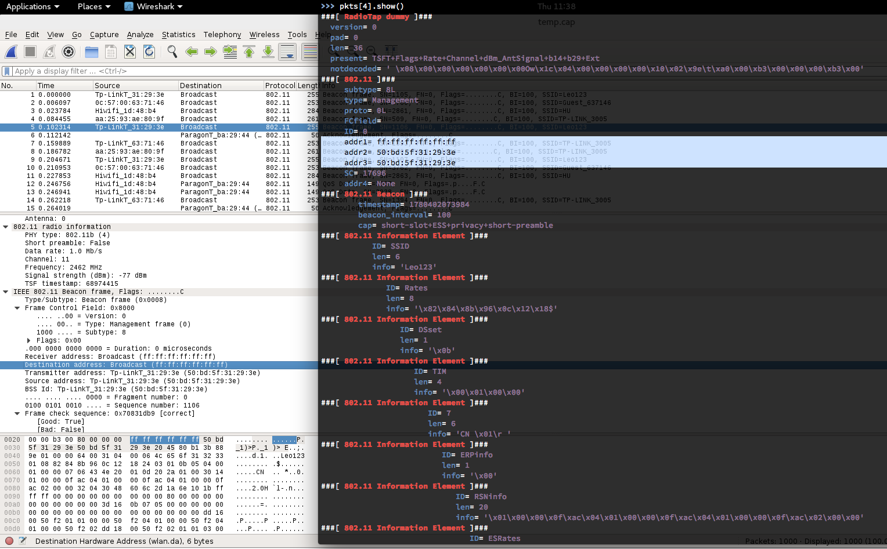

# 基于Scapy的无线网络监听编程实践

## 认识scapy

Scapy是一个支持发送、监听、解码和伪造网络数据报文的python程序。基于这些特性你可以开发出探测、扫描甚至是网络攻击程序。例如，你可以使用scapy来完全代替以下这些工具的应用场景：

* hping
* arpspoof
* arp-sk
* arping
* p0f 

对于以下这些工具的应用场景，scapy也可以通过自行编程来部分代替实现：

* Nmap
* tcpdump
* tshark
* aircrack-ng

Scapy支持交互方式运行，同时也可以作为一个python模块被引用依赖。其最核心的设计理念就是：自定义构造网络数据报文并发送和接收。除此之外，更丰富的逻辑设计和控制则完全借助于python的语言特性支持和完善。使用Scapy，发送的报文可能仅需一行代码描述再加一行打印结果的代码。90%的网络探测工具可以使用Scapy使用2行代码重新实现。

最后，用[Scapy官方文档](https://scapy.readthedocs.io/en/latest/introduction.html)中的这幅图来总结scapy的核心设计理念：


## 安装和配置

可以参考[Scapy官方文档中的下载和安装说明](https://scapy.readthedocs.io/en/latest/installation.html)，对于Kali 2.0和rolling版的用户来说，scapy已在当前发行版中内置，开箱即用。在终端输入scapy即可进入scapy的交互式命令行模式（可以通过TAB键进行函数和scapy关键字的自动补全）。如果想以模块方式编程使用scapy的全部功能，只需在py文件中增加一行模块引用声明：

```python
from scapy.all import *
```

### python 3.x 与 scapy-python3 

Scapy 自 2.4.0 版本开始，官方同时支持 Python2 和 Python3，并且官方明确表示 scapy-python3 之类的第三方维护版本很快将被重命名以避免误导用户。所以以下内容不再适用于 Scapy 2.4.0 以后版本的用户参考。

注意：Kali目前版本（``Linux KaliRolling 4.9.0-kali4-amd64 #1 SMP Debian 4.9.30-2kali1 (2017-06-22) x86_64 GNU/Linux``）提供的scapy只兼容``python 2.7.x``系列，如果希望使用``python 3.x``系列兼容的版本，则需要先配置``python 3.x``运行环境。

关于scapy-python3与scapy2版本的兼容性注意事项，请自行查阅[scapy-python3官方github上的说明](https://github.com/phaethon/scapy)

### 推荐本地开发环境同时管理 Python2 和 Python3 的方法

```bash
# 按照 https://github.com/pyenv/pyenv-installer 这里的说明安装pyenv
curl -L https://raw.githubusercontent.com/pyenv/pyenv-installer/master/bin/pyenv-installer | bash

# 注意上述脚本执行结束时的命令行提示，按照提示将相关配置指令添加到 ~/.bash_profile
# 确保打开新终端时可以正常使用 pyenv

# 安装python3.x解释器环境编译所需依赖
# ref: https://github.com/pyenv/pyenv/wiki/common-build-problems
apt install -y make build-essential libssl-dev zlib1g-dev libbz2-dev \
libreadline-dev libsqlite3-dev wget curl llvm libncurses5-dev libncursesw5-dev \
xz-utils tk-dev libffi-dev liblzma-dev
pip install zipstream
# 输入 3.7. 后通过连按 2 次「TAB 键」可以自动补全提示有哪些可选版本
pyenv install 3.7.0 -v

# 切换当前解释器环境为刚才安装的3.x版本
# 如果需要系统全局使用刚才安装的 3.x 版本，可以通过 pyenv global 3.x 来实现
pyenv local 3.7.0

# 检查当前pip是否已经切换到使用3.x解释器引擎，如果没有则使用以下命令重建pyenv shims
pyenv rehash

# 此时可以正确切换到pip3了
pip --version
# 如果看到类似如下输出，则说明已经正确切换到pip3了
# pip 10.0.1 from /root/.pyenv/versions/3.7.0/lib/python3.7/site-packages (python 3.7)

# 安装 pipenv
pip install pipenv

# 使用 pipenv 管理不同项目中使用的 Python 解释器版本和 Lib 依赖版本
# 使用 pipenv 安装最新版本 scapy 及其相关依赖 lib
pipenv install scapy matplotlib cryptography pyx ipython

# 激活当前目录下的隔离 python 开发环境
pipenv shell

# 启动 scapy
scapy
#WARNING: No route found for IPv6 destination :: (no default route?)
#
#                     aSPY//YASa
#             apyyyyCY//////////YCa       |
#            sY//////YSpcs  scpCY//Pp     | Welcome to Scapy
# ayp ayyyyyyySCP//Pp           syY//C    | Version 2.4.0
# AYAsAYYYYYYYY///Ps              cY//S   |
#         pCCCCY//p          cSSps y//Y   | https://github.com/secdev/scapy
#         SPPPP///a          pP///AC//Y   |
#              A//A            cyP////C   | Have fun!
#              p///Ac            sC///a   |
#              P////YCpc           A//A   | Craft packets like I craft my beer.
#       scccccp///pSP///p          p//Y   |               -- Jean De Clerck
#      sY/////////y  caa           S//P   |
#       cayCyayP//Ya              pY/Ya
#        sY/PsY////YCc          aC//Yp
#         sc  sccaCY//PCypaapyCP//YSs
#                  spCPY//////YPSps
#                       ccaacs
#                                       using IPython 6.5.0
```

## 快速体验

```
>>> ip = IP(dst="www.baidu.com")
>>> ip.summary()
"10.0.3.4 > Net('www.baidu.com') hopopt"
>>> ls(IP)
version    : BitField (4 bits)                   = (4)
ihl        : BitField (4 bits)                   = (None)
tos        : XByteField                          = (0)
len        : ShortField                          = (None)
id         : ShortField                          = (1)
flags      : FlagsField (3 bits)                 = (<Flag 0 ()>)
frag       : BitField (13 bits)                  = (0)
ttl        : ByteField                           = (64)
proto      : ByteEnumField                       = (0)
chksum     : XShortField                         = (None)
src        : SourceIPField                       = (None)
dst        : DestIPField                         = (None)
options    : PacketListField                     = ([])
```

## 基本概念

* 数据报文分层：通过 `/` 运算符来连接数据报文中邻近的两层。当使用该操作符时，下层可以根据其上层，使它的一个或多个默认字段被重载。（你仍可以赋予您想要的值）一个字符串也可以被用作原始层（raw layer）
* 数据报文构造：数据报文的每一层字段定义可以直接通过函数参数赋值来完成或继承该字段的默认值。
* 数据报文解析：通过haslayer()判断指定的数据报文层是否存在，若存在，则通过getlayer()来解析出该层数据，最后通过对象访问操作符 `.` 来读取具体的报文字段值。
* 数据报文发送：scapy中主要有2类报文发送函数，一类是只管发送（send/sendp），不提供接收功能。另一类则是发送并等待接收响应（sr/srp）。
* 数据报文接收：对应上述报文发送和接收函数。

实例：

```python
>>> pkt = IP(dst="202.205.24.196")/ICMP()/"helloworld"
>>> ans = sr1(pkt)
Begin emission:
..........Finished to send 1 packets.
.............*
Received 24 packets, got 1 answers, remaining 0 packets
>>> ans.show()
###[ IP ]###
  version= 4
  ihl= 5
  tos= 0x0
  len= 38
  id= 38847
  flags=
  frag= 0
  ttl= 58
  proto= icmp
  chksum= 0xf882
  src= 202.205.24.196
  dst= 10.0.3.4
  \options\
###[ ICMP ]###
     type= echo-reply
     code= 0
     chksum= 0xdfdf
     id= 0x0
     seq= 0x0
###[ Raw ]###
        load= 'helloworld'
###[ Padding ]###
           load= '\x00\x00\x00\x00\x00\x00\x00\x00'
>>> pkt.show()
###[ IP ]###
  version= 4
  ihl= None
  tos= 0x0
  len= None
  id= 1
  flags=
  frag= 0
  ttl= 64
  proto= icmp
  chksum= None
  src= 10.0.3.4
  dst= 202.205.24.196
  \options\
###[ ICMP ]###
     type= echo-request
     code= 0
     chksum= None
     id= 0x0
     seq= 0x0
###[ Raw ]###
        load= 'helloworld'
```

* 数据报文监听：对应sniff函数。

```python
pkts=sniff(1000, iface="wlan0mon")
```

```python
#!/usr/bin/env python

import sys

from scapy.all import *

def PacketHandler(pkt):
    print(pkt.summary())
    return

pkts = sniff(iface = sys.argv[1], count = int(sys.argv[2]), prn = PacketHandler)
```

* 数据报文保存到pcap

```
>>> wrpcap("temp.cap", pkts)
```

* 从pcap读取数据报文

```
>>> pkts = rdpcap("temp.cap")
```

或

```
>>> pkts = sniff(offline="temp.cap")
```


## 帮助系统

* ls(obj=None) 列举所有可用（可解析和可构造）的报文层名称，或查看一个指定报文层所包含的字段名

```python
>>> ls()
Dot11      : 802.11
Dot11ATIM  : 802.11 ATIM
Dot11AssoReq : 802.11 Association Request
Dot11AssoResp : 802.11 Association Response
Dot11Auth  : 802.11 Authentication
Dot11Beacon : 802.11 Beacon
Dot11Deauth : 802.11 Deauthentication
Dot11Disas : 802.11 Disassociation
Dot11Elt   : 802.11 Information Element
Dot11ProbeReq : 802.11 Probe Request
Dot11ProbeResp : 802.11 Probe Response
Dot11QoS   : 802.11 QoS
Dot11ReassoReq : 802.11 Reassociation Request
Dot11ReassoResp : 802.11 Reassociation Response
Dot11WEP   : 802.11 WEP packet
...

>>> ls(IP)
version    : BitField             = (4)
ihl        : BitField             = (None)
tos        : XByteField           = (0)
len        : ShortField           = (None)
id         : ShortField           = (1)
flags      : FlagsField           = (0)
frag       : BitField             = (0)
ttl        : ByteField            = (64)
proto      : ByteEnumField        = (0)
chksum     : XShortField          = (None)
src        : Emph                 = (None)
dst        : Emph                 = ('127.0.0.1')
options    : PacketListField      = ([])
```

* lsc(cmd=None) 查看scapy的所有内置命令（函数）

```python
>>> lsc()
...
send                : Send packets at layer 3
sendp               : Send packets at layer 2
...
```

* 查看（命令）使用帮助

```python
>>> help(sniff)
Help on function sniff in module scapy.sendrecv:

sniff(count=0, store=1, offline=None, prn=None, lfilter=None, L2socket=None, timeout=None, opened_socket=None, stop_filter=None, *arg, **karg)
    Sniff packets
    sniff([count=0,] [prn=None,] [store=1,] [offline=None,] [lfilter=None,] + L2ListenSocket args) -> list of packets

      count: number of packets to capture. 0 means infinity
      store: wether to store sniffed packets or discard them
        prn: function to apply to each packet. If something is returned,
             it is displayed. Ex:
             ex: prn = lambda x: x.summary()
    lfilter: python function applied to each packet to determine
             if further action may be done
             ex: lfilter = lambda x: x.haslayer(Padding)
    offline: pcap file to read packets from, instead of sniffing them
    timeout: stop sniffing after a given time (default: None)
    L2socket: use the provided L2socket
    opened_socket: provide an object ready to use .recv() on
    stop_filter: python function applied to each packet to determine
                 if we have to stop the capture after this packet
                 ex: stop_filter = lambda x: x.haslayer(TCP)
```

## 理解数据报文的指定层和报文字段设置



如上图所示，通过wireshark和scapy交互式命令行里的数据报文详情打印交叉比对，学习报文字段设置方法。

## 其他注意事项

* 由于scapy的sniff函数没有提供channel hopping的设置功能，所以在进行无线嗅探时建议在另一个打开的终端同时运行`airodump-ng wlan0mon`，利用airodump-ng的channel hopping功能来进行非定向嗅探或参考[本章实验一节提供的通过 shell 脚本配合 iw/iwconfig 定时更改虚拟网卡的监听 channel 方法](exp.md#airodump-ng)。


## 参考资料

* [Scapy官方文档](https://scapy.readthedocs.io/en/latest/)
* [Scapy CheatSheet](http://packetlife.net/media/library/36/scapy.pdf)
* [Black Hat Python: Infinite possibilities with the Scapy Module](http://bt3gl.github.io/black-hat-python-infinite-possibilities-with-the-scapy-module.html)
* [The Very Unofficial Dummies Guide To Scapy](https://theitgeekchronicles.files.wordpress.com/2012/05/scapyguide1.pdf)


