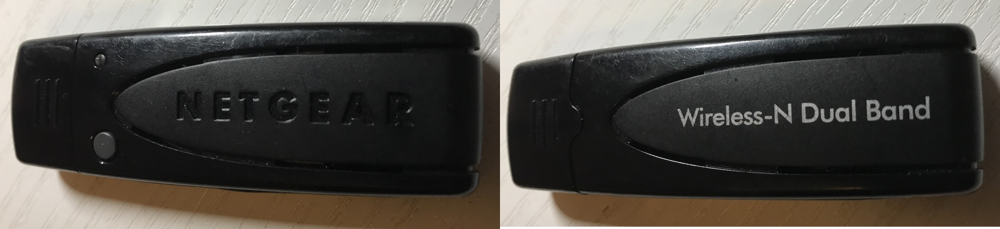

# NetGear WNDA3100v3



## 不推荐购买该型号网卡，目前驱动支持尚不成熟（2017-08-02）


在Kali Rolling 2017.1(``Linux KaliRolling 4.9.0-kali4-amd64 #1 SMP Debian 4.9.30-2kali1 (2017-06-22) x86_64 GNU/Linux``)上测试，默认驱动无法启用该网卡。

经过Google：``WNDA3100v3 Kali``在[wikidevi](https://wikidevi.com/wiki/Netgear_WNDA3100v3)上查到了目前的[可用Linux驱动jurobystricky/Netgear-A6210](https://github.com/jurobystricky/Netgear-A6210)。

对照[jurobystricky/Netgear-A6210](https://github.com/jurobystricky/Netgear-A6210)上的页面说明手工编译驱动：

```bash
git clone https://github.com/jurobystricky/Netgear-A6210
sudo mv Netgear-A6210/ /usr/src/netgear-a6210-2.5.0
sudo dkms install netgear-a6210/2.5.0    
```

重启系统后，即可查看到网卡信息：

```
	max # scan SSIDs: 128
	max scan IEs length: 2304 bytes
	max # sched scan SSIDs: 0
	max # match sets: 0
	max # scan plans: 1
	max scan plan interval: -1
	max scan plan iterations: 0
	Retry short limit: 7
	Retry long limit: 4
	Coverage class: 0 (up to 0m)
	Device supports AP-side u-APSD.
	Supported Ciphers:
		* WEP40 (00-0f-ac:1)
		* WEP104 (00-0f-ac:5)
		* TKIP (00-0f-ac:2)
		* CCMP-128 (00-0f-ac:4)
	Available Antennas: TX 0 RX 0
	Supported interface modes:
		 * IBSS
		 * managed
		 * AP
	Band 1:
		Capabilities: 0x106e
			HT20/HT40
			SM Power Save disabled
			RX HT20 SGI
			RX HT40 SGI
			No RX STBC
			Max AMSDU length: 3839 bytes
			DSSS/CCK HT40
		Maximum RX AMPDU length 65535 bytes (exponent: 0x003)
		Minimum RX AMPDU time spacing: No restriction (0x00)
		HT Max RX data rate: 150 Mbps
		HT TX/RX MCS rate indexes supported: 0-7, 32
		Bitrates (non-HT):
			* 1.0 Mbps (short preamble supported)
			* 2.0 Mbps (short preamble supported)
			* 5.5 Mbps (short preamble supported)
			* 11.0 Mbps (short preamble supported)
			* 6.0 Mbps
			* 9.0 Mbps
			* 12.0 Mbps
			* 18.0 Mbps
			* 24.0 Mbps
			* 36.0 Mbps
			* 48.0 Mbps
			* 54.0 Mbps
		Frequencies:
			* 2412 MHz [1] (20.0 dBm)
			* 2417 MHz [2] (20.0 dBm)
			* 2422 MHz [3] (20.0 dBm)
			* 2427 MHz [4] (20.0 dBm)
			* 2432 MHz [5] (20.0 dBm)
			* 2437 MHz [6] (20.0 dBm)
			* 2442 MHz [7] (20.0 dBm)
			* 2447 MHz [8] (20.0 dBm)
			* 2452 MHz [9] (20.0 dBm)
			* 2457 MHz [10] (20.0 dBm)
			* 2462 MHz [11] (20.0 dBm)
			* 2467 MHz [12] (20.0 dBm) (no IR)
			* 2472 MHz [13] (20.0 dBm) (no IR)
			* 2484 MHz [14] (20.0 dBm) (no IR)
	Band 2:
		Capabilities: 0x106e
			HT20/HT40
			SM Power Save disabled
			RX HT20 SGI
			RX HT40 SGI
			No RX STBC
			Max AMSDU length: 3839 bytes
			DSSS/CCK HT40
		Maximum RX AMPDU length 65535 bytes (exponent: 0x003)
		Minimum RX AMPDU time spacing: No restriction (0x00)
		HT Max RX data rate: 150 Mbps
		HT TX/RX MCS rate indexes supported: 0-7, 32
		Bitrates (non-HT):
			* 6.0 Mbps
			* 9.0 Mbps
			* 12.0 Mbps
			* 18.0 Mbps
			* 24.0 Mbps
			* 36.0 Mbps
			* 48.0 Mbps
			* 54.0 Mbps
		Frequencies:
			* 5180 MHz [36] (20.0 dBm) (no IR)
			* 5190 MHz [38] (20.0 dBm) (no IR)
			* 5200 MHz [40] (20.0 dBm) (no IR)
			* 5220 MHz [44] (20.0 dBm) (no IR)
			* 5230 MHz [46] (20.0 dBm) (no IR)
			* 5240 MHz [48] (20.0 dBm) (no IR)
			* 5260 MHz [52] (20.0 dBm) (no IR, radar detection)
			* 5270 MHz [54] (20.0 dBm) (no IR, radar detection)
			* 5280 MHz [56] (20.0 dBm) (no IR, radar detection)
			* 5300 MHz [60] (20.0 dBm) (no IR, radar detection)
			* 5310 MHz [62] (20.0 dBm) (no IR, radar detection)
			* 5320 MHz [64] (20.0 dBm) (no IR, radar detection)
			* 5500 MHz [100] (20.0 dBm) (no IR, radar detection)
			* 5520 MHz [104] (20.0 dBm) (no IR, radar detection)
			* 5540 MHz [108] (20.0 dBm) (no IR, radar detection)
			* 5560 MHz [112] (20.0 dBm) (no IR, radar detection)
			* 5580 MHz [116] (20.0 dBm) (no IR, radar detection)
			* 5590 MHz [118] (20.0 dBm) (no IR, radar detection)
			* 5600 MHz [120] (20.0 dBm) (no IR, radar detection)
			* 5620 MHz [124] (20.0 dBm) (no IR, radar detection)
			* 5630 MHz [126] (20.0 dBm) (no IR, radar detection)
			* 5640 MHz [128] (20.0 dBm) (no IR, radar detection)
			* 5660 MHz [132] (20.0 dBm) (no IR, radar detection)
			* 5670 MHz [134] (20.0 dBm) (no IR, radar detection)
			* 5680 MHz [136] (20.0 dBm) (no IR, radar detection)
			* 5700 MHz [140] (20.0 dBm) (no IR, radar detection)
			* 5745 MHz [149] (20.0 dBm) (no IR)
			* 5755 MHz [151] (20.0 dBm) (no IR)
			* 5765 MHz [153] (20.0 dBm) (no IR)
			* 5785 MHz [157] (20.0 dBm) (no IR)
			* 5795 MHz [159] (20.0 dBm) (no IR)
			* 5805 MHz [161] (20.0 dBm) (no IR)
			* 5825 MHz [165] (20.0 dBm) (no IR)
			* 5835 MHz [167] (disabled)
			* 5845 MHz [169] (disabled)
			* 5855 MHz [171] (disabled)
			* 5865 MHz [173] (disabled)
			* 4920 MHz [184] (disabled)
			* 4940 MHz [188] (disabled)
			* 4960 MHz [192] (disabled)
			* 4980 MHz [196] (disabled)
			* 6040 MHz [208] (disabled)
			* 6060 MHz [212] (disabled)
			* 6080 MHz [216] (disabled)
	Supported commands:
		 * new_interface
		 * set_interface
		 * new_key
		 * start_ap
		 * new_station
		 * set_bss
		 * join_ibss
		 * set_pmksa
		 * del_pmksa
		 * flush_pmksa
		 * remain_on_channel
		 * frame
		 * frame_wait_cancel
		 * set_channel
		 * start_p2p_device
		 * connect
		 * disconnect
	Supported TX frame types:
		 * managed: 0x50 0xd0
		 * AP: 0x00 0x10 0x20 0x30 0x40 0x50 0x60 0x70 0x80 0x90 0xa0 0xb0 0xc0 0xd0 0xe0 0xf0
		 * P2P-client: 0x50 0xd0
		 * P2P-GO: 0x00 0x10 0x20 0x30 0x40 0x50 0x60 0x70 0x80 0x90 0xa0 0xb0 0xc0 0xd0 0xe0 0xf0
	Supported RX frame types:
		 * managed: 0x40 0xd0
		 * AP: 0x00 0x20 0x40 0xa0 0xb0 0xc0 0xd0
		 * P2P-client: 0x40 0xd0
		 * P2P-GO: 0x00 0x20 0x40 0xa0 0xb0 0xc0 0xd0
	software interface modes (can always be added):
	interface combinations are not supported
	Device has client inactivity timer.
	Device supports scan flush.
```

从上述信息可知，该网卡驱动目前暂时不支持monitor模式。

尝试``ifconfig wlan0 up``，提示``SIOCSIFFLAGS: Operation not permitted``，阅读了[jurobystricky/Netgear-A6210](https://github.com/jurobystricky/Netgear-A6210/issues)的每一条issue，没有得到肯定的解决方案，倒是看到有人遇到了和我相似的问题。

改用源代码编译的方式再尝试：

```bash
cd /usr/src/netgear-a6210-2.5.0 && make
sudo make install
```

此时可以通过``ifconfig wlan0 up``启用无线网卡了！但进一步测试表明，该网卡的``AP``模式和``managed / STA``模式支持还是有bug，无法正常工作。在无线网卡处于连接状态下，执行``ifconfig -a``或``iw list``等无线网卡枚举类操作都会导致操作无响应。只要一断开网卡连接，则一切恢复正常。

根据[jurobystricky/Netgear-A6210 Success stories! #14](https://github.com/jurobystricky/Netgear-A6210/issues/14)上的信息，该网卡驱动在Gentoo Linux, kernel 3.18.9-gentoo、Ubuntu 16.04上均有成功案例反馈。

在``Ubuntu 16.04.1``（``Linux linux-sys 4.4.0-66-generic #87-Ubuntu SMP Fri Mar 3 15:29:05 UTC 2017 x86_64 x86_64 x86_64 GNU/Linux``）上再次测试编译驱动，DKMS方式编译的驱动同Kali上的编译效果一样：无法启用网卡。直接源代码编译静态驱动的方式，可以成功启用网卡。

```bash
iw dev wlan0 scan
```

可以通过上述方式成功扫描探测附近的无线网络。但在实际使用过程中，该网卡驱动还是会经常导致整个系统卡死。


