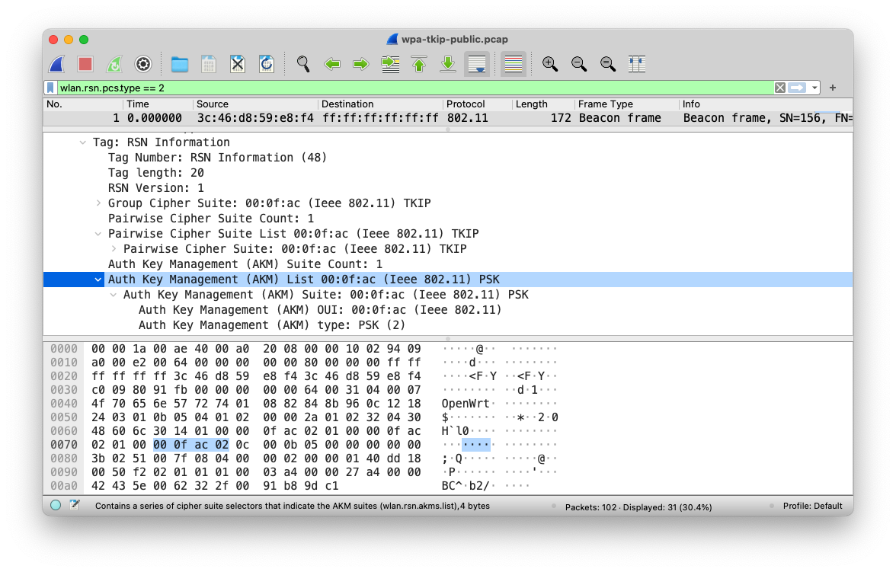

# 第三章 无线接入网入侵与防御

## 绕过那些似是而非的安全机制

### 禁⽌SSID⼴播

AP在主动广播的``beacon frame``中包含SSID字段值，所有AP的默认出厂设置都是开启了SSID广播功能的。但同时也提供了关闭SSID广播功能的开关，如下图所示：


AP如果关闭了SSID广播功能（部分产品的管理界面使用的功能术语是：隐藏无线网络），手机等无线客户端在“刷新”无线网络列表时会忽略掉这些网络（因为收到的AP广播``beacon frame``中没有网络名称信息，所以无法在界面上“显示”），造成了这些无线网络似乎就“隐身”了的假象，进而给人一种假象：

> 攻击者发现不了我的网络，就无法发起攻击，所以网络就安全了。

事实上，攻击者可以选择“被动发现”的方式来“发现”禁止SSID广播的无线网络。这是因为：

* 当有STA加⼊隐藏SSID的AP时，``Probe Request`` 中包含该无线网络的SSID；
* 该AP下客户端断线重连AP时发送的``Association Request``、``Probe Request``和AP发送的``Probe Response``中都会包含目标无线网络的SSID。

攻击者只需要“静静”的抓包，就可以“发现”目标网络的SSID。

演示实验如下：


上图中，红色方框高亮的BSSID：``08:57:00:6B:11:D0``对应AP在``airodump-ng``的控制台中ESSID字段显示为``<length:  0>``，这表示抓到的该AP广播的``beacon frame``中ESSID字段值为空，符合“禁止SSID广播”设置的AP的表现。

> 说明：不同AP的“禁止SSID广播”的实现方式会有差异，有些厂商的AP会在``beacon frame``字段中根据实际网络的SSID字段长度（假设为N字节）填充对应长度的``\x00``字符，这时在airodump-ng的控制台中ESSID字段就会显示为``<length:  N>``。

下图中，通过向指定AP发送1个解除认证⼴播包，并等待客户端重连和观察airodump-ng的输出信息变化，可以看到原先BSSID ``08:57:00:6B:11:D0`` 对应 AP 在``airodump-ng``的控制台中ESSID字段变化为``HackMeIfYouCanHidden``，这就是刚才隐藏的目标网络SSID被我们“发现”了。

```bash
aireplay-ng --deauth 1 -a 08:57:00:6B:11:D0 mon0 --ignore-negative-one
```


另外，我们还注意到，该目标网络当前确实有一个已经处于连接状态的无线客户端，它的MAC地址是：``E0:F8:47:DC:38:C4``。

下图是我们用wireshark分析我们刚才在“发现隐藏SSID”演示实验中的抓包结果截图，其中``HackMeIfYouCanHidden``确实出现在了无线客户端发送给AP的``Association Request``帧之中。


如上图所示，我们使用``iwlist wlan11 scanning | grep -A 30 '08:57:00:6B:11:D0'``可以再次证明，该AP的广播beacon frame中确实没有有效的ESSID值，是一个“隐藏无线网络”。

### MAC地址过滤

如下图所示是一个典型的MAC地址过滤设置界面，图中的过滤规则里的“禁止”和“允许”分别对应“黑名单”和“白名单”机制。由于无线网络即使启用了数据加密功能，但MAC地址依然是明文包含在无线数据帧中的，通过嗅探模式抓包可以轻易的了解到目标网络中有哪些设备处于已连接状态。对于白名单过滤模式来说，攻击者只需要把自己设备的MAC地址修改为网络中已连接客户端的MAC地址，即可绕过白名单限制。当然，黑名单限制就更容易绕过了，攻击者如果怀疑自己的MAC地址被加入到了MAC地址过滤黑名单，只需要修改掉当前使用的MAC地址重新尝试连接即可。


在Linux系统中修改网卡MAC地址的命令行方法如下：

```bash
ifconfig wlan0 hw ether 00:11:22:33:44:55
```

Windows系统可以通过修改注册表项（例如：``HKLM\SYSTEM\CurrentControlSet\Control\Class\{4D36E972-E325-11CE-BFC1-08002bE10318} ``，取决于网卡驱动和操作系统的支持情况），也可以使用一些第三方工具，例如TMAC、MAC Makeup等。

在Linux系统中可以使用命令行工具``wpa_supplicant``连接WPA/WPA2认证方式的无线网络。首先把明文Passphrase通过Hash运算生成PSK，这会用到命令行工具 ``wpa_passphrase`` 生成 wpa_supplicant 所需的最小配置，可以快速连接到已知 SSID 的无线网络。例如：

```bash
$ wpa_passphrase TargetSSID
# reading passphrase from stdin
hellopassword
network={
	ssid="TargetSSID"
	#psk="hellopassword"
	psk=4cc54666ad54da9f19f3e6fde3b8521bd3e06d8be19928c3864aea13db3d5a75
}
```

上例表明，wpa_supplicant 可以与 wpa_passphrase 协同工作，只需简单地这样即可做：

```bash
# 注意: 由于存在进程替换，这个命令不能带着 sudo 执行，必须切换到 root 身份。否则会报错：
# 上一步 wpa_passphrase 的输出结果也可以直接保存为一个独立配置文件，在这一步就可以替换 -c 参数的值为配置文件路径
# wpa_supplicant -B -i wlan1 -c <(wpa_passphrase TargetSSID hellopassword)
```

一旦完成了网络认证过程，剩下的就可以和正常自动连接无线网络一样，手工通过``dhclient wlan1``这样的命令来执行DHCP请求，获取网络自动配置。如下图所示展示了这个过程用到的主要命令和命令执行结果。


### 禁用DHCP，使用静态IP地址分配

无论是有线局域网还是无线局域网，监听ARP广播都是我们发现当前网络IP地址段配置的最佳方法。ARP广播的典型发生场景包括了：同⼀局域⽹下客户端相互之间首次访问；客户端要访问外⽹，寻找⽹关地址。对于一个正常提供网络服务的无线网络来说，ARP广播是非常频繁发生的。因此，只要我们完成了无线网络的身份认证和链路层连接建立，剩下的只需要耐心的监听ARP广播和分析就可以知道当前网络的IP地址配置和网关IP。

## 已有安全机制的漏洞原理

### 开放式认证

开放式认证的本质就是使用明文通信协议，而无线嗅探可以直接获得⽆线数据并分析应用层数据。如果应用层数据没有被加密传输，则“嗅探”攻击可以轻易得手。另外，一些采用HTTP协议的Portal认证方式还面临“重放攻击”和“仿冒身份”威胁。例如，可以直接提取出已通过Portal认证的客户端HTTP会话数据中的cookie信息，轻易“克隆”出另一个一模一样的合法、已认证客户端会话。如果是基于MAC地址过滤方式的AP，则已通过认证的⽆线STA的MAC地址被克隆后，克隆STA就可以连入当前无线网络。


如上动图所示，通过无线数据嗅探的方式提取到了一个已登录用户的HTTP会话使用的cookie值，只需要简单的配合使用一个浏览器的插件（例如上图中使用的是Chrome浏览器的``Modify Headers``插件）把该cookie值“克隆”到当前浏览器中，一刷新，就可以在无需知道目标用户登录账号信息的情况下“仿冒”身份使用网站的注册用户服务。

对于使用开放式认证服务的无线网络用户来说，要避免使用明文通信协议的应用，更不要在这样的网络中输入隐私信息和数据。对于网络管理员来说，使用HTTPS方式的Portal认证代替明文的Portal认证。如果有条件，可以为用户提供VPN服务，减少明文数据传输。

### Evil Twin

IEEE 802.11协议中对ESSID的使用没有任何强制认证机制，任何人都可以任意声明ESSID，STA无法区分同名ESSID谁是冒牌，BSSID也可以被任意伪造，DS机制允许单个ESSID对应关联多个BSSID。无线客户端的无线网络列表选择界面是按照独立ESSID进行显示的，如果有多个AP设置了相同的ESSID也仅仅只会显示成一个网络名称。这样，当用户手动选择网络时或根据历史连接记录自动加入网络时，客户端会大概率连入信号强度更高的无线网络，伪造同名ESSID的AP往往会将自己的信号发射功率调的较高，以诱骗更多受害者连接自己。

如果客户端成功加入到Evil Twin方式搭建的AP，则该BS的服务提供AP对当前BS内的STA的所有通信流量可见、可控，诸如DNS劫持和投毒、DHCP控制和ARP投毒等手段都将轻而易举。同时由于AP负责提供客户端的上网服务，因此所有上网流量都可以被AP引导到自己控制的服务器上并进行静默记录，实现流量监控。更进一步的，还可以提供透明代理，实现更强大的中间人攻击效果。

Evil Twin实验的操作方法和步骤详见[本章实验](exp.md)

### Evil ESSID


如上图所示是IEEE 802.11协议官方文档对SSID元素格式的定义，SSID字段长度范围限制为0~32字节，但在协议规范中并没有限制字段取值范围和使用的字符编码标准。

正是由于协议规范文档中的上述“宽泛”定义，我们在真实世界中可以发现几种常见的利用ESSID字段的攻击向量或滥用行为。

> 广告：传播垃圾信息


使用``airbase-ng``可以用一个无线网卡快速创建多个ESSID“假网络”，操作步骤如下：

```bash
# cat essids.txt
你好
听说
你在
抓包
看看
你能
抓到
我吗
# airbase-ng --essids essids.txt wlan0mon
```

在手机上看到的效果如下截图：


路由器的管理后台通常是网页方式提供服务的，如果网页在展示扫描到的无线网络名称列表时没有对SSID字段进行必要的过滤和转义，则攻击者可以利用SSID字段进行XSS攻击，如下图所示：


如果网页在展示无线网络名称时采取了防止XSS的过滤和转义措施，则借助SSID字段实施XSS攻击的行为就不会得逞，如下图所示：


### TKIP缺陷

2002年10月31日，Wi-Fi联盟提出**临时密钥完整性协议**（Temporal Key Integrity Protocol, TKIP），归类于WPA标准的一部分。IEEE随后在2004年7月23日的IEEE 802.11i-2004报告中背书临时密钥完整性协议并同时提出基于**计数器模式密码块链消息完整码**（Counter Cipher Mode with block chaining message authentication code Protocol, CCMP）协议的802.1X和AES协议这些更坚固的安全协议。之后Wi-Fi联盟接受了IEEE的相关报告并冠以“WPA2”这个商业名称发布。

临时密钥完整性协议随后由于安全性原因于2009年1月被IEEE废弃。ZDNet于2010年7月18日的报告中表明Wi-Fi联盟应当禁止所有Wi-Fi设备使用WEP和临时密钥完整性协议。自2012年的802.11标准中，TKIP已不再视为完全，且即将废弃。

TKIP本质上是一个WEP补丁，解决了攻击者通过获得少量的路由器流量解析出路由器密钥的问题。为了解决这个问题，TKIP每隔几分钟就给出新的密钥。不给攻击者提供足够的数据来破译密钥或算法所依赖的RC4流加密。

虽然当时TKIP还提供了一个较为完善的安全升级，但是对于保护你的网络不受黑客攻击这件事上，它还是不够全面的。其中最大的漏洞被称为“chop-chop attack”，是发生在加密本身释放之前的攻击。

黑客可以利用chop-chop attack截获并分析网络中产生的数据，并最终破译出密钥、明文显示其中的数据。

我们先来回顾一下TKIP缺陷被发现和漏洞利用的历史：

2008年11月8日，两名德国人Martin Beck, Erik Tews 发表了论文：[Practical attacks against WEP and WPA](https://dl.aircrack-ng.org/breakingwepandwpa.pdf)，在部分条件下可导致攻击者对数据包进行解密，不过这个不是密钥恢复攻击，攻击者只能恢复用于加密验证报文的密钥而不是用于加密数据的密钥。使用恢复的密钥，只有捕获的报文仅在有限的7次尝试下的窗口机会中进行伪造。攻击者每次只能解密一个报文，当前的速率是12-15分钟一个报文，另外只有报文从无线AP发送到客户端时才能被加密。只有配置了TKIP作为加密机制的设备受此漏洞攻击，使用AES-CCMP密文套件的WPA2不受此漏洞影响。同时，这个攻击方式存在限制性条件：目标WPA无线网络实现应支持IEEE 802.11e QoS特性（有时被称为Wi-Fi Multi-media, WMM）。这种攻击方式被命名为：贝克-特夫斯攻击法（**Beck-Tews** Attacks）。

Beck-Tews攻击可以看做是针对WEP的断续攻击（Chop-Chop Attack）的升级扩展。因为WEP所使用的校验和算法CRC32在密码学上并不安全，攻击者可以猜测到数据包中的单个字节，而后AP会对猜测正确与否作出确认或拒绝传输。如果猜测正确，攻击者可以发现猜测正确并继续猜测下一个字节。不过相较于针对WEP的断续攻击，攻击者如果猜错必须额外等待60秒才能继续猜测。这是因为尽管TKIP仍然使用CRC32校验和算法，但由于使用了**序列计数器**（称为Michael）而可以缓解攻击。如果一个AP在60秒内收到了2个Michael序列计数器错误，AP随后将启动反制措施，重组TKIP的会话密钥（Session Key），从而改变随后的密钥流。由此，Beck-Tews攻击则等待一个适当的时间从而避免该反制措施。由于ARP包可以非常简单通过包大小鉴别，并且包中内容通常很容易猜到（大多ARP包内容相似），从而留给攻击者需要猜测的包大小则变得非常有限（大约为14字节）。通常来说在寻常的网络配置下只需要12分钟即可破解12加密字节。

当攻击者可以接触到全部的加密包内容后，对于余下在每个包内的明码内容进行去除，攻击者即可轻易获得包内的密钥流，同时还可获得对话的MIC码。应用这些信息攻击者可以重建新的数据包并在网络上传送。Beck-Tews攻击使用QoS通道传送新组建的数据包从而绕开WPA应用的重放攻击防护。由此攻击者可以传送数据包已达到其他攻击方式，比如ARP欺骗攻击，拒绝服务式攻击或其他类似攻击。

Beck-Tews攻击的概念验证代码以[Tkiptun-ng](https://www.aircrack-ng.org/doku.php?id=tkiptun-ng)工具的形式公开，感兴趣的同学可以研究一下这个工具的源代码。

2009年10月，挪威科技大学的费恩·霍尔沃森（Finn M Helvorsen）在他的硕士论文 [Cryptanalysis of IEEE 802.11i TKIP](http://wiki-files.aircrack-ng.org/doc/tkip_master.pdf)  中进一步改进了Beck-Tews攻击（并提供了``tkiptun-ng``代码的补丁），使得攻击者可以在18分25秒内注入一个比普通ARP包大的多的数据包（596字节）。

2009年两名日本人Toshihiro Ohigashi , Masakatu Morii以Beck-Tews攻击法为基础，进一步优化攻击。在论文 [A Practical Message Falsification Attack on WPA](http://citeseerx.ist.psu.edu/viewdoc/download;jsessionid=C1900E687D98D6663EE32451728A4A35?doi=10.1.1.158.1372&rep=rep1&type=pdf) 中发布了一种更简单且更快速的类似攻击方式——“大东-森井攻击”（Ohigashi-Morii Attack）。该种攻击在使用Beck-Tews攻击的同时使用中间人攻击，同时不需要AP必须使用QoS。在理想情况下，1分钟即可完成一次Beck-Tews攻击。

2015年7月，两名比利时研究人员Mathy Vanhoef和Frank Piessens，展示了在52小时内解密了受TLS保护且使用RC4加密的HTTPS会话中使用的Web cookie，而此前利用RC4漏洞的攻击需要花费2000小时。通过使用固定纯文本恢复技术——被称为RC4 NOMORE(Numerous Occurrence Monitoring & Recovery Exploit)，攻击者可诱骗用户访问代码来产生足够的数据，成功地解密出用户的加密cookie值。

这种攻击并不局限于解密cookie，任何被重复加密的数据或信息都可以被解密。例如，对于使用TKIP加密技术的无线网络来说，这种攻击只需要一个小时来执行。作者已经把相关工作通过论文的形式发表在USENIX 15 [All Your Biases Belong To Us: Breaking RC4 in WPA-TKIP and TLS](http://www.rc4nomore.com/vanhoef-usenix2015.pdf)，这种攻击方法的详细原理已经被整理到一个专门的网站：[RC4 NOMORE](https://www.rc4nomore.com/) 。

### WPA/WPA2 PSK破解

回顾[第二章 无线接入网监听](../chap0x02/main.md)中我们对WPA/WPA2 PSK的``四次握手认证``原理讲解，我们了解到：

```
PTK = Hash(PMK||A-nonce||S-nonce|| AP Mac || STA Mac)
    = Hash(PBKDF(Passphrase, SSID, ssidLength, 4096, 256)||A-nonce||S-nonce||AP Mac ||STA Mac)
```

上述公式中，解密出``Passphrase``是我们的破解目标，剩下的变量均可以通过无线嗅探的方式获取到。其中：

* ``A-nonce``在4次握手消息中的第1个EAP包；
* ``S-nonce``在4次握手消息中的第2个EAP包；
* 剩下的变量在AP的``beacon frame``广播包、STA和AP之间的``probe request``、``probe response``、``association request``和``association response``中都可以提取到；

需要注意的是，我们在嗅探获得的数据包中并不能得到PTK，实际上我们能够提取到的是PTK的组成部分之一：校验和字段MIC值。如下图所示展示了这些变量（``Passphrase``、``PTK``和``MIC``）之间的“推导”关系：


对于WPA-个人模式（WPA和WPA2均是如此）来说， ``PSK`` 就是 ``PMK``，而 ``PMK`` 和 ``Passphrase``之间的关系就是如下公式：

```
PSK = PMK = PBKDF(Passphrase, SSID, ssidLength, 4096, 256)
```

由于网络身份认证通信过程中传输的是经由 ``Passphrase`` 通过了一系列随机值填充之后的**单向散列**算法生成**随机**的挑战-应答消息，所以首先排除了直接逆向运算解密出 ``Passphrase`` 的可能性。其次，采用穷举的方式在线破解无线网络的预共享密钥虽然存在理论上的可信性，但实践中，我们会采取一种相对更“优雅”的离线破解方案，降低被AP检测到破解攻击的风险。具体来说这个破解过程如下描述：

* 使用嗅探模式（避免channel hopping，采用固定信道方式）监听目标AP的通信数据；
* 如果目标AP当前没有已连接的无线客户端，则需要静候有无线客户端连接AP时发送4次握手认证包；
* 如果目标AP当前有已连接的无线客户端，通过伪造``de-authenticate``数据帧的方式强制客户端下线，静候客户端重连目标AP时产生的4次握手认证包；
* 只要获取到4次握手认证包的前2个，即可开始离线破解。

如下图所示，是PMK与MIC之间的对应关系。


在WPA中，MIC是通过“Michael完整性校验算法”计算得到。如下图所示：



在WPA2的默认加密算法CCMP使用了更安全的 ``CBC-MAC`` 模式AES算法从明文MPDU (MAC Protocol Data Unit) 计算出MIC，CCMP加密数据封装（计算出的MIC追加在加密输出结果的尾部）过程如下图所示：


加密封装扩展后的CCMP MPDU结构如下图所示：


CCMP中使用的MIC计算方法改进了“Michael完整性校验算法”的2个已知缺陷：可逆恢复MIC密钥（根据任一已知消息和MIC值，能够得到MIC的密钥）和相关消息攻击导致MIC密钥在线性时间内可以恢复出来。不过，对于WPA/WPA2 PSK的离线暴力破解来说，我们只用到了针对单向散列算法的通用破解思路：散列值穷举匹配。

> 固定散列值算法中除“目标输入变量值”之外的所有变量值，穷举“目标输入变量值”的散列值和“已知散列值”进行匹配。如果找到匹配，则说明找到了“目标输入变量值”。

下图是一个仅支持WPA2 CCMP的``probe response``请求的抓包结果截图：


下图是一个同时支持TKIP和CCMP的``beacon frame``广播的抓包结果截图：


4次握手认证包的第1个包如下图所示：


4次握手认证包的第2个包如下图所示：


上述2张截图中，我们确实可以看到：``A-nonce``、``S-nonce``和``MIC``。

除了直接嗅探客户端和目标AP的握手认证过程来破解预共享密钥之外，由于无线客户端的“自动发现和自动重连”网络特性，我们还可以通过``Evil Twin``攻击方式，让一个“离线”的客户端自动连入我们伪造的AP。我们不需要知道该AP使用的预共享密钥，只需要诱骗客户端主动和我们伪造的AP完成4次握手认证中的前2个数据包交换过程即可。

如下图所示，就是一个典型的“离线”客户端（``not associated``）的常规网络探测行为被我们嗅探到的情况。我们通过“离线”客户端定时发送的``probe request``可以了解到该客户端连接过哪些网络（图中显示出该客户端一定连接过2个名称分别为``a101e-lab``和``cuc``的网络）。这样，Evil Twin攻击就可以有针对性的去设置ESSID。当Evil Twin AP运行起来之后，就会主动响应“离线”客户端的探测请求并自动继续完成接下来的网络连接和身份认证交互过程了。


一旦拿到包含4次握手认证包的前2个包的抓包文件之后，剩下的破解工作就可以交给``aircrack-ng``来自动化完成了。如下图所示是一次成功的口令破解结果截图：


详细的实验操作方法参见[实验](exp.md)。

#### 破解加速

> 基本思想1：空间换时间，针对常见SSID预先计算好PMK

可以用到的工具：

* genpmk - WPA-PSK precomputation attack 


> 基本思想2：使用GPU代替CPU计算

可以用到的工具：

* [pyrit](https://github.com/JPaulMora/Pyrit) - A GPGPU-driven WPA/WPA2-PSK key cracker
* [hashcat](https://github.com/hashcat/hashcat) - World's fastest password cracker

> 基本思想3: 并行/分布式计算


> 基本思想4: 众包和云计算

* [GPUHASH.me - online cracking service](https://gpuhash.me/)
* [Crackq - an online distributed GPU-accelerated password cracker](https://hashcrack.org/)

### WPS已知脆弱性和漏洞利用⽅法

#### 静态PIN码离线预测攻击

针对Headless设备静态预分配PIN码的弱随机产⽣算法或静态确定性产⽣算法，攻击者可以直接根据目标AP的MAC地址计算出可以用于加入目标无线网络的WPS PIN码。


相关历史安全事件如下：

* [2012年爆出所有MAC地址前6位是C83A35和00B00C的腾达和磊科全系路由器采用了确定性PIN码算法可以通过嗅探无线路由器MAC地址后秒算PIN码](http://wifibeta.com/2012-04/thread-712-1-1.html)
    * 这些WPS PIN是通过mac的后6位 DEC2HEX 取舍而得
* [2014年D-Link部分路由器的WPS PIN算法被逆向并可以从BSSID秒算](http://www.devttys0.com/2014/02/reversing-the-wrt120n-firmware-obfuscation/)
* [2015年贝尔金部分路由器的WPS PIN算法被逆向并可以从路由器MAC地址秒算](http://www.freebuf.com/articles/wireless/63627.html)

根据[《Wi-Fi Simple Configuration Technical Specification》](attach/chap0x02/media/Wi-Fi_Simple_Configuration_Technical_Specification_v2.0.5.pdf) 的 ``4.3.2 Guidelines and Requirements for PIN values`` ，上述 **静态PIN码离线预测攻击** 是一例典型的 ``设计⽆缺陷，实现偷⼯减料导致的安全漏洞``。

```
The recommended length for a manually entered device password is an 8-digit numeric PIN.  This length does not provide a large amount of entropy for strong mutual authentication, but the design of the Registration Protocol protects against dictionary attacks on PINs if a fresh PIN or a rekeying key is used each time the Registration Protocol is run.

***PIN values should be randomly generated, and they SHALL NOT be derivable from any information that can be obtained by an eavesdropper or active attacker***. The device’s serial number and MAC address, for example, are easily eavesdropped by an attacker on the in-band channel.  Furthermore, if a device includes multiple PIN values, these values SHALL be cryptographically separate from each other.  If, for example, a device includes both a label-based PIN and a Device Password on an integrated NFC Tag, the two Device Passwords SHALL be different and uncorrelated.   
```

#### 动态PIN码暴⼒枚举攻击

动态PIN码在线暴力枚举攻击的基本原理是：利用内部注册协议分段离线暴⼒枚举破解

* 第⼀轮M1~M4: 在线暴⼒破解枚举PSK-1
* 第⼆轮M5~M7: 用正确的PSK-1，在线暴⼒枚举PSK-2
* 得到完整PSK，进⾏⼀次完整WPS内部注册过程

无线设备在与无线路由器连接时，系统自动生成了一个随机的8位个人识别号码（PIN码），并根据这个8位PIN码进行安全的WPA链接，而绕过了WPA密码验证环节。如果黑客想通过穷举法，破解这个8位PIN码与无线路由器进行连接，理论上需要试算10^8次即1亿次，按照每秒1次的速度，需要1157天。但这个8位PIN是有规律的，实际上是一组4位PIN+另一组3位PIN+最后的1位校验位组成。校验位有固定的算法，这样只需要试算10^4+10^3总共11000次就可以了。穷举法试算11000次，几个小时就可以出来结果。

如果攻击者在发送完M4消息后接收到一个EAP-NACK消息，则说明PIN码的前半部分是错误的，继续枚举测试直到完成10000次尝试。在几分钟内尝试50次攻击时，有些路由器可能会把攻击的网卡加入黑名单。但大多数路由器都不会这样做，即使加入黑名单了还可以稍后再做攻击。攻击者也可以不断变换自己的MAC地址，对抗MAC地址黑名单机制。

如果攻击者在发送完M6消息后接收到EAP-NACK消息，就说明枚举PIN码的第二部分是错误的，继续暴力尝试下一个PIN码。使用工具 [reaver](https://github.com/t6x/reaver-wps-fork-t6x) 可以实现在线暴力破解动态PIN码以及恢复目标网络的WPA-PSK密钥，如下2张截图所示。


上述在线暴力枚举攻击的一种改进算法被命名为 [``Pixie Dust Attack``](https://forums.kali.org/showthread.php?24286-WPS-Pixie-Dust-Attack-\(Offline-WPS-Attack\)) ，其算法改进的基础是：E-Hash1、E-Hash2、PKE、PKR 都是可以直接通过抓包获得的，剩下的PSK1和PSK2分别对应PIN码前后两半，可被枚举。E-S1和E-S2是整个离线破解的关键，⼀旦这2个参数被计算出来，则对照公式可以离线遍历PSK-1和PSK-2的可能性验证计算出的E-Hash1是否与抓包得到的E-Hash1相同。

E-S1和E-S2在实际设备中的实现算法使用的是 ``伪随机数发⽣器`` ，存在以下3个主要缺陷：

* 嵌⼊式设备⼤多采用32位CPU，状态空间不⾜，导致产生的随机数取值空间较小
* 伪随机算法可能被逆向
* 伪随机数种⼦状态可能会被预测和恢复

除了随机数生成算法的缺陷之外，部分设备厂商在生产设备时甚至对 ``伪随机数发生器`` 进一步偷工减料，例如：

* Broadcom/eCos，E-S1 + E-S2 使用与N1相同的随机数发⽣器
* Realtek，E-S1 = E-S2 = N1 或 使用秒为单位的UNIX时间戳格式整数作为随机数发⽣器种⼦
* Ralink / MediaTek / Celeno， E-S1 = E-S2 = 0

改进后的 ``Pixie Dust Attack`` 实现了 **离线** 暴力破解WPS动态PIN码，对应的攻击算法实现工具 [Pixiewps](https://github.com/wiire-a/pixiewps) 可以针对特定存在上述 ``伪随机数算法`` 缺陷的无线路由器实现杪级至分钟级别的PIN码计算。甚至对特定无线路由器实现恢复出 WPA-PSK 明文密钥。

以下2张图是使用 [Pixiewps](https://github.com/wiire-a/pixiewps) 进行离线动态PIN码破解成功的截图。


### 攻击 WPA/WPA2 企业级认证⽆线⽹络

逻辑上来说，EAP认证过程发生在请求者（supplicant）和认证服务器（authentication server）之间，如下图所示：


物理上来说，AP扮演了认证过程的中间人：认证过程建立在安全隧道之上，但加密的SSL/TLS数据是在开放的无线网络上传输的。


在安全隧道建立之前，AP是一个开放访问的接入点，开放无线网络易遭受Evil Twin攻击，因为（客户端）没有办法验证AP的身份。


当用户连接无线网络过程中，在自己的手机上看到了如下的 **信任警告** ，大多数用户应该不会查看 **更多详细信息** ，即使查看了，在不借助工具的情况下，肉眼也无法鉴别该证书的合法性，所以最终的结果都是用户选择了 **信任** 这个 ``自签发`` 的证书，无线网络连接过程得以继续进行下去。


如下图所示，攻击者此时此刻通过 **Evil Twin** 构建的 ``假AP`` （包括自建的 ``假认证服务器``），可以直接查看到无线客户端提交的认证凭据。认证凭据虽然不是明文口令传输，但对于单向散列值来说，可以使用 ``彩虹表`` 查找技术直接查出散列值对应的明文口令。


攻击者在 ``假AP`` 上看到的基于明文口令生成的``挑战-响应应答消息``（**单向散列运算值**）示例如下图所示；


把 **单向散列运算值** 导入到 [asleep](https://tools.kali.org/wireless-attacks/asleap) 中就可以很快恢复出明文口令。


针对上述企业级无线网络认证方式的中间人攻击方法，企业无线网络的管理员应：

* 禁用不安全的EAP实现方法，例如：EAP-MD5, EAP-OTP, EAP-GTC, LEAP
* 启用并 **正确配置** 安全的EAP实现方法，例如：PEAP, TTLS, EAP/TLS
* 在无线客户端上预置自签发的EAP认证证书或购买权威CA签发的用于身份认证的证书
* 无线客户端启用永远验证服务器证书有效性
* 教育无线网络用户不要信任任何被警告的证书
    * 学会手工验证证书的CN字段值是否与公司通告一致（只是缓解风险，如果攻击者完全克隆企业的证书信息，则本方法无效）

## 安全机制漏洞利用实例

详见[本章实验](exp.md)

## 构建安全的无线局域网

和通用信息系统和网络的安全加固方法一样，构建安全的无线局域网也应遵守“层次化的安全加固策略”，即按照：人、应用层、网络层、链路层和物理层等这样的分层分析威胁和针对性安全加固。

### 人

针对人的安全加固主要是通过安全意识教育和安全技能培训的方式来实施：

* 避免使用万能Wi-Fi钥匙类APP。作为一种披着“分享”经济外衣的工具类应用，信息相比较于实物，天然具有零复制成本和易于复制、快速传播、难以追溯传播源的特点。客人可以通过此类软件在未经主人知晓的情况下，将所连过的主人家中Wi-Fi的密码、SSID上传到服务器分享给其他人。其他路人后续使用这个共享密钥连入该主人的家庭网络时，主人同样面临着没有知情权和控制权的危险处境。如果说未经授权占用他人带宽事小，那么未授权的内部网络任意访问、窃取隐私和机密数据则有可能严重侵犯到网络所有者的私有数据所有权。
* 定期更换个人或家庭无线网络的共享密钥，一来缓解密钥被未知渠道、未知原因泄漏带来的“蹭网”风险，另一方面可以降低网络密钥被离线暴力破解成功的概率。
* 谨慎使用公共或陌生Wi-Fi，攻击者可以在这样的网络中使用局域网攻击技术实现数据嗅探和中间人攻击，为了避免敏感信息在传输过程中被非法嗅探，防止投毒攻击劫持正常通信连接进行钓鱼攻击和二进制文件篡改安装后门，应避免在这一类Wi-Fi中使用需要提交个人信息的应用和服务，避免使用明文方式下载和安装应用软件，避免打开在用网期间通过明文方式下载的文档和压缩包等二进制文件。
* 所有具备Wi-Fi功能的设备在不使用Wi-Fi功能时关闭无线开关（软开关或硬件开关），避免Evil Twin攻击套取到你连过的AP的EAPOL Packet用于离线破解WPA/WPA2 PSK密码，避免设备主动连入开放认证的恶意AP被监听和中间人劫持攻击。

### 应用层

无线路由器的管理员应修改路由器默认设置，执行以下安全加固措施

* 修改默认的管理员用户名和密码，避免被弱口令登录；
* 启用登录管理界面的图形化验证码，提高身份认证暴力破解的难度；
* 更新到最新版固件，避免针对路由器系统的直接远程攻击。

### 网络层

同样是对无线路由器的默认设置进行修改，启用客人/访客网络

* 仅提供互联网访问，禁止访问有线局域网；
* 独立网络使用独立密码；
* 启用AP隔离功能，可以禁止无线网络中的客户端相互直接访问，杜绝局域网内的攻击。

对于企业无线网络的管理员来说，进行合理的子网划分与隔离，按业务需求、安全等级设置无线局域网、有线局域网和互联网之间的访问控制机制。

### 链路层

依然是对无线路由器的默认设置进行修改

* 仅使用WPA2-PSK（针对个人用户），禁用TKIP这样的缺陷加密算法；
* 使用强健密码，例如大小写字母、数字、特殊字符组合；
* 禁用WPS功能；
* 避免使用常见SSID名，例如：dlink、NetGear等。

对于企业无线网络的管理员来说，启用WPA-企业级身份认证

* 实名制、独立账号接入，在员工离职时可以及时删除账号杜绝非授权访问，对于每个员工的用网行为进行独立审计，可以精确定位是哪个用户泄漏了自己的上网账号和密码；
* 有IT技术能力的企业强烈建议配置EAP-TLS，实现 **双向证书验证** 。

### 物理层

个人用户根据信号覆盖范围需求，合理设置无线路由器的信号发射功率。企业无线网络的管理员可以通过以下措施限制无线信号的覆盖范围：

* 缩窄发射天线覆盖范围
* 墙面信号反射涂料
* 使用定向天线


