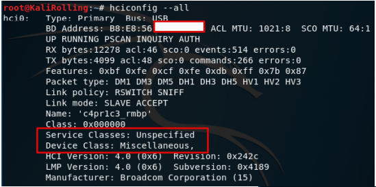
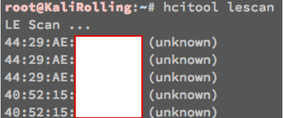
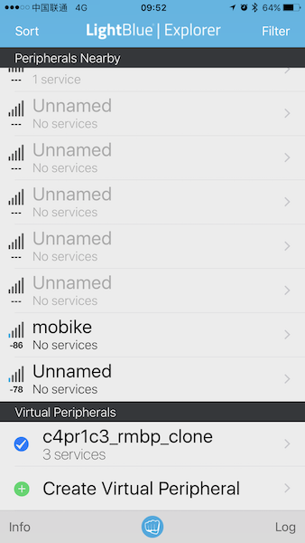

## 蓝牙标识伪造

```bash
# 查看系统中所有已连接的蓝牙控制器信息
hciconfig --all
```



```bash
# 修改蓝牙控制器的profile类别，如“新设备信息”截图
hciconfig hci0 class 0x800404
```


## 蓝牙设备存活性探测

在蓝牙(Bluetooth®)4.2核心规范当中，支持一项新的特性，可以通过周期性地改变蓝牙设备的随机地址帮助蓝牙设备的使用者来保护自身的隐私，避免其设备被黑客或者是窃听者通过射频侦听以及对数据分析的方式得以窃取。

```bash
# 扫描标准蓝牙设备
hcitool scan
```



```bash
# 扫描低功耗蓝牙设备
hcitool lescan
```


## 本机蓝牙设备信息探测

```bash
# 查看本机蓝牙设备信息
hcitool -i hci0 inq

# 扫描并查看远程蓝牙设备信息
hcitool -i hci0 scan --info --class
```


## 蓝牙通信数据嗅探、构造和发送

### 嗅探基础

由于蓝牙有两种物理层通信模式：经典（BR/EDR）和LE不兼容，复杂的蓝牙协议（2000多页的蓝牙核⼼协议规范）软件实现，并且协议规范一直在快速演进（蓝牙4.2于2014年12月推出，蓝牙5.0于2016年6月发布）。不同设备厂商⽣产设备利用蓝牙扩展协议实现一些私有特性导致不同蓝牙设备之间的互操作性存在兼容问题。

蓝牙通信嗅探的难度要远远大于IEEE 802.11无线嗅探。以BLE为例，数据传送在37个频点上跳频通信，1秒⾄多1600次跳频，并且每个数据帧只在⼀个频点上传输。跳频图谱动态产⽣：设备内部时钟频率决定跳频周期间隔，需要实时抓包并按照会话实时计算，蓝牙并发连接增加了会话实时计算的工作负载。2.4 GHz 频段拥挤，物理层嗅探需要过滤掉同频段的其他无线数据（例如IEEE 802.11数据帧）。

### 硬件

免费硬件方案可以使用笔记本内置蓝牙模块（USB接口），在虚拟机里可以通过把宿主机的USB设备共享给虚拟机，使得虚拟机里的Linux系统可以操作蓝牙设备进行数据嗅探。


使用智能手机，可以安装一些第三方App来实现对蓝牙设备的扫描发现和蓝牙设备伪装，如下图所示：




免费硬件方案的局限性主要体现在：

* 标准蓝牙设备不支持“混杂”模式。这就意味着无法嗅探其他设备之间的蓝牙通信数据，目的地址不是自己的蓝牙数据在硬件底层就被“丢弃”。需要专门定制的硬件，例如软件定义无线电（SDR）；
* 所有通过蓝牙协议发送的数据都是“混淆”的，抓包的同时需要实时的“解混淆”这些数据；
* 跳频图谱需要动态实时计算出来才能完整捕获连接建立后的通信数据，例如基于Master的MAC地址实时计算。

付费的硬件解决方案有很多，例如：[SmartRF Protocol Packet Sniffer from TI](http://www.ti.com.cn/tool/cn/packet-sniffer)

> 适用于蓝牙低功耗网络的数据包监听器。

> 适用于 ZigBee 和 IEEE 802.15.4 网络的数据包监听器。

> 适用于 RF4CE 网络的数据包监听器。

> 适用于 SimpliciTI™ 网络的数据包监听器。

> 适用于通用协议（原始数据包数据）的数据包监听器。

> 保存/打开含有捕获的数据包的文件。

> 选择要显示和隐藏的字段。

> 过滤要显示的数据包。

> 通过显示由无线电设备接收的原始数据来显示数据包详细信息。

> 收到的数据包有准确的时间戳。

> 具有网络中所有已知节点的地址薄。

> 按照接收顺序显示所有数据包的简单时间线。

> 可以将捕获的数据转发至 UDP 套接字，用于通过自定义工具来实时监控数据包

Nordic的BLE协议调试工具nRF51822和Bluetooth 5协议调试nRF52xxx系列工具

| | nRF52840 | nRF52832 | nRF52810 |
|--|--------|--------|--------|
| 支持协议 | 蓝⽛5 / BLE / ANT / 802.15.4 / 2.4GHz RF SoC   | 蓝⽛5 / BLE / ANT / 2.4GHz RF SoC | 蓝⽛5 / BLE / ANT / 2.4GHz RF SoC
| 长距离(x4) | ✓ | | |
| ⾼吞吐(x2) | ✓ | ✓  | ✓ |
| ⼴播容量增加(x8) | ✓ | ✓ | ✓ |
| 增强信道共存算法 | ✓ | ✓ | ✓ |

Adafruit 公司基于Nordic公司的nRF51822解决⽅案生产了 [Adafruit Bluefruit LE Sniffer - Bluetooth Low Energy (BLE 4.0) - nRF51822 - v3.0](https://www.adafruit.com/product/2269)。

ellisys是一家专业蓝牙协议分析仪制造商，旗下的2款代表产品 [Ellisys Bluetooth Explorer All-in-One Bluetooth® Protocol Analysis System](http://www.ellisys.com/products/bex400/) 和 [Ellisys Bluetooth Tracker Ultra-Portable BLE and Wi-Fi Protocol Analyzer](http://www.ellisys.com/products/btr1/) 支持对蓝牙和IEEE 802.11无线通信数据实现同时、全频率覆盖监听和分析。


[Ubertooth](https://github.com/greatscottgadgets/ubertooth/wiki/Getting-Started) 是一款软硬件均开源的2.4 GHz无线开发平台，可以用于蓝牙相关实验。硬件可以通过开源的电子器件原理图DIY也可以直接购买现成设备。固件运行在Ubertooth One上的ARM处理器。主机代码运行在通过USB连接了Ubertooth One设备的普通电脑上。

### 不同硬件方案横向比较

| | 价格 | 优点 | 缺点 |
|---|--|--|--|
| Ellisys Bluetooth Tracker | > $10,000 | ⾼度集成和便携，支持蓝牙5(包括BLE）和Wi-Fi | 贵 |
| TI BLE Sniffer (CC2540EMK-USB dongle) | ~$50 | 相对简单易用，价格便宜 | 仅能支持单⼴播信道监听（硬件限制），使用私有分析软件，抓包结果难以导出，偶尔丢包和崩溃 |
| Nordic nRF Sniffer (nRF51 PCA10031 USB dongle) | ~$50 | 价格便宜，使用Nordic nRFSniffer软件和Wireshark集成（仅Win平台） | 仅能支持单⼴播信道监听（硬件限制），偶尔丢包，配置步骤较复杂 |
| Adafruit Bluefruit LE Sniffer | ~$30 | 价格便宜，使用Nordic nRFSniffer软件和Wireshark集成（仅Win平台）| 仅能支持单⼴播信道监听（硬件限制），偶尔丢包，配置步骤较复杂 |
| Ubertooth One | ~$120 | 开源软硬件 | 仅能支持单⼴播信道监听（硬件限制），仅Linux支持完善 |
| Ellisys Bluetooth Explorer 400-STD-LE | ~$30,000 | 基于SDR，设备固件可升级以支持新版本蓝牙协议 | 太贵 |

<a href="https://github.com/knownsec/KCon/blob/master/2017/%5BKCon%202017%5D0826_6_%E6%9D%A8%E6%99%8B_%E9%87%8D%E7%8E%B0%E9%80%9F8%E5%83%B5%E5%B0%B8%E8%BD%A6%E9%98%9F%EF%BC%88%E8%93%9D%E7%89%994.0%20BLE%E5%8D%8F%E8%AE%AE%E7%9A%84%E8%BF%9B%E6%94%BB%EF%BC%89.pdf"> </a>

### ⼯具软件

* btmon / hcidump / wireshark
* nRF Connect for Mobile (Android App) 

数据存储格式使用的[BTSnoop](http://www.fte.com/webhelp/bpa600/Content/Technical_Information/BT_Snoop_File_Format.htm)

* 注意事项
    * 没有专用硬件支持则只能嗅探到本机收发的蓝牙数据，⽆法捕获其他设备之间的蓝牙通信数据
    * 类比802.11⽹络的“监听”模式与有线⽹卡的“混杂”模式的区别

Linux上的开源蓝牙协议栈——[BlueZ](http://www.bluez.org/) 可以实现蓝牙数据的构造和发送接收。

通过对蓝牙通信数据的嗅探、构造和发送，我们可以对蓝牙通信协议进行逆向工程。除此之外，直接的重放攻击也是一种常见的针对蓝牙设备的有效攻击手段。例如：[智能灯泡逆向与控制实例](http://www.guillier.org/blog/2015/04/reverse-engineering-of-a-ble-bulb/) 和 [Blue picking —— 针对蓝牙智能锁的破解](https://conference.hitb.org/hitbsecconf2017ams/materials/D2T3%20-%20Slawomir%20Jasek%20-%20Blue%20Picking%20-%20Hacking%20Bluetooth%20Smart%20Locks.pdf)。


