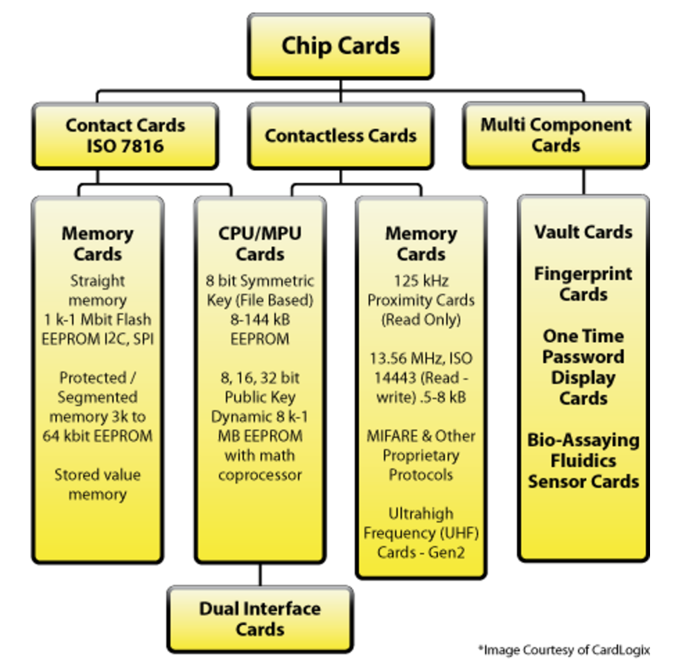
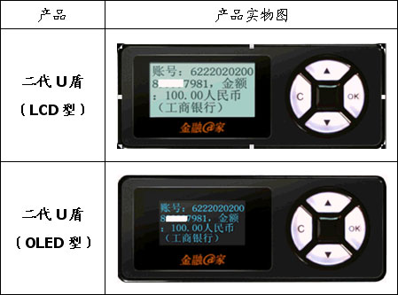
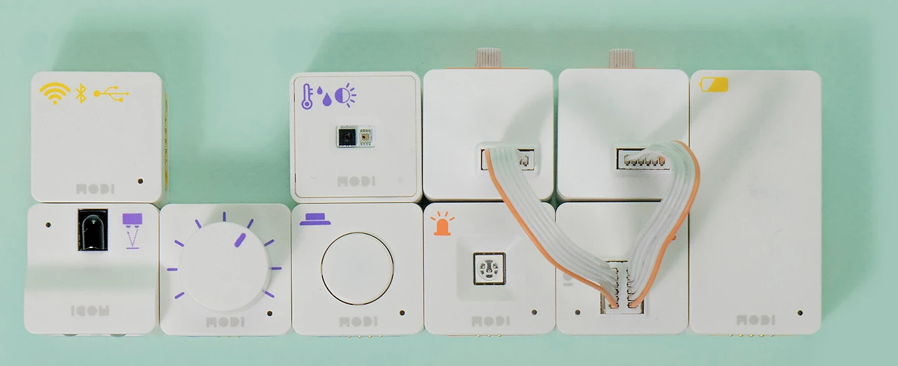
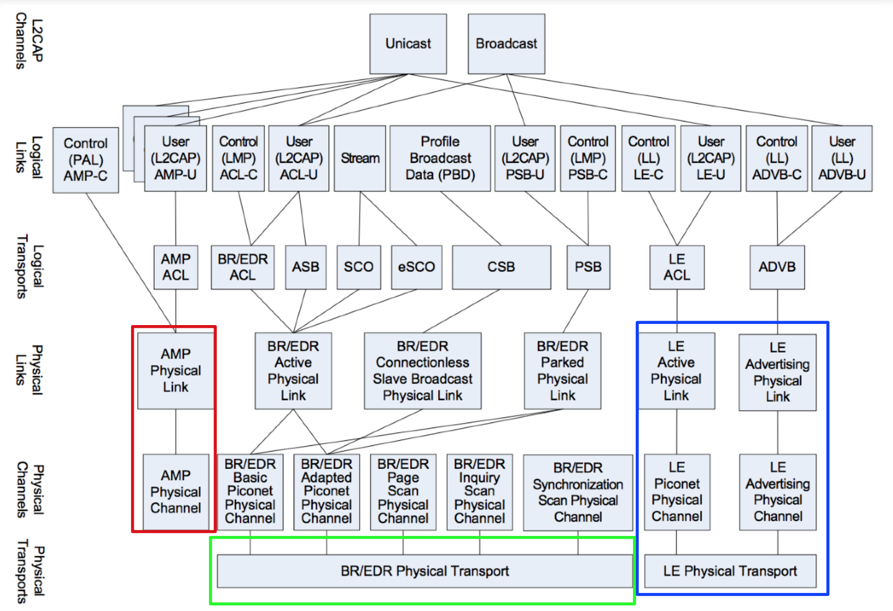
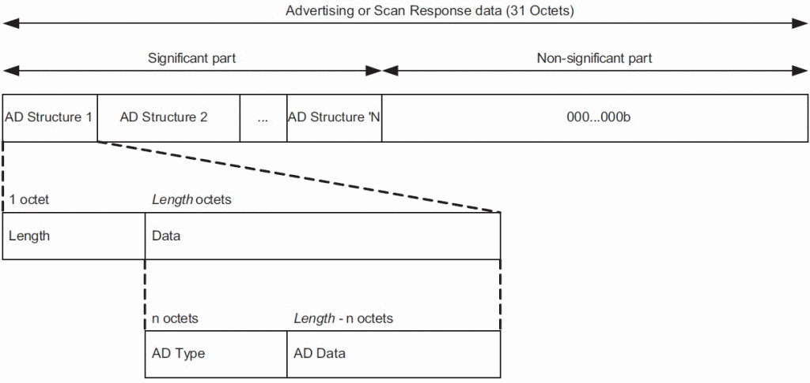
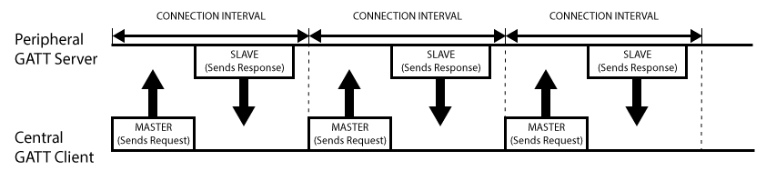
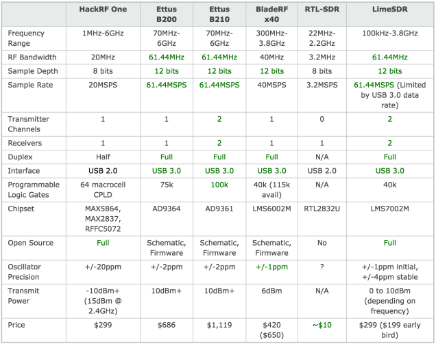
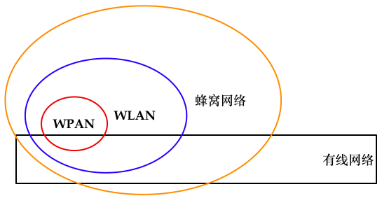

# 第四章 移动通信安全概述

## 2G / 2.5G / 3G / 4G / 5G


## 物联⽹安全 

[Wi-Fi 联盟制造商](https://www.wi-fi.org/) 的商标可做为产品的品牌认证，最基础的认证条件是符合 IEEE 802.11 标准，此外还需缴纳认证授权费用。WLAN（无线局域网）不仅可以使用Wi-Fi设备来组⽹，蓝牙、ZigBee等技术都可以用于构建⼀个⽆线局域⽹，Wi-Fi是符合IEEE 802.11标准的一种 WLAN 产品认证。如下图所示就是 Wi-Fi 认证标志：


物联⽹（Internet of Things，IoT）是互联⽹、传统电信⽹等信息承载体，让所有能⾏使独立功能的普通物体实现 **互联互通** 的⽹络。``Machine to Machine`` 是狭义物联网的一大特征，核心是依赖于“通信技术”。广义的物联网中不仅是机器到机器的通信，也包括机器到人（M2P）、人到人（P2P）、人到机器（P2M）之间广泛的通信和信息交流。物联网中的机器定义为可以获取信息的各种终端。由于“万物互联”，物联网又被称为是一种 ``泛在（Ubiquitous）网络``，即具备 ``4A`` (Anytime, Anywhere, Anyone, Anything) 级别通信能力。物联网对网络中各种物品的 ``全面感知`` 依托 ``4A`` 级别通信能力成为可能。物联网中各种不同的传感器如同人体的各种器官，对外界环境进行感知。物联网通过射频识别、传感器、二维码等感知设备对物品各种信息进行感知获取。物联网正是通过遍布在各个角落和物品上形形色色的传感器，以及由它们组成的无线传感器网络来最终感知整个物质世界。

物联网的基础是实现网络融合，现有的互联网、电信网（包括移动通信系统）、广播电视网络首先要融合成一个统一的“大网络”，即我们熟知的“三网融合”。物联网继承了IP⽹络基本组⽹和通信模型，具体表现在：通信架构方面依然遵循分层结构，通信模式方面依然支持点对点、组播、广播和任播这几种模式。支撑物联网底层联网的关键技术主要包括：RFID (物联⽹的基础设施技术之⼀，可以通过蓝牙、NFC技术来实现）、蓝牙 (IEEE 802.15.1)、NFC (ISO 13157等)和ZigBee (IEEE 802.15.4)。如下图所示，是一个典型的物联网系统 **分层** 架构图。


除此之外，电力行业也是物联网系统发展的先驱，智能抄表系统、智能配电系统都是物联网行业的典型应用。物联网的重点行业应用还包括城市综合管理系统、安防系统、智能物流系统、智能家居以及智能医疗等。“智能”化将物联网推向一个全新的高度，目前的2大智能化特征表现在：自动化（Autonomous）和使用了人工智能（Artificial Intelligence, AI）技术。传感器网络为“智能”处理提供了丰富的原始感知数据，对于用户来说这些原始数据只有经过转换、删除、分析处理之后才有实际价值。智能处理相当于人的大脑，能够根据神经系统传递来的各种信号做出决策，指导相应器官进行活动。物联网系统中的智能处理部分将收集来的数据进行处理运算，做出决策来指导系统进行相应的改变，是物联网应用实施的核心。

### RFID

RFID的全称是Radio Frequency Identification，翻译过来是“射频标识”，属于⽆线通信技术范畴。通过⽆线电信号识别特定目标并读写相关数据，⽆需识别系统与特定目标之间建立机械或光学接触。

⽆线电的信号是通过调成⽆线电频率的电磁场，把数据从附着在物品上的标签上传送出去，以自动辨识与追踪该物品。某些标签在识别时从识别器发出的电磁场中就可以得到能量，并不需要电池，这一类标签被称为⽆源RFID。⽆源RFID (Passive RFID，被动RFID) 依靠和阅读器的电磁耦合供能，读取距离取决于：阅读器耦合线圈的尺⼨、⼯作频率和阅读器的功率（0.5W：0.7m 、 4W：2m 、30W：5.5m）。成本低,应用⼴泛。也有标签本身拥有电源，并可以主动发出⽆线电波（调成⽆线电频率的电磁场），这一类标签被称为有源RFID。标签包含了电⼦存储的信息，数米之内都可以识别。与条形码不同的是，射频标签不需要处在识别器视线之内，也可以嵌⼊被追踪物体之内。使用锂电池通常可⼯作3~10年，读取距离10米 ~ 30米，或更远。目前的应用相对⽆源ID要少，典型如：需要远距离识别的场合、⼿机钱包和⾼速公路ETC。

RFID的技术发展呈现着以下发展趋势特点：

* 越来越多的RFID应用，原本只是以条形码的替代者面目出现；
* 飞快的发展速度；
* 小型化，低成本化；
* 协议和标准泛滥，目前共有117个不同的协议，各国使用不同的标准不同的频段。

目前主要RFID使用的频段现状如下表格所示：

<a href="http://zh.wikipedia.org/wiki/%E5%B0%84%E9%A2%91%E8%AF%86%E5%88%AB"></a>

目前RFID的主要应用领域涵盖了：钞票及产品防伪技术、身份证、通⾏证（包括门票）、电⼦收费系统，如城市公交卡、家畜或野⽣动物识别、病⼈识别及电⼦病历、物流管理、⾏李分类和门禁系统等。

RFID 标签按照是否可写，分为：

* 可读写卡(RW)，Read Write，相当于CDRW。可读可写标签内部的存储器，除了ROM、缓冲存储器之外，还有非活动可编程记忆存储器。这种存储器一般是EEPROM（电可擦除可编程只读存储器），它除了存储数据功能外，还具有在适当的条件下允许多次对原有数据的擦除以及重新写入数据的功能。可读可写标签还可能有随机存取器（Random Access Memory，RAM），用于存储标签反应和数据传输过程中临时产生的数据。可读写标签一般存储的数据比较大，这种标签一般都是用户可编程的，标签中除了存储标识码外，还存储有大量的被标识项目其他的相关信息，如生产信息、防伪校验码等。在实际应用中，关于被标识项目的所有信息都是存储在标签中的，读标签就可以得到关于被标识目标的大部分信息，而不必连接到数据库进行信息读取。另外在读标签的过程中，可以根据特定的应用目的控制数据的读出，实现在不同情况下读出的数据部分不同。典型应用产品形态：第⼆代身份证；
* ⼀次写⼊卡(WORM)，Write Once, Read Many, 相当于CDR。如航空行李标签、特殊身份证件标签等。RW卡一般比WORM卡和RO卡价格高得多，如电话卡、信用卡等：WORM卡是用户可以一次性写入的卡，写入后数据不能改变，比RW卡要便宜。RO卡存有一个唯一的ID号码，不能修改，具有较高的安全性；
* 只读卡(RO)，Read Only, 相当于CD。只读标签内部只有只读存储器（Read Only Memory，ROM）。ROM中存储有标签的标识信息。这些信息可以在标签制造过程中，由制造商写入ROM中，电子标签在出厂时，即已将完整的标签信息写入标签。这种情况下，应用过程中，电子标签一般具有只读功能。也可以在标签开始使用时由使用者根据特定的应用目的写入特殊的编码信息。只读标签一般容量较小，可以用做标识标签。对于标识标签来说，一个数字或者多个数字字母字符串存储在标签中，这个储存内容是进入信息管理系统中数据库的钥匙（Key）。标识标签中存储的只是标识号码，用于对特定的标识项目，如人、物、地点进行标识，关于被标识项目的详细、特定的信息，只能在与系统相连接的数据库中进行查找。典型应用场景是：门禁。

RFID面临的主要安全风险如下：

* 伪造、假冒和非法篡改，详见本节接下来的具体案例说明。
* 泄露隐私。由于RFID标签无须直接与读卡器接触，使用者会在不知情的情况下被他人读取标签内存储的信息，面临安全风险。试想一下，如果每一件商品都内置了RFID标签，比如你的口红，通过合适的RFID阅读设备就可以读取和识别，那么通过追踪一个私人物品的位置移动就可以实现对一个人的跟踪。
* 植⼊⼈体？技术上已经成熟，美国的食品和药品监督管理局（Food and Drug Administration, FDA）已经于2004年通过了相关法律：[CPG Sec. 400.210, Radiofrequency Identification Feasibility Studies and Pilot Programs for Drugs](https://www.fda.gov/ICECI/ComplianceManuals/CompliancePolicyGuidanceManual/ucm074357.htm) 允许RFID芯片植入人体。这将给那些“生物科技黑客”更多攻击人类的途径，这就不仅是泄漏隐私的问题了，对于具备双向通信和控制能力的RIFD芯片来说，这完全可以成为一颗埋在人体内的“定时炸弹”。

除了上述RFID标签之类的RFID应用之外，在我们的生活中还有一些常见的无线产品也属于RFID技术应用。例如：无线键盘和无线鼠标。最早期的无线键盘鼠标依靠红外线作为信号传输的载体，唯一的访问控制就是红外设备的发射和接收距离限制。历史上无线键鼠还使用过 27 MHz 射频技术，由于其他无线设备很少使用 27 MHz 频率，因此受干扰的可能性不大。27 MHz 射频的特点是技术成熟、成本较低，但劣势也比较明显：电力消耗较大、只支持单向传输（可能导致传出传入的频率互相干扰）、传输距离短（仅6英尺（182.88cm））、安全级别不高。目前主流的无线键盘和鼠标使用蓝牙技术传输控制信号，蓝牙的抗干扰能力、传输速率和安全性都优于以往的无线键鼠使用的无线通信技术，而且具备和其他蓝牙产品互联的能力。

在探讨[IEEE 802.11构建的无线局域网的安全加固](../chap0x03/main.md)时我们可以在物理层限制无线信号的发射和覆盖范围来避免不必要的“信号泄漏”，对于物联网来说，电磁辐射泄漏无处不在，例如经典的CRT显示器行场信息还原，普通键盘和鼠标的电磁泄漏问题等。最近，国外的安全研究人员公布了一种通过软件定义无线电（SDR）的方式实现还原远程显示器上的画面的方法和工具 [TempestSDR](https://github.com/martinmarinov/TempestSDR) ，利用它可以捕获计算机屏幕上的射频信号，进而将屏幕显示的实时图像复原出来；如果外加一个增强信号的天线，甚至可以在几米之外成功窥探到电脑屏幕的内容。开源出来的这个TempestSDR工具允许使用任何SDR软件，支持ExtIO（如RTL-SDR、Airspy、SDRplay、HackRF）。如下图所示是工具作者公布的演示视频中的一个同步还原远程显示器上画面的片段截图：


### 智能卡

智能卡的“智能”体现在：

* 内置“存储器”，对存储的数据可以进行访问控制，阻止未授权访问；
* 内置“微处理器”和RAM，支持密码学计算和可编程计算等；
* 支持组件式架构，例如可以按需搭载指纹识别、OTP和传感器模块。

智能卡的具体分类定义取决于： 1) 卡片数据的读取和写入方式；2) 卡片内置的芯片类型和支持的功能。

如下图所示是一个典型的智能卡分类定义结构图：



按照卡片与读卡器之间的通信方式是否需要物理接触分为：接触式卡片和非接触式卡片，大部分的RFID卡片都是非接触s式的。除此之外，还有一类多组件卡片，例如：指纹卡、OTP显示屏卡、密保卡等。

USB令牌就是一类典型的的智能卡实现载体产品形态，除了接口和外观形状不同，其他物理和软件技术架构和智能卡无差异。接口使用USB，无需专用的“读卡设备”。




如上图所示的是银行的U盾，如下图所示的是一种OTP卡：[yubikey](https://www.yubico.com) 。


智能卡的主要应用场景如下：

* 信息存储卡，通常用于保存个人（隐私）信息，例如个人医疗记录卡；
* 储值卡，代替小额现金支付场景，无需在线联网校验，直接读写卡内余额（次数）；自动贩卖机卡、预付费一次性电话卡、公交卡；
* 认证令牌卡，内置加密芯片，提供散列值、数字签名和加解密能力；
* 多功能卡，内置操作系统。Windows for Smart Cards, MULTOS, Java Card。支持灵活丰富的应用场景。

智能卡面临的主要威胁如下：

* 差分功耗分析（Differential Power Analysis），基于密码学计算过程中的功耗变化统计数据来推导卡片上存储的密钥；
* 计时攻击（Timing Attacks），类似的攻击手段我们已在“SQL盲注攻击”中见识过；
* 芯片逆向（Reverse Engineering of the Chips），专家/富人/国家级研发能力和成本投入；
* 设计/实现缺陷，通用/缺省加密口令/密钥。

使用分层次威胁建模的方法，自下而上按照：环境、硬件、网络、操作系统、应用软件和人这几个层次来逐层分析智能卡面临的威胁：

* 环境：钓鱼风险；
* 硬件：直接读取或破坏（改变电压/温度/酸碱度/电路板重新焊接搭线等）EEPROM；
* 网络：明文传输风险，MITM，嗅探器调试；
* 操作系统：需要分 ``固定文件系统`` 和 ``动态文件系统`` 具体讨论；
* 应用软件：软件设计与实现漏洞；
* 人：遗失、外借、设置弱PIN码等。

下面重点探讨智能卡操作系统安全，智能卡操作系统主要分为 1) ``固定文件系统`` 和 2) ``动态文件系统``。正如所有智能卡类型可以按照应用场景分类，操作系统选型也是取决于应用场景。除此之外，不同智能卡的差异还体现在操作系统的加密能力和选用的芯片。

1) ``固定⽂件系统`` 通常只被用于可信安全计算环境，所有⽂件权限都是出厂时设置好⽆法修改的，例如员⼯信息卡；

2) ``动态⽂件系统`` 常见于JavaCard®和MULTOS，操作系统和应用软件实现了解耦。例如，GSM的SIM卡，支持OTA更新，适用于频繁需要更新数据/软件的场景，例如密钥协商。

```
								MF (Master File)          
                                       |
                          -------------+--------------
                          |            |             |
               EF (Elementary File)    EF   DF (Dedicated File)
                                                     |
                                            ---------+--------
                                            |        |       |
                                            EF       DF      EF
                                                     |
                                                     EF
```

如上图所示是一个智能卡操作系统上的数据组织方式示意图，其中 ``MF (Master File)`` 和 ``DF (Dedicated File)`` 相当于“目录”，但DF依然可以独立存储数据。``MF``相当于根目录，包含了EF和DF的文件头信息。``EF (Elementary File)`` 相当于“⽂件”，MF/DF/EF的⽂件头包含安全属性（相当于访问控制信息）：只要有“权限”，操作系统上的应用就可以遍历所有⽂件。智能卡的 ``PIN`` 也会被存储在 ``EF`` 文件头但访问必须获得卡片上操作系统授权。卡片上的数据访问遵循访问控制规则，以SIM卡为例，智能卡文件系统包含5类安全属性（权限）：

* Always(ALW)，这一类权限意味着数据访问不受限制；
* Card holder verification 1 (CHV1)，使用 ``PIN1`` 验证（用户设置的）通过或禁用了PIN验证功能；
* Card holder verification 2 (CHV2)，使用 ``PIN2`` 验证，设备商设置的用于解封设置（ ``PIN1`` 和 ``PIN2`` 是相互独立的PIN）或禁用了PIN2验证功能；
* Administrative (ADM)，卡片签发者在满足特定管理访问机制实现的前提下才可以访问；
* Never (NEV)，通过SIM/ME接口的访问是被永久禁止的。

SIM卡中通常会存储订阅者（手机卡持有者）的通讯录和短信消息，除此之外还包含以下重要信息：

* Integrated circuit card identifier (ICCID)
* International mobile subscriber identity (IMSI)
* Service provider name (SPN)
* Mobile country code (MCC)
* Mobile network code (MNC)
* Mobile subscriber identification number (MSIN)
* Mobile station international subscriber directory number (MSISDN)
* Abbreviated dialing numbers (ADN)
* Last dialed numbers (LDN)
* Short message service (SMS)
* Language preference (LP)
* Card holder verification (CHV1 and CHV2)
* Ciphering key (Kc)
* Ciphering key sequence number
* Emergency call code
* Fixed dialing numbers (FDN)
* Local area identity (LAI)
* Own dialing number
* Temporary mobile subscriber identity (TMSI)
* Routing area identifier (RIA) network code
* Service dialing numbers (SDNs)

由于这些信息保存在 ``EF`` 中，``PIN`` 是保护这些信息机密性的重要安全机制，通常 ``PIN`` 被设置为4位数字，因此防暴力破解锁定机制成为了 ``PIN码`` 首选安全机制。

* 触发锁定的错误尝试认证次数和锁定时间取决于操作系统设置
* ``PIN2`` 用于解封 ``PIN1`` 被锁定状态
* ``PIN2`` 被锁定通常就只能返厂维修了
* ``PIN1`` 被锁定时所有⽂件均被设置 ``CHV1`` 属性，禁⽌访问

除了SIM卡之外，市场上还有一大部分智能卡是 MIFARE 系列。MIFARE 是恩智浦半导体公司（NXP Semiconductors）在非接触式智能卡及近场感应卡领域的注册商标。MIFARE是依循ISO/IEC 14443-A规格创建的非接触式智能卡，利用⽆线射频识别（频率为13.56MHz）来完成验证。由于价廉物美，近年来MIFARE已经普遍在日常⽣活当中使用，如⼤众运输系统付费、商店小额消费、门禁安全系统、借书证等。以下是MIFARE公司近几年的主要产品架构及工作原理简表。


其中，又以 ``MIFARE Classic`` 系列销量最好。该系列卡片的主要特点如下：

* Unique Identifier(UID)只读
* 读取设备和卡片双向认证通过之后使用协商出会话秘钥加密通信数据
* 使用私有的CRYPTO1加密算法（依赖于算法保密来“提升”密码学算法的安全性）
* 奇偶校验位信息混淆
* 仅硬件实现（依赖于硬件化“提升”防逆向能⼒）

但 ``MIFARE Classic`` 的安全性目前已经被证明存在重大缺陷，以下3个里程碑事件再一次证明了：“混淆不等于安全”和“不要自己设计和实现未经密码学安全性证明的密码学算法”。

* 2007年12月两个德国⼈Nohl 和 Plötz在 Chaos Communication Congress上展示了通过Crypto-1的⼀些缺陷部分逆向了其算法
* 2008年3月来自荷兰Radbond⼤学的研究者完全逆向了Crypto-1算法并予以[公开](http://www2.ru.nl/media/english.html) 。NXP试图通过法律途径禁⽌上述公开⾏为，但在2008年7月被当地法庭以⾔论自由原因驳回了申诉
* 2008年10月，Radbond⼤学以GNU GPL v2协议开源了Crypto-1算法代码

目前，已有⼤量针对MIFARE Classic卡的⿊客⼯具被公开。其中，知名的RFID Hacking工具 [Proxmark 3](https://github.com/Proxmark/proxmark3) 就内置了对 Crypto-1 算法的[破解支持](https://github.com/Proxmark/proxmark3/tree/master/common/crapto1) 。

Proxmark 3是Jonathan Westhues设计并且开发的开源硬件，其主要用于从低频 (125 kHz) 到⾼频 (13.56 MHz) RFID的嗅探、读取以及克隆等的操作，相关Hacking实验可类比IEEE 802.11类嗅探和注⼊实验。

非接触式智能卡与RFID标签的横向比较如下表格所示：

|  | 非接触式智能卡 | RFID标签 |
|--|----------------|----------|
| 身份认证 | <ul><li>（读卡器与卡片之间）双向认证 </li><li> 支持PIN或⽣物特征识别 </li><li> 数据传输加密 </li> <li>软硬件双重加密防⽌伪造身份</li></ul> | <ul><li>单向认证（不认证读卡器）</li><li> 存储空间小（不支持⽣物特征信息存储） </li><li> ⽆板载芯片用于计算 </li><li> 预共享静态秘钥</li></ul> |
| 功能场景 | 公民身份标识、⾦融交易、物理、访问控制等 | 物品标识（例如：库存管理、物流管理）为主 |
| 可读写能⼒ | 内置可读写持久存储器 | <ul><li>内存小（92字节）</li><li>  通常只读</li></ul> |
| 通信距离 | 近距离为主 | 取决于射频的⼯作频率 |
| 价格 | 较贵 | 便宜 |

## “智能”硬件 

智能硬件没有一个公认的统一定义，本书接下来要介绍的“智能”硬件其“智能”主要体现在⾄少具备以下特性之一：

* 具备通用或专用计算能⼒
* 具有可编程性，支持软件定义硬件
* 具备感知外界的能⼒
* 低功耗或节能型

符合上述特性的代表性产品包括：

* DIY硬件
* 机器⼈、⽆⼈机
* 智能家电，例如：⾖浆机，热⽔器，空调，净⽔器，电源开关，电源插座，电视，摄像机等等
* 智能家居
* 可穿戴设备（健康医疗、VR/AR等等）

DIY硬件方面，[Raspberry Pi](https://www.raspberrypi.org/) 和 [Arduino](https://www.arduino.cc/) 是2个代表性产品家族。其中，Raspberry Pi主打微尺⼨、全功能Linux主机，是英国剑桥⼤学出品，原设计用于教学计算机硬件维修实验对象：满⾜物美价廉、可定制的全功能计算机硬件特性。Arduino则属于一种微控制器，是意⼤利⼀所交互设计专业教师出品，原设计同样用于教学：快速硬件产品原型构建。Raspberry Pi 和 Arduino 可以进行组合集成，打造一个有着丰富传感器和控制器的全功能计算平台，特别适合于物联网系统的构建。除此之外，智能手机通过USB OTG接口可以连接丰富的配件（网卡、键盘等）打造成一个移动计算和办公平台环境。

[MODI](https://www.luxrobo.com/) 是一个模块化的 DIY 物联网和机器人构建系统，可以像搭积木一样来构建一个智能硬件系统。如下图，就是一个基于MODI的DIY硬件构建效果图。



[PoisonTap](https://github.com/samyk/poisontap) 是一个可以安装部署到 Raspberry Pi 的智能硬件渗透测试系统，可以基于USB接⼝通过物理连接Hack掉⼀台电脑，可以提供流量嗅探和劫持、Cookie毒化和远程访问控制（RAT, Remote Access Toolkit）工具。在 [本书的第三章](../chap0x03/main.md) 我们介绍过Rogue Access Point，借助这里的 [PoisonTap](https://github.com/samyk/poisontap) 通过物理联⼊的⼀个⽆线热点可以实现远程接⼊⼀个安全隔离的有线⽹络。有线⽹络的安全性可以通过物理安全保障，但恶意AP的接⼊打破了原有的物理隔离和限制措施，⼀个可编程的恶意AP可以实现自动化的局域⽹攻击，智能⼿机、使用开源路由器固件（OpenWrt/DD-Wrt等等）的⽆线路由器等均可以用于构建一个Rogue AP。


近些年，智能路由器产品大量出现在消费级路由器市场上，相比于普通家用路由器，智能路由器的“智能”主要体现在可以远程通过手机App查看和管理路由器、提供私有云存储功能、智能家居的网关功能等。从技术实现的角度来说，智能路由器相比于普通路由器主要是增加了远程访问能力和可编程扩展性。其中，远程访问功能的实现在实践中被一些路由器厂商预留了“调试”后门，例如[2014年2月 国家互联网应急中心发布 关于多款路由器设备存在预置后门漏洞的情况通报](http://www.cert.org.cn/publish/main/9/2014/20140210091555248367162/20140210091555248367162_.html) ：

> 近期，CNCERT主办的国家信息安全漏洞共享平台（CNVD）对Cisco、Linksys、Netgear、Tenda、D-link等主流网络设备生产厂商的多款路由器产品进行分析，确认其存在预置后门漏洞。上述产品均为应用较广的企业级或个人用户产品,利用上述漏洞可取得路由器产品的远程控制权，进而发起DNS劫持、窃取信息等攻击。

可编程的智能路由器普遍使用了诸如OpenWRT这样的路由器操作系统作为系统固件的构建基础，固件更新设计与实现缺陷屡见不鲜，例如：仅使用简单的Hash算法校验下载⽂件完整性，未使用数字签名算法鉴别⽂件真实性。不仅如此，私有化的固件防逆向能力不同厂商的差异也较大，一些厂商把一些关键算法、私有算法、密钥等机密数据封装在固件之中，并假设攻击者无法从固件中提取出密钥和还原出相关重要算法，一旦攻击者破译出了密钥和算法，就可以绕过一些客户端校验和保护机制、编写第三方客户端软件与厂商的云服务通信、使用提取出来的密钥解密加密通信数据等。

除了智能路由器所面临的的一些特定威胁之外，普通路由器也会存在的配置信息保存不当（例如明文保存）、WPS功能未默认关闭、不安全的默认设置（例如默认SSID和默认WEB管理界面的缺省管理员密码等）和路由器WEB管理系统漏洞等问题，对于智能路由器来说依然是安全风险的重要来源。

## 蓝牙安全 

蓝牙是构建无线个人网络（WPAN，Wireless Personal Area Network）的基础技术之一，支持服务能⼒描述/声明配置⽂件（声明蓝牙设备所具备的应用能⼒，例如：输⼊（键盘、鼠标）、输出（音频、⽂件传送、打印机）和设备能⼒发现。越来越多的物联⽹应用采用蓝牙（特别是蓝牙低功耗）作为底层通信协议，例如各种智能锁、智能家居产品等。

蓝牙设备按照功耗等级可以分为三个等级，如下表格所示：

| 设备类型 | 功耗 | 最⼤功耗等级 | 设计通信距离 | 典型设备 |
|----------|----------|----------|----------|----------|
| Class 1  | ⾼ | 100 mW (20 dBm) | < 100⽶ | USB适配器、接⼊点 |
| Class 2  | 中 | 2.5 mW(4 dBm)   | < 10⽶  | 移动设备、蓝⽛适配器、智能卡读卡器 |
| Class 3  | 低 | 1 mW (0 dBm)    | < 1⽶   | 蓝⽛适配器 |

如下图摘自[蓝牙4.2协议规范 Figure 3.3: Overview of transport architecture entities and hierarchy](https://www.bluetooth.org/DocMan/handlers/DownloadDoc.ashx?doc_id=286439) 。



蓝牙使用的是2.4 GHz [ISM \(Industrial Scientific Medical Band\)](https://zh.wikipedia.org/wiki/ISM%E9%A2%91%E6%AE%B5) 频段的 ``2400~2483.5 MHz``，根据物理层传输方式的差异分为标准蓝牙（BR/EDR和AMP）和低功耗蓝牙（BLE），2种物理层传输方式相互不兼容。以下如果没有特别说明是蓝牙低功耗或BLE，则默认均指的是使用标准蓝牙的物理层传输协议。其中，标准蓝牙的传输速率有2种，分别是721.2Kbps的基础速率（Basic Rate, BR）和可选的2.1Mbps增强数据速率（Enhanced Data Rate, EDR）。AMP (Alternate MAC and PHY layer extension) 是另一种标准蓝牙传输速率的物理层协议规范，“借用”了IEEE 802.11协议的物理层和MAC层规范，传输速率可以达到54 Mbps。

使用了AMP的标准蓝牙和IEEE 802.11协议的区别与联系可以用如下表格进行总结：

| 特性 | 蓝⽛ | IEEE 802.11 |
|-----|-----|-----|-----|
| ⽹络拓扑   | 对称（点对点） | ⾮对称（以AP为中⼼），也支持点对点的非基础设施模式 |
| ⼯作频段   | 2.4 GHz | 2.4 GHz / 5 GHz |
| 传输速率   | 1~24 Mbps | 5.5~1000 Mbps |
| 传输距离   | 1～300⽶蓝牙5.0 | 室外最⼤250⽶左右 |
| 协议兼容性 | 3.0+版本兼容802.11n (物理层使⽤802.11协议) | - |

如下图所示是蓝牙系统的逻辑组成图，Host在负责逻辑链路的基础上为上层蓝⽛应⽤提供更易使⽤的封装，Controller负责定义RF、Baseband等偏硬件的规范在此基础之上抽象出⽤于通信的逻辑链路。


### BR/EDR

标准蓝牙和低功耗蓝牙使用不同的物理层传输协议规范，具体来说，BR/EDR控制器把可用的频带[分成79个频率，每个为1 MHz](https://en.wikipedia.org/wiki/List_of_2.4_GHz_radio_use#Bluetooth)，使用跳频(Frequency Hopping)通信，1秒⾄多改变1600次；物理信道（Physical Channel）是由跳频图谱（Hopping Pattern）决定的，跳频图谱是⼀种规则，规定了蓝牙RF在某⼀时刻需要跳到79个频率中的哪个频率上通信。BR/EDR控制器把所有物理信道分为三类：搜索用的信道（Inquiry scan channel)、连接用的信道（Page scan channel)和连接后设备之间通信的信道。连接建立后，多个设备共享同⼀个物理信道，决定跳频图的那个设备称作Master，其他设备称作Slave。Master只有⼀个，Slave可以有多个。连接建立后，双⽅根据已建立的、基于BR/EDR控制器的L2CAP(Logical Link Control and Adaptation Protocol)，可以协商各自是否具备可以使用的AMP信道，如果具备，是否愿意将后续的数据输出转移到这些控制器上（可以提⾼蓝牙传输速率） 。

蓝牙设备之间进⾏数据通信前需要先 **找到对⽅** 。具体来说，蓝牙设备在寻找对方的过程会被分别设置为搜索和可被搜索状态。处于搜索状态的⼀⽅以较快的速度跳频，被搜索设备以较慢的速度跳频并⼴播自身信息。


蓝牙设备之间进⾏数据通信前还需要 **和对⽅建立连接** ，一方面蓝牙设备可以被设置为连接和可被连接状态，连接是两个蓝牙设备同步到同⼀个跳频图谱（即物理信道）的过程，发起连接的⼀⽅作为Master，接受连接的⼀⽅为Slave。

BR/EDR Controller的链路层控制体现在同⼀个物理信道上，只有Master和Slave之间可以通信，Slave和Slave之间不能通信。多个设备共享⼀个物理信道，Master和不同Slave之间可以时分复用信道，看起来就像独占了⼀个信道，称为：物理链路(Physical Link)。在物理链路之上抽象出逻辑链路，用于传输不同类型的数据，如异步数据、同步数据、单向(unidirectional)数据、⼴播数据等。逻辑链路时分复用物理链路。链路管理协议(Link Management Protocol, LMP)用于管理抽象出来的逻辑链路。LMP之上提供L2CAP层，从应用的角度复用逻辑链路。负责不同应用类型数据的封包和解包，类似TCP/IP里的端⼝。

### BLE

低功耗蓝牙的别名是 ``Bluetooth Smart``，是经典蓝牙协议的一个轻量级子集（另一个是Basic Rate），但不能与经典蓝牙协议互通。BLE是蓝牙4.0核心规范的组成部分，是面向现代移动终端平台设计，各个主流操作系统对蓝牙4.0的内置协议栈支持情况如下：

* iOS5+ (iOS7+ preferred)
* Android 4.3+ (numerous bug fixes in 4.4+)
* Apple OS X 10.6+
* Windows 8 (XP, Vista and 7 only support Bluetooth 2.1) 
* GNU/Linux Vanilla BlueZ 4.93+ 

BLE 控制器把可用的频带分成40个频率，每个为2 MHz。其中3个频率为⼴播信道（Advertising Channel），37个频率为数据信道（Data Channel）。

BLE的使用场景包括了：广播通信和连接建立。其中，广播通信是单一方向的、无连接的数据通信，数据发送者在广播信道上广播数据，数据接收者扫描、接收数据。BLE 控制器把⼴播信道为预先设定的物理信道，其个数和占用的频率，都可以设定，这些信道被划为时间单元，在这些时间单元上传输的数据包也称作事件(event)，有⼴播和连接两种事件。37个数据信道用于连接建立后的数据通信，采用跳频技术。BLE 控制器的广播通信过程中，在⼴播信道发送⼴播数据的⼀⽅称作⼴播者(Advertiser)，接收⼴播数据但不打算连接的⼀⽅称作扫描者(Scanner)。该特性主要用于那些没必要建立点对点连接的数据通信，如多播或⼴播。Advertiser发送的⼴播数据中有⼀种称为“可连接⼴播数据包”，表示它可以被其他设备连接。接收到该包的设备可以在⼴播信道上回应“连接请求”，这样可以建立起来点对点连接，同时该设备被称作发起者(Initiator)。类似BR/EDR技术，Initiator为Master，Advertiser为Slave。如下图所示是广播数据（Advertising Data, AD）和可选的扫描应答（Scan Response, SR）数据结构示意图。



* 广播数据（或者扫描应答数据）由一个一个的AD Structure组成，对于未满31bytes的其它数据，则填充为0
* 每个AD Structure由两部分组成：1byte的长度信息（Data的长度），和剩余的Data信息
* Data信息又由两部分组成：AD Type（长度不定）指示该AD Structure的类型，以及具体的AD Data

周边设备会设置一个广播间隔并周期性的重新传送它的主广播数据报文，间隔设置的长短会影响到设备的耗电和响应延迟。监听设备通过发送SR请求来获得周边设备的SR数据。


周边设备一旦和中心设备建立连接，则广播通信过程终止，改用GATT服务来进行双向通信。点对点连接建立后的数据通信物理信道是由Master⽣成的跳频图谱决定的。


[GATT - Generic Attribute Profile](https://www.bluetooth.com/specifications/gatt) 定义了2个BLE设备数据交换的方式，通过2种属性分类：服务（Service）和特性（Characteristic）来分类组织。Profile是[由蓝牙标准委员会](https://www.bluetooth.com/specifications/gatt) 或周边设备生产商预定义的一个服务集合，由[蓝牙标准委员会官方采纳的服务（Service）](https://www.bluetooth.com/specifications/gatt/services) 采用16-bit UUID进行标识，最多允许包含3个特性，私有自定义服务采用 128-bit 唯一标识。由[蓝牙标准委员会官方采纳的特性](https://www.bluetooth.com/specifications/gatt/characteristics) 采用16-bit UUID进行标识，私有自定义特性采用128-bit唯一标识，一个特性字段存一个独立数据（可以是复合数据结构）。

Attribute Profile (ATT) 提供存储服务、特性和相关数据于一个简单的查找表，使用16-bit 唯一编号在表中查找匹配。一个BLE周边设备一次只能连接一个中心设备，连接一旦建立，广播通信立刻停止，其他设备就无法发现它所以无法再建立新连接了。

已建立BLE连接时，一个中心设备可以被多个周边设备连接，连接一旦建立就是一个双向通信的信道。


在一个GATT会话中定义了周边设备（GATT Server）、中心设备（GATT Client）和连接间隔。周边设备持有ATT查找数据、服务和特性定义，中心设备向周边设备发起请求。连接间隔通常由Server设置建议值，Client不一定照办（并发处理多个会话带来的可能延迟）。



如下图所示一个BLE的典型协议栈结构示意图：


GAP (Generic Access Profile) 负责从应用程序的角度，抽象并封装LL提供的功能，以便让应用以比较傻瓜的方式进行广播通信。非必须选项，没有GAP也可以进行广播通信。这是一个基础的蓝牙profile，用于提供蓝牙设备的通用访问功能，包括设备发现、连接、鉴权、服务发现等等。通过定义设备角色来控制蓝牙连接和广播通信，实现不同设备（中心设备和周边设备）的互操作。中心设备(Central Device)是主动发现的设备，计算能力更强，耗电量更大，例如手机、平板电脑等。周边设备(Peripheral Device)是被发现的设备，体积小、功耗低，通常需要连入中心设备。例如心率监控设备。

HCI (Host Controller Interface) 负责将LL提供的所有功能，以Command/Event的形式抽象出来，供Host使用。

LL (Link Layer) 负责广播通信有关功能的定义和实现，包括物理通道的选择、相关的链路状态的定义、PDU的定义、设备过滤（Device Filtering）机制的实现等。链路层状态定义包括：

* Advertising，数据发送方，周期性的发送广播数据；
* Scanning，数据接收方，扫描、接收广播数据；
* Initiating，连接发起方，扫描带有“可连接”标志的广播数据，一旦发现，则发起连接请求（都是由Link Layer自动完成，不需要Host软件参与）。

GATT提供多种认证机制：静态口令/秘钥、挑战-响应（最常见）和PKI。

SMP（Security Manager Protocol）:点对点的协议，基于专用的L2CAP channel，用于生成加密和识别（identity）用的密匙

SM控制包括配对（pairing,）、认证（authentication）和加密（encryption）等过程。

L2CAP包括两个子模块：Channel Manager主要负责创建、管理、释放L2CAP channel；L2CAP Resource Manager负责统一管理、调度L2CAP channel上传递的PDU（Packet Data Unit），以确保那些高QoS的packet可以获得对物理信道的控制权


### 蓝牙 4.0 安全机制

蓝牙 4.0 安全机制包括了配对(Pairing)，秘钥产⽣(Key Generation)、加密（主要是应用层（GATT）加密）和数字签名等。其中，配对是⼀次性过程，又分为三种配对方式：JustWorks(R), 如果设备没有显示屏；6位PIN，如果设备有显示屏；带外(Out of band)。

### 蓝牙安全概述

[蓝牙协议本身的安全问题](https://css.csail.mit.edu/6.858/2012/projects/echai-bendorff-cathywu.pdf) 主要包括：劫持配对过程,窃听、伪造蓝牙通信，重放和中间人攻击，隐私问题：标识追踪。

蓝牙协议栈实现的安全问题包括：无线网络绑定的是硬件层和协议层，配对验证码PIN是默认值或弱PIN码和蓝牙直接绑定应用相对复杂（典型漏洞：针对蓝牙协议1.1版本的[BlueSnarf](https://trifinite.org/trifinite_stuff_bluesnarf.html) 攻击和特定蓝牙协议栈实现的缓冲区溢出）。

2017年9月，[Armis](https://www.armis.com/blueborne/) 爆出了一系列蓝牙协议栈实现的漏洞，基本上影响所有的蓝牙设备，相关受影响的系统和CVE漏洞编号情况统计如下。只要手机开启了蓝牙，就可能被远程控制。 

* CVE-2017-1000250 Linux bluetoothd进程信息泄露 
* CVE-2017-1000251 Linux 内核栈溢出 
* CVE-2017-8628 微软蓝牙协议栈欺骗漏洞
* CVE-2017-0785 Android com.android.bluetooth进程信息泄露 
* CVE-2017-0781 Android com.android.bluetooth进程堆溢出 
* CVE-2017-0782 Android com.android.bluetooth进程堆溢出
* CVE-2017-14315 LEAP (Low Energy Audio Protocol)协议堆溢出漏洞导致的远程代码执行漏洞

上述相关漏洞被发现者 [Armis](https://www.armis.com/blueborne/) 命名为 ``BlueBorne`` 。BlueBorne之所以危险，是因为大多数用户都会在他们不使用蓝牙的时候将蓝牙开关打开。而攻击者根本不需要与目标设备配对(但是信号得在接收范围内)即可完全接管该设备。Armis Labs团队的负责人Ben Seri称，他们已经在实验环境下建立了一个僵尸网络，并且使用BlueBorne攻击安装了勒索软件。

与传统网络攻击不同，BlueBorne不需要用户点击URL链接，或者下载恶意文件，受害者甚至根本不需要连接到互联网上，它可以使用蓝牙协议在短距离内在空气中传播，而黑客根本就不需要与目标受害者配对，只要目标的蓝牙开关处于打开状态，黑客就可连接到这台设备，完全接管设备，还可以通过被攻陷的设备传播恶意软件，而受害者完全无法察觉。

Armis Lab在公开漏洞信息的同时也已第一时间在Google Play上发布了[BlueBorne漏洞检测app](https://play.google.com/store/apps/details?id=com.armis.blueborne_detector) ，不仅可用来检测你的设备是否受BlueBorne攻击影响，还可检测你周围的蓝牙设备是否也受影响（检测系统的补丁日期）。

有意思的是，本书作者在Google Play上搜索该公司刚刚发布的该漏洞扫描软件“BlueBorne”时，已经有山寨app出现在搜索结果列表里，如下图所示：

<a href="attach/blueborne.phishing.png" alt="点击在新窗口查看大图" target="_blank"></a>

上述BlueBorne漏洞相关的安全事件带给我们2点启示：

* 移动互联时代，官方应用商店提供的app同样可能存在仿冒和钓鱼应用；
* 物联网时代，物联网设备和协议漏洞将会成为安全事件的新常态。

### NFC

NFC是一种短距离⾼频⽆线通信技术，由RFID演变⽽来。NFC仅限13.56MHz⾼频段，RFID有较多频段选择。NFC的有效通信距离⼤多在10厘米以内，RFID的通信距离范围从⼏厘米到⼏⼗米都有。NFC是⼀种“集成”RFID技术，单芯片内置非接触读卡器、非接触卡和点对点功能，RFID通常使用独立的阅读器和标签。RFID多用于⽣产、物流、资产管理等，NFC则更多用于公交、门禁、⼿机支付等。

以下表格总结了NFC与标准蓝牙、BLE之间的关系：

| 特性     | NFC | 蓝⽛ | 低功耗蓝⽛(BLE) |
|----------|-------|-------|-------|
| 标签是否耗能 | 否 | 是 | 是 |
| 标签成本     | 10美分 | 5美元 | 5美元 |
| RFID兼容性   | ISO 18000-3 | 有源（主动）| 有源（主动） |
| 标准化组织   | ISO/IEC | Bluetooth SIG | Bluetooth SIG |
| ⽹络协议标准 | ISO 13157 etc. | IEEE 802.15.1 | IEEE 802.15.1 |
| ⽹络拓扑类型 | 点对点 | WPAN | WPAN |
| 加密         | 基于RFID技术的没有 | 可选 | 可选 |
| 通信距离     | < 0.2m | ~ 100m (class 1) | ~50m |
| 频段         | 13.56 MHz  | 2.4-2.5GHz  | 2.4-2.5GHz |
| 传输(⽐特)速率 | 424 kbps | 2.1/24 Mbps | 1 Mbps |
| (⽹络)建⽴时间 | < 0.1s | < 6s | < 0.006s |
| 功耗 | < 15 mA(读) | 不同级别有差异 | < 15 mA (读和传输) |

## ⼴义⽆线⽹络安全

在研究广义无线网络安全之前，让我们先来熟悉一下《中华人民共和国无线管理条例》

> 第十四条 使用无线电频率应当取得许可，但下列频率除外：

> （一）业余无线电台、公众对讲机、制式无线电台使用的频率；

> （二）国际安全与遇险系统，用于航空、水上移动业务和无线电导航业务的国际固定频率；

> （三）国家无线电管理机构规定的微功率短距离无线电发射设备使用的频率。

> 第十五条 取得无线电频率使用许可，应当符合下列条件：

> （一）所申请的无线电频率符合无线电频率划分和使用规定，有明确具体的用途；

> （二）使用无线电频率的技术方案可行；

> （三）有相应的专业技术人员；

> （四）**对依法使用的其他无线电频率不会产生有害干扰**。

知法守法，对于信息安全专业的学习者来说必须时刻谨记。攻防是信息安全的一体两面，**未知攻焉知防** 不等于 **攻击有理** 和 **攻击无罪** ，网络攻击技术的学习和研究一定要确保在受控、隔离环境中进行，扩展一下上述《无线管理条例》的规定，我们应 **对依法使用的其他网络与系统不会产生有害干扰** 。

软件定义无线电（Software Defined Radio, SDR）是基于 **通用的硬件平台** 上用 **软件** 来实现各种通信模块，囿于本书篇幅我们不会具体介绍和讲解基于SDR的攻防技术，推荐阅读 [《HackRf与GnuRadio⼊门指南》](http://www.hackrf.net/hackrf%E4%B8%8Egnuradio%E5%85%A5%E9%97%A8%E6%8C%87%E5%8D%97/) 入门基于SDR的广义无线攻防技术。

和前述无线网络的攻防实验和研究一样，基于SDR的广义无线攻防也是需要借助于专门的硬件来运行软件模拟和实现的各种通信模块。以下简单介绍几种目前常见的平价硬件解决方案：

* [RTL2832U](https://github.com/osmocom/rtl-sdr) 是一款廉价DVB-T调制解调电视棒常使用的芯片型号，[RTL-SDR]((https://github.com/osmocom/rtl-sdr)是基于该款硬件的SDR软件。
* [HackRF](https://greatscottgadgets.com/hackrf/) 是 [greatscottgadgets.com](http://greatscottgadgets.com/) 开发的一款低成本开源SDR平台，支持从 1 MHz 到 6 GHz 频率的无线电信号发送和接收。该团队还开发了知名的蓝牙和BLE嗅探平台[Ubertooth](https://github.com/greatscottgadgets/ubertooth/wiki) 。
* [BladeRF](http://nuand.com/) 是一个软件无线电开放教学实验平台，支持 300 MHz ~ 3.8 GHz 频率的无线电信号发送和接收，支持USB 3.0高速模式。
* [USRP](https://www.ettus.com/)支持从直流信号到6 GHz频率的射频应用SDR开发平台。
* [LimeSDR](https://github.com/myriadrf) 是一款低成本、开源和支持插件应用模式的SDR平台，

如下图所示是RTL电视棒、HackRF、BladeRF、USRP、LimeSDR参数对比表：

<a href="https://cn0xroot.com/2017/04/"></a>

## 无线网络安全小结



如上图所示，总结了各种不同信号物理覆盖范围的无线网络构建技术和有线网络之间的关系。概括描述如下：

* 无线网络主要解决的是终端设备接入网络的问题，有线网络主要解决的是骨干网络互联互通以及为无线网络提供广域网络传输的接入；
* WPAN、WLAN和蜂窝网络的物理信号覆盖范围逐渐增大。

在无线网络安全加固方面，针对蜂窝通信的建议是：

* 尽快升级你的移动通信⽹络制式到4G；
* 不要依赖 2G ⽹络的短信传送机密信息，避免明文嗅探风险；
* 服务提供商要正确的实现验证码短信功能：不要在短信中同时出现完整帐号和验证码；验证码有效周期尽可能短，建议重要验证码1分钟过期；
* 遇到疑似伪造来源号码的电话和短信，**回拨** 可验证真伪。这里的 **回拨** 有两点需要注意。第一，对于陌生号码，为了避免 **高额主叫话费** 和落入电信诈骗的陷阱，并没有回拨的必要性。第二，需要 **回拨** 确认主叫号码真实性的场景主要指的是用你熟悉的电话号码（例如通讯录号码、常见短号码，如110，10086，银行客服电话等）呼入，但谈话内容疑似诈骗。这时，更换另⼀个⼿机号、固定电话，逐个号码手工输⼊⽅式进行回拨，能够规避主叫号码篡改类的电信诈骗风险。这是因为，虽然来电号码可能会通过类似VoIP等方式来伪造，但当我们回拨的时候，被叫号码却并不是诈骗犯所能控制和劫持的。类似的，通过伪基站方式发送的伪造发信人号码（例如伪造电信运营商客服号码、银行客服号码等）的短信，通过 **更换另一个手机运营商号码** 的手机（规避特定运营商链路被劫持和当前手机中木马的风险） 并且 **离开当前位置超过2公里以上** （避开伪基站劫持） **上行** 短信到该发信人号码，基本能够确保短信送达真正的号码所有者，而不是伪造号码的所有者。

针对蓝牙的安全加固建议是：

* 默认不启用设备的蓝牙功能，除非需要用到；
* 尽可能使用最低等级的蓝牙默认功耗，限制蓝牙传输距离，这需要蓝牙控制软件或操作系统提供这种高级配置功能；
* 关闭蓝牙的“可被发现”能⼒；
* 使用动态、健壮的PIN码，这主要依赖于蓝牙应用软件的开发者在开发软件时加入该特性的支持实现；
* 尽可能使用⾼版本的蓝牙协议支持设备；
* 关闭不需要的蓝牙功能，例如iOS系统的AirDrop功能；
* 建议开启蓝牙配对设备的双向认证功能，这也主要依赖于蓝牙应用软件的开发者在开发软件时加入该特性的支持实现。

针对RFID的安全建议是：

* 给你⼝袋/钱包里的RFID卡增加⼀个RFID屏蔽卡套，防⽌近距离复制；
* 避免使用Mfiare Classic芯片卡，⽽采用更强加密算法的芯片卡，比如CPU卡；
* 涉及⾦额等敏感数据应进⾏加密处理，禁⽌明⽂存储；
* 读卡器与后端主机数据库实⾏线上作业，采用即时连线的⽅式进⾏系统核查；
* 结合uid进⾏加密，并设置uid白名单，提⾼攻击者破解成本，但可能被特殊卡绕过；
* 对全扇区采用非默认密码加密，提⾼破解成本，但可能通过DarkSide⽅式暴⼒破解。


