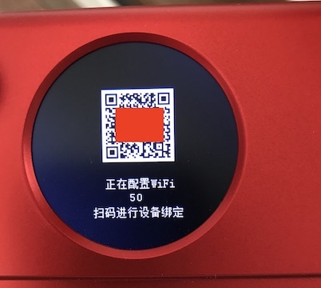
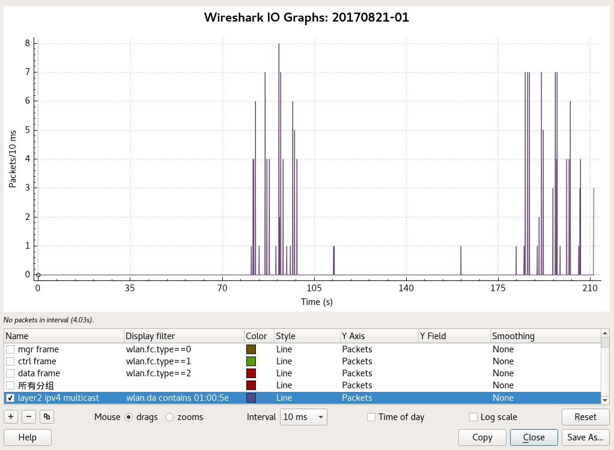
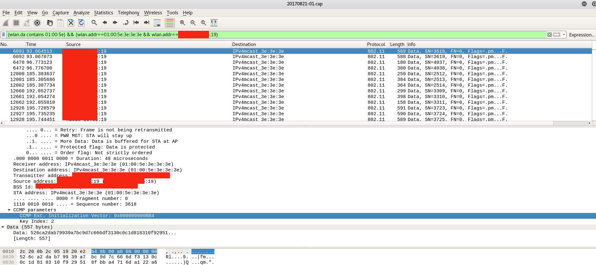
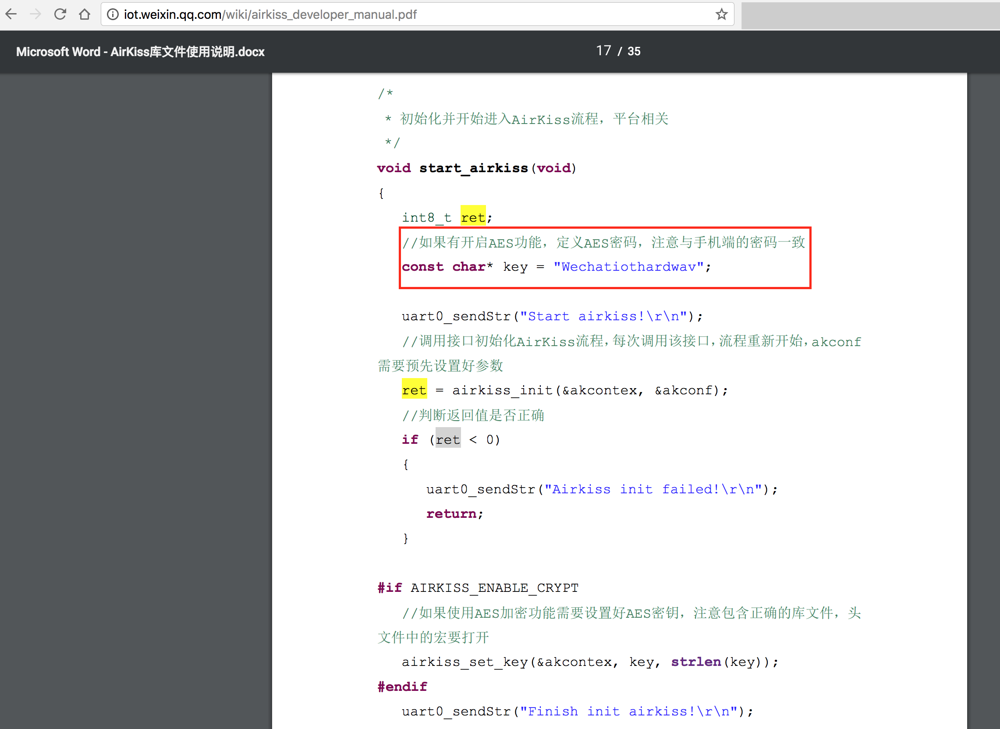

# 以WiFi协议为基础的物联网设备“联网初始化配置”分析手记

物联网已经在智能家居领域获得了重要的普及，电视、洗衣机、冰箱、空调等等纷纷开始上网。在这些设备中，电视由于天然就是一块大屏幕，所以对于电视联网的配置完全可以照搬电脑、手机等这些小屏幕设备的联网配置方式，但没有显示屏如洗衣机、冰箱和空调们怎么实现联入家里的无线网络，进而被手机控制，实现“智能家居”呢？

本小节的内容就尝试带领大家对以WiFi协议为基础的“无屏幕”或“无键盘输入设备”的设备如何实现上网配置一探究竟。

## 现状

目前流行的智能设备WiFi配置模式一般有以下2种:

1. 智能设备开启AP模式，手机处于Managed模式，手机连接智能设备的软AP后组成无线局域网。手机发送智能设备需要连接无线路由器的SSID及密码至智能设备，智能设备主动去连接指定无线路由器成功后，完成智能设备的互联网连接配置。

2. 一键配置模式：智能硬件内置的无线网卡开启混杂模式，监听网络中的所有报文。与智能设备配套的手机专用“配网”软件将SSID和密码编码到UDP报文中，通过无线广播包或组播包发送。智能设备接收到广播或组播报文后解码，得到正确的SSID和密码，然后主动连接指定SSID的无线路由器，完成智能设备的互联网连接配置。

以上两种方式都可以达到让智能设备连接至指定无线路由器的效果，但是AP模式需要用户**手动切换**手机当前连接的WiFi网络（手机上的软件通常没有权限或需要高系统权限才能帮助用户去主动切换正在连接的无线网络，大部分情况下App是没有权限静默切换用户正在连接的无线网络的），先连接智能设备的软AP网络，配置完成后再恢复连接正常WiFi网络，对普通用户来说操作较为复杂，需要一定的计算机使用经验和专业知识。

业界以TI为代表，率先研发出了真正“一键联网”解决方案：[SimpleLink™ Wi-Fi SmartConfig™ 技术](http://www.ti.com.cn/tool/cn/smartconfig#descriptionArea)

> TI 的 SimpleLink Wi-Fi CC3000 模块附带 TI 的独特 SmartConfig™ 技术，该技术是一步式 Wi-Fi 设置过程，允许多个家用设备快速高效地连接到 Wi-Fi 网络。考虑到应用通常没有用于输入 Wi-Fi 网络名称和密码的显示屏或键盘，SmartConfig 技术为最终用户提供了将其基于 CC3000 的设备轻松连接到接入点的能力。通过简单的 SmartConfig 技术接口，消费者只需利用简单的 Web 浏览器便可以使用 iOS 或 Android 智能手机/平板电脑或家庭 PC。此页上的软件可以访问 SmartConfig 库和应用程序源代码，以便您使用 TI 的 SmartConfig 技术创建自己的应用。

有意思的是，TI官方似乎并不愿意将这个技术“公开”出来，证据在这里：[TI官方上的一个问答贴](http://e2e.ti.com/support/wireless_connectivity/simplelink_wifi_cc3000/f/851/t/253463?tisearch=e2e-quicksearch&keymatch=smart%20config)，有意思的是前后有2名TI的员工宣称：SmartConfig传输SSID和密码的编解码算法是不可公开、受专利保护的。

>  First Yael Oz claims "the configuration algorithm is under patent thus can't be exposed".

> Then a second TI employee claims "the algorithm is proprietary. This is also for security purposes :)"

不过已经有网友将TI的这个“保密”编码方案给“破解”并公布了出来：[CC3000 Smart Config - transmitting SSID and keyphrase](http://depletionregion.blogspot.jp/2013/10/cc3000-smart-config-transmitting-ssid.html)

SmartConfig技术的核心思想可以归纳为：

1. 待配置的联网设备没有或只有有限的设备交互输入和输出能力（例如只有一个按键）
2. 由于不同的无线网络，有的启用了加密，有的没有启用加密。所以，从兼容性角度出发，SmartConfig技术设计的基本假设是：当前无线网络已经启用了加密机制；
3. 在一个已加密的无线网络中，组播和广播数据的负载都是已加密的。所以，试图通过UDP组播或广播的方式来传送数据给未联网设备是不可行的。但SmartConfig技术巧妙的利用了组播数据帧中的“数据长度”字段来“编码”SSID和密码数据，并且在需要的情况下，手机软件编码出的明文数据可以使用对称加密的方式加密后再编码到“数据长度”。至于对称加密算法则可以由设备制造商自己来预定义、硬编码到设备芯片和手机软件之中，秘钥的获取则可以借助设备唯一编号来进行云端查询的方式获取（仅仅是个人推测，TI官方并没有公布具体的编码和加密方案）。

除了SmartConfig技术之外，TI官网的Wiki上有一个[无线联网技术总结表格](http://processors.wiki.ti.com/index.php/Wireless_Connectivity)，这个表格也基本囊括了主要的物联网联网基础技术：

* 近距离/接触式
    * NFC/RFID
* 个人无线网络
    * 蓝牙/低功耗蓝牙
    * 私有2.4GHz协议
* 本地无线网络
    * ZigBee
    * 6LoWPAN
    * Wi-Fi
* 友邻无线网络
    * 私有1GHz以下频段协议

除此之外，还有一些厂商巧妙的利用了“声波”来编码发送和接收SSID和密码，实现智能设备联网。可见，物联网的“上网”方式并不是唯一的，也没有所谓标准的方式。当前的应用现状就是：八仙过海，各显神通，能让设备尽可能简单的“一键联网”就可以了。

## 以“汉王霾表N2”为例实战分析

汉王霾表N2是一款可以探测空气温度、湿度、PM2.5和甲醛指数的家用控制质量检测仪表，该设备具备联网功能，可以实时将仪表读数通过网络发送到手机软件上进行查看。以下是对该设备的首次联网过程进行分析的完整记录：

如下，前3张图对应手机软件上的向导式联网配置过程截图，第4张图是实拍的霾表N2上最后一步的状态拍照记录。




在手机软件开始配置N2联网之前，先使用`airodump-ng`进入监听模式抓包，基于先验的一些实验和调研，我们指定`airodump-ng`监听当前无线网络的工作channel进行定向监听（关闭`airodump-ng`的`channel hopping`模式，以保证尽可能100%捕获手机软件发送的所有数据包）：



上图是对应手机间隔一段时间2次配置N2联网过程的抓包统计可视化结果（如图，已设置了wireshark的``display filter``，无关数据没有在图中体现）。图中设备的``display filter``中用到的MAC地址前缀“01:00:5e”是[以太网协议规范中规定的2层可用组播地址前缀](https://en.wikipedia.org/wiki/IP_multicast)。

以下2张图展示了当前无线网络：启用了CCMP(AES)对称加密，每个数据帧中的初始化向量都是随机产生的。




最后这张图则按照抓包文件中的端到端通信数据帧数量逆序排序的收发数据统计结果。


使用`tshark`进一步分析抓包结果会发现：

```bash
# tshark -r 20170821-04.cap -Y '(wlan.addr contains 01:00:5e) && (wlan.sa == xx:xx:xx:xx:xx:19)' -n -T fields -e frame.number -e frame.time -e wlan.da -e data.len | head -n 10
4085    Aug 21, 2017 14:49:11.123380000 CST 01:00:5e:01:01:01   559
4086    Aug 21, 2017 14:49:11.123379000 CST 01:00:5e:01:01:01   558
4087    Aug 21, 2017 14:49:11.123892000 CST 01:00:5e:01:01:01   557
4088    Aug 21, 2017 14:49:11.126962000 CST 01:00:5e:01:01:01   556
4089    Aug 21, 2017 14:49:11.129522000 CST 01:00:5e:02:02:02   559
4090    Aug 21, 2017 14:49:11.132081000 CST 01:00:5e:02:02:02   558
4091    Aug 21, 2017 14:49:11.135155000 CST 01:00:5e:02:02:02   557
4092    Aug 21, 2017 14:49:11.137715000 CST 01:00:5e:02:02:02   556
4093    Aug 21, 2017 14:49:11.140274000 CST 01:00:5e:03:03:03   559
4094    Aug 21, 2017 14:49:11.142835000 CST 01:00:5e:03:03:03   558

# tshark -nr 20170821-04.cap -o wlan.enable_decryption:TRUE -o "uat:80211_keys:\"wpa-pwd\",\"ApPasswordHere\"" -Y 'udp && ip.addr==mobile_ip_here' -T fields -e 'frame.number' -e frame.time -e 'ip.dst' -e 'udp.length' | head -n 10
4085    Aug 21, 2017 14:49:11.123380000 CST 234.1.1.1   523
4086    Aug 21, 2017 14:49:11.123379000 CST 234.1.1.1   522
4087    Aug 21, 2017 14:49:11.123892000 CST 234.1.1.1   521
4088    Aug 21, 2017 14:49:11.126962000 CST 234.1.1.1   520
4089    Aug 21, 2017 14:49:11.129522000 CST 234.2.2.2   523
4090    Aug 21, 2017 14:49:11.132081000 CST 234.2.2.2   522
4091    Aug 21, 2017 14:49:11.135155000 CST 234.2.2.2   521
4092    Aug 21, 2017 14:49:11.137715000 CST 234.2.2.2   520
4093    Aug 21, 2017 14:49:11.140274000 CST 234.3.3.3   523
4094    Aug 21, 2017 14:49:11.142835000 CST 234.3.3.3   522
```

* 手机App使用的是UDP组播的方式发送设备“配网”数据；
* 数据链路层组播地址是固定``01:00:53``，顺序递增设置MAC地址后3字节。对应的，IP层组播地址是固定``234``前缀，顺序递增设置IP地址后3字节；
* （并非以上命令）我们分析的这个设备并没有一上来直接就开始发送编码后的“SSDI和密码”数据，而是通过周期性重复发送多组数据长度序列为559、558、557、556的数据帧，似乎在让待联网设备与手机软件进行时序“同步”；
* （并非以上命令）在完成“同步”阶段之后，会开始正式发送“SSID和密码”编码后的数据。完成一轮发送（100个数据帧）之后，再进行一次“同步”过程，然后继续重复发送“SSID和密码”编码后的数据（也可能是SSID和密码分开发送，或者是编码或加密算法之中有混淆算法，避免相同数据多次编码结果相同）；
* 验证了[CC3000 Smart Config - transmitting SSID and keyphrase](http://depletionregion.blogspot.jp/2013/10/cc3000-smart-config-transmitting-ssid.html)无法解码N2的手机端软件发送的数据，可能是私有的编码算法。


## 微信 | 硬件平台 之 AirKiss

国内的微信提出了名为[AirKiss](http://iot.weixin.qq.com/wiki/document-7_1.html)技术：

> AirKiss是微信硬件平台提供的一种WIFI设备快速入网配置技术，要使用微信客户端的方式配置设备入网，需要设备支持AirKiss技术。目前已经有越来越多的芯片和模块厂商，提供了支持AirKiss技术的方案。

其主要使用场景如下：

> 待接入互联网的设备不具备输入输出能力，如空调、空气净化器、烟雾报警器等。

> 用户不具备通过设备热点的方式进行配置的能力，如老人、家庭主妇等缺乏相关IT知识的用户人群。

为了避免官网文档更新导致无法查看，以下2张是官网当前的技术文档完整截图，可点击图片查看原图。

<a href="attach/smartconfig/airkiss-1.png"></a>

<a href="attach/smartconfig/airkiss-2.png"></a>

需要注意的是，AirKiss技术同时支持非加密和加密2种配网模式，这就意味着如果设备没有启用加密配网模式，则存在明文泄漏（虽然采取了编码方案，但由于有官网SDK，所以解码是可行的）当前网络加密口令的风险。即使设备启用了加密配网模式，但如果**照抄**了官方提供的示例代码，则很可能照搬了默认的加密口令：``Wechatiothardwav``

<a href="http://iot.weixin.qq.com/wiki/airkiss_developer_manual.pdf"></a>


## 延伸阅读

* [How does TI CC3000 wifi smart config work?](https://electronics.stackexchange.com/questions/61704/how-does-ti-cc3000-wifi-smart-config-work)
* [Smart Connect by TP-LINK](http://www.tp-link.com/common/Promo/en/Smart-Connect/Smart-Connect.html)

