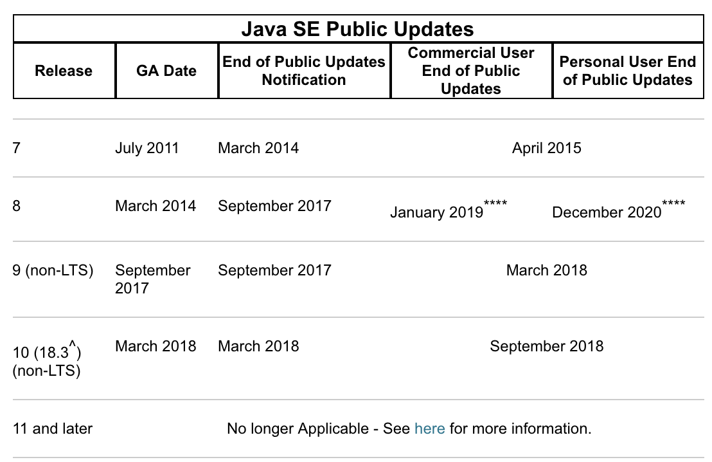
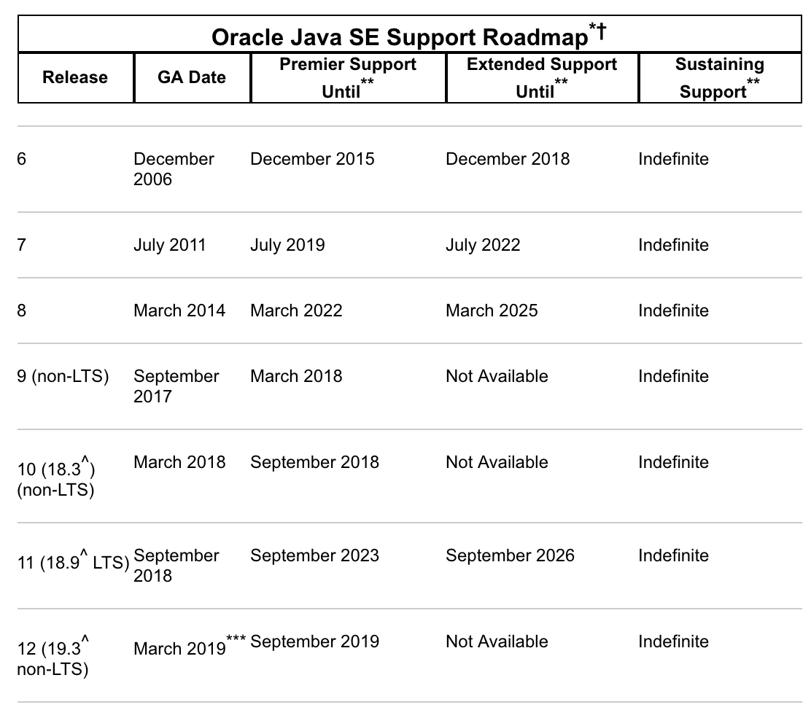
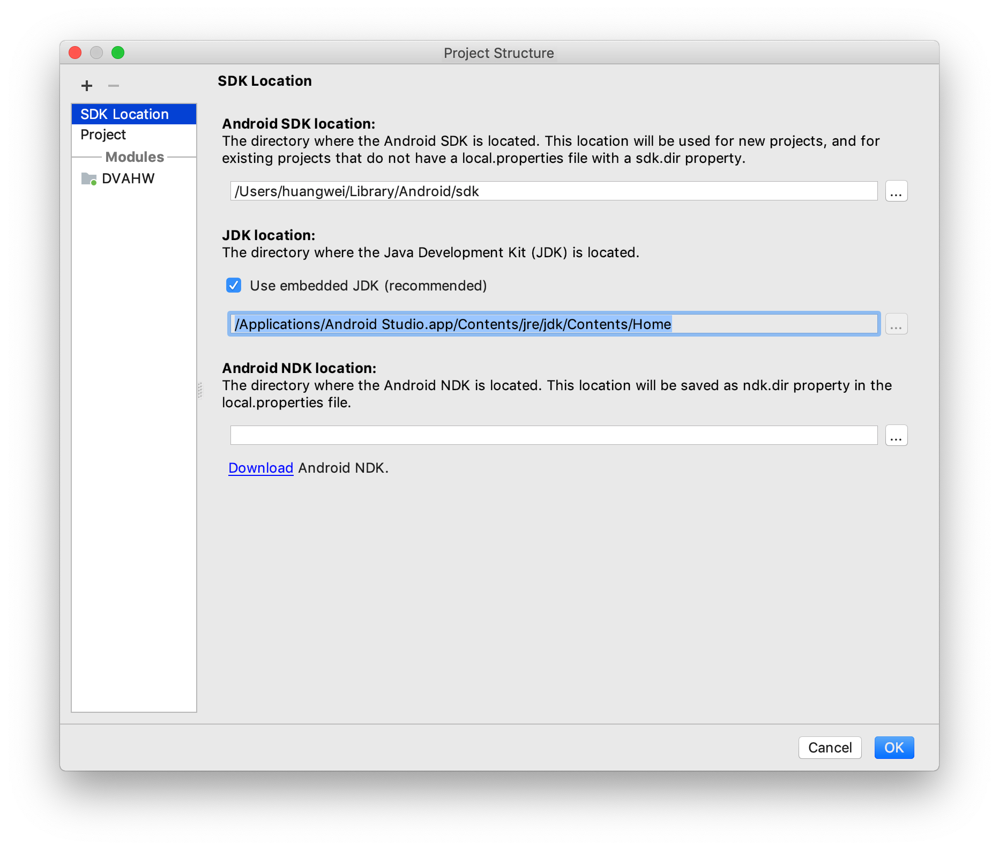
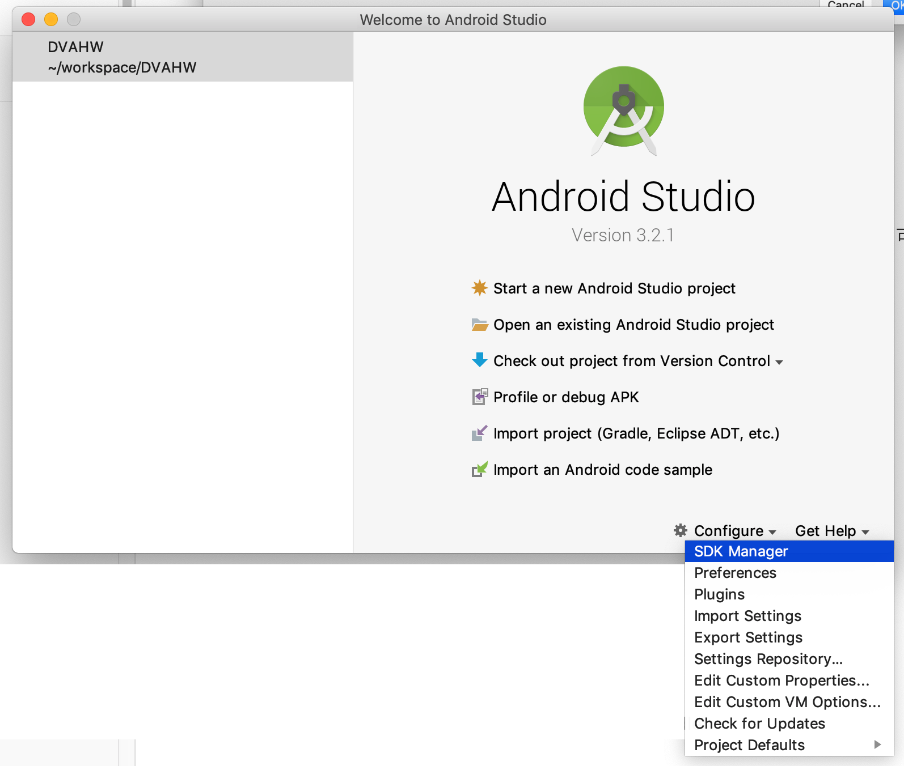
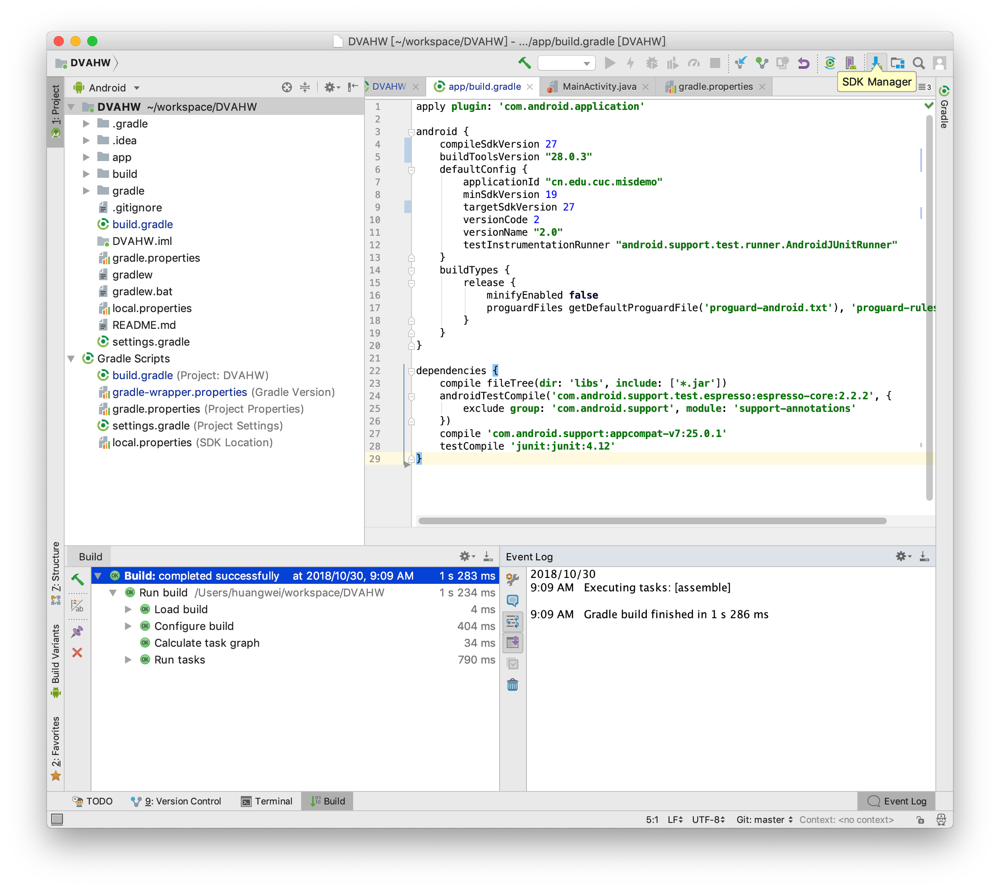
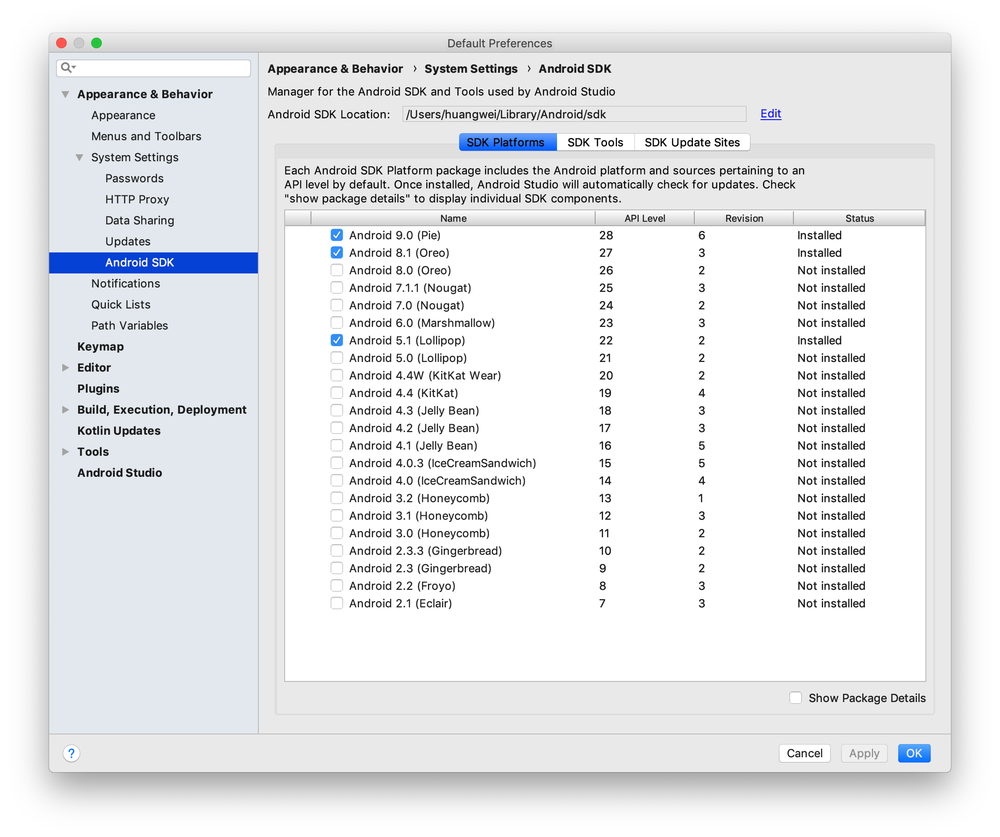
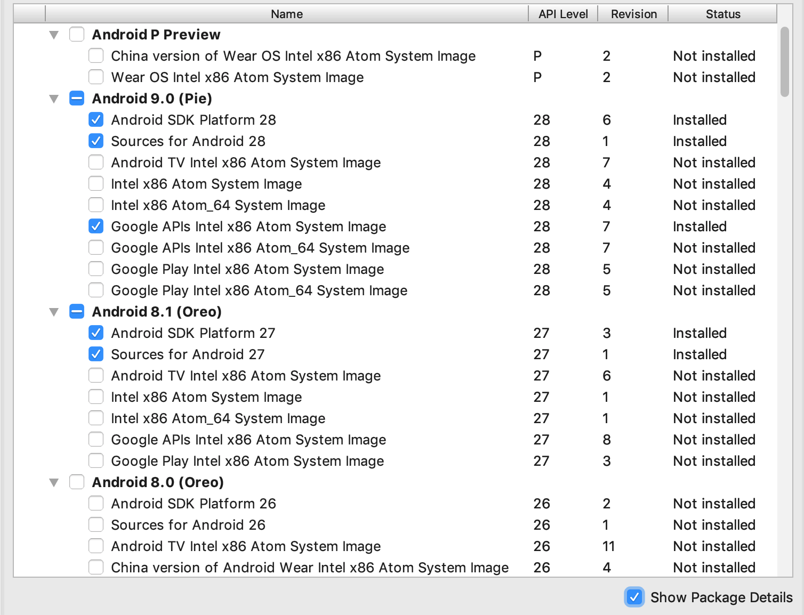
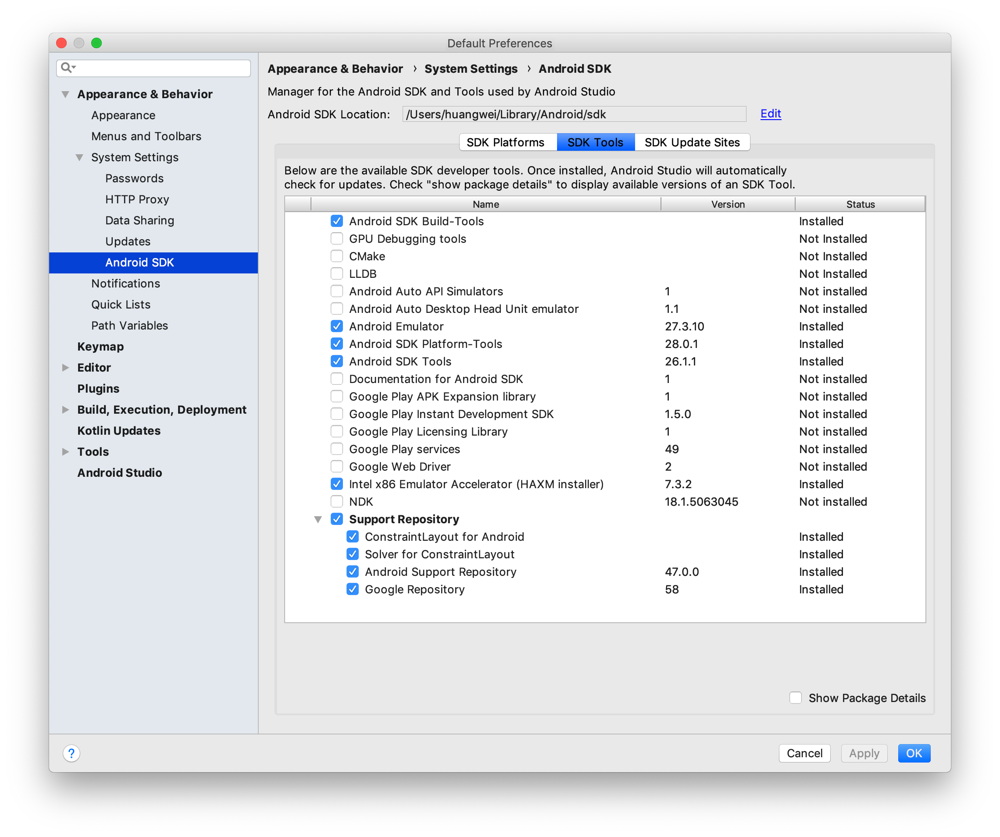

## 安装和配置 Java SDK 

如何选择 Java SDK 版本？参考 [Java 官方的版本支持计划](https://www.oracle.com/technetwork/java/javase/eol-135779.html)，首选 LTS（长期支持，Long-Term-Support ）版本，确保可获得足够长时间的官方维护和更新支持。

[按照 Java 官方的说法](https://blogs.oracle.com/java-platform-group/oracle-jdk-releases-for-java-11-and-later)，从 Java 11 开始，Oracle 将在 GPLv2 许可证下提供 JDK 版本，采用 Classpath Exception (GPLv2+CPE) 的方式，满足了在商业许可下使用 Oracle JDK 作为 Oracle 产品或服务的一部分，或者不想使用开源软件的需求。这种使用开源许可证和商业许可证的组合取代了历史上的“BCL”许可证，该许可证具有免费和付费商业条款的组合。

Android Studio 安装后已经内置了 Java 运行时环境，以 Android 3.2.1 为例，通过菜单 File -> Project Structure -> SDK Location 可以查看到 Android Studio 在编译当前项目时使用的 JDK 目录。

## 安装Android Studio

通过官方网站下载[Android Studio](https://developer.android.com/studio/) 最新版本并根据提示安装，安装 Android Studio 的过程中可能会提示联网下载更新 Android SDK。

## 下载安装 Android SDK

在启动 Android Studio 之后可以通过启动界面的菜单选项 Configure -> SDK Manager 启动 SDK Manager 。

或者通过在默认打开项目的视图工具菜单里找到 SDK Manager 按钮启动 SDK Manager。

SDK Manager 的 SDK Platforms 选项卡可以选择不同版本的 SDK 下载安装。

Android 版本号与 API Level 之间的对应关系见下图：

不同版本的 SDK Platforms 默认会被安装到 `$ANDROID_HOME/platforms/android-$APILevel` 。每一个版本的 [Platforms](https://developer.android.com/studio/releases/platforms) 通常包含以下组件:

* Android SDK Platform package. 用于构建目标 Android 系统版本应用所需工具。
* 若干系统镜像包，用于 Android 模拟器运行所需要的操作系统镜像。每个平台版本都会包含不同产品类型的定制版本镜像（例如手机，电视和可穿戴设备），每一种产品类型还可能按照支持的 CPU 架构差别细分出不同版本（例如，Intel x86 和 ARM EABI）。标记为 `Google APIs` 的镜像包含了访问 Google Play 服务的 API 支持，标记为 `Google Play` 的镜像内置了 Google Play 应用程序。
* Android 系统源代码。

在 SDK Platforms 选项卡中勾选 Show Package Details 可以进一步定制下载哪些系统组件，如下图所示：

SDK Tools 选项卡可以选择不同的开发者工具下载安装，关于该选项卡下推荐安装的软件包和图标状态说明请参考[官方帮助文档](https://developer.android.com/studio/intro/update#sdk-manager)。

Android [SDK Tools](https://developer.android.com/studio/command-line/#tools-sdk) 默认被安装到 `$ANDROID_HOME/tools`，包括一些常用的命令行辅助工具，如 avdmanager, sdkmanager, lint 等。

Android SDK [Platform-tools](https://developer.android.com/studio/command-line/#tools-platform) 默认被安装到 `$ANDROID_HOME/platform-tools`，这些工具会随着 android 系统版本的升级进行更新以支持新特性（通常是修复或改进工具），每次更新都是向后兼容旧版本。

Android SDK [Build-Tools](https://developer.android.com/studio/command-line/#tools-build) 默认被安装到 `$ANDROID_HOME/build-tools/$version/`。构建 Android 应用程序必须使用到这个软件包。这个软件包里的大部分工具不是直接提供给开发者使用的，而是在构建软件过程中被构建工具（例如 gradle ）自动调用。

## 配置 Android 模拟器运行环境

在 PC / Mac 上运行 Android 模拟器强烈建议必须安装 Intel x86 Emulator Accelerator (HAXM installer)，并且配合使用 ABI 类型为 x86/x86_64 的模拟器以获得最流畅的模拟器使用体验。 

在 Android 模拟器上运行应用请参阅[官方文档](https://developer.android.com/studio/run/emulator)。

## 配置 Gradle 编译环境

* gradle 版本和 Android Studio Gradle 插件版本
* 使用 Android Studio 的内置 gradle 还是使用自己安装的 gradle

