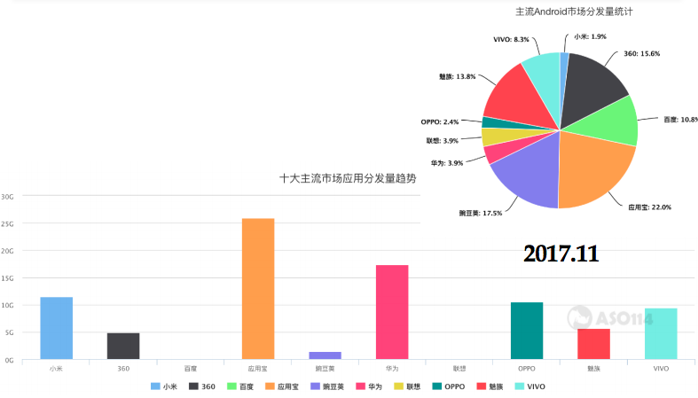
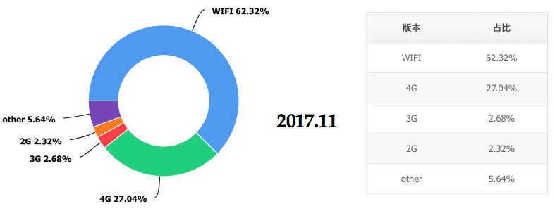
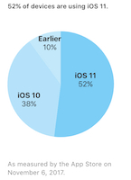
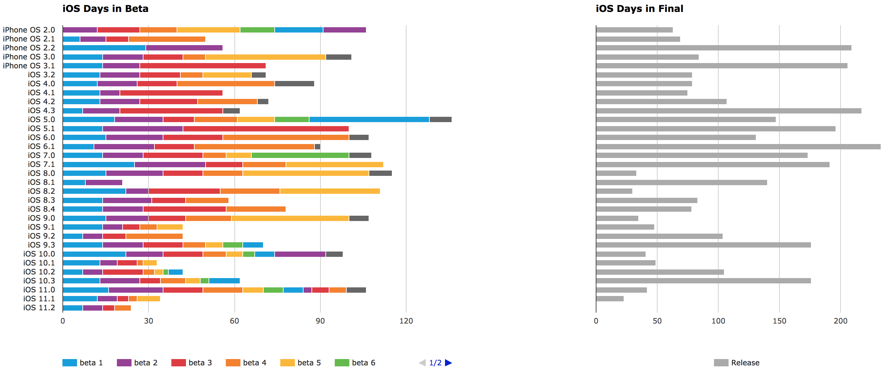
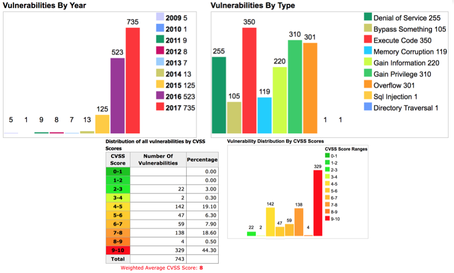

# 第五章 智能终端操作系统安全基础

根据 [《工信部电信研究院2014年移动互联网白皮书（2014年5月）》](http://www.catr.cn/kxyj/qwfb/bps/201405/t20140512_1017472.html) ，移动互联网已经成为最大的信息消费市场、最活跃的创新领域、最强的信息通信技术产业驱动力量。2013 年全球移动业务收入达到 1.6 万亿美元, 相当于全球 GDP 的 2.28%。全球智能手机出货量近 10 亿部,达到 PC 的 3 倍。移动互联网重构了互联网服务的模式与生态，全球应用程序下载次数累计超过 5000 亿。全球计算平台中移动操作系统的占比超过 50%。PC(Wintel) 主导的市场已经被智能终端(Android&iOS+ARM)所逐渐取代，视频、微博等主要互联网平台来自移动计算平台(Android/iOS)的流量超过 50%。

时间到了2017年，根据 [《互联网发展趋势报告 中国信息通信研究院 2017年1月》](http://www.caict.ac.cn/kxyj/qwfb/bps/201701/P020170110333987961362.pdf)，移动应用已步入平稳发展阶段，移动服务成为互联网服务主体。全球移动互联网增长步入 **平稳期**。全球人口红利正快速消失，行业转入平稳发展新阶段。产业互联网发展全球提速，**万物互联时代** 全面开启。从连接规模来看，全球联网设备数量保持高速增长，全面超越移动互联网设备数量，**工业互联网** 和 **车联网** 成两大热点。

从2014年到2017年这几年的发展来看，全球互联网正从“人人相联”（使用智能手机为代表的移动互联网）向“**万物互联**”（使用各种智能终端和丰富传感器组成的物联网）迈进。物联网推动互联网应用从消费领域向生产领域扩展，并逐步深入城市管理各环节。互联网逐步回归计算本源，进一步解放人脑的 **人工智能** 成为信息产业探索重心。互联网业务基础逻辑从“感知”，跃进至“理解与决策”，逐步具备自主“认知”能力。便携式的 **虚拟现实终端** 有望成为继移动智能终端后，重构互联网业务生态的下一代计算平台。

云计算、大数据和人工智能产业的发展促进了跨行业、跨地域的数据共享和流动。**数据** 流动一方面促进了价值释放，另一方面不规范流动行为严重威胁了数据主权和隐私安全。关键基础设施面临严峻的网络安全威胁，新兴技术产业逐渐成为网络安全攻防的重点领域，新兴的移动互联网安全研究对象包括了物联网终端与系统、云端数据、企业自带移动设备（BYOD）、智能家居和智能汽车等。

## 智能终端概述

### Android

如上图所示，Android系统生态圈支持的设备种类从手表、手机、平板电脑，到电视、汽车，应用领域非常广泛。

截止2017年11月，[根据Android官网的统计数据](https://developer.android.com/about/dashboards/index.html?hl=zh-cn)，全球安装了Android操作系统的设备分辨率分布情况如上图所示。上述统计表格中的小、正常、大和超大是Android对 ``屏幕尺寸`` 按屏幕对角测量的实际物理尺寸的一种简化分组标识方法。ldpi、mdpi、hdpi等则是Android的 ``屏幕密度`` 简记表示，表征的是屏幕物理区域中的像素量；通常称为 dpi（每英⼨ 点数）。例如， 与“正常”或“⾼”密度屏幕相比，“低”密度屏幕在给定
物理区域的像素较少。为简便起见，Android 将所有屏幕密度分组为六种通用密度：低（ldpi）、中（mdpi）、⾼（hdpi）、超⾼（xhdpi）、超超⾼（xxhdpi）和超超超⾼（xxxhdpi）。其他和Android支持设备屏幕尺⼨规范相关的几个概念如下：

* ⽅向，从用户视角看屏幕的⽅向，即横屏还是竖屏，分别表示屏幕的纵横比是宽还是⾼。请注意，不仅不同的设备默认以不同的⽅向操作，⽽且⽅向在运⾏时可随着用户旋转设备⽽改变；
* 分辨率，屏幕上物理像素的总数。添加对多种屏幕的支持时，应用不会直接使用分辨率；⽽只应关注通用尺⼨和密度组指定的屏幕尺⼨及密度；
* 密度⽆关像素 (dp)，在定义 UI 布局时应使用的虚拟像素单位，用于以密度⽆关⽅式表示布局维度或位置。

上图是[2017年11月来自腾讯移动分析的展现统计设备的分辨率进分布比例的按月趋势变化统计图](https://mta.qq.com/mta/data/device/resolution) ，和全球的统计数据相比，国内的Android设备的主流分辨率相对更集中，碎片化现象要优于全球统计数据。

截止2017年11月，[根据Android官网的统计数据](https://developer.android.com/about/dashboards/index.html?hl=zh-cn)，Android操作系统的不同版本的市场占有率分布如上图所示。一句话描述这个分布率现状就是：新版本系统更新部署到终端设备周期较长。以KitKat（4.4）版本为例，正式发布于2013年10月31日，但是到2017年11月，全球范围内仍然有13.8%的设备还在运行着4年前的“旧”系统。

与此类似的是，根据[2017年11月来自腾讯移动分析的国内Android设备操作系统版本最新分布和按月趋势变化统计图](https://mta.qq.com/mta/data/device/resolution) ，国内在同一时期的KitKat版本系统占有率达到了17.05%，高于全球数据。与此同时，新版本Android系统的普及部署增长缓慢（注意，图中的``25``是指的Android SDK API版本，对应Android 7.1。其他Android版本号与API Level之间的对应关系见下图）。

如上图所示是Android的系统组成结构图，从图中我们可以看到：Linux内核和大量第三方开源组件支撑了Android底层关键技术构建。所以，我们在探讨和研究Android系统安全的时候，不能忽略这些外部项目和上游项目的代码安全性问题完全有可能影响到Android系统中的其他专属组件或模块。

国内的Android系统由于政策法规的限制原因，无法使用Google官方所有内置系统服务，其中就包括无法使用Google官方应用商店。各个设备制造商或第三方操作系统定制开发服务提供商会用自己或其他第三方应用市场来向用户提供内置的应用市场服务。根据国内App推广服务平台[ASO114 2017年11月的统计数据](https://aso114.com/android/rank-overview.html)，目前国内主流的应用分发渠道有不下十家，大部分都已经在手机出厂时内置在系统里。除了这些主流分发渠道，第三⽅安卓应用市场数量大且良莠不齐，由于每天新增待审核APP数量巨⼤，⼈⼯审查存在疏漏，自动化审查存在技术局限性，一些规模较⼤的第三⽅市场的APP上架审查机制不严格，导致用户从这些应用市场搜索、下载安装App的时候，也会安装了非官方版甚至是恶意软件。[上一章中，我们已经提到了BlueBorne扫描器在Google Play中刚上线不久就被发现山寨仿冒应用](../chap0x04/main.md)，严格如Google Play的应用上架审核都会存在疏漏，更不用说一些本来就对应用上架审核的安全扫描、安全评估不够重视或缺乏技术能力的第三方应用市场了。来自应用分发渠道的真实威胁不能被忽视，这是一个值得深入研究的应用和运维安全方向。

Android生态圈中的厂商可以在获得Google官⽅授权允许后，制造所有类型设备。Android系统基于开源授权协议标准自⾏修改和使用。第三方和自建Android应用分发渠道Google官⽅既未授权允许，也未明令禁⽌。一些⼭寨机厂商在看到了这个高度开放和可定制化的生态圈之后，在手机出厂时、销售环节就被『刷⼊』恶意代码，这种威胁方式目前被统称为“来自供应链的威胁”。

根据[2017年11月来自腾讯移动分析的国内安卓系统联网方式统计](https://mta.qq.com/mta/data/device/resolution)，通过Wi-Fi上网的用户依然占有60%以上的比例，这就意味着Wi-Fi安全依然是移动互联网安全的一个重要组成部分，我们在前三章所讲述的内容就是围绕Wi-Fi安全的方方面面，从协议安全到动手实践安全攻防。

小结一下目前Android生态圈的一些特点：

* Google主导的全面开放生态圈，从源代码到文档，通过开放源代码授权的方式（Android 开放源代码项目所有组成部分的首选许可是[Apache 2.0许可](https://www.apache.org/licenses/LICENSE-2.0)）向全球商业化公司开放了绝大部分的源代码、文档和开发过程。但请注意，相关开源许可并未涵盖专有商标和品牌特征授权（例如这种特殊样式的字体徽标）。

> Apache 2.0 是适用于开放源代码的商业软件许可。大多数 Android 平台和文档都是根据 Apache 2.0 许可授权用户使用。尽管该项目会尽可能遵循此首选许可，但也可能存在例外情况，例如，如果文档（代码注释）的提取来源是根据 GPLv2 或其他许可授权的源代码模块。在这些情况下，源代码模块所遵循的许可将适用于从源代码模块中提取的文档。

* 以Android操作系统为核心的全面多行业发展，全球范围内从硬件设备制造商、互联网软件服务提供商、电信运营商等多个行业深度参与；
* 多样化的设备、系统与应用，小到手表、手机、平板电脑等，大到智能电视、智能汽车等，Google Play应用市场中的独立App[数量从2009年时的16000个增长到2017年9月的3,300,000个](https://www.statista.com/statistics/266210/number-of-available-applications-in-the-google-play-store/)，无论是绝对数量还是数量增长率都体现了Android应用生态圈的繁荣发展；
* 开发者要面临碎片化应用运行平台，由于市场上大量设备不能及时更新到最新版本的系统，应用开发者在开发应用时就不得不做大量旧版本兼容性开发和测试工作。而对于企业级应用来说，一年一次大的Android系统版本更新，在选择使用最新特性和继续坚守已被证明的稳定可用性方面面临抉择；
* 国内消费者目前（截止2017年12月）只能使用定制化的安卓系统，一方面无法及时升级系统和安装系统级别的安全更新。另一方面，大多数设备厂商只知道每年推出多款新设备，却普遍忽视对已有设备上系统的持续更新维护或更新维护周期较短（1年左右）。

### iOS

iOS是苹果公司为移动设备所开发的专有操作系统，所支持的设备包括iPhone、iPod touch和iPad。与Android不同，iOS不支持任何非苹果的硬件设备。除了iOS，苹果公司生产的智能电视使用的是专有操作系统tvOS，智能手表使用的专用操作系统watchOS。

在2017年8月底的腾讯安全国际技术峰会上，[Corellium 创始人分享了 iOS 虚拟化这个新鲜议题](http://www.freebuf.com/fevents/146209.html) ，同时在现场一并公开了 iOS 虚拟化的最新研究成果。他介绍的 Virtual.al TK1 demo box 可以虚拟化 iphone3、4、4s，而他们的 CHARM设计（Corellium Hypervisor for ARM）还可以支持 iPhone 6 和 iPhone 7 的虚拟化。目前相关成果除了在一些新闻报道中可见之外，Corellium 还没有公布更多技术细节或公开产品源代码。一旦移动虚拟化技术成熟，一方面意味着iOS系统和硬件的强相关和绑定将被严重松动，更多高性能的Android计算设备将可以用于运行iOS，另一方面，有了这样的虚拟化设备，在进行安全研究的时候，逆向iOS 会变得轻松起来。通过虚拟化攻击，甚至可以直接通过 IDA Pro 进行深入研究，对于 iOS 逆向研究会有帮助。

根据苹果官方App Store的统计数据，截止2017年11月6日，全球iOS系统版本分布统计情况如上图所示：当前最新的iOS 11已经达到了52%的设备普及率，远远高于同期Android最新的Android 8.0系统的设备普及率（0.3%）。不过，与之形成对比的是，根据[同期 腾讯移动分析的国内iOS设备系统版本统计数据](https://mta.qq.com/mta/data/device/os)，如下图所示，iOS 11在2017年11月的设备普及率合计（iOS 11.0.3、11.0.2、11.1和11.1.1）刚刚超过30%。

从iOS系统的迭代更新速度来看，iOS系统的开发和发布采取的是快速迭代和快速发布的策略，大多数正式发布版的寿命只有50天左右，尤其是从iOS 8开始，只有少数版本的寿命达到了150天以上。版本快速迭代的其中一个重要原因就是软件的bug数量越来越多，系统的健壮性相比较于PC时代的Windows系统差距较大。

iOS系统的基本组成分为从底层到顶层依次为：Core OS、Core Services、Media和Cocoa Touch。其中，[Core OS 是基于 FreeBSD 和 Mach 所改写的 Darwin](https://developer.apple.com/opensource/) ，是开源、符合 POSIX 标准的一个 Unix 核心。提供了整个 iOS 的一些基础功能。例如：硬件驱动，内存管理，程序管理，线程管理（POSIX），文件系统，网络（BSD Socket），以及标准输入输出等等。所有这些功能都会通过C语言的API来提供。Core OS层的驱动也提供了硬件和系统框架之间的接口。然而，由于安全的考虑，只有有限的系统框架类能访问内核和驱动。

iOS生态圈相比较于Android生态圈的一个最显著特点就是：封闭。汽车、智能家居领域设备制造商需要获得苹果官方授权才可以生产和销售搭载苹果操作系统的设备，智能手机只有苹果自己公司在生产和销售。移动操作系统是苹果官方独立、唯一在维护（系统中用到的一些第三方开源组件除外）。苹果官方未授权允许任何第三方应用商店，仅允许企业级应用的自行分发和授权模式，在消费者领域苹果保持了应用分发渠道的唯一性。

小结一下iOS为代表的苹果移动互联生态圈，可以概括为如下特点：

* 苹果强势主导的授权有限开放生态圈；
* 消费级应用商业变现能力目前强于Android生态圈；
* 应用多样性发展逐渐落后于Android生态圈，例如在电视、盒子、投影设备、智能家居等领域的市场占有率要落后于Android生态圈。

## iOS系统安全概述

根据[第三方统计机构对CVE漏洞数据库中的历年iOS系统的漏洞数据统计如上图所示](http://www.cvedetails.com/product/15556/Apple-Iphone-Os.html?vendor_id=49)

由于iOS底层的[Core OS 是基于 FreeBSD 和 Mach 所改写的 Darwin](https://developer.apple.com/opensource/) ，所以FreeBSD的相关漏洞在某些条件下也会影响到iOS，上图中统计的CVE漏洞数据库中的FreeBSD相关漏洞数据也可以用来让我们了解iOS系统的安全基础现状和历史变化情况。

现代操作系统的版本升级发展历程，普遍经历了一个从对安全漠视，到引起重视，到投入具体资源去进行安全设计和安全加固实现，最终将安全评估、安全检测和安全加固等内置在整个产品迭代的生命周期之中每个阶段。回顾iOS系统的版本变更记录，我们能够找到iOS系统的系统安全加固路径，可以让我们更好的了解移动终端上的安全攻防发展历程。同时，通过对系统加固策略的选择与设计实现，我们可以更好的认识到移动终端面临的主要安全威胁有哪些，同时，掌握系统级别的一些最佳安全实践和安全加固方法，有助于我们编写出更加健壮和符合标准的安全的应用程序。以下整理了iOS系统各个版本引入的主要安全特性或新增特性带来的新型安全威胁：

* iOS 4
    * 禁止第三方程序访问所有通话历史
    * 禁止第三方程序拦截呼入和呼出的通话
    * GPS定位功能需要用户明确授权
    * <del>限制后台联网程序种类（只允许音乐、VoIP类应用在后台运行）</del>，iOS 7 开始系统放宽后台静默和联网程序的限制
    * 限制后台静默运行程序（音乐、GPS 、VoIP 、消息推送守护程序以及周边配件附属的程序）
    * 系统相机拍摄的照片默认包含GPS位置信息，如果图片未经处理上传到第三方网站或发送给他人，会暴露照片的拍摄位置信息；
* iOS 5
    * 禁止第三方程序访问短信收件箱和后台静默发送短信
    * 推出了iMessage服务，并且很快被黑产盯上，用来群发垃圾信息（通过手机号或电子邮件地址，只要接收者启用了iMessage并绑定了手机号或电子邮件地）；
* iOS 6
    * 第三方程序访问通讯录、日历、照片需要用户明确授权
* iOS 7
    * iphone5s引入Touch ID，支持指纹解锁
    * 设备激活强制使用Apple ID并联网认证身份，防止设备被盗、恶意清空数据和设置等
    * USB首次连接时双向身份认证，只有用户处于屏幕解锁状态时，才可以点击信任当前USB连接的电脑（无需输入锁屏密码），杜绝通过USB植入恶意代码
    * 原生通讯录支持设置电话号码黑名单
* iOS 8
    * 开放系统全局的第三方输入法，在此之前，系统没有给第三方输入法开放编程接口
    * 允许第三方程序使用Touch ID来进行身份认证
    * iOS 8 设备在扫描WiFi 时，系统会使用随机的 MAC 地址来防止设备被跟踪，只有在连接成功后才会使用真正的设备物理MAC地址
    * 系统相册在删除照片时，默认是将照片移动到“最近删除”的相册并保留30天后再自动真删除。避免用户误删除照片的同时，可能会导致一些秘密和隐私照片没有被及时删除，其他人一旦可以物理接触到手机，就可以从“最近删除”的相册中恢复出照片。这是一个典型的产品机密性和可用性矛盾调和、妥协的设计与实现；
    * 黑产利用新增的 **iOS日历邀请** 功能群发垃圾信息，这种日历弹窗小广告，不显示来源，仅仅显示广告内容、发送人和一个时段。我们往往会下意识地点击「拒绝」，但没想到这个小动作就能把自己的个人名字泄露了给对方。保留iCloud日历同步功能的同时，防止垃圾邀请充斥日历的操作方法如下：
        1. 登陆iCloud
        2. 左下角齿轮-偏好设置-高级：邀请，选择发送电子邮件给XXX邮箱，保存
        3. 点击编辑，点击＋ 完成
        4. 选择想删除的事件，在弹出框标题旁的颜色点上单击，选择新建的分类，保存
        5. 点击编辑，点击新建分类旁边的－，删除分类，确定这样垃圾事件就被删除了，以后的事件邀请会发送到邮箱，然后使用邮箱的垃圾邮件屏蔽设置即可。

* iOS 10
    * iOS 10.3推出了iCloud照片分享功能，黑产利用该功能强制推送包含广告和垃圾信息的相册，其基本原理和iMessage垃圾信息类似。除了系统内置反垃圾信息功能并持续改进之外，普通用户如果深受垃圾信息骚扰只能选择禁用“iCloud照片分享”功能；
* iOS 11
    * 位置信息访问控制更精细，iOS 10上的App开发者可以选择向用户隐藏“使用应用时访问位置信息”选项，iOS 11开始这个选项无法再被隐藏
    * 照片库访问控制允许开发者申请只读访问授权
    * 手机即使处于解锁状态通过数据线缆连接到一台陌生电脑时依然需要 **输入设备解锁口令** 才能信任这台电脑（原先只需要在解锁的手机上点击“允许”按钮）
    * 强制已有的iCloud账户启用 **双因素认证** 来代替原先的“**两步认证**”
    * 通过控制中心“关闭”Wi-Fi开关并不是真的关闭Wi-Fi功能，只是让当前设备从当前连接的任何网络断开
    * 当通过控制中心停用 Wi-Fi 后，自动加入附近任何 Wi-Fi 网络的功能也会被停用，直到：**您步行或驾车到新位置** 和 **当地时间凌晨 5 点** 。这就意味着，``EvilTwin`` 类攻击对于iOS手机用户将有更多机会得手，因为用户手机的Wi-Fi功能将会随着用户位置的变化、系统时间的变化而自动被系统强制开启。
* 2013.5
    * App Store审核标准中新增对App读取设备MAC地址的禁令

从iOS 5开始，几乎每次系统更新后，都会引入新的锁屏绕过类漏洞，在[CVE漏洞数据库中有记录的就有如下二十条](http://www.cvedetails.com/vulnerability-list.php?vendor_id=49&product_id=15556&version_id=&page=3&hasexp=0&opdos=0&opec=0&opov=0&opcsrf=0&opgpriv=0&opsqli=0&opxss=0&opdirt=0&opmemc=0&ophttprs=0&opbyp=1&opfileinc=0&opginf=0&cvssscoremin=0&cvssscoremax=0&year=0&month=0&cweid=0&order=1&trc=112&sha=4918ceca8eeb00256920025cdf494c6acf16c4cf)：

* iOS 9.2 CVE-2015-7080
* iOS 9 CVE-2015-5892
* iOS 9 CVE-2015-5861
* iOS 8.1.1 CVE-2014-4463
* iOS 8.1.1 CVE-2014-4451
* iOS 7.1.2 CVE-2014-1360
* iOS 7.1.2 CVE-2014-1353
* iOS 7.1.2 CVE-2014-1351
* iOS 6 CVE-2012-3736
* iOS 6 CVE-2012-3738
* iOS 6 CVE-2012-3739
* iOS 6 CVE-2012-3740
* iOS 5.1 CVE-2012-0644
* iOS 6.0.1 CVE-2012-3750
* iOS 6.1.3 CVE-2013-0980
* iOS 7.0.3 CVE-2013-5144
* iOS 7 CVE-2013-5147
* iOS 7.0.2 CVE-2013-5160
* iOS 7.0.2 CVE-2013-5161
* iOS 7.0.3 CVE-2013-5162

综上，我们发现iOS系统自2015年以来相关漏洞的数量呈现快速增长的态势，这种增长和设备本身的销售和市场保有量增长、系统功能和代码行数的增长以及安全研究投入的增长均有正相关性。

## Android系统安全概述

根据[第三方统计机构对CVE漏洞数据库中的历年Android系统的漏洞数据统计如上图所示](http://www.cvedetails.com/product/19997/Google-Android.html?vendor_id=1224)。

由于Android底层基于Linux内核，所以Linux内核的相关漏洞在某些条件下也会影响到Android，上图中统计的CVE漏洞数据库中的Linux内核相关漏洞数据也可以用来让我们了解Android系统的安全基础现状和历史变化情况。

以下整理了Android系统各个版本引入的主要安全特性或新增特性带来的新型安全威胁：

* Cupcake 1.5，基于ProPolice防止缓冲区溢出攻击，增强内存管理的安全性；
* Froyo (冻酸奶) 2.2，引入安卓设备管理API，支持企业级安全策略实现；
* Gingerbread （姜饼）2.3，引入mmap_min_addr机制防御权限提升类攻击；
* Honeycomb 3.0，文件系统加密。用户口令存储使用更安全的加盐散列算法，对抗暴力破解和还原口令类攻击；
* Ice Cream Sandwich 4.0，实现地址空间随机化（ASLR），对抗内存破坏类攻击。引入KeyChain机制，改进用户密钥存储和证书管理；
* Jelly Bean 4.2，APP使用短信发送权限需要得到用户的显式授权同意。支持应用验证API，安全类APP可以基于此API对APK的下载、安装进行检查和拦截。4.2.2版本引入了“安全USB调试”机制（真机ADB连接强制 **单向身份认证** ：手机认证PC机身份）；
* KitKat 4.4，禁止第三方APP获取电池使用量信息，避免恶意程序恶意消耗手机电量；
* Lolipop 5.0，使用ART 运行时取代 Dalvik 成为平台默认设置。通知现在显示在用户的锁定屏幕上。用户可以选择保护敏感信息不被公开，此时系统会自动删减通知显示的文本。引入了对 64 位系统的支持，64 位支持也可改进用于加密的 OpenSSL 的性能。WebView默认情况下，系统会阻止混合内容和第三方 Cookie。TLSv1.2 和 TLSv1.1 协议现已启用。MD5、3DES、导出和静态密钥 ECDH 加密套件现已停用。首选使用前向保密性（ Forward Secrecy ）加密套件（ECDHE 和 DHE）。
* Marshmallow 6.0，用户可直接在运行时管理应用权限。这种模式让用户能够更好地了解和控制权限，同时为应用开发者精简了安装和自动更新过程。用户可为所安装的各个应用分别授予或撤销权限。对于使用 WLAN API 和 Bluetooth API 的应用，Android 移除了对设备本地硬件标识符的编程访问权。``WifiInfo.getMacAddress()`` 方法和 ``BluetoothAdapter.getAddress()`` 方法现在会返回常量值 ``02:00:00:00:00:00`` 。当运行 Android 6.0（API 级别 23）的设备发起后台 WLAN 或蓝牙扫描时，在外部设备看来，该操作的发起来源是一个 **随机化 MAC 地址**。
* Nougat 7.0，移除了三项隐式广播，以帮助优化内存使用和电量消耗。为了提高私有文件的安全性，面向 Android 7.0 或更高版本的应用私有目录被限制访问(``0700``)。名为 Crypto 的 JCA 提供程序已弃用，因为它仅有的 SHA1PRNG 算法为弱加密。应用无法再使用 SHA1PRNG（不安全地）派生密钥。对于面向 Android 7.0 的应用，Android 框架执行的 StrictMode API 政策禁止在应用外部公开 ``file:// URI``。
* Oreo 8.0，后台执行限制（默认情况下，这些限制仅适用于针对 O 的应用。不过，用户可以从 Settings 屏幕为任意应用启用这些限制，即使应用并不是以 O 为目标平台）。后台应用接收位置更新频率被降低。实现 HttpsURLConnection 时不会执行不安全的 TLS/SSL 协议版本回退，不再支持 SSLv3。使用安全计算 (``SECCOMP``) 过滤器来过滤所有应用。允许的系统调用列表仅限于通过 ``bionic`` 公开的系统调用。应用的 ``WebView`` 对象将在多进程模式下运行。网页内容在独立的进程中处理，此进程与包含应用的进程相隔离，以提高安全性。在相同设备上运行但具有不同签署密钥的应用将不会再看到相同的 Android ID（即使对于同一用户来说，也是如此）。只要签署密钥相同（并且应用未在 OTA 之前安装到某个版本的 O），``ANDROID_ID`` 的值在软件包卸载或重新安装时就不会发生变化。即使系统更新导致软件包签署密钥发生变化，``ANDROID_ID`` 的值也不会变化。查询 ``net.hostname`` 系统属性返回的结果为空，系统属性 ``net.dns1``、``net.dns2``、``net.dns3`` 和 ``net.dns4`` 不再可用。如果应用请求 ``READ_CONTACTS`` 权限，查询联系人的使用情况数据得到的是 **近似值** 而不是精确值。

### 系统安全评估方法

在了解了iOS和Android系统的CVE漏洞数据库中的历年漏洞数据统计信息之后，我们可以根据一个系统（历史上出现的）漏洞数量的多少来评估系统安全性吗？可以根据系统中（历史）包含漏洞的CVSS评分统计量（总和、平均值）高低来评估系统安全性吗？要想回答好这个问题，我们需要运用风险评估的基本理论和方法，从系统整体出发，从不同角度出发来评估系统安全性。

首先，信息安全的本质是持续对抗，信息资产的价值高低会影响攻击者的攻击目标选择策略。市场占有率高、用户基数大的系统和应用软件会吸引到更多的攻击技术研究者，研究和挖掘漏洞参与度的提升，一方面意味着漏洞被隐藏的可能性越低、漏洞被尽早曝光的可能性越高，另一方面系统和应用软件开发团队需要时间去深入研究和落地应用安全加固策略和措施，所以反映在公开漏洞数量和严重性程度（例如CVSS平均分）随时间变化曲线方面会经历一个从上升到下降到相对平稳运行的阶段。

其次，漏洞数量和软件代码行数成非线性正相关性比例，虽然[不同安全开发水平的团队开发出来的软件的“漏洞密度”（每千行代码包含漏洞的数量）有差异](http://www.freebuf.com/articles/terminal/149575.html) ，但总体上随着代码行数的增加，软件包含的漏洞数量也会随之增长。从软件规模的角度来看，大型软件、操作系统中包含漏洞的数量是要大于小型软件和简单功能软件的，只是是否被曝光和曝光时间的早晚问题。

再者，单一的漏洞数量指标无法说明系统面临的威胁多少和风险高低。首先，漏洞的生命周期管理方法会影响到实际漏洞的发现和利用难度。例如对于开源和闭源软件来说，同样的漏洞保密和曝光周期条件下，开源软件由于开发过程的完全透明化，更容易通过源代码补丁比对的方式发现0-day漏洞（厂商还未推送补丁）并以相对最低的时间和人力成本开发出漏洞利用程序。而闭源软件就无法使用源代码补丁比对技术发现0-day漏洞，需要通过分析成本更高的二进制补丁比对技术在厂商推送补丁程序之后（N-day）才能发现漏洞。其次，单一漏洞对系统安全性的威胁等级是有差别的，例如，远程任意代码执行类漏洞对系统完整性和机密性的破坏性程度会受到实际攻击过程是否需要通过身份认证、是否需要高权限账户等制约。最后，系统的安全性评估是要结合系统的具体安全需求来进行评估的。如果一个漏洞被利用并不会影响到系统的具体安全需求，那么，这样的单个漏洞是无法影响系统整体安全性的。

不仅如此，系统的安全性评估是一个**系统工程**，不能简单的将系统中各个组件的漏洞CVSS评分进行统计（累加或求均值或求最大最小值等）。CVSS是针对单一漏洞危害的评价指标，而实际的网络与系统攻击过程往往是多个漏洞的组合利用过程，多个低危漏洞的优化组合同样可能会对企业网络和系统带来致命一击。根据信息系统安全评估的“木桶原理”，系统整体安全性高低取决于系统中最短板的安全性水平，换句话来说高危漏洞的存在性会显著降低系统整体安全性。但高危漏洞的存在性如果不能转化为一次成功的漏洞利用过程（由于各种安全机制的保护），则对于系统整体安全性目标保护而言，高危漏洞并没有降低系统的安全性。除此之外，漏洞的生命周期管理方法、开源或闭源软件开发模式、系统具体如何使用和部署缺陷组件的方法等，都会影响到系统安全性的评估结果。

最后，已修复的漏洞即使被公开，只要被评估系统已经安装了对应的安全补丁，那么历史上出现的漏洞数量再多也不会影响到当前系统的安全性。

### Android VS. iOS 面临的威胁

| 威胁 | iOS | Android |
|------|---|---|
| 钓鱼及鱼叉式(定向)钓鱼，(邮件、网页、文件) | √ | √ |
| 短信欺诈 (钓鱼) | √ | √ |
| 应用欺诈 (钓鱼) | √ | √ |
| 盗取上传通讯录 | √ | √ |
| 越狱、root、越狱伪装 | √ | √ |
| SSL漏洞利用 | √ | √ |
| 恶意配置文件 | √ | - |
| 邮件附件未加密 | √ | √ |
| 勒索软件 | √ | √ |
| 备份(数据)劫持 | √ | √ |
| 系统(设备)碎片化 | - | √ |
| 非官方应用(恶意捆绑) | √* | √ |
| 通话和短信记录上传 | - | √ |

#### iOS 上的企业级应用分发方式风险

苹果的应用分发授权模式主要有2种，分别是个人应用和企业级应用。个人应用，必须且仅允许通过App Store审核通过后允许消费者下载安装使用。企业级应用，无需App Store审核，消费者可以直接下载安装使用。如果企业作恶或者企业的分发证书被盗取滥用呢？**假面攻击** 最早是在 2014 年 7 月由FireEye移动安全人员提交，通过使用企业账户安装App，替代通过苹果官方App Store安装的App应用，该漏洞只要替换的应用程序使用了和App Store安装的应用程序有相同的 ``bundle identifier``，即可完成IPA安装程序的替换。假面攻击的危害主要包括：

1. 通过诱导用户替换App Store 中下载的App，因为做了二次封装和改动，可以获取用户登录App的账户及密码，比如邮箱账户密码或者银行账户密码；
2. 该APP应用下的隐私数据，比如配置信息，缓存文件，本地sqlite数据库可以被假冒程序盗取访问；
3. 虽然苹果对应用有沙盒保护，只能获取该应用下的敏感数据，但是可以通过已有的漏洞绕过沙盒保护机制对系统层进行攻击。

假面攻击可以通过USB连接安装或者无线网络安装App：

1. USB连接方式使用PC与手机端底层驱动libimobiledevice通讯，在非越狱的情况下将替换的App安装到手机中。知名的iOS平台木马 ``WireLurker`` 就是通过这种方式实现的；
2. 无线网络环境下可通过短信、iMessage、邮件中包含一个链接的方式诱导用户去安装，导致原有通过App Store下载的APP被替换，这种方式受众面更广。

假面攻击利用的漏洞对越狱和非越狱的 iOS 7.1.1, 7.1.2, 8.0, 8.1 及其 8.1.1 beta版本以下均受影响。

我们在此奉劝iOS用户：谨慎越狱。一方面，越狱程序本身有可能已经被恶意捆绑后门和木马程序，安装这样的修改版越狱程序之后你的手机就成为黑客可以远程控制的对象了。另一方面，越狱应用本就可以无视 iOS 的沙盒机制、无限制访问原本受保护的资源和调用私有API，当系统面临类似假面攻击威胁时，越狱会增加系统被完全攻破的风险。不仅如此，一旦系统有更新升级的时候，越狱版用户一旦选择同步更新，则越狱程序利用的旧版系统提权漏洞往往就会立刻失效。所以，大多数情况下，越狱系统的用户会选择等待下一个升级版越狱程序推出之后，在更新到对应的可越狱版本。这就意味着用户主动放弃了安装最新的安全补丁的机会，系统会较长时间处在 ``N-day漏洞`` （官方已有安全补丁的漏洞利用程序目标漏洞，但由于用户选择不安装补丁升级导致非 ``0-day`` 漏洞利用依然可以成功利用）攻击时间窗口。

#### iOS 上的恶意配置文件风险

攻击者利用配置文件可以绕过iOS的安全机制，配置文件可以重新定义各种系统功能参数，如运营商、MDM（移动设备管理）和网络设置。用户可能被诱骗下载这样的恶意配置文件，从而在不知情的情况下被导向攻击者控制的服务器，进一步被安装恶意软件，甚至被解密通信。

如上图所示是一个企业部署在员工手机上的配置文件（Profile）实例，查看手机上是否安装了配置文件的操作方法是：``设置 - 通用 - 描述文件与设备管理``，如果发现有未知的配置文件安装，请及时删除。在该实例中我们可以看到，一共安装了3个配置文件。其中，有1个Wi-Fi网络配置文件，另外2个是企业自签发的根CA证书。试想，如果上述配置文件和证书是攻击者添加的，那么攻击者通过添加的CA证书可以模拟银行等安全加密站点（利用预置的根证书任意签发仿冒站点的证书）实现完美钓鱼攻击。恶意Wi-Fi网络配置文件可以用来实现对用户无线网络连接的完美劫持，配合恶意AP可以完全监听和控制用户的网络流量。

攻击者可以通过发送钓鱼邮件和设置网页链接文件的方式，诱骗用户下载安装恶意配置文件。如下图所示是一次鱼叉式钓鱼邮件附件方式诱骗用户安装恶意iOS配置文件的示例：

虽然iOS对于没有使用可信CA证书签发的配置文件会向用户展示 **红色** 的 **未签名** 警告，但由于大多数企业使用的配置文件也是未签名的，大多数用户会选择忽略这些警告信息，直接安装。

### 系统安全与网络安全是密不可分的

系统与系统之间的通信过程时刻存在着监听、劫持等中间人攻击风险：Wi-Fi钓鱼、Wi-Fi口令破解、Wi-Fi中间人攻击、GSM监听、GSM伪基站等等。这些风险的来源是网络攻击，但是攻击的目标往往是为了获得系统控制权。从防御者的角度来看，在一个不可信、不安全的网络中进行安全的数据传输与通信控制，可以使用端到端加密技术，但这种加密传输能够达到机密性和完整性保护的前提是通信双方的系统安全是有保障的。一旦系统被植入木马、安装了键盘记录器、屏幕监控等，网络安全机制就会失效。网络加密传输的可靠实现依赖于密钥管理的安全性，而系统安全又是密钥管理安全性的基础和保障。越来越多的系统采用专用硬件加密芯片来管理重要密钥的生命周期（存储、使用、更新、销毁等）。

