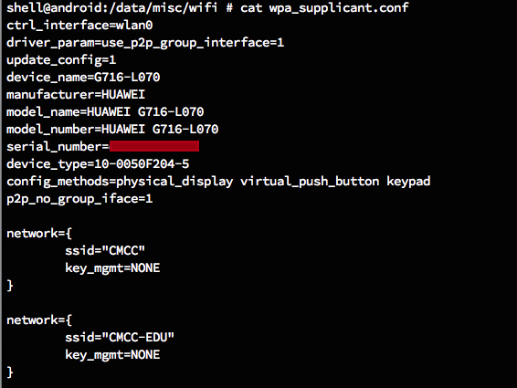
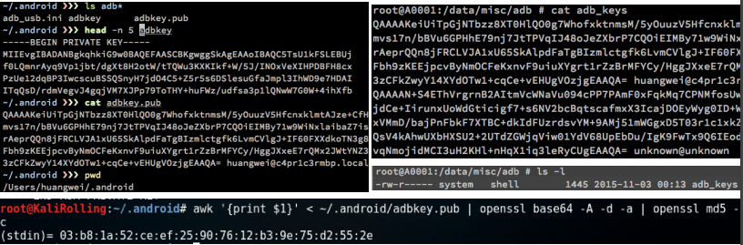

## ADB实验

### 命令行

```bash
echo $PATH
# /sbin:/vendor/bin:/system/sbin:/system/bin:/system/xbin

# on Android 7.1.1 (Google APIs）x86_64 ，部分系统中没有提供 uname
uname -a
# Linux localhost 3.10.0+ #371 SMP PREEMPT Thu Jan 21 12:03:33 PST 2016 x86_64

# 基本命令
#  cd / ls / pwd / ps / grep /kill / cat / chmod /chown / mkdir /echo /
# touch / du / df / set / uptime / top / ifconfig / more

# 进阶命令
# su / iptables / iftop / lsof / mount / vmstat / wpa_cli / sqlite3

# 将文件复制到设备/从设备复制文件
adb pull remote local
adb push local remote

# 安装应用
adb install path_to_apk
```

* /etc
    * /etc/hosts 静态域名解析记录本地配置，域名解析时最⾼优先级记录
    * /etc/apns-conf.xml APN(Access Point Name)，移动⽹络接⼊点配置
* /data/misc WIFI联⽹记录等存在此目录下
* /proc 进程信息目录，特别是/proc/<pid>/
* /dev 设备信息目录

更多有价值的⽬录相关信息请在Linux主机上``man hier``。

### Activity Manager (am)

在Android中，除了从界面上启动程序之外，还可以从命令行启动程序，使用的是命令行工具am (activity manager ).

```bash
usage: am [subcommand] [options]
usage: am start [-D] [-W] [-P <FILE>] [--start-profiler <FILE>]
               [--R COUNT] [-S] [--opengl-trace] <INTENT>
       am startservice <INTENT>
       am force-stop <PACKAGE>
       am kill <PACKAGE>
       am kill-all
       am broadcast <INTENT>
       am instrument [-r] [-e <NAME> <VALUE>] [-p <FILE>] [-w]
               [--no-window-animation] <COMPONENT>
       am profile start <PROCESS> <FILE>
       am profile stop [<PROCESS>]
       am dumpheap [flags] <PROCESS> <FILE>
       am set-debug-app [-w] [--persistent] <PACKAGE>
       am clear-debug-app
       am monitor [--gdb <port>]
       am screen-compat [on|off] <PACKAGE>
       am display-size [reset|MxN]
       am to-uri [INTENT]
       am to-intent-uri [INTENT]

am start: start an Activity.  Options are:
    -D: enable debugging
    -W: wait for launch to complete
    --start-profiler <FILE>: start profiler and send results to <FILE>
    -P <FILE>: like above, but profiling stops when app goes idle
    -R: repeat the activity launch <COUNT> times.  Prior to each repeat,
        the top activity will be finished.
    -S: force stop the target app before starting the activity
    --opengl-trace: enable tracing of OpenGL functions

am startservice: start a Service.

am force-stop: force stop everything associated with <PACKAGE>.

am kill: Kill all processes associated with <PACKAGE>.  Only kills.
  processes that are safe to kill -- that is, will not impact the user
  experience.

am kill-all: Kill all background processes.

am broadcast: send a broadcast Intent.

am instrument: start an Instrumentation.  Typically this target <COMPONENT>
  is the form <TEST_PACKAGE>/<RUNNER_CLASS>.  Options are:
    -r: print raw results (otherwise decode REPORT_KEY_STREAMRESULT).  Use
with
        [-e perf true] to generate raw output for performance measurements.
    -e <NAME> <VALUE>: set argument <NAME> to <VALUE>.  For test runners a
        common form is [-e <testrunner_flag> <value>[,<value>...]].
    -p <FILE>: write profiling data to <FILE>
    -w: wait for instrumentation to finish before returning.  Required for
        test runners.
    --no-window-animation: turn off window animations will running.

am profile: start and stop profiler on a process.

am dumpheap: dump the heap of a process.  Options are:
    -n: dump native heap instead of managed heap

am set-debug-app: set application <PACKAGE> to debug.  Options are:
    -w: wait for debugger when application starts
    --persistent: retain this value

am clear-debug-app: clear the previously set-debug-app.

am monitor: start monitoring for crashes or ANRs.
    --gdb: start gdbserv on the given port at crash/ANR

am screen-compat: control screen compatibility mode of <PACKAGE>.

am display-size: override display size.

am to-uri: print the given Intent specification as a URI.

am to-intent-uri: print the given Intent specification as an intent: URI.

<INTENT> specifications include these flags and arguments:
    [-a <ACTION>] [-d <DATA_URI>] [-t <MIME_TYPE>]
    [-c <CATEGORY> [-c <CATEGORY>] ...]
    [-e|--es <EXTRA_KEY> <EXTRA_STRING_VALUE> ...]
    [--esn <EXTRA_KEY> ...]
    [--ez <EXTRA_KEY> <EXTRA_BOOLEAN_VALUE> ...]
    [--ei <EXTRA_KEY> <EXTRA_INT_VALUE> ...]
    [--el <EXTRA_KEY> <EXTRA_LONG_VALUE> ...]
    [--ef <EXTRA_KEY> <EXTRA_FLOAT_VALUE> ...]
    [--eu <EXTRA_KEY> <EXTRA_URI_VALUE> ...]
    [--ecn <EXTRA_KEY> <EXTRA_COMPONENT_NAME_VALUE>]
    [--eia <EXTRA_KEY> <EXTRA_INT_VALUE>[,<EXTRA_INT_VALUE...]]
    [--ela <EXTRA_KEY> <EXTRA_LONG_VALUE>[,<EXTRA_LONG_VALUE...]]
    [--efa <EXTRA_KEY> <EXTRA_FLOAT_VALUE>[,<EXTRA_FLOAT_VALUE...]]
    [-n <COMPONENT>] [-f <FLAGS>]
    [--grant-read-uri-permission] [--grant-write-uri-permission]
    [--debug-log-resolution] [--exclude-stopped-packages]
    [--include-stopped-packages]
    [--activity-brought-to-front] [--activity-clear-top]
    [--activity-clear-when-task-reset] [--activity-exclude-from-recents]
    [--activity-launched-from-history] [--activity-multiple-task]
    [--activity-no-animation] [--activity-no-history]
    [--activity-no-user-action] [--activity-previous-is-top]
    [--activity-reorder-to-front] [--activity-reset-task-if-needed]
    [--activity-single-top] [--activity-clear-task]
    [--activity-task-on-home]
    [--receiver-registered-only] [--receiver-replace-pending]
    [--selector]
    [<URI> | <PACKAGE> | <COMPONENT>]
```

> 实例

```bash
# Camera（照相机）的启动方法为:
am start -n com.android.camera/com.android.camera.Camera
 
# Browser（浏览器）的启动方法为：
am start -n com.android.browser/com.android.browser.BrowserActivity

# 启动浏览器 :
am start -a android.intent.action.VIEW -d  http://sec.cuc.edu.cn/
 
# 拨打电话 :
am start -a android.intent.action.CALL -d tel:10086

# 发短信：
adb shell am start -a android.intent.action.SENDTO -d sms:10086 --es sms_body ye --ez exit_on_sent true
```

### 软件包管理器 (pm)

在 adb shell 中，可以使用[软件包管理器 (pm)](https://developer.android.com/studio/command-line/adb.html#pm) 工具发出命令，以对设备上安装的应用软件包进行操作和查询。在 shell 中，此语法为：

```bash
pm command
```

也可以直接从 adb 发出软件包管理器命令，无需进入远程 shell。例如：

```bash
adb shell pm uninstall com.example.MyApp
```

### 其他adb实验

```bash
# 常用的按键对应的KEY_CODE
adb shell input keyevent 22 //焦点去到发送键
adb shell input keyevent 66 //回车按下

adb shell input keyevent 4 // 物理返回键
adb shell input keyevent 3 // 物理HOME键

# android 4.0+
$ input
usage: input ...
       input text <string>
       input keyevent <key code number or name>
       input tap <x> <y>
       input swipe <x1> <y1> <x2> <y2>
```

## FAQ

1. 如果执行通过``adb shell``进入的命令行提示符不是``#``，而是``$``；或者 ``adb root`` 提示 ``adbd cannot run as root in production builds``，请更换使用的Android系统镜像版本，不要使用带有``Google APIs``字样的系统即可；
2. 使用命令行管理所有的Android虚拟机可以参阅[Start the Emulator from the Command Line](https://developer.android.com/studio/run/emulator-commandline.html)

## 国行安卓手机的默认信任SSID

打开手机设置里的``WLAN``详细设置，查看是否存在**默认信任接入点**或类似的设置。如下图所示是一个存在**默认信任接入点**的手机实例截图。其中的``信任接入点``是当前手机曾经成功连接过的无线网络的SSID，**未知接入点**对应的是当前手机所在位置附近扫描到的可用无线接入点信息。


查看``/data/misc/wifi/wpa_supplicant.conf``，会找到上述**默认信任接入点**是写入到这个配置文件中的：



对于运营商联合手机厂商的这种“预置”设置，在手机没有``root``的情况下是无法删除或“忘记”这些**默认信任接入点**的，这就意味着这些手机将面临更严重的``Evil Twin``威胁：自动连入不加密且遍地都有的无线网络。

如果当前手机没有``root``，则可以通过修改**默认信任接入点**的IP获取方式为**手动**，并且故意设置为错误、不可联网的IP的方式来达到即使手机自动连入了``Evil Twin``，但由于本地网络配置的缘故而无法联网，进而避免进一步的数据通信和降低被网络攻击的概率。如下图所示：


如果手机已``root``，则可以通过修改``/data/misc/wifi/wpa_supplicant.conf``，删除默认信任接入点相关配置实现彻底删除**默认信任接入点**。


## ADB 安全

已开启USB调试功能的Android 4.2.2+真机设备通过USB连接到电脑，终端输⼊``adb devices``会提示设备“未授权”（``unauthorized``）。此时，⼿机解锁后在主屏幕上会弹出对话框，如下图所示：


只有用户点击“确定”之后才能完成USB调试接⼝连接，这是⼿机对电脑进⾏**单向**认证。电脑不认证⼿机的风险：[利用⼿机的USB连接攻击电脑](https://github.com/offensive-security/kali-nethunter/wiki/NetHunter-HID-Attacks)。

如果用户勾选了“⼀律使用这台计算机进⾏调试”，则在⼿机的``/data/misc/adb``目录下的``adb_keys``⽂件保存当前计算机进⾏ADB连接所使用的公钥。换句话说，如果恶意软件可以修改``/data/misc/adb/adb_keys``文件添加任意公钥，就意味着手机在通过USB连入存有该公钥对应私钥的电脑时就将面临着被在用户不知情的情况下任意访问手机上存储的数据、安装软件、管理进程等高风险威胁。



所以我们建议手机在不需要用于**开发调试目的**时，关闭**USB调试**功能，避免来自ADB的安全威胁。在实践中，由于大量傻瓜``root``程序、通过电脑管理手机的程序等会引导用户开启**USB调试**模式，甚至[充电宝也会诱骗用户开启手机的USB调试功能](https://zhuanlan.zhihu.com/p/31130783)，而大多数用户一旦开启了**USB调试**模式之后很少会有人再去关闭这个功能，因此，通过ADB调试方式攻击手机的案例在现实中屡见不鲜。

除了手机之外，很多智能电视也安装了Android系统并且默认开启了**ADB网络调试**模式，默认监听 ``TCP 5555`` 端口，一旦攻击者能接入该智能电视所在的局域网，通过网络扫描手段就可以发现目标，进而通过 ``adb connect device_ip_address`` 的方式通过网络直连上电视，剩下的就和通过``adb命令行``控制和调试手机无异了。

## Hello World v1

认真阅读Android官方给出的[使用Android Studio一步一步创建并运行的Hello World程序指南](https://developer.android.google.cn/training/basics/firstapp/creating-project.html)，在官方指南的基础上，我们额外作出如下特别要求（非强制要求，主要是为了v2版的示例代码提供上下文环境的一个示范）：

* Application Name设置为：MISDemo
* Company Domain设置为：cuc.edu.cn

在代码编写和运行过程中，请特别关注以下问题：

* [ ] 按照向导创建的工程在模拟器里运行成功的前提下，生成的APK文件在哪儿保存的？
* [ ] 使用adb shell是否可以绕过MainActivity页面直接“唤起”第二个DisplayMessageActivity页面？是否可以在直接唤起的这个DisplayMessageActivity页面上显示自定义的一段文字，比如：你好移动互联网安全
* [ ] 如何实现在真机上运行你开发的这个Hello World程序？
* [ ] 如何修改代码实现通过 ```adb shell am start -a android.intent.action.VIEW -d  http://sec.cuc.edu.cn/``` 可以让我们的cuc.edu.cn.misdemo程序出现在“用于打开浏览器的应用程序选择列表”？
* [ ] 如何修改应用程序默认图标？
* [ ] 如何修改代码使得应用程序图标在手机主屏幕上实现隐藏？

## Hello World v2

* 在v1基础之上，我们增加以下新功能来为后续的程序逆向和组件安全实验做一些“标靶”
    * 使用SharedPreferences持久化存储小数据并按需读取
    * 实现一个简单的注册码校验功能

以下给出v1版的2个核心Java源代码的修改后主要代码，xml文件的修改请自行根据源代码进行相应编辑。

### MainActivity.java

```java
public class MainActivity extends AppCompatActivity {

    public final static String EXTRA_MESSAGE = "cn.edu.cuc.mishello.MESSAGE";
    public SharedPreferences sharedPreferences;

    @Override
    protected void onCreate(Bundle savedInstanceState) {
        super.onCreate(savedInstanceState);
        setContentView(R.layout.activity_main);

        // Load Saved to editText
        sharedPreferences = getSharedPreferences(getString(R.string.pref_filename), Context.MODE_PRIVATE);
        String saved_message = sharedPreferences.getString(getString(R.string.pref_usr_input_msg), "");
        EditText editText = (EditText) findViewById(R.id.edit_message);
        editText.setText(saved_message);
    }

    /** Called when the user clicks the Send button */
    public void sendMessage(View view) {
        // Prepare SharedPreferences
        sharedPreferences = getSharedPreferences(getString(R.string.pref_filename), Context.MODE_PRIVATE);
        SharedPreferences.Editor editor = sharedPreferences.edit();

        // Do something in response to button
        Intent intent = new Intent(this, DisplayMessageActivity.class);
        EditText editText = (EditText) findViewById(R.id.edit_message);
        String message = editText.getText().toString();
        intent.putExtra(EXTRA_MESSAGE, message);

        // Save Data
        editor.putString(getString(R.string.pref_usr_input_msg), message);
        editor.commit();

        startActivity(intent);
    }

}
```

### DisplayActivity.java

所有的import代码都默认省略，请自行利用IDE的自动导入功能来组织import。

```java
public class DisplayMessageActivity extends AppCompatActivity {

    private String SECRET_SEED = "sec.cuc.edu.cn";

    @Override
    protected void onCreate(Bundle savedInstanceState) {
        super.onCreate(savedInstanceState);
        setContentView(R.layout.activity_display_message);

        register();
    }

    private void register() {
        Intent intent = getIntent();
        String message = intent.getStringExtra(MainActivity.EXTRA_MESSAGE);
        String secret_key = md5(SECRET_SEED).substring(0, 4);

        Log.d("user input", message);
        Log.d("debug secret_key", secret_key);

        TextView textView = new TextView(this);
        textView.setTextSize(40);

        if(message.equalsIgnoreCase(secret_key)) {
            textView.setText(getString(R.string.register_ok));
        } else {
            textView.setText(getString(R.string.register_failed));
        }

        ViewGroup layout = (ViewGroup) findViewById(R.id.activity_display_message);
        layout.addView(textView);
    }

    private String md5(String s) {
        try {
            // Create MD5 Hash
            MessageDigest digest =MessageDigest.getInstance("MD5");
            digest.update(s.getBytes());
            byte messageDigest[] = digest.digest();

            // Create Hex String
            StringBuffer hexString = new StringBuffer();
            for (int i=0; i<messageDigest.length; i++)
                hexString.append(Integer.toHexString(0xFF & messageDigest[i]));
            return hexString.toString();

        } catch (NoSuchAlgorithmException e) {
            e.printStackTrace();
        }
        return "";
    }
}
```

## 思考题

* DisplayMessageActivity.java中的2行打印日志语句是否有风险？如果有风险，请给出漏洞利用示范。如果没有风险，请给出理由。
* SharedPreferences类在进行读写操作时设置的``Context.MODE_PRIVATE``参数有何作用和意义？还有其他可选参数取值吗？

## 参考资料

* [ADB权威参考](http://developer.android.google.cn/tools/help/adb.html)
* [Android自动化测试初探（五）: 再述模拟键盘鼠标事件（adb shell 实现）](http://blog.csdn.net/roger_ge/article/details/5552740)
* [android跨进程事件注入(程序模拟用户输入)](http://zuoshu.iteye.com/blog/1775606)
* [KeyEvent常量查询](http://developer.android.google.cn/reference/android/view/KeyEvent.html)

