# 第六章 安卓系统访问控制策略与机制

## Android安全机制概览

[在第五章 智能终端操作系统安全基础](../chap0x05/main.md)，我们分别介绍了``Android系统生态圈支持的设备``和``Android的系统组成结构图``，基于此我们认识到 Android 平台的主要组件包括：

* **设备硬件**：Android 能够在多种硬件配置中运行，其中包括智能手机、平板电脑、手表、汽车、智能电视、OTT 游戏盒和机顶盒。Android 独立于处理器，但它确实利用了一些针对硬件的安全功能，例如 ARM eXecute-Never。
* **Android 操作系统**：核心操作系统是在 Linux 内核之上构建的。所有设备资源（例如，摄像头功能、GPS 数据、蓝牙功能、电话功能、网络连接等）都通过该操作系统访问。
* **Android 应用运行时**：Android 应用通常都是使用 Java 编程语言编写的，并在 Android 运行时 (ART) 中运行。不过，仍有许多应用（包括核心 Android 服务和应用）是本机应用或包含本机库。ART 和本机应用在相同的安全环境中运行（包含在应用沙盒内）。应用在文件系统中有一个专用部分，它们可以在其中写入私密数据，包括数据库和原始文件。
Android 应用扩展了 Android 核心操作系统。应用有两个主要来源：

* **预先安装的应用**：Android 包括一套预先安装的应用，其中包括电话、电子邮件、日历、网络浏览器和通讯录应用。这些应用不仅能够用作用户应用，而且能够提供可供其他应用访问的关键设备功能。预先安装的应用可能是开放源代码 Android 平台的一部分，也可能是由具体设备的制造商开发的。
* **用户安装的应用**：Android 提供了一个支持任何第三方应用的开放式开发环境。Google Play 为用户提供了数十万款应用。

除了Android的平台的安全机制，Google提供了一套基于云的服务，用户可通过 [Google 移动服务](https://www.android.com/gms/?hl=zh-cn) 将这些服务安装到兼容的 Android 设备上。虽然**这些服务不是 Android 开放源代码项目的一部分**，但它们包含在许多 Android 设备中。如需关于其中部分服务的更多信息，请参阅 Android 安全团队发布的 [2015 年年度回顾报告](https://source.android.com/security/reports/Google_Android_Security_2015_Report_Final.pdf?hl=zh-cn)。

信息安全的本质是``持续对抗``，在介绍Android安全机制是如何``对抗``各类威胁之前，我们先了解一下Android开发团队在实现安全的``持续``性方面做了哪些具体计划：

* **设计审核**：Android 安全流程在开发生命周期的早期便开始了，并会在这一阶段创建大量的可配置安全模型和设计。平台的每项主要功能都会由工程和安全资源进行审核，并且适当的安全控制机制会被集成到系统架构中。
* **渗透测试和代码审核**：在平台开发期间，Android 创建的组件和开放源代码组件都要接受严格的安全审核。这些审核由 Android 安全团队、Google 的信息安全工程团队和独立的安全顾问进行。这些审核的目标是在主要版本发布之前找出存在的缺陷和可能的漏洞，并模拟将由外部安全专家在平台发布时进行的各种类型的分析。
* **开放源代码和社区审核**：Android 开放源代码项目允许任何感兴趣者对其进行广泛的安全审核。Android 还使用已经过重要外部安全审核的开放源代码技术，例如 Linux 内核。Google Play 面向用户和公司开设了一个论坛，以便直接向用户提供与具体应用相关的信息。
* **事件响应**：即使采取了所有这些预防措施，平台发布后也仍可能会出现安全问题，为此，Android 项目制定了一个全面的安全响应流程。Android 安全团队有全职成员负责监控用于讨论潜在漏洞的 Android 专用安全社区和一般安全社区，并且他们会查看提交到 Android 错误数据库中的安全错误。发现确实存在的问题后，Android 团队会启动响应流程，以便快速修复漏洞，确保将所有 Android 用户面临的潜在风险降至最低。这些云支持的响应可能包括更新 Android 平台（无线下载更新）、从 Google Play 中移除应用，以及从现场设备中移除应用。
* **每月安全更新**：Android 安全团队会为 Google Nexus 设备和所有设备制造合作伙伴提供每月更新。

Android 一直在不断改进其安全功能和产品/服务，官网有专题页面记录了[各个版本的增强功能列表](https://source.android.com/security/enhancements/?hl=zh-cn)。

Android安全机制可以分为软件和硬件两个方面的具体技术。硬件方面的安全机制以[Android 4.3](https://developer.android.com/about/versions/android-4.3.html)开始引入的``可信计算模块``（``Trusted Platform Module, TPM``）为代表，提供了基于硬件专用芯片的密钥安全存储（无法导出）和密码学算法实现。在软件方面的安全机制主要涵盖：系统与内核安全（操作系统）、应用安全（权限、应用与服务）和实现安全（源代码）三大方面。

### 硬件相关安全机制

#### 密钥存储与密码学算法

借助系统芯片 (SoC) 中提供的可信执行环境，Android 设备可以为 Android 操作系统、平台服务甚至是第三方应用提供由硬件支持的强大安全服务。寻求 Android 专用扩展程序的开发者应访问 [android.security.keystore](https://developer.android.com/reference/android/security/keystore/KeyGenParameterSpec.html?hl=zh-cn)。

Keystore 在 Android 6.0 中得到了[显著增强](https://source.android.com/security/keystore/features?hl=zh-cn)，不仅增加了对称加密模块（AES 和 HMAC），还增加了针对由硬件支持的密钥的访问控制系统。访问控制在密钥生成期间指定，并会在密钥的整个生命周期内被强制执行。可以将密钥限定为仅在用户通过身份验证后才可使用，并且只能用于指定的目的或只有在具有指定的加密参数时才可使用。对于工程实现方面的细节可以查阅[Android官方 面向实现人员的参考资料](https://source.android.com/security/keystore/implementer-ref?hl=zh-cn)

在 Android 6.0 之前的版本中，Android 已有一个非常简单的由硬件支持的加密服务 API（由 0.2 和 0.3 版的 Keymaster 硬件抽象层 (HAL) 提供）。该 Keystore 能够提供数字签名和验证操作，以及不对称签名密钥对的生成和导入操作。该 API 在许多设备上都已实现，但有许多安全目标无法只通过一个签名 API 来轻松达成。Android 6.0 中的 Keystore 在该 Keystore API 的基础上进行了扩展，能够提供更广泛的功能。

#### Trusty TEE

Trusty 是一组在移动设备上支持``可信执行环境`` (``Trusted Execution Environment, TEE``) 的软件组件。

Trusty 包含以下组件：

* 一个在用于提供 TEE 的处理器上运行的操作系统（Trusty 操作系统）
* 适用于 Android 内核 (Linux) 的驱动程序，旨在促进与在 Trusty 操作系统下运行的应用之间的通信
* 一组适用于 Android 系统软件的库，旨在使用内核驱动程序促进与在 Trusty 操作系统中执行的可信应用之间的通信

> 重要提示：Trusty 和 Trusty API 随时可能发生变化。

所有 TEE 操作系统（不仅仅是 Trusty）均可用于 TEE 实现。

``TEE 处理器``通常是系统内的**单独微处理器**，**或是主处理器的虚拟化实例**。TEE 处理器与系统的其余部分之间使用由硬件支持的内存和 I/O 保护机制隔离开来。

TEE 处理器如今已成为移动设备的基本组成部分。这些设备上的主处理器会被视为“不可信”，它们无法访问制造商用于存储机密数据（例如，设备专用加密密钥）的特定 RAM、硬件寄存器和 ``用户空间文件系统``（Filesystem in Userspace，Fuse） 区域。在主处理器上运行的软件会将所有需要使用机密数据的操作委派给 TEE 处理器。

在 Android 生态系统中，最广为人知的不可信主处理器示例是用于受保护内容的 DRM 框架。在 TEE 处理器上运行的软件可以访问解密受保护内容所需的设备专用密钥。主处理器只能看到已加密的内容，这样一来，就可以针对基于软件的攻击提供高级别的安全保障和保护。

TEE 还有许多其他用法，例如移动支付、安全银行、全盘加密、多因素身份验证、设备重置保护、抗重放攻击的持久存储、无线显示（“投射”）受保护的内容、安全的 PIN 码和指纹处理，甚至还有恶意软件检测。

Trusty 提供用于开发以下两类应用的 API：

* 在 TEE 处理器上运行的可信应用或服务
* 在主处理器上运行并使用可信应用提供的服务的普通/不可信应用

在主处理器上运行的软件可以使用 Trusty API 连接到可信应用并与它们交换任意消息，就像通过 IP 提供的网络服务一样。应用负责使用应用级协议确定这些消息的数据格式和语义。消息传递的可靠性由底层 Trusty 基础架构（采用在主处理器上运行的驱动程序的形式）来保证，并且通信完全是异步进行的。

可信应用会以单独进程的形式在 Trusty 操作系统内核下运行。每个进程都会利用 TEE 处理器的 MMU 功能在各自的虚拟内存沙盒中运行。内核会使用由安全计时器驱动且按优先级进行调度的轮询调度程序安排这些进程。在最新版本的 Trusty 中，所有 Trusty 应用均具有相同的优先级。

可以使用 C/C++（对 C++ 的支持有限）编写适用于 Trusty 操作系统的应用，此类应用可以访问小型的 C 库。main() 函数目前不接受任何参数。系统调用存根是作为该库的一部分在本机汇编代码中提供的，因此可按名称访问系统调用。

所有 Trusty 应用均为单线程应用；目前不支持在 Trusty 用户空间中使用多线程。

Trusty 应用会在加载期间初始化一次，并且在 TEE 处理器重置之前，会一直保留在内存中。Trusty 目前不支持动态加载和取消加载应用。

可信应用是作为 **事件驱动型服务器** 编写的，会等待其他应用或主处理器上运行的应用发出的命令。此外，可信应用也可以作为其他可信服务器应用的客户端。以下 API 部分中介绍的事件将由 Trusty 内核传送到可信应用。

### 软件相关安全机制

#### 系统和内核安全

在操作系统级别，Android 平台不仅提供 Linux 内核的安全功能，而且还提供安全的进程间通信 (IPC) 机制，以便在不同进程中运行的应用之间安全通信。操作系统级别的这些安全功能旨在确保即使是本机代码也要受应用沙盒的限制。无论相应代码是自带应用行为导致的结果，还是利用应用漏洞导致的结果，系统都能防止恶意应用危害其他应用、Android 系统或设备本身。要了解可以采取哪些措施来增强设备上的内核，请参阅[Android官网的 内核配置](https://source.android.com/devices/tech/config/kernel.html?hl=zh-cn)。要了解必需的设置，请参阅 [Android 兼容性定义文档 (CDD)](https://source.android.com/compatibility/cdd.html?hl=zh-cn)。

> Linux安全

Android 平台的基础是 Linux 内核。Linux 内核多年来一直应用得非常广泛，并且用在了数百万种安全敏感型环境中。在历经数以千计的开发者不断研究、攻击和修复之后，Linux 已成为许多公司和安全专业人士信任的一款既稳定又安全的内核。

作为移动计算环境的基础，Linux 内核为 Android 提供了一些关键的安全功能，其中包括：

* 基于用户的权限模式
* 进程隔离
* 用于实现安全 IPC 的可扩展机制
* 能够移除内核中不必要的和可能不安全的部分

作为多用户操作系统，Linux 内核的一个基本安全目标是将用户资源彼此隔离开来。Linux 的安全理念是防范用户资源之间相互侵扰。因此，Linux 可以：

* 防止用户 A 读取用户 B 的文件
* 确保用户 A 不会占用用户 B 的内存
* 确保用户 A 不会占用用户 B 的 CPU 资源
* 确保用户 A 不会占用用户 B 的设备（例如，电话、GPS、蓝牙）

> 应用沙盒

Android 平台利用基于用户的 Linux 保护机制来识别和隔离应用资源。Android 系统会为每个 Android 应用分配一个独一无二的用户 ID (UID)，并使它们以这个用户身份在单独的进程中运行。这种方法与其他操作系统（包括传统的 Linux 配置）采用的方法不同。在其他操作系统中，多个应用会以相同的用户权限运行。

这样就设置了一个内核级应用沙盒。内核会在进程级别通过标准的 Linux 内容（例如，分配给应用的用户 ID 和组 ID）强制执行应用和系统之间的安全功能。默认情况下，应用不能彼此交互，而且应用对操作系统的访问权限会受到限制。如果应用 A（一个单独的应用）尝试执行恶意操作，例如在没有权限的情况下读取应用 B 的数据或拨打电话，操作系统会阻止此类操作，因为应用 A 没有适当的用户权限。沙盒非常简单，可审核，并且基于已有数十年历史的 UNIX 风格的进程用户隔离和文件权限机制。

由于应用沙盒位于内核中，因此该安全模型的保护范围扩展到了本机代码和操作系统应用。位于内核上方的所有软件（例如，操作系统库、应用框架、应用运行时和所有应用）都会在应用沙盒中运行。在某些平台上，为了强制执行安全功能，会限制开发者只能使用特定的开发框架、API 组或语言。在 Android 上，并没有限制必须如何编写应用才能强制执行安全功能；在这一方面，本机代码与直译码一样安全。

在某些操作系统中，一个应用中的内存损坏错误可能会导致位于同一内存空间中的其他应用出现损坏，进而导致设备的安全性完全遭到破坏。由于所有应用及其资源都在操作系统级别的沙盒内，因此，如果出现内存损坏错误，将只有在相应应用的环境中才能发生任意执行代码的行为，而且只能是以操作系统确立的权限执行代码。

与所有安全功能一样，应用沙盒并不是坚不可摧的。不过，要在经过适当配置的设备上攻破应用沙盒这道防线，必须要先攻破 Linux 内核的安全功能。

> 系统分区和安全模式

系统分区包含 Android 的内核，以及操作系统库、应用运行时、应用框架和应用。该分区设为了只读分区。当用户将设备启动到安全模式时，第三方应用可由设备所有者手动启动，但不会默认启动。

> 文件系统权限

在 UNIX 风格的环境中，文件系统权限可确保一个用户不能更改或读取另一个用户的文件。在 Android 中，每个应用都以自己的用户身份运行。除非开发者明确地与其他应用共享文件，否则一个应用不能读取或更改另一个应用创建的文件。

> 安全增强型 Linux

Android 使用安全增强型 Linux (SELinux) 来应用访问控制策略并对进程建立强制访问控制 (mac)。如需详细信息，请参阅 [Android 中的安全增强型 Linux](https://source.android.com/security/selinux/?hl=zh-cn)。

> 验证启动

Android 6.0 及更高版本支持验证启动功能和 device-mapper-verity。验证启动功能旨在保证设备软件（从硬件信任根直到系统分区）的完整性。在启动过程中，无论是在每个阶段，都会在进入下一个阶段之前先验证下一个阶段的完整性和真实性。

Android 7.0 及更高版本支持严格强制执行的验证启动，这意味着遭到入侵的设备将无法启动。

如需更多详细信息，请参阅[验证启动](https://source.android.com/security/verifiedboot/index.html?hl=zh-cn)。

> 加密

Android 提供了一套加密 API 供应用使用，其中包括标准和常用加密算法（例如，AES、RSA、DSA 和 SHA）的实现 API。此外，Android 还提供了适用于更高级别协议（例如，SSL 和 HTTPS）的 API。

Android 4.0 中引入了 [KeyChain](http://developer.android.com/reference/android/security/KeyChain.html?hl=zh-cn) 类，以便应用使用系统凭据存储空间来存储私钥和证书链。

加密是使用对称加密密钥对 Android 设备上的所有用户数据进行编码的过程。设备经过加密后，所有由用户创建的数据在存入磁盘之前都会自动加密，并且所有读取操作都会在将数据返回给调用进程之前自动解密数据。加密可确保未经授权方在尝试访问相应数据时无法读取它们。

Android 有两种设备加密方法：全盘加密和文件级加密。

> 全盘加密

全盘加密是使用已加密的密钥对 Android 设备上的所有用户数据进行编码的过程。设备经过加密后，所有由用户创建的数据在写入磁盘之前都会自动加密，并且所有读取操作都会在将数据返回给调用进程之前自动解密数据。

全盘加密是在 Android 4.4 版中引入的，不过 Android 5.0 中又引入了以下新功能：

* 创建了快速加密方式，这种加密方式只会对数据分区中已使用的分块进行加密，以免首次启动用时过长。目前只有 EXT4 和 F2FS 文件系统支持快速加密。
* 添加了 [``forceencrypt fstab 标记``](https://source.android.com/devices/storage/config.html?hl=zh-cn)，以便在首次启动时进行加密。
* 添加了对解锁图案和无密码加密的支持。
* 添加了由硬件支持的加密密钥存储空间，该空间使用可信执行环境（TEE，例如 TrustZone）的签名功能。如需更多详细信息，请参阅[存储已加密的密钥](https://source.android.com/security/encryption/full-disk?hl=zh-cn#storing_the_encrypted_key)。

> 注意：对于升级到 Android 5.0 的设备，如果升级之后进行了加密，则可以通过恢复出厂设置还原到未加密状态。在首次启动时加密的新 Android 5.0 设备无法还原到未加密状态。

Android 5.0 及更高版本支持[全盘加密](https://source.android.com/security/encryption/full-disk?hl=zh-cn)。全盘加密是使用单个密钥（由用户的设备密码加以保护）来保护设备的整个用户数据分区。设备启动后，用户必须提供其凭据才能访问磁盘的任何部分。

虽然这非常有利于确保安全性，但如果采用这种加密方式，当用户重新启动设备后，手机的大多数核心功能都将无法立即可用。由于对数据的访问受单个用户凭据的保护，因此闹钟等功能将无法运行，无障碍服务将无法使用，并且手机将无法接听电话。

> 文件级加密

Android 7.0 及更高版本支持[文件级加密](https://source.android.com/security/encryption/file-based?hl=zh-cn)。采用文件级加密时，可以使用不同的密钥对不同的文件进行加密，并且可以对这些文件进行单独解密。支持文件级加密的设备还支持一种称为[直接启动](https://developer.android.com/training/articles/direct-boot.html?hl=zh-cn)的新功能。该功能处于启用状态时，已加密设备在启动后将直接进入锁定屏幕，从而可让用户快速访问重要的设备功能，例如无障碍服务和闹钟。

引入文件级加密和新 API 后，便可以将应用设为加密感知型应用，这样一来，它们将能够在受限环境中运行。这些应用将可以在用户提供凭据之前运行，同时系统仍能保护私密用户信息。

> 获取设备的 Root 权限

默认情况下，在 Android 上，只有内核和一小部分核心应用能够以 Root 权限运行。Android 不会阻止具有 Root 权限的用户或应用修改操作系统、内核或任何其他应用。一般来说，Root 对所有应用和所有应用数据拥有完整访问权限。如果用户在 Android 设备上更改权限来向应用授予 Root 访问权限，则会使遭受恶意应用攻击以及遭受潜在应用缺陷侵扰的安全风险增加。

能够修改自己的 Android 设备对于使用 Android 平台的开发者来说非常重要。在许多 Android 设备上，用户都可以解锁引导加载程序(``bootloader``)，以便安装替代操作系统。这些替代操作系统可能会允许所有者获得 Root 访问权限，以便他们调试应用和系统组件，或者访问 Android API 未提供给应用的功能。

在有些设备上，能够亲手控制设备并拥有 USB 数据线的用户可以安装能够向其提供 Root 权限的新操作系统。为了保护所有现有用户数据免遭入侵，引导加载程序解锁机制要求引导加载程序在解锁期间清空所有现有用户数据。利用内核错误或安全漏洞获得 Root 访问权限后，可以绕过这种保护机制。

使用存储在设备上的密钥对数据进行加密的做法并不能防止 Root 用户访问应用数据。应用可以使用存储在设备之外的密钥（例如，存储在服务器上的密钥，或用户密码）进行加密，从而添加一道数据保护屏障。如果不提供密钥的话，这种方法可以提供临时保护，但在某些时候，必须要先将密钥提供给应用，然后 Root 用户才能访问相应应用。

一种更强大的防止 Root 用户获取数据的方式是使用硬件解决方案。原始设备制造商 (OEM) 可以选择实现仅允许访问特定类型的内容的硬件解决方案，例如，适用于视频播放的 DRM 或适用于 Google 电子钱包的 NFC 相关可信存储空间。

如果设备丢失或被盗，Android 设备上的全文件系统加密功能可以使用设备密码来保护加密密钥，这样一来，修改启动加载程序或操作系统的做法将不足以在没有用户设备密码的情况下访问用户数据。

> 用户安全功能

* 文件系统加密

Android 3.0 及更高版本提供全文件系统加密功能，因此所有用户数据都可以在内核中进行加密。

Android 5.0 及更高版本支持全盘加密。全盘加密功能旨在使用单个密钥（由用户的设备密码加以保护）来保护设备的整个用户数据分区。在启动时，用户必须先提供其凭据，然后才能访问磁盘的任何部分。

Android 7.0 及更高版本支持文件级加密。采用文件级加密时，可以使用不同的密钥对不同的文件进行加密，并且可以对这些文件进行单独解密。

如需关于实现文件系统加密的更多详细信息，请参阅[加密部分](https://source.android.com/security/encryption/?hl=zh-cn)。

* 密码保护

Android 可以配置为在提供对设备的访问权限之前先验证用户提供的密码。除了防止未经授权使用设备外，该密码还可以保护用于进行全文件系统加密的加密密钥。

设备管理员可以要求使用密码和/或密码复杂度规则。

> 设备管理

Android 2.2 及更高版本提供 Android Device Administration API，该 API 在系统级别提供设备管理功能。例如，内置的 Android 电子邮件应用可以使用该 API 来改善 Exchange 支持。通过电子邮件应用，Exchange 管理员可以跨设备强制执行密码政策（其中密码包括字母数字密码或数字 PIN 码）。管理员还可以远程清除（即恢复出厂默认设置）丢失或被盗手机上的数据。

除了在 Android 系统自带的应用中使用外，该 API 还可供提供设备管理解决方案的第三方使用。如需关于该 API 的详细信息，请参阅[设备管理](https://developer.android.com/guide/topics/admin/device-admin.html?hl=zh-cn)。

#### 应用安全性

Android 提供了一个适用于移动设备的开放源代码平台和应用环境。核心操作系统基于 Linux 内核。Android 应用通常都是使用 Java 编程语言编写的，并在 Dalvik 虚拟机中运行。不过，也可以使用本机代码编写应用。应用是通过文件扩展名为 .apk 的单个文件安装的。

Android 应用的主要构造组件包括：

* **AndroidManifest.xml**：[AndroidManifest.xml](https://developer.android.com/guide/topics/manifest/manifest-intro.html?hl=zh-cn) 是控制文件，用于告诉系统如何处理应用中的所有顶级组件（具体来说就是下面介绍的活动、服务、广播接收器和内容提供程序）。该文件还用于指定需要哪些权限。
* **Activity**：一般情况下，[活动（**Activity**）](https://developer.android.com/guide/topics/fundamentals/activities.html?hl=zh-cn) 是指聚焦于用户的单个任务的代码。活动通常包括向用户显示界面，但并不一定会这样，有些活动就从不显示界面。通常情况下，应用的入口点是应用的其中一项活动。
* **Service**：[服务](https://developer.android.com/guide/topics/fundamentals/services.html?hl=zh-cn) 是指在后台运行的代码的主体。服务可以在自己的进程中运行，也可以在其他应用的进程中运行。其他组件会“绑定”到某项服务，并通过远程过程调用来调用该服务的方法。比如媒体播放器就是一项服务：即使用户退出媒体选择界面，也可能仍然希望音乐继续播放。即使界面已关闭，服务也可使音乐继续播放。
* **BroadcastReceiver**：[广播接收器](https://developer.android.com/reference/android/content/BroadcastReceiver.html?hl=zh-cn) 是在操作系统或其他应用发出称为 [Intent](https://developer.android.com/reference/android/content/Intent.html?hl=zh-cn) 的 IPC 机制时实例化的对象。例如，应用可以注册一个接收器来接收电量不足消息，并可以根据该信息改变自己的行为。

> Android 权限模式：访问受保护的 API

Android 上的所有应用均在应用沙盒（本文档的前面对其进行了介绍）内运行。默认情况下，Android 应用只能访问有限的系统资源。系统负责管理 Android 应用对资源的访问权限。如果资源使用不当或被恶意使用，可能会给用户体验、网络或设备上的数据带来不利影响。

这些限制是通过多种不同的形式实现的。有些功能会因 Android 有意未提供针对敏感功能的 API（例如，Android 中没有用于直接操控 SIM 卡的 Android API）而受到限制。在某些情况下，角色分离能够提供一种安全措施，就像按应用隔离存储空间一样。在其他情况下，敏感 API 旨在供可信应用使用，并由一种称为“权限”的安全机制进行保护。

这些受保护的 API 包括：

* 摄像头功能
* 位置数据 (GPS)
* 蓝牙功能
* 电话功能
* 短信/彩信功能
* 网络/数据连接

这些资源只能通过操作系统进行访问。要使用设备上受保护的 API，应用必须在其清单中定义所需的功能。在准备安装应用时，系统会向用户显示一个对话框，其中会注明应用请求的权限并询问是否继续安装。如果用户选择继续安装，系统会认定用户已授予应用请求的所有权限。用户不能单独授予或拒绝个别权限，而是必须要一起授予或拒绝应用请求的所有权限。

获得授权后，应用只要安装在设备上，便会一直拥有这些权限。为了避免用户混淆，系统不会再次通知用户向应用授予的权限，而核心操作系统中包含的应用或由原始设备制造商 (OEM) 绑定的应用不会向用户请求权限。应用卸载后，权限也会被移除，因此如果用户之后重新安装卸载的应用，系统会再次显示应用请求的权限。

在设备设置中，用户可以查看之前安装的应用的权限。此外，用户还可以根据需要在全局范围内停用某些功能，例如停用 GPS、无线功能或 WLAN。

如果应用尝试使用未在其清单中声明的受保护功能，权限失败通常会导致系统向应用抛回一个安全异常。受保护 API 权限检查会在最底层被强制执行，以防止出现规避行为。图 2 中显示了如果应用在安装时请求获得受保护 API 的访问权限，会导致系统向用户显示的消息示例。

如需关于系统默认权限的说明，请访问：https://developer.android.com/reference/android/Manifest.permission.html。 应用可以声明自己的权限以供其他应用使用。上述位置中未列出此类权限。

在定义权限时，protectionLevel 属性用于告诉系统如何让用户知道哪些应用需要或可以获得相应权限。如需关于如何创建和使用应用特有权限的详细信息，请访问：https://developer.android.com/guide/topics/security/security.html。

有些设备功能（例如，发送短信广播 Intent 的功能）不会供第三方应用使用，但可供原始设备制造商 (OEM) 预先安装的应用使用。这些应用使用 signatureOrSystem 权限。

> 用户如何了解第三方应用

当用户与第三方应用互动时，Android 会尽力让用户清楚这一情况，并让用户知道这些应用具备的功能。在安装任何应用之前，系统都会向用户显示一条明晰的消息，让用户知道要安装的应用请求获得的各项权限。安装完毕后，系统不会再次提示用户确认任何权限。

在安装前一刻显示权限的原因有很多。这时用户正在主动查看应用、开发者和功能方面的信息，以确定其是否符合自己的需求和期望。同样非常重要的一点是，他们尚未对要安装的应用做出心理或财务方面的承诺，并且可以轻松地将要安装的应用与其他替代应用进行比较。

有些其他平台会使用不同的方式通知用户，即在每个会话开始时或用户正在使用应用时请求权限。Android 的愿景是让用户能够随意在应用之间无缝切换。每次都让用户确认会拖慢用户的操作速度，而且会导致 Android 无法提供良好的用户体验。如果让用户在安装应用时查看权限，用户便可以在不愿意授予相应权限时选择不进行安装。

此外，许多界面研究表明，过度提示用户会导致用户开始在看到任何对话框时都选择“确定”。Android 的安全目标之一是向用户有效地传达重要的安全信息，而使用让用户习惯性忽略的对话框则无法做到这一点。如果只向用户提供一次重要信息并且仅在重要时刻提供，用户更有可能慎重思考他们要同意的是什么。

有些平台会选择完全不显示与应用功能有关的任何信息。这种方式会导致用户无法轻松了解和讨论应用功能。尽管无法使所有用户都是在充分了解相关信息的情况下做出决定，但 Android 权限模式可让众多用户轻松获取与应用相关的信息。例如，如果遇到意外的权限请求，经验更丰富的用户可能会询问有关应用功能的关键问题，并在 Google Play 等所有用户都可以看到的位置分享他们的疑问。


> 进程间通信

进程可以使用 UNIX 类型的任何传统机制进行通信。例如，文件系统、本地套接字或信号。不过，Linux 权限仍然适用。

Android 还提供了一些新的 IPC 机制：

* Binder：一种基于功能的轻量型远程过程调用机制，在执行进程内调用和跨进程调用时能够实现出色的性能。Binder 是使用自定义 Linux 驱动程序实现的。请访问 https://developer.android.com/reference/android/os/Binder.html。
* 服务：服务（如上文所述）可提供能够使用 Binder 直接访问的接口。
* Intent：Intent 是简单的消息对象，表示想要执行某项操作的“意图”。例如，如果当前应用想要显示某个网页，则会创建一个 Intent 实例并将其传递给系统，以此来表示想要访问相应网址的“意图”。然后，系统会找到一些知道如何处理该 Intent 的其他代码（在本例中为浏览器），然后运行该代码。Intent 也可用于在系统范围内广播有趣的事件（例如通知）。请访问 https://developer.android.com/reference/android/content/Intent.html。
* ContentProvider：ContentProvider 是一个数据存储库，用于访问设备上的数据；典型的示例就是用于访问用户通讯录的 ContentProvider。应用可以访问其他应用通过 ContentProvider 提供的数据，还可以定义自己的 ContentProviders 来提供自己的数据。请访问 https://developer.android.com/reference/android/content/ContentProvider.html。
虽然可以使用其他机制（例如，网络套接字或全局可写文件）来实现 IPC，但上面这些都是建议使用的 Android IPC 框架。建议 Android 开发者遵循保护用户数据及避免引入安全漏洞方面的最佳做法。

虽然可以使用其他机制（例如，网络套接字或全局可写文件）来实现 IPC，但上面这些都是建议使用的 Android IPC 框架。建议 Android 开发者遵循保护用户数据及避免引入安全漏洞方面的最佳做法。

> 费用敏感 API

费用敏感 API 指可能会给用户或网络带来费用的任何功能。Android 平台已将费用敏感 API 放入由操作系统控制的受保护 API 列表中。如果有第三方应用请求使用费用敏感 API，必须要由用户授予明确的权限，它们才能使用这些 API。这些 API 包括：

* 电话
* 短信/彩信
* 网络/数据
* 应用内结算
* NFC 访问

Android 4.2 进一步增强了对使用短信的控制。如果有应用尝试向使用付费服务的短代码发送短信（可能会产生额外的费用），Android 将会通知用户。用户可以选择是允许还是阻止该应用发送短信。

> SIM 卡访问

第三方应用无法对 SIM 卡进行底层访问。操作系统负责处理与 SIM 卡之间的所有通信，包括访问 SIM 卡内存中的个人信息（通讯录）。应用也无法访问 AT 命令，因为这些命令完全由无线接口层 (RIL) 进行管理。RIL 不会为这些命令提供任何高层 API。

> 个人信息

Android 已将能够用于访问用户数据的 API 放入受保护 API 组中。在正常使用期间，Android 设备还会收集用户安装的第三方应用内的用户数据。选择分享这些信息的应用可以使用 Android 操作系统权限检查功能保护来自第三方应用的数据。

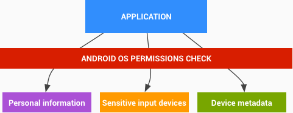

可能包含个人信息或个人身份信息（例如，通讯录和日历）的系统内容提供程序在创建时便已拥有明确确定的权限。这种精细的设计可让用户清楚地知道哪些类型的信息可能会提供给相应应用。在安装过程中，第三方应用可能会请求获得访问这些资源的权限。获得授权后，应用便可以进行安装，并且只要安装在设备上，便会一直有权访问请求的数据。

默认情况下，收集个人信息的所有应用都会仅限特定应用访问这些数据。如果某个应用选择通过 IPC 将数据提供给其他应用，那么这个授予访问权限的应用便可以限制由操作系统强制执行的 IPC 机制的权限。

> 敏感数据输入设备

Android 设备经常会提供可让应用与周围环境进行互动的敏感数据输入设备（例如，摄像头、麦克风或 GPS）。对于要使用这些设备的第三方应用，必须先由用户通过使用 Android 操作系统权限向其明确提供使用权限。安装应用时，安装程序会以提供名称的方式请求用户授予使用相应传感器的权限。

如果某个应用想要知道用户所在的位置，则需要获得获取用户位置信息的权限。安装应用时，安装程序会询问用户是否允许相应应用获取用户的位置信息。如果用户不希望任何应用获取其位置信息，可以随时运行“设置”应用，转到“位置和安全”，然后取消选中“使用无线网络”和“启用 GPS 卫星”。这将针对用户设备上的所有应用停用需要使用位置信息的服务。

> 设备元数据

Android 还会尽力限制访问本身并不属于敏感数据，但可能会间接透露用户特征、用户偏好以及用户使用设备的方式的数据。

默认情况下，应用无权访问操作系统日志、浏览器历史记录、电话号码以及硬件/网络标识信息。如果应用在安装时请求获得访问此类信息的权限，安装程序会询问用户是否允许相应应用访问此类信息。如果用户没有授予该权限，系统将不会安装相应应用。

> 证书授权中心

Android 中收录了一组已安装的系统证书授权中心，这些授权中心在整个系统范围内均可信。在 Android 7.0 之前的版本中，设备制造商可以修改其设备上搭载的 CA 组。不过，运行 7.0 及更高版本的设备将具有一组统一的系统 CA，并且不再允许设备制造商对其进行修改。

要作为新的公共 CA 添加到 Android 收录的 CA 组中，相应 CA 必须要完成 [Mozilla CA 收录流程](https://wiki.mozilla.org/CA:How_to_apply)，然后提交一项针对 Android 的功能请求 (https://code.google.com/p/android/issues/entry)，以便请求添加到 [Android 开放源代码项目 (AOSP)](https://android.googlesource.com/) 收录的 Android CA 组中。

此外还有一些设备专用 CA，这些 CA 不应被收录到 AOSP CA 核心组中，例如，安全访问运营商基础架构组件（例如，短信/彩信网关）时可能需要的运营商私有 CA。建议设备制造商将私有 CA 仅收录在需要信任这些 CA 的组件/应用中。如需更多详细信息，请参阅[网络安全配置](https://developer.android.com/preview/features/security-config.html?hl=zh-cn)。

> 应用签名

通过[代码签名](https://source.android.com/security/apksigning/index.html?hl=zh-cn)，开发者可以标识应用创作者并更新其应用，而无需创建复杂的接口和权限。在 Android 平台上运行的每个应用都必须要有开发者的签名。Google Play 或 Android 设备上的软件包安装程序会拒绝没有获得签名就尝试安装的应用。

在 Google Play 上，应用签名可以将 Google 对开发者的信任和开发者对自己的应用的信任联系在一起。开发者知道自己的应用是以未经修改的形式提供给 Android 设备的，并且开发者可以对自己的应用的行为负责。

在 Android 上，应用签名是将应用放入其应用沙盒的第一步。已签名的应用证书定义了哪个用户 ID 与哪个应用相关联；不同的应用要以不同的用户 ID 运行。应用签名可确保一个应用无法访问任何其他应用，通过明确定义的 IPC 进行访问时除外。

当应用（APK 文件）安装到 Android 设备上时，软件包管理器会验证 APK 是否已经过适当签名（已使用 APK 中包含的证书签名）。如果该证书（或更准确地说，证书中的公钥）与为设备上的任何其他 APK 签名时使用的密钥一致，那么这个新 APK 可以选择在清单中指定它将与其他以类似方式签名的 APK 共用一个 UID。

应用可以由第三方（原始设备制造商(OEM)、运营商、其他相关方）签名，也可以自行签名。Android 提供了使用自签名证书进行代码签名的功能，而开发者无需外部协助或许可即可生成自签名证书。应用并非必须由核心机构签名。Android 目前不对应用证书进行 CA 认证。

应用还可以在“签名”保护级别声明安全权限，以便仅限使用同一个密钥签名的应用访问它们，同时维持单独的 UID 和应用沙盒。通过[共用 UID](https://developer.android.com/guide/topics/manifest/manifest-element.html?hl=zh-cn#uid) 功能，可以与共用的应用沙盒建立更紧密的联系，这是因为借助该功能，使用同一个开发者密钥签名的两个或更多应用可以在其清单中声明共用的 UID。

> 应用验证

Android 4.2 及更高版本均支持应用验证。用户可以选择启用“验证应用”，并在安装应用之前由应用验证程序对其进行评估。如果用户尝试安装的应用可能有害，应用验证功能可以提醒用户；如果应用的危害性非常大，应用验证功能可以阻止安装。

> 数字版权管理

Android 平台提供了一个可扩展的 DRM 框架，以便应用根据与受版权保护的内容相关的许可限制条件来管理这些内容。DRM 框架支持多种 DRM 方案；设备具体支持哪些 DRM 方案由设备制造商决定。

Android DRM 框架是在以下两个架构层中实现的（请参见下图）：

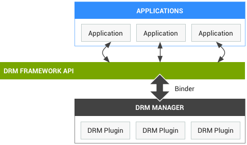

* DRM 框架 API：通过 Android 应用框架提供给应用，并通过适用于标准应用的 Dalvik VM 运行。
* 本机代码 DRM 管理器：用于实现 DRM 框架，并为 DRM 插件（代理）提供接口，以便处理各种 DRM 方案的版权管理和解密操作。

#### 实现安全性

Android 安全团队经常会收到用户发来的请求，希望官方开发团队提供关于如何防止 Android 设备上出现潜在安全问题的信息。Android安全团队偶尔也会对设备进行抽查，并让设备制造商和受影响的合作伙伴知晓潜在问题。

Android安全团队为开发者提供了[安全设计文档](http://developer.android.com/guide/practices/security.html?hl=zh-cn)，以及关于如何在设备上编译或安装系统级软件的详细信息。

为了方便相关人员采用这些最佳做法，Android 安全团队会尽可能将相关测试整合到 [Android 兼容性测试套件 (CTS)](https://source.android.com/compatibility/cts?hl=zh-cn) 和 [Android Lint](http://tools.android.com/tips/lint?hl=zh-cn) 中。

> 兼容性测试套件 (CTS) 是一个免费的商业级测试套件，可在此处下载。CTS 代表兼容性的“机制”。CTS 在桌面设备上运行，并直接在连接的设备或模拟器上执行测试用例。CTS 是一套单元测试，旨在集成到工程师构建设备的日常工作流程（例如通过连续构建系统）中。其目的是尽早发现不兼容性，并确保软件在整个开发过程中保持兼容性。

> 兼容性测试套件验证程序（CTS 验证程序）是对 CTS的补充。CTS 验证程序为无法在没有手动输入（例如音频质量、加速度计等）的固定设备上进行测试的 API 和功能提供测试。

本节主要是摘录了Android安全团队在安全开发方面的最佳实践经验，主要分为：开发流程和产品实现两方面。其中开发流程方面的最佳实践包括：审核源代码、使用自动测试功能、为系统映像签名、为应用（APK）签名、推荐在Google Play发布应用、建立安全团队和应急响应机制积极应对安全事件。在产品实现方面，应遵循以下最佳实践：

* 隔离 Root 进程。遵循信息系统设计的``最小化授权``原则，Root 进程是最常受到提权攻击的目标，因此减少 Root 进程数量有助于降低提权风险。应尽可能减少设备上作为 Root 代码运行的必要代码的数量。尽可能使用常规 Android 进程而非 Root 进程。应尽可能将 Root 代码与不可信数据隔离开来，并尽可能通过 IPC 访问 Root 代码。Root 进程不得通过网络套接字进行监听。Root 进程不得为应用提供通用运行时（例如 Java VM）。
* 隔离系统应用。一般而言，预先安装的应用不应使用共用系统 UID 运行。类似上述隔离 Root 进程的做法，系统代码也应遵循：少量、隔离系统代码与不可信数据、避免提供通过网络套接字监听的系统代码。
* 隔离进程。Android 应用沙盒要求应用与系统中的其他进程（包括 Root 进程和调试程序）隔离开来。除非应用或用户特意启用了 **调试** 功能，否则任何应用都不应违反这一要求。具体来说主要是限制 Root 进程和任何应用不得对其他应用文件夹内和内存中的数据进行访问，除了使用已记录的 Android 调试方法。
* 保护 SUID 文件。新的 SetUID 程序应该不能被不可信程序访问。
* 保护监听套接字。当设备通过任何端口或任何接口进行监听时，CTS 测试都会失败。这是由于操作系统的访问控制机制无法作用于监听套接字，对于使用套接字的本地 IPC，应用必须使用只有某个组可以访问的 UNIX 域套接字来代替。
* 避免记录（敏感）数据。记录数据的做法会增加数据遭泄露的风险并降低系统性能。之前曾发生过多起因 Android 设备上默认安装的应用记录敏感用户数据而导致的公共安全事件。
* 限制对（重要）目录的访问。全局可写目录可能会引入安全漏洞，并且可能会使应用能够重命名可信文件、替换文件或进行基于符号链接的攻击（攻击者可能会利用指向某个文件的符号链接诱使可信程序执行不应执行的操作）。可写目录还可能会导致卸载应用后无法适当清除与相应应用关联的所有文件。
* 保护配置文件。许多驱动程序和服务都依赖于存储在 ``/system/etc``、``/data`` 等目录中的配置文件和数据文件。如果这些文件由某个特权进程处理且为全局可写文件，应用可能能够通过在全局可写文件中创建恶意内容来利用该特权进程中的漏洞。最佳做法是：特权进程使用的配置文件不应为全局可读文件。特权进程使用的配置文件不得为全局可写文件。
* 存储本机代码库。特权设备制造商进程使用的所有代码都必须位于 ``/vendor`` 或 ``/system`` 中；这些文件系统会在设备启动时以只读模式装载。作为最佳做法，系统使用的库或手机上安装的其他权限非常高的应用使用的库也应位于这些文件系统中。这有助于防止出现可让攻击者用来控制特权进程执行的代码的安全漏洞。
* 限制对设备驱动程序的访问。应该只有可信代码能够直接访问驱动程序。首选架构要尽可能提供一个单一用途守护进程来代理向驱动程序发出的调用，并仅限该守护进程访问驱动程序。作为最佳做法，驱动程序设备节点不应为全局可读或全局可写节点。CTS 测试能够检查是否存在全局可读或全局可写驱动程序的已知实例，从而有助于强制执行这种最佳做法。
* 停用 ADB。Android 调试桥 (ADB) 是一款非常实用的开发和调试工具，但它只适合在受控的安全环境中使用，不应针对一般使用情况启用该工具。最佳做法是：ADB 必须默认处于停用状态。ADB 必须要求用户先将其开启，然后再接受连接。
* 解锁引导加载程序。许多 Android 设备都支持解锁引导加载程序。解锁引导加载程序后，设备所有者将能够修改系统分区和/或安装自定义操作系统。常见用例包括在设备上安装第三方 ROM 以及进行系统级开发。作为最佳实践，在解锁之前，可解锁的 Android 设备必须先安全地清除所有用户数据。如果未能适当删除所有数据便进行解锁，能够接触到这些设备的攻击者便可以在未经授权的情况下获取机密的 Android 用户数据。为了防止用户数据泄露，支持解锁的设备必须正确实现解锁（我们已见到过设备制造商以不当方式实现解锁的无数实例）。

更详细的安全开发最佳实践请查阅[Android官方专题页面：实现安全保护措施](https://source.android.com/security/overview/implement)。

#### 小结

<a href="https://source.android.com/devices/">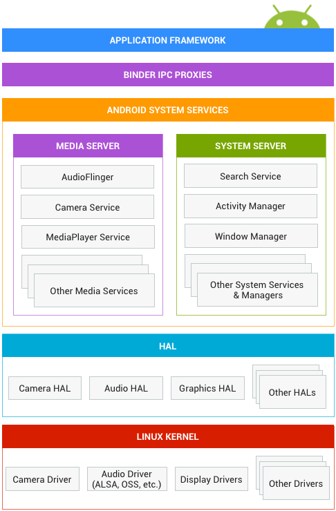</a>

如上图所示是``Android 系统架构图``，该图中，从上到下依次是：应用框架、Binder IPC代理、Android系统服务、硬件抽象层和Linux内核。下图引用自[Android开发者网站的API指南之Android软件栈](https://developer.android.com/guide/platform/index.html)。相比较于上图侧重于“架构师”视角，下图更侧重于“开发者”视角。

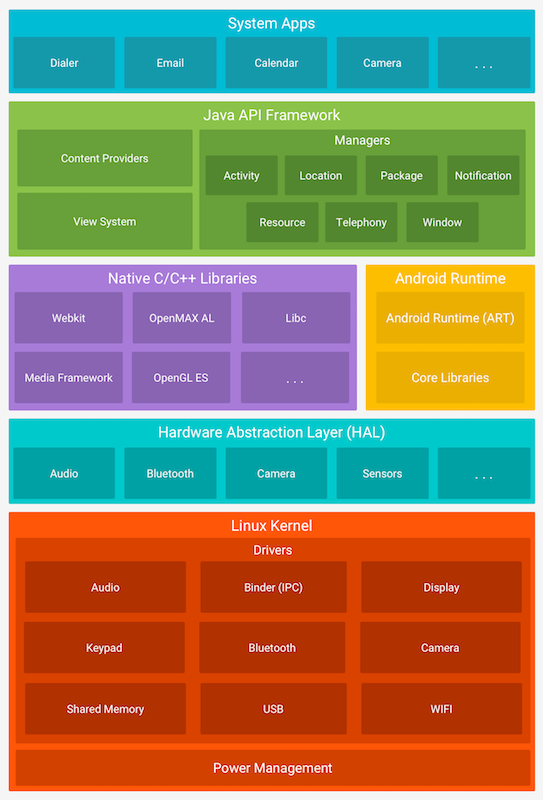

按照每一层主要使用的编程语言差别进行划分，应用框架和Binder IPC代理主要使用Java编程语言，Android系统服务、硬件抽象层和Linux内核主要使用C/C++以及一些汇编代码开发实现。在Google I/O 2017大会上，Google正式宣布[Android Studio 3.0完全支持Kotlin](Google I/O 2017大会上，Google正式宣布Android Studio 3.0完全支持Kotlin，Kotlin也将从JetBrain移交给独立的非盈利组织来进行后续的开发。)，Kotlin也将从JetBrain移交给独立的非盈利组织来进行后续的开发。Kotlin可以与Java进行完整的互操作，并且也是运行在JVM上。Kotlin还能调用C++和Android代码，因为它可以通过external标识符来支持JNI。Kotlin的源代码可以被编译成JVM的字节码，也可以生成JavaScript代码。

基于以上现状，Android系统安全的研究工作需要的先修基础包括了：Java、C/C++和汇编相关技术。具体到不同的组件，需要的技术基础可以是具体的一种编程语言。

按照每一层开发的代码使用的开源授权协议差别进行分类，除了Linux内核普遍使用 ``GPL`` 协议授权之外，其他所有层的代码普遍使用的是 ``Apache Software License`` 授权协议（简称 ``ASL`` ）。关于不同的开源授权协议许可的差异，可以查阅阮一峰翻译的这篇[如何选择开源许可证？](http://www.ruanyifeng.com/blog/2011/05/how_to_choose_free_software_licenses.html)。Google主导的Android项目选择 ``ASL`` 的主要原因是所有构建在Android源代码之上的硬件驱动和应用程序，都可以保持封闭，有利于吸引商业公司在Android生态中投入研发资源的同时保守商业秘密和技术竞争力。当然，选择 ``ASL`` 同样也是可以开放自己编写的代码给开源社区，一切都由代码作者自行决定。

正是由于Android项目中既有开源代码，也有使用开源授权协议的闭源软件，所以Android系统安全的研究既包括了以源代码审计为代表的白盒技术，也需要用到以二进制程序逆向为代表的黑盒技术。当然，同时用到了二进制和源代码相关安全技术的灰盒分析也有用武之地。

## Android应用软件基础

### Android开发基本流程

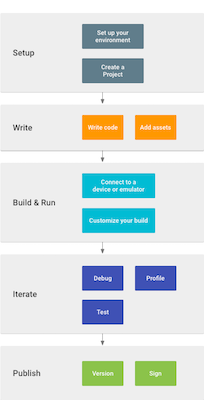

如上图所示概括了一个Android应用软件开发的5个主要阶段，分别是：[开发环境配置](../chap0x05/exp.md)、编写代码、构建和运行、迭代（调试、测试和优化）和发布应用。

> 编写代码和迭代（调试、测试和优化）

Android官方推荐的编写代码环境是[Android Studio](https://developer.android.com/studio/index.html?hl=zh-cn)。Android Studio 是基于 [IntelliJ IDEA](https://www.jetbrains.com/idea/) 的官方 Android 应用开发集成开发环境 (IDE)。 除了 IntelliJ 强大的代码编辑器和开发者工具，Android Studio 提供了更多可提高 Android 应用构建效率的[功能](https://developer.android.com/studio/intro/index.html?hl=zh-cn)，例如：

* 基于 Gradle 的灵活构建系统
* 快速且功能丰富的模拟器
* 可针对所有 Android 设备进行开发的统一环境
* Instant Run，可将变更推送到正在运行的应用，无需构建新的 APK
* 可帮助开发者构建常用应用功能和导入示例代码的代码模板和 GitHub 集成
* 丰富的测试工具和框架
* 可捕捉性能、易用性、版本兼容性以及其他问题的 Lint 工具
* C++ 和 NDK 支持
* 内置对 [Google 云端平台](http://developers.google.com/cloud/devtools/android_studio_templates/?hl=zh-cn)的支持，可轻松集成 Google Cloud Messaging 和 App 引擎

使用Android Studio创建的一个新Android项目时的典型目录结构如下图所示：

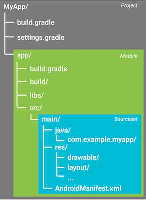

* settings.gradle 文件位于项目根目录，用于指示 Gradle 在构建应用时应将哪些模块包括在内。对大多数项目而言，该文件很简单，只包括以下内容：
```
include ‘:app’
```
不过，多模块项目需要指定应包括在最终构建之中的每个模块。
* 模块级 build.gradle 文件位于每个 <project>/<module>/ 目录，用于配置适用于其所在模块的构建设置
* Gradle 还包括两个属性文件，位于项目根目录，可用于指定适用于 Gradle 构建工具包本身的设置：
    * gradle.properties，可以在其中配置项目范围 Gradle 设置，例如 Gradle 后台进程的最大堆大小。如需了解详细信息，请参阅[构建环境](https://docs.gradle.org/current/userguide/build_environment.html)；
    * local.properties，为构建系统配置本地环境属性，例如 SDK 安装路径。由于该文件的内容由 Android Studio 自动生成并且专用于本地开发者环境，因此开发者不应手动修改该文件，或将其纳入版本控制系统。
* Android Studio 按逻辑关系将每个模块的源代码和资源分组为**源集**（source sets）。模块的 main/ 源集包括其所有构建变体共用的代码和资源，其他源集目录为可选项（配置新的构建变体时，Android Studio 不会自动创建这些目录）。

> 构建和运行、发布应用

在完成了代码的编写之后，Android 构建系统编译应用资源和源代码，然后将它们打包成可供测试、部署、签署和分发的 APK。Android Studio 使用 [Gradle](http://www.gradle.org/) 这一高级构建工具包来自动化执行和管理构建流程，同时也允许开发者定义灵活的自定义构建配置。每个构建配置均可自行定义一组代码和资源，同时对所有应用版本共有的部分加以重复利用。Android Plugin for Gradle 与这个构建工具包协作，共同提供专用于构建和测试 Android 应用的流程和可配置设置。

Gradle 和 Android 插件独立于 Android Studio 运行。这意味着，开发者可以在 Android Studio 内、使用计算机上的命令行工具或在未安装 Android Studio 的计算机（例如持续性集成服务器）上构建 Android 应用。如果不使用 Android Studio，可以从命令行构建和运行应用。无论是从命令行、在远程计算机上还是使用 Android Studio 构建项目，构建的输出都相同。

一个**典型 Android 应用模块的构建流程**如下图所示：

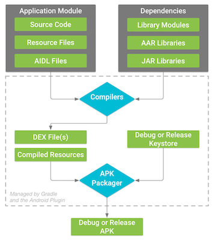

典型 Android 应用模块的构建流程通常依循下列步骤：

1. 编译器将源代码转换成 DEX（Dalvik Executable) 文件（其中包括运行在 Android 设备上的字节码），将所有其他内容转换成已编译资源。
2. APK 打包器将 DEX 文件和已编译资源合并成单个 APK。不过，必须先签署 APK，才能将应用安装并部署到 Android 设备上。
3. APK 打包器使用调试或发布密钥库签署 APK：
    * 如果构建的是调试版本的应用（即专用于测试和分析的应用），打包器会使用调试密钥库签署应用。Android Studio 自动使用调试密钥库配置新项目。
    * 如果构建的是打算向外发布的发布版本应用，打包器会使用发布密钥库签署应用。要创建发布密钥库，请阅读[在 Android Studio 中签署您的应用](https://developer.android.com/studio/publish/app-signing.html?hl=zh-cn#studio)。
6. 在生成最终 APK 之前，打包器会使用 [zipalign](https://developer.android.com/studio/command-line/zipalign.html?hl=zh-cn) 工具对应用进行优化，减少其在设备上运行时的内存占用。

构建流程结束时，我们将获得可用来进行部署、测试的调试 APK，或者可用来发布给外部用户的发布 APK。

### Android应用基础

[Android 应用采用 Java 编程语言编写](https://developer.android.com/guide/components/fundamentals.html)。Android SDK 工具将源代码连同所有数据和资源文件编译到一个 APK：***Android 软件包***，即带有 ``.apk`` 后缀的存档文件中。一个 APK 文件包含 Android 应用的所有内容，它是基于 Android 系统的设备用来安装应用的文件。

安装到设备后，每个 Android 应用都运行在自己的安全沙箱内：

* Android 操作系统是一种多用户 Linux 系统，其中的每个应用都是一个不同的用户；
* 默认情况下，系统会为每个应用分配一个唯一的 Linux 用户 ID（该 ID 仅由系统使用，应用并不知晓）。系统为应用中的所有文件设置权限，使得只有分配给该应用的用户 ID 才能访问这些文件；
* 每个进程都具有自己的虚拟机 (VM)，因此应用代码是在与其他应用隔离的环境中运行；
* 默认情况下，每个应用都在其自己的 Linux 进程内运行。Android 会在需要执行任何应用组件时启动该进程，然后在不再需要该进程或系统必须为其他应用恢复内存时关闭该进程。

Android 系统可以通过这种方式实现最小权限原则。也就是说，默认情况下，每个应用都只能访问执行其工作所需的组件，而不能访问其他组件。 这样便营造出一个非常安全的环境，在这个环境中，应用无法访问系统中其未获得权限的部分。

不过，应用仍然可以通过一些途径与其他应用共享数据以及访问系统服务：

* 可以安排两个应用共享同一 Linux 用户 ID，在这种情况下，它们能够相互访问彼此的文件。 为了节省系统资源，可以安排具有相同用户 ID 的应用在同一 Linux 进程中运行，并共享同一 VM（应用还必须使用相同的证书签署）。
* 应用可以请求访问设备数据（如用户的联系人、短信、可装载存储装置 [SD 卡]、相机、蓝牙等）的权限。 用户必须明确授予这些权限。 如需了解详细信息，请参阅 [使用系统权限](https://developer.android.com/training/permissions/index.html)。

#### 应用组件

应用组件是 Android 应用的基本构建基块。每个组件都是一个不同的点，系统可以通过它进入具体应用。 并非所有组件都是用户的实际入口点，有些组件相互依赖，但每个组件都以独立实体形式存在，并发挥特定作用。每个组件都是唯一的构建基块，有助于定义应用的总体行为。

共有四种不同的应用组件类型。每种类型都服务于不同的目的，并且具有定义组件的创建和销毁方式的不同生命周期。

以下便是这四种应用组件类型：

> Activity（活动）

Activity 表示具有用户界面的单一屏幕。例如，电子邮件应用可能具有一个显示新电子邮件列表的 Activity、一个用于撰写电子邮件的 Activity 以及一个用于阅读电子邮件的 Activity。 尽管这些 Activity 通过协作在电子邮件应用中形成了一种紧密结合的用户体验，但每一个 Activity 都独立于其他 Activity 而存在。 因此，其他应用可以启动其中任何一个 Activity（如果电子邮件应用允许）。 例如，相机应用可以启动电子邮件应用内用于撰写新电子邮件的 Activity，以便用户共享图片。

Activity 作为 [Activity](https://developer.android.com/reference/android/app/Activity.html) 的子类实现，开发者可以在 [Activity 开发者指南](https://developer.android.com/guide/components/activities.html) 中了解有关它的更多详情。

> Service（服务）

服务是一种在后台运行的组件，用于执行长时间运行的操作或为远程进程执行作业。服务不提供用户界面。 例如，当用户位于其他应用中时，服务可能在后台播放音乐或者通过网络获取数据，但不会阻断用户与 Activity 的交互。 诸如 Activity 等其他组件可以启动服务，让其运行或与其绑定以便与其进行交互。

服务作为 [Service](https://developer.android.com/reference/android/app/Service.html) 的子类实现，开发者可以在 [服务开发者指南](https://developer.android.com/guide/components/services.html) 中了解有关它的更多详情。

> Content Provider（内容提供者）

``内容提供者``管理一组共享的应用数据。开发者可以将数据存储在文件系统、SQLite 数据库、网络上或当前应用可以访问的任何其他持久化存储位置。 其他应用可以通过``内容提供者``查询数据，甚至修改数据（如果``内容提供者``允许）。 例如，Android 系统可提供管理用户联系人信息的``内容提供者``。 因此，任何具有适当权限的应用都可以查询``内容提供者``的某一部分（如 [ContactsContract.Data](https://developer.android.com/reference/android/provider/ContactsContract.Data.html) ），以读取和写入有关特定人员的信息。

``内容提供者``也适用于读取和写入当前应用不共享的私有数据。 例如，记事本示例应用使用``内容提供者``来保存笔记。

``内容提供者``作为 [ContentProvider](https://developer.android.com/reference/android/content/ContentProvider.html) 的子类实现，并且必须实现让其他应用能够执行事务的一组标准 API。 如需了解详细信息，请参阅[``内容提供者``开发者指南](https://developer.android.com/guide/topics/providers/content-providers.html)。

> Broadcast Receiver（广播接收器）

``广播接收器``是一种用于响应系统范围广播通知的组件。 许多广播都是由系统发起的。例如，通知屏幕已关闭、电池电量不足或已拍摄照片的广播。应用也可以发起广播。例如，通知其他应用某些数据已下载至设备，并且可供其使用。 尽管``广播接收器``不会显示用户界面，但它们可以[创建状态栏通知](https://developer.android.com/guide/topics/ui/notifiers/notifications.html)，在发生广播事件时提醒用户。 但``广播接收器``更常见的用途只是作为通向其他组件的“通道”，设计用于执行极少量的工作。 例如，它可能会基于事件发起一项服务来执行某项工作。

``广播接收器``作为 [BroadcastReceiver](https://developer.android.com/reference/android/content/BroadcastReceiver.html) 的子类实现，并且每条广播都作为 [Intent](https://developer.android.com/reference/android/content/Intent.html) 对象进行传递。 如需了解详细信息，请参阅 [BroadcastReceiver](https://developer.android.com/reference/android/content/BroadcastReceiver.html) 类。

Android 系统设计的独特之处在于，**任何应用都可以启动其他应用的组件**。 例如，如果开发者想让用户使用设备的相机拍摄照片，很可能有另一个应用可以执行该操作，那么当前应用就可以利用该应用，而不是开发一个 Activity 来自行拍摄照片。 开发者不需要集成甚至链接到该相机应用的代码，而是只需启动拍摄照片的相机应用中的 Activity。 完成拍摄时，系统甚至会将照片返回当前（调用者）应用，以便（调用者）使用。对用户而言，就好像相机真正是当前应用的组成部分。

当系统启动某个组件时，会启动该应用的进程（如果尚未运行），并实例化该组件所需的类。 例如，如果当前应用启动相机应用中拍摄照片的 Activity，则该 Activity 会在属于相机应用的进程，而不是当前应用的进程中运行。因此，与大多数其他系统上的应用不同，**Android 应用并没有单一入口点**（例如，没有 main() 函数）。

由于系统在单独的进程中运行每个应用，且其文件权限会限制对其他应用的访问，因此当前应用无法直接启动其他应用中的组件，但 Android 系统却可以。因此，要想启动其他应用中的组件，当前应用必须向系统传递一则消息，说明当前应用想启动特定组件的 Intent。 系统随后便会为当前应用启动该组件。

四种组件类型中的三种：Activity、服务和广播接收器通过名为 Intent 的异步消息进行启动。Intent 会在运行时将各个组件相互绑定（可以类比为在不同组件间传递消息的信使），无论组件属于当前应用还是其他应用。

Intent 使用 [Intent](https://developer.android.com/reference/android/content/Intent.html) 对象创建，它定义的消息用于启动特定组件或特定类型的组件。Intent 对象携带了 Android 系统用来确定要启动哪个组件的信息（例如，准确的组件名称或应当接收该 Intent 的组件类别），以及收件人组件为了正确执行操作而使用的信息（例如，要采取的操作以及要处理的数据）。Intent 可以是显式的，也可以是隐式的。

* 显式（Explicit）Intent：按名称（完全限定类名）指定要启动的组件。 通常，开发者会在自己的应用中使用显式 Intent 来启动组件，这是因为开发者知道要启动的 Activity 或服务的类名。例如，启动新 Activity 以响应用户操作，或者启动服务以在后台下载文件。
* 隐式（Implicit）Intent：不会指定特定的组件，而是声明要执行的常规操作，从而允许其他应用中的组件来处理它。创建隐式 Intent 时，Android 系统通过将 Intent 的内容与在设备上其他应用的清单文件中声明的 [Intent 过滤器](https://developer.android.com/reference/android/content/IntentFilter.html)进行比较，从而找到要启动的相应组件。 如果 Intent 与 Intent 过滤器匹配，则系统将启动该组件，并向其传递 Intent 对象。 如果多个 Intent 过滤器兼容，则系统会显示一个**对话框**，**支持用户选取要使用的应用**。Intent 过滤器是应用清单文件中的一个表达式，它指定该组件要接收的 Intent 类型。 例如，**通过为 Activity 声明 Intent 过滤器，开发者可以使其他应用能够直接使用某一特定类型的 Intent 启动 Activity**。同样，如果开发者没有为 Activity 声明任何 Intent 过滤器，则 Activity 只能通过显式 Intent 启动。隐式 Intent 指定能够在可以执行相应操作的设备上调用任何应用的操作。 如果当前应用无法执行该操作而其他应用可以，且开发者希望用户选取要使用的应用，则使用隐式 Intent 非常有用。

```java
// 显式 Intent 实例
// Executed in an Activity, so 'this' is the Context
// The fileUrl is a string URL, such as "http://www.example.com/image.png"
Intent downloadIntent = new Intent(this, DownloadService.class);
downloadIntent.setData(Uri.parse(fileUrl));
startService(downloadIntent);

// 隐式 Intent 实例
// Create the text message with a string
Intent sendIntent = new Intent();
sendIntent.setAction(Intent.ACTION_SEND);
sendIntent.putExtra(Intent.EXTRA_TEXT, textMessage);
sendIntent.setType("text/plain");

// Verify that the intent will resolve to an activity
if (sendIntent.resolveActivity(getPackageManager()) != null) {
    startActivity(sendIntent);
}
```

对于 Activity 和服务， Intent 定义要执行的操作（例如，“查看”或“发送”某个内容），并且可以指定要执行操作的数据的 URI（以及正在启动的组件可能需要了解的信息）。 例如， Intent 传达的请求可以是启动一个显示图像或打开网页的 Activity。 在某些情况下，应用可以启动 Activity 来接收结果，在这种情况下，Activity 也会在 [Intent](https://developer.android.com/reference/android/content/Intent.html) 中返回结果（例如，可以发出一个 Intent，让用户选取某位联系人并将其返回给包括指向所选联系人的 URI）。

为了确保应用的安全性，[Android开发者官网上的Intent 和 Intent 过滤器使用指南](https://developer.android.com/guide/components/intents-filters.html?hl=zh-cn)建议：启动 Service 时，应始终使用显式 Intent，且不要为服务声明 Intent 过滤器。使用隐式 Intent 启动服务存在安全隐患，因为开发者无法确定哪些服务将响应 Intent，且用户无法看到哪些服务已启动。从 Android 5.0（API 级别 21）开始，如果使用隐式 Intent 调用 bindService()，系统会引发异常。

对于广播接收器， Intent 只会定义要广播的通知（例如，指示设备电池电量不足的广播只包括指示“电池电量不足”的已知操作字符串）。

Intent 不会启动另一个组件类型：内容提供者，后者会在成为 ContentResolver 的请求目标时启动。 内容解析程序通过内容提供者处理所有直接事务，使得通过提供程序执行事务的组件可以无需执行事务，而是改为在 ContentResolver 对象上调用方法。 这会在内容提供者与请求信息的组件之间留出一个抽象层（以确保安全）。

每种类型的组件有不同的启动方法：

* 开发者可以通过将 Intent 传递到 startActivity() 或 startActivityForResult()（当前应用想让 Activity 返回结果时）来启动 Activity（或为其安排新任务）。
* 开发者可以通过将　Intent 传递到 startService() 来启动服务（或对执行中的服务下达新指令）。 或者，也可以通过将 Intent 传递到 bindService() 来绑定到该服务。
* 开发者可以通过将 Intent 传递到 sendBroadcast()、sendOrderedBroadcast() 或 sendStickyBroadcast() 等方法来发起广播；
* 开发者可以通过在 ContentResolver 上调用 query() 来对内容提供者执行查询。

如需了解有关 Intent 用法的详细信息，请参阅 [Intent 和 Intent 过滤器](https://developer.android.com/guide/components/intents-filters.html)文档。 以下文档中还提供了有关启动特定组件的详细信息： [Activity](https://developer.android.com/guide/components/activities.html)、[服务](https://developer.android.com/guide/components/services.html)、[BroadcastReceiver](https://developer.android.com/reference/android/content/BroadcastReceiver.html) 和[内容提供者](https://developer.android.com/guide/topics/providers/content-providers.html)。

#### AndroidManifest.xml

在 Android 系统启动应用组件之前，系统必须通过读取应用的 AndroidManifest.xml 文件（“清单”文件）确认组件存在。 当前应用必须在此文件中声明其所有组件，每个应用的根目录中都必须包含一个 [AndroidManifest.xml](https://developer.android.com/guide/topics/manifest/manifest-intro.html) 文件（且文件名精确无误）。 清单文件向 Android 系统提供应用的必要信息，系统必须具有这些信息方可运行应用的任何代码。

此外，清单文件还可执行以下操作：

* 为应用的 Java 软件包命名。软件包名称充当应用的**唯一标识**符。
* 描述应用的各个组件，包括构成应用的 Activity、服务、广播接收器和内容提供程序。它还为实现每个组件的类命名并发布其功能，例如它们可以处理的 [Intent](https://developer.android.com/reference/android/content/Intent.html) 消息。这些声明向 Android 系统告知有关组件以及可以启动这些组件的条件的信息。
* 确定托管应用组件的进程。
* 声明应用必须具备哪些权限才能访问 API 中受保护的部分并与其他应用交互。还声明其他应用与该应用组件交互所需具备的权限
* 列出 [Instrumentation](https://developer.android.com/reference/android/app/Instrumentation.html)（``插桩``） 类，这些类可在应用运行时提供分析和其他信息。这些声明只会在应用处于开发阶段时出现在清单中，在应用发布之前将移除。
* 声明应用所需的最低 Android API 级别
* 列出应用必须链接到的库

#### 应用资源

Android 应用并非只包含代码，它还需要与源代码分离的资源，如图像、音频文件以及任何与应用的视觉呈现有关的内容。 例如，开发者应该通过 XML 文件定义 Activity 用户界面的动画、菜单、样式、颜色和布局。使用应用资源能够在不修改代码的情况下轻松地更新应用的各种特性，并可通过提供备用资源集让开发者能够针对各种设备配置（如不同的语言和屏幕尺寸）优化应用。

对于 Android 项目中包括的每一项资源，SDK 构建工具都会定义一个唯一的整型 ID，开发者可以利用它来引用应用代码或 XML 中定义的其他资源中的资源。 例如，如果当前应用包含一个名为 logo.png 的图像文件（保存在 res/drawable/ 目录中），则 SDK 工具会生成一个名为 R.drawable.logo 的资源 ID，可以利用它来引用该图像并将其插入到当前用户界面。

提供与源代码分离的资源的其中一个最重要优点在于，开发者可以提供针对不同设备配置的备用资源。例如，通过在 XML 中定义 UI 字符串，开发者可以将字符串翻译为其他语言，并将这些字符串保存在单独的文件中。 然后，Android 系统会根据向资源目录名称追加的语言限定符（如为法语字符串值追加 res/values-fr/）和用户的语言设置，对当前 UI 应用相应的语言字符串。

Android 支持许多不同的备用资源限定符。限定符是一种加入到资源目录名称中，用来定义这些资源适用的设备配置的简短字符串。 再举一例，开发者应该经常会根据设备的屏幕方向和尺寸为 Activity 创建不同的布局。例如，当设备屏幕为纵向（长型）时，可能想要一种垂直排列按钮的布局；但当屏幕为横向（宽型）时，应按水平方向排列按钮。 要想根据方向更改布局，开发者可以定义两种不同的布局，然后对每个布局的目录名称应用相应的限定符。然后，系统会根据当前设备方向自动应用相应的布局。

如需了解有关可以在应用中包括的不同资源类型以及如何针对不同设备配置创建备用资源的详细信息，请阅读[提供资源](https://developer.android.com/guide/topics/resources/providing-resources.html)。

### APK签名与分发（安装）

Android 要求所有 APK 必须先使用证书进行数字签署，然后才能安装。公钥证书（也称为数字证书或身份证书）包含公钥/私钥对的公钥，以及可以标识密钥所有者的一些其他元数据（例如名称和位置）。证书的所有者持有对应的私钥。

在开发者签署 APK 时，签署工具会将公钥证书附加到 APK。公钥证书充当“指纹”，用于将 APK 唯一关联到开发者及开发者的对应私钥。这有助于 Android 确保 APK 开发者的任何将来更新都是原版更新并来自原始作者。用于创建此证书的密钥称为 **应用签名密钥**。

密钥库是一种包含一个或多个私钥的二进制文件。每个应用在其整个生命周期内必须使用相同证书，以便用户能够以应用更新的形式安装新版本。

从 IDE 中运行或调试项目时，Android Studio 将自动使用通过 Android SDK 工具生成的调试证书签署当前项目对应的 APK。当在 Android Studio 中首次运行或调试项目时，IDE 将自动在 ``$HOME/.android/debug.keystore`` 中创建调试密钥库和证书，并设置密钥库和密钥密码。

由于调试证书通过构建工具创建并且在设计上不安全，大多数应用商店（包括 Google Play 商店）都不接受使用调试证书签署要发布的 APK。

Android Studio 会自动将开发者的调试签署信息存储在签署配置中，因此开发者不必在每次调试时都输入此信息。签署配置是一种包含签署 APK 所需全部必要信息的对象，这些信息包括密钥库位置、密钥库密码、密钥名称和密钥密码。

由于应用签名密钥用于验证应用开发者的应用所有权身份，并确保为用户进行无缝而安全的更新，因此，管理和保护开发者的发布密钥对于开发者和他的用户而言都非常重要。开发者可以选择使用 Google Play 应用签名以利用 Google 的基础架构安全地管理和存储开发者的应用签名密钥，也可以选择自行管理和保护自己的密钥库和应用签名密钥。

关于具体的APK文件签名操作方法，请参阅[Android开发者官网上的应用签署指南](https://developer.android.com/studio/publish/app-signing.html)。

#### APK 签名方案v2

[APK 签名方案 v2](https://source.android.com/security/apksigning/v2) 是一种**全文件签名方案**，该方案能够发现对 APK 的受保护部分进行的所有更改，从而有助于加快验证速度并增强完整性保证。

使用 APK 签名方案 v2 进行签名时，会在 APK 文件中插入一个 APK 签名分块，该分块位于“ZIP 中央目录”部分之前并紧邻该部分。在“APK 签名分块”内，v2 签名和签名者身份信息会存储在 APK 签名方案 v2 分块中。


APK 签名方案 v2 是在 Android 7.0 (Nougat, API Level 24.0.3) 中引入的。为了使 APK 可在 Android 6.0 (Marshmallow) 及更低版本的设备上安装，应先使用 [JAR 签名](https://source.android.com/security/apksigning/#v1)功能对 APK 进行签名，然后再使用 v2 方案对其进行签名。为了最大限度地提高兼容性，应同时采用 v1 和 v2 这两种方案对应用进行签名。与只通过 v1 方案签名的应用相比，通过 v2 方案签名的应用能够更快速地安装到 Android Nougat 及更高版本的设备上。更低版本的 Android 平台会忽略 v2 签名，这就需要应用包含 v1 签名。

v1 签名不保护 APK 的某些部分，例如 ZIP 元数据。APK 验证程序需要处理大量不可信（尚未经过验证）的数据结构，然后会舍弃不受签名保护的数据。这会导致相当大的受攻击面。此外，APK 验证程序必须解压所有已压缩的条目，而这需要花费更多时间和内存。为了解决这些问题，Android 7.0 中引入了 APK 签名方案 v2。

为了保持与当前 APK 格式向后兼容，v2 及更高版本的 APK 签名会存储在“APK 签名分块”（``APK Signing Block``）内，该分块是为了支持 APK 签名方案 v2 而引入的一个新容器。在 APK 文件中，“APK 签名分块”位于“ZIP 中央目录”（位于文件末尾）之前并紧邻该部分。

为了保护 APK 内容，APK 包含以下 4 个部分：

* ZIP 条目的内容（从偏移量 0 处开始一直到“APK 签名分块”的起始位置）
* APK 签名分块
* ZIP 中央目录
* ZIP 中央目录结尾

APK 签名方案 v2 负责保护第 1、3、4 部分的完整性，以及第 2 部分包含的“APK 签名方案 v2 分块”中的 ``signed data`` 分块的完整性。

第 1、3 和 4 部分的完整性通过其内容的一个或多个摘要来保护，这些摘要存储在 signed data 分块中，而这些分块则通过一个或多个签名来保护。

第 1、3 和 4 部分的摘要采用以下计算方式，类似于两级 [Merkle 树](https://en.wikipedia.org/wiki/Merkle_tree)。每个部分都会被拆分成多个大小为 1 MB（220 个字节）的连续块。每个部分的最后一个块可能会短一些。每个块的摘要均通过字节 0xa5 的连接、块的长度（采用小端字节序的 uint32 值，以字节数计）和块的内容进行计算。顶级摘要通过字节 0x5a 的连接、块数（采用小端字节序的 uint32 值）以及块的摘要的连接（按照块在 APK 中显示的顺序）进行计算。摘要以分块方式计算，以便通过并行处理来加快计算速度。

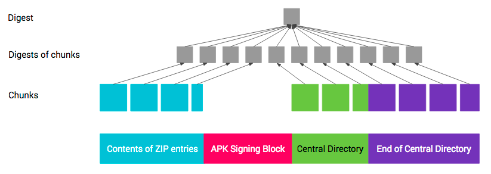

由于第 4 部分（ZIP 中央目录结尾）包含“ZIP 中央目录”的偏移量，因此该部分的保护比较复杂。当“APK 签名分块”的大小发生变化（例如，添加了新签名）时，偏移量也会随之改变。因此，在通过“ZIP 中央目录结尾”计算摘要时，必须将包含“ZIP 中央目录”偏移量的字段视为包含“APK 签名分块”的偏移量。

#### APK 签名方案的防回滚保护

攻击者可能会试图在支持对带 v2 签名的 APK 进行验证的 Android 平台上将带 v2 签名的 APK 作为带 v1 签名的 APK 进行验证。为了防范此类攻击，带 v2 签名的 APK 如果还带 v1 签名，其 META-INF/*.SF 文件的主要部分中必须包含 ``X-Android-APK-Signed`` 属性。该属性的值是一组以英文逗号分隔的 APK 签名方案 ID（v2 方案的 ID 为 2）。在验证 v1 签名时，对于此组中验证程序首选的 APK 签名方案（例如，v2 方案），如果 APK 没有相应的签名，APK 验证程序必须要拒绝这些 APK。此项保护依赖于内容 META-INF/*.SF 文件受 v1 签名保护这一事实。请参阅 [JAR 已签名的 APK 的验证部分](https://source.android.com/security/apksigning/v2#v1-verification)。

攻击者可能会试图从“APK 签名方案 v2 分块”中删除安全系数较高的签名。为了防范此类攻击，对 APK 进行签名时使用的签名算法 ID 的列表会存储在通过各个签名保护的 ``signed data`` 分块中。

#### APK 签名的验证

在 Android 7.0 中，可以根据 APK 签名方案 v2（v2 方案）或 JAR 签名（v1 方案）验证 APK。更低版本的平台会忽略 v2 签名，仅验证 v1 签名。


如上图所示就是一个APK 签名验证过程，新步骤以红色显示。

#### APK 安装

Android应用安装有如下四种方式：

* **系统应用安装**：开机时加载系统的APK和应用，没有安装界面；
* **网络下载应用安装**：通过各种market应用完成，没有安装界面；
* **ADB工具安装**：即通过Android的SDK开发tools里面的adb.exe程序安装，没有安装界面；
* **第三方应用安装**：通过SD卡里的APK文件安装(比如双击APK文件触发)，有安装界面，系统默认已经安装了一个安装卸载应用的程序，即由[packageinstaller.apk](https://developer.android.com/reference/android/content/pm/PackageInstaller.html)应用处理安装及卸载过程的界面，分别是：``PackageInstallerActivity`` 和 ``UninstallerActivity`` 。这两个Activity可以通过发送Intent的方式启动。

APK安装过程可能会涉及到以下目录：

* ``/system/app`` ：系统自带的应用程序，获得adb root权限才能删除
* ``/data/app`` ：用户程序安装的目录。安装时把apk文件复制到此目录
* ``/data/data`` ：存放应用程序的数据
* ``/data/dalvik-cache`` ：将apk中的dex文件安装到dalvik-cache目录下(dex文件是dalvik虚拟机的可执行文件,当然，ART–Android Runtime的可执行文件格式为oat，启用ART时，系统会执行dex文件转换至oat文件)
* ``/data/system`` ：该目录下的``packages.xml``文件，类似于Windows的注册表，这个文件是在解析apk时由writeLP()创建的，里面记录了系统的权限列表，以及每个APK的name， codePath， flags， ts， version， uesrid等信息，这些信息主要通APK的 ``AndroidManifest.xml`` 解析获取，解析完APK后将更新信息写入这个文件并保存到内部存储，下次开机直接从里面读取相关信息添加到内存相关列表中。当有APK升级，安装或删除时会更新这个文件。``packages.list``文件中保存着应用的包名，uid，所属的用户，以及 ``home`` 目录.因为Android中每一个应用都类似Linux系统中用户的概念，它们都有自己的 ``home`` 目录，用来保存应用特定的数据。

安卓系统 **安装** 一个应用时，系统大致会进行如下操作：

* 复制APK安装包到 ``/data/app`` 目录下，文件名会以应用的package命名；
* 解压并扫描安装包，把dex文件(Dalvik字节码)保存到dalvik-cache目录(一般情况下，会先执行dexopt即dex文件的优化，将优化后的dex文件保存至该目录下)，并在 ``/data/data`` 目录下创建对应的应用数据目录( ``/data/data`` 目录可读可写)；
* 更新 ``/data/system/packages.xml`` 中的内容，将APK的信息加入进去。

如下图所示，总结了一个典型Android应用安装流程和应用安装涉及到的主要目录。

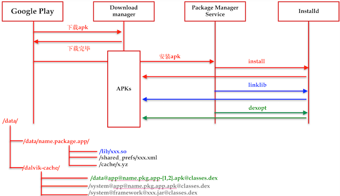

上图中，``PackageManagerService``（简记为``PMS``）由system_server启动，它全面负责应用包的安装，卸载，权限检查等工作。在每次开机的时候，``PMS`` 都会在其构造函数中，对指定的目录的APK进行扫描。对于没有安装的APK文件会触发安装过程。``PMS`` 在扫描过程中会给 ``installd`` 发送消息，请求创建应用程序的数据目录和执行代码优化。在应用程序的管理工作中，有时候需要对存储设备做一些操作，比如创建目录修改目录权限等，这些操作有的是需要特权级的权限。``PMS`` 存活在system_server进程中，这个进程的用户为 ``system``，它是没有特权级的权限的，出于最小化授权和进程隔离的角度考虑，Android单独将一部分需要特权的工作，转交给 ``installd`` 进程去完成。``installd`` 也算是个服务端了，它是通过socket来接收客户端的消息，然后进行处理。

对照安装过程，**卸载** 过程与之相逆：删除安装过程中在上述目录下创建的文件及目录。

#### 免安装应用（Instant Apps）

Android 免安装应用使原生 Android 应用能够在启动网址时运行，无需安装应用。 当 **Google Play** 商店收到与 免安装应用匹配的网址请求时，它将必需的代码文件发送到发送该请求的 Android 设备。 然后，该设备将运行此应用。

> 注：Android 免安装应用仅在运行 Android 5.0（API level 21）或更高版本的 Android 设备上，且系统必须内置Google Play服务才可以正常工作。

> 应用即功能

Android 免安装应用为开发者构建应用和用户使用应用提供了一种新颖而独特的方式。 在介绍 Android 免安装应用的核心概念之前，了解一些基本术语很有用处。

基本而言，应用至少有一项功能（即应用执行的操作）：例如，查找地图上的位置、发送电子邮件或读取每日新闻。 许多应用都提供多种功能。 例如，除查找地图上的位置外，地图应用可能还允许用户查找附近的餐馆或通过电子邮件发送位置链接。

每一个此类操作（查找位置、查找附近的餐馆、分享位置链接）都是地图应用中的一项功能。

借助 Android 免安装应用，用户可以从 Google Play 商店下载某个应用的某项功能，而无需下载和安装整个应用。 当用户从免安装应用请求一项功能时，他们仅收到运行该特定功能所必需的代码，不多也不少。 在用户使用完此功能后，系统可以丢弃该功能的代码。

回到前面的地图应用示例，该地图免安装应用可将其每项功能对外显示为该应用中的某个分散实体。

用户可以只下载和使用位置查找器功能，也可以只下载和使用餐馆指南功能或分享功能。 在用户切换到另一个应用后，系统可以安全地移除此功能的代码。

免安装应用中的每项功能应至少有一个可充当该功能 ***入口点*** 的 Activity 类。 入口点 Activity 可托管此功能的 UI，并定义整个用户流。 当用户在其设备上启动此功能时，他们首先看到的是入口点 Activity。 一项功能可以有多个入口点 Activity，但它只需要一个。

> 功能模块和功能 APK

要提供按需功能下载，开发者需要将应用分解成较小的模块，并将它们打包成功能模块。

在构建免安装应用项目时，构建输出是一个包含一个或多个功能 APK 的免安装应用 APK。 每项功能 APK 都是从项目中的功能模块构建的，可以由用户按需下载，并且可以作为免安装应用进行启动。

每个免安装应用都必须有且仅有一个基础功能 APK。 如果免安装应用只有一项功能，那么，用户只需要基础功能 APK；其他功能 APK 是可选的。如果免安装应用具有多项功能，则基础功能 APK 通常包含其他功能所依赖的共享资源和代码文件。 像地图免安装应用一样，基础 APK 可能包含此地图应用的基础 styles.xml 文件或数据结构类，以用于位置和景点建模。 无论用户请求哪项功能，均会下载基础功能 APK。

除基础功能 APK 外，开发者还可以有其他功能 APK。 其他功能 APK 可以包含与某项功能对应的应用片段。 功能 APK 包含针对该功能的入口点 Activity，以及该功能所需的任何独特资源。

当用户从免安装应用请求一项功能时，他们将获得两个功能 APK：所请求的功能 APK 和基础功能 APK。 如果同一个用户从该免安装应用请求另一项功能，他们可能只会收到该功能 APK，因为他们已下载基础功能 APK。 当然，如果免安装应用只有一项功能，因而只有一个基础功能 APK，则用户只会收到基础功能 APK。

下图描绘了免安装应用 APK 和功能 APK 之间的关系。


> 从 Google Play 商店请求功能

要从 Google Play 商店下载免安装应用的一项功能，用户只需点击一个 **链接**。 当 Google Play 商店收到针对某个免安装应用的请求时，它将解析网址以确定用户请求哪项功能。 在找到匹配的功能后，Google Play 商店将与该功能对应的功能 APK 发送到用户设备，然后，免安装应用运行时启动该功能。 如果 Google Play 商店无法找到匹配的功能，它将在设备上提醒免安装应用运行时。 然后，免安装应用运行时将向系统发送一个广播 Intent 以便处理该网址。

因此，免安装应用中的每个入口点 Activity 都必须 ***可寻址***：它需要与一个唯一的网址对应。 如果免安装应用中各个功能的网址共享一个网域，则每项功能都需要与该网域中的一个不同路径对应。

关于免安装应用的开发指南，请参阅[Android开发者官网的Instant Apps入门指南](https://developer.android.com/topic/instant-apps/getting-started/index.html?hl=zh-cn)。

### 应用⽣命周期管理

#### Activity

不同于使用 ``main()`` 方法启动应用的其他编程范例，Android 系统会通过调用对应于其生命周期中特定阶段的特定**回调**方法在 [Activity](https://developer.android.com/reference/android/app/Activity.html?hl=zh-cn) 实例中启动代码。**有一系列可启动 Activity 的回调方法，以及一系列可分解 Activity 的回调方法**。

在 Activity 的生命周期中，系统会按类似于阶梯金字塔的顺序调用一组核心的生命周期方法。 也就是说，Activity 生命周期的每个阶段就是金字塔上的一阶。 当系统创建新 Activity 实例时，每个回调方法会将 Activity 状态向顶端移动一阶。 金字塔的顶端是 Activity 在前台运行并且用户可以与其交互的时间点。

当用户开始离开 Activity 时，系统会调用其他方法在金字塔中将 Activity 状态下移，从而销毁 Activity。 在有些情况下，Activity 将只在金字塔中部分下移并等待（比如，当用户切换到其他应用时），Activity 可从该点开始移回顶端（如果用户返回到该 Activity），并在用户停止的位置继续。

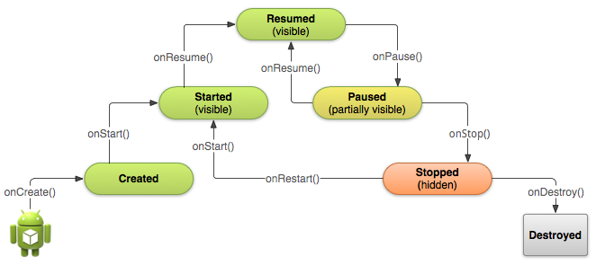

如上图所示是简化的 **Activity 生命周期**图示，以阶梯金字塔表示。此图示显示，对于用于将 Activity 朝顶端的“继续”状态移动一阶的每个回调，有一种将 Activity 下移一阶的回调方法。 Activity 还可以从“暂停”和“停止”状态回到继续状态。

根据 Activity 的复杂程度，开发者可能不需要实现所有生命周期方法（大多数情况下如此）。 但是，了解每个方法并实现确保应用按照用户期望的方式运行的方法非常重要。 正确实现 Activity 生命周期方法可确保应用按照以下几种方式良好运行，包括：

* 如果用户在使用应用时接听来电或切换到另一个应用，它不会崩溃。
* 在用户未主动使用它时不会消耗宝贵的系统资源。
* 如果用户离开应用并稍后返回，不会丢失用户的进度。
* 当屏幕在横向和纵向之间旋转时，不会崩溃或丢失用户的进度。

Activity 会在如上简化的 **Activity 生命周期** 所示不同状态之间过渡的几种情况。但是，这些状态中只有三种可以是静态。也就是说，Activity 只能在三种状态之一下存在很长时间。

* **继续**。在这种状态下，Activity 处于前台，且用户可以与其交互。（有时也称为“运行”状态。）
* **暂停**。在这种状态下，Activity 被在前台中处于半透明状态或者未覆盖整个屏幕的另一个 Activity 部分阻挡。 暂停的 Activity 不会接收用户输入并且无法执行任何代码。
* **停止**。在这种状态下，Activity 被完全隐藏并且对用户不可见；它被视为处于后台。 停止时，Activity 实例及其诸如成员变量等所有状态信息将保留，但它无法执行任何代码。

其他状态（“创建”和“开始”）是瞬态，系统会通过调用下一个生命周期回调方法从这些状态快速移到下一个状态。 也就是说，在系统调用 ``onCreate()`` 之后，它会快速调用 ``onStart()``，紧接着快速调用 ``onResume()``。

以上就是基本 Activity 生命周期的管理方式和运行机理，对于用户**启动应用**这个日常操作（从主屏幕点击应用图标）来说，系统会为应用中已声明为“启动器”（或“主要”）Activity 的应用中的 Activity 调用 [onCreate()](https://developer.android.com/reference/android/app/Activity.html?hl=zh-cn#onCreate(android.os.Bundle)) 方法。这是作为 应用的**用户界面主入口**的 Activity。

开发者可以在 Android 清单文件 AndroidManifest.xml 中定义哪个 Activity 用作主 Activity，该文件位于Android应用开发项目目录的根目录中。

应用的主 Activity 必须使用 <intent-filter>（包括 MAIN 操作和 LAUNCHER 类别）在清单文件中声明。例如：

```xml
<activity android:name=".MainActivity" android:label="@string/app_name">
    <intent-filter>
        <action android:name="android.intent.action.MAIN" />
        <category android:name="android.intent.category.LAUNCHER" />
    </intent-filter>
</activity>
```

> 注：使用 Android SDK工具创建新 Android 项目时，默认的项目文件包括使用过滤器在宣示说明中声明的 Activity 类。

如果未对应用的 Activity 之一声明 [MAIN](https://developer.android.com/reference/android/content/Intent.html?hl=zh-cn#ACTION_MAIN) 操作或 [LAUNCHER](https://developer.android.com/reference/android/content/Intent.html?hl=zh-cn#CATEGORY_LAUNCHER) 类别，那么应用图标将不会出现在应用的主屏幕列表中。

> 注：上述 主Activity 的实现规范是我们在进行 **逆向分析** 时常用的查找应用 **主入口** 的一个方法。

大多数应用包含若干个不同的 Activity，用户可通过这些 Activity 执行不同的操作。无论 Activity 是用户单击应用图标时创建的主 Activity 还是应用在响应用户操作时开始的其他 Activity，系统都会通过调用其 onCreate() 方法创建 Activity 的每个新实例。

开发者**必须实现** onCreate() 方法执行只应在 Activity 整个生命周期出现一次的基本应用启动逻辑。 例如， onCreate() 的实现应定义用户界面并且可能实例化某些类范围变量。例如，onCreate() 方法中可以定义显示执行 Activity 某些基本设置的一些代码，比如声明用户界面（在 XML 布局文件中定义）、定义成员变量，以及配置某些 UI。

一旦 onCreate() 完成执行操作，系统会相继调用 onStart() 和 onResume() 方法。Activity 从不会驻留在“已创建”或“已开始”状态。在技术上，Activity 会在 onStart() 被调用时变得可见，但紧接着是 onResume()，且 Activity 保持“继续”状态，直到有事情发生使其发生变化，比如当接听来电时，用户导航至另一个 Activity，或设备屏幕关闭。

#### Service

Service 是一个可以在后台执行长时间运行操作而不提供用户界面的应用组件。服务可由其他应用组件启动，而且即使用户切换到其他应用，服务仍将在后台继续运行。 此外，组件可以绑定到服务，以与之进行交互，甚至是执行进程间通信 (IPC)。 例如，服务可以处理网络事务、播放音乐，执行文件 I/O 或与内容提供程序交互，而所有这一切均可在后台进行。

服务基本上分为两种形式：

* **启动**。当应用组件（如 Activity）通过调用 startService() 启动服务时，服务即处于“启动”状态。一旦启动，服务即可**在后台无限期运行**，**即使启动服务的组件已被销毁也不受影响**。 已启动的服务通常是执行单一操作，而且不会将结果返回给调用方。例如，它可能通过网络下载或上传文件。 操作完成后，服务会自行停止运行。处于“启动”状态的服务根据是否会通知用户，又可以细分为“前台”服务和“后台”服务。
    * **前台**。前台服务执行的操作会通知用户执行状态。例如，音频播放应用会使用前台服务播放音频。前台服务必须显示一个[状态栏图标](https://developer.android.com/guide/topics/ui/notifiers/notifications.html)。即使用户不操作应用，前台服务也能一直运行。
    * **后台**。后台服务不会直接通知用户执行状态。例如，应用使用后台服务执行存储压缩过程。如果应用运行环境是API level 26（Android 8.0）或以上版本，系统会对[应用未在前台时执行后台服务进行限制](https://developer.android.com/about/versions/oreo/background.html)。默认情况下，这些限制仅适用于针对 Android 8.0 的应用。 不过，用户可以从 **设置** 屏幕为任意应用启用这些限制，即使应用并不是以 Android 8.0 为目标平台。在大多数情况下，应用都可以使用 [JobScheduler](https://developer.android.com/reference/android/app/job/JobScheduler.html) 作业克服这些限制。这种方式让应用安排为在未活跃运行时执行工作，不过仍能够使系统可以在不影响用户体验的情况下安排这些作业。
* **绑定**（``Bound``）。当应用组件通过调用 bindService() 绑定到服务时，服务即处于“绑定”状态。绑定服务提供了一个客户端-服务器接口，允许组件与服务进行交互、发送请求、获取结果，甚至是利用进程间通信 (IPC) 跨进程执行这些操作。 仅当与另一个应用组件绑定时，绑定服务才会运行。多个组件可以同时绑定到该服务，但全部取消绑定后，该服务即会被销毁。

服务可以同时以这两种方式运行，也就是说，它既可以是启动服务（以无限期运行），也允许绑定。问题只是在于开发者是否实现了一组回调方法：onStartCommand()（允许组件启动服务）和 onBind()（允许绑定服务）。

无论应用是处于启动状态还是绑定状态，抑或处于启动并且绑定状态，任何应用组件均可像使用 Activity 那样通过调用 Intent 来使用服务（即使此服务来自另一应用）。 不过，开发者可以通过[清单文件将服务声明为私有服务](https://developer.android.com/guide/components/services.html?hl=zh-cn#Declaring)，并阻止其他应用访问。

> 注意：服务在其托管进程的主线程中运行，它既不创建自己的线程，也不在单独的进程中运行（除非另行指定）。 这意味着，如果服务将执行任何 CPU 密集型工作或阻止性操作（例如 MP3 播放或联网），则应在服务内创建新线程来完成这项工作。通过使用单独的线程，可以降低发生“应用无响应”(ANR) 错误的风险，而应用的主线程仍可继续专注于运行用户与 Activity 之间的交互。如需在主线程外部执行工作，不过只是在用户正在与应用交互时才有此需要，则应创建新线程而非服务。

如同 Activity（以及其他组件）一样，开发者必须在应用的清单文件中声明所有服务。

要声明服务，请添加 ``<service>`` 元素作为 ``<application>`` 元素的子元素。例如：

```xml
<manifest ... >
  ...
  <application ... >
      <service android:name=".ExampleService" />
      ...
  </application>
</manifest>
```
如需了解有关使用清单文件声明服务的详细信息，请参阅 [<service>](https://developer.android.com/guide/topics/manifest/service-element.html?hl=zh-cn) 元素参考文档。

开发者还可将其他属性包括在 ``<service>`` 元素中，以定义一些特性，如启动服务及其运行所在进程所需的权限。``android:name`` 属性是唯一必需的属性，用于指定服务的类名。应用一旦发布，即不应更改此类名，如若不然，可能会存在因依赖**显式 Intent** 启动或绑定服务而破坏代码的风险。

为了确保应用的安全性，请**始终使用显式 Intent 启动**或**绑定 Service**，且不要为服务声明 Intent 过滤器。启动哪个服务存在一定的不确定性，而如果对这种不确定性的考量非常有必要，则可为服务提供 Intent 过滤器并从 Intent 中排除相应的组件名称，但随后必须使用 setPackage() 方法设置 Intent 的软件包，这样可以充分消除目标服务的不确定性。

此外，还可以通过添加 ``android:exported`` 属性并将其设置为 ``"false"``，确保服务仅适用于当前应用。这可以有效阻止其他应用启动当前应用中的**私有**服务，即便在使用显式 Intent 时也如此。

服务的生命周期比 Activity 的生命周期要简单得多。但是，密切关注如何创建和销毁服务反而更加重要，因为服务可以在用户没有意识到的情况下运行于后台。

服务生命周期（从创建到销毁）可以遵循两条不同的路径：

* **启动服务**。该服务在其他组件调用 startService() 时创建，然后无限期运行，且必须通过调用 stopSelf() 来自行停止运行。此外，其他组件也可以通过调用 stopService() 来停止服务。服务停止后，系统会将其销毁。
* **绑定服务**。该服务在另一个组件（客户端）调用 bindService() 时创建。然后，客户端通过 IBinder 接口与服务进行通信。客户端可以通过调用 unbindService() 关闭连接。多个客户端可以绑定到相同服务，而且当所有绑定全部取消后，系统即会销毁该服务。 （服务不必自行停止运行。）

这两条路径并非完全独立。也就是说，开发者可以绑定到已经使用 startService() 启动的服务。例如，可以通过使用 Intent（标识要播放的音乐）调用 startService() 来启动后台音乐服务。随后，可能在用户需要稍加控制播放器或获取有关当前播放歌曲的信息时，Activity 可以通过调用 bindService() 绑定到服务。在这种情况下，除非所有客户端均取消绑定，否则 stopService() 或 stopSelf() 不会实际停止服务。


上左图显示了使用 startService() 所创建的服务的生命周期，上右图显示了使用 bindService() 所创建的服务的生命周期。

通过实现这些方法，开发者可以监控服务生命周期的两个嵌套循环：

* 服务的整个生命周期从调用 onCreate() 开始起，到 onDestroy() 返回时结束。与 Activity 类似，服务也在 onCreate() 中完成初始设置，并在 onDestroy() 中释放所有剩余资源。例如，音乐播放服务可以在 onCreate() 中创建用于播放音乐的线程，然后在 onDestroy() 中停止该线程。
无论服务是通过 startService() 还是 bindService() 创建，都会为所有服务调用 onCreate() 和 onDestroy() 方法。
* 服务的有效生命周期从调用 onStartCommand() 或 onBind() 方法开始。每种方法均有 {Intent 对象，该对象分别传递到 startService() 或 bindService()。
对于启动服务，有效生命周期与整个生命周期同时结束（即便是在 onStartCommand() 返回之后，服务仍然处于活动状态）。对于绑定服务，有效生命周期在 onUnbind() 返回时结束。

> 注：尽管启动服务是通过调用 stopSelf() 或 stopService() 来停止，但是该服务并无相应的回调（没有 onStop() 回调）。因此，除非服务绑定到客户端，否则在服务停止时，系统会将其销毁 — onDestroy() 是接收到的唯一回调。

上图说明了服务的典型回调方法。尽管该图分开介绍通过 startService() 创建的服务和通过 bindService() 创建的服务，但是请记住，不管启动方式如何，任何服务均有可能允许客户端与其绑定。因此，最初使用 onStartCommand()（通过客户端调用 startService()）启动的服务仍可接收对 onBind() 的调用（当客户端调用 bindService() 时）。

## Android应用软件的安全策略与机制

### APK制作过程面临的威胁与挑战

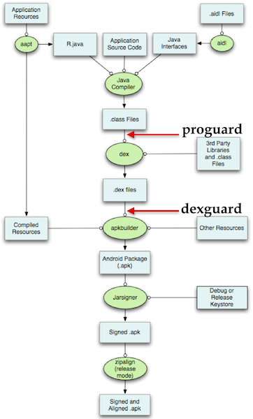

如上图所示是经典的Android APK详细制作过程示意图，图中出现的[ProGuard](https://www.guardsquare.com/en/proguard)和[DexGuard](https://www.guardsquare.com/en/dexguard)分别是APK制作过程中常用的2款代码压缩和混淆工具。其中``ProGuard``是开源、免费Java class字节码压缩，优化, 混淆, 静态验证⼯具，能检测并删除⽆用类、成员、⽅法和属性;优化Java字节码并删除⽆用指令；使用简短⽆意义名称重命名类名、成员名和⽅法名（代码混淆）；压缩⽣成的⼆进制程序体积；增加⼆进制Java程序被逆向⼯程得到源代码和解读理解的难度。``DexGuard``是商业Android平台Dalvik⼆进制字节码压缩，优化, 混淆, 静态验证⼯具，可以加密字符串常量、类、原⽣库、资源⽂件等；隐藏敏感API调用⾏为，改用运⾏时反射⽅法等价调用；程序完整性检测与保护机制；发布版代码自动清理所有日志⾏为代码；进⼀步增加⼆进制Android平台Java程序被逆向⼯程得到源代码和解读理解的难度。

使用``ProGuard``和``DexGuard``类解决⽅案防⽌已发布的⼆进制程序被逆向⼯程恢复源代码，增加攻击者通过源代码审计，发现漏洞的难度和破解⼯作量。开发者编写的某些类⽅法如果使用ProGuard混淆会导致程序运⾏出错，所以会配置禁⽌ProGuard对这些代码的混淆，这给了攻击者还原出这部分代码的便利。

从Android Studio 3.0开始，Google默认开启了aapt2作为资源编译的编译器，aapt2的出现，为资源的增量编译提供了支持。

[AndResGuard](https://github.com/shwenzhang/AndResGuard)是微信Android开发团队开源出来的Android资源文件混淆打包工具，是一个帮助你缩小APK大小的工具，它的原理类似Java Proguard，但是只针对资源。它可以实现混淆资源ID长度(例如将``res/drawable/welcome.png``混淆为``r/s/a.png``)，同时利用7z深度压缩，大大减少了安装包体积，提升了破解难度。

``AndResGuard``不涉及编译过程，只需输入一个apk（无论签名与否，debug版，release版均可，在处理过程中会直接将原签名删除），可得到一个实现资源混淆后的apk（若在配置文件中输入签名信息，可自动重签名并对齐，得到可直接发布的apk）以及对应资源ID的mapping文件。

### 权限模型

从 Android 6.0（API 级别 23）开始，用户开始在应用运行时向其授予权限，而不是在应用安装时授予。此方法可以简化应用安装过程，因为用户在安装或更新应用时不需要授予权限。它还让用户可以对应用的功能进行更多控制；例如，用户可以选择为相机应用提供相机访问权限，而不提供设备位置的访问权限。用户可以随时进入应用的“Settings”屏幕调用权限。

系统权限分为两类：正常权限和危险权限：

* 正常权限不会直接给用户隐私权带来风险。如果应用在其清单（``AndroidManifest.xml``）中列出了正常权限，系统将自动授予该权限。
* 危险权限会授予应用访问用户机密数据的权限。如果您的应用在其清单中列出了正常权限，系统将自动授予该权限。如果您列出了危险权限，则用户必须明确批准您的应用使用这些权限。

需要注意的是，Android的权限模型并不是对抗攻击和威胁的万能手段，零『敏感』（危险）权限声明的App也可以实现⾼危操作，例如：香港中文大学的研究人员在2014年发表的论文：[Your Voice Assistant is Mine: How to Abuse Speakers to Steal Information and Control Your Phone](https://arxiv.org/abs/1407.4923)，介绍了一种新颖的权限绕过攻击方法：**Google语音搜索攻击**。攻击者可利用一个**零权限**的Android应用VoicEmployer，前台激活操作系统内置的语音助手模块Google Voice Search，后台播放预先准备好的音频文件，语音搜索能识别语音命令执行相应操作。借助这一机制，攻击者不需要任何权限就可以拨打任意电话号码，伪造短信/电子邮件，访问私人信息，传输敏感数据，实现远程控制。

类似上述 **Google语音搜索攻击** 的思路，当某apk权限请求与权限声明不对等的时候，那么恶意应用在没有对应 ``<uses-permission>`` 请求下，可以通过构造 Intent 访问用户安装其他合法应用的 ``Activity``、``Broadcast`` 、``Service`` 的高权限接口来达到“暗度陈仓”和“借刀杀人”的效果。除此之外，如果拥有敏感数据的APK通过 ``ContentProvider`` 暴露敏感数据访问接口给任意应用调用也会导致Android系统的权限保护和沙盒隔离机制失效，恶意应用可以借此访问应用原本的私有数据空间。如果Android应用使用SQLite来管理持久化存储的数据，那么SQL注入威胁也会在系统权限模型保护能力范围之外危害到用户的隐私数据机密性和完整性。

在所有版本的 Android 中，应用都需要在其应用清单中同时声明它需要的正常权限和危险权限，如[声明权限](https://developer.android.com/training/permissions/declaring.html)中所述。不过，该声明的影响因系统版本和应用的目标 SDK 级别的不同而有所差异：

* 如果设备运行的是 Android 5.1 或更低版本，或者应用的**目标 SDK** 为 22 或更低：如果开发者在清单中列出了危险权限，则用户必须在安装应用时授予此权限；如果用户不授予此权限，系统根本不会安装应用。
* 如果设备运行的是 Android 6.0 或更高版本，或者应用的**目标 SDK** 为 23 或更高：应用必须在清单中列出权限，并且它必须在运行时请求其需要的每项危险权限。用户可以授予或拒绝每项权限，且即使用户拒绝权限请求，应用仍可以继续运行有限的功能。

通过扫描清单文件，我们可以在不运行、甚至不安装应用的情况下，了解应用可能（应用可以只声明需要用到哪些权限，但没有实现代码。但实践中，几乎不会有应用或恶意软件采用这种“狼来了”的行为）会请求访问哪些硬件设备（例如：GPS、相机、录音设备等），使用了哪些组件（例如，已知恶意软件组件名称），应用可以处理哪些 Intent （例如：恶意软件通过注册 ``BOOT_COMPLETED`` 消息实现开机自启动）。

通过反编译APK和DEX文件，我们可以发现危险API调用和和敏感权限相关API调用，硬编码的关键字特征，例如：域名、IP等。

> 注：从 Android 6.0（API 级别 23）开始，用户可以随时从任意应用调用权限，即使应用面向较低的 API 级别也可以调用（通过使用***Android 支持库***）。无论开发的应用面向哪个 API 级别，开发者都应对应用进行测试，以验证它在缺少需要的权限时行为是否正常。

[***Android 支持库***](https://developer.android.com/topic/libraries/support-library/index.html) 提供了诸多未内置于框架的功能。这些库提供向后兼容版本的新功能、框架中未包含的实用 UI 元素，以及应用可以利用的一系列实用程序。许多情况下，某项功能可能对应用开发者很有用，但是添加到 Android 框架却并不合适。例如，某个应用可能仅需要用于特定用例的某项功能，如在不同版本的 Android 系统之间顺畅切换。为了解决这一问题，Android SDK 添加了多个库，这些库统称为 ***Android 支持库***。如果应用开发者想要在应用中集成库功能，他们可以添加其中任意一个库。

支持库提供一系列不同的功能：

* 向后兼容版本的框架组件。
* 用于实现建议的 Android 布局模式的 UI 元素。
* 支持不同的设备类型。
* 其他实用程序功能。

### 检查权限

如果应用需要危险权限，则每次执行需要这一权限的操作时您都必须检查自己是否具有该权限。用户始终可以自由调用此权限，因此，即使应用昨天使用了相机，它不能假设自己今天仍具有该权限。

要检查当前应用是否具有某项权限，可以调用 ``ContextCompat.checkSelfPermission()`` 方法。例如，以下代码段显示了如何检查 Activity 是否具有在日历中进行写入的权限：

```java
// Assume thisActivity is the current activity
int permissionCheck = ContextCompat.checkSelfPermission(thisActivity,
        Manifest.permission.WRITE_CALENDAR);
```

如果应用具有此权限，方法将返回 ``PackageManager.PERMISSION_GRANTED``，并且应用可以继续操作。如果应用不具有此权限，方法将返回 ``PERMISSION_DENIED``，且应用必须明确向用户要求权限。

### 处理权限请求响应

当应用请求权限时，系统将向用户显示一个对话框。当用户响应时，系统将调用应用的 ``onRequestPermissionsResult()`` 方法，向其传递用户响应。应用开发者必须重写（override）该方法，以了解是否已获得相应权限。回调会将开发者传递的相同请求代码传递给 ``requestPermissions()``。

系统显示的对话框说明了当前应用需要访问的权限组；它不会列出具体权限。例如，如果开发者请求 ``READ_CONTACTS`` 权限，系统对话框只显示当前应用需要访问设备的联系人。用户只需要为每个权限组授予一次权限。如果当前应用请求该组中的任何其他权限（已在当前应用清单中列出），系统将自动授予应用这些权限。当应用请求此权限时，系统会调用应用内的 ``onRequestPermissionsResult()`` 回调方法，并传递 ``PERMISSION_GRANTED``，如果用户已通过系统对话框明确同意当前应用的权限请求，系统将采用相同方式操作。

> 注：当前应用仍需要明确请求其需要的每项权限，即使用户已向应用授予该权限组中的其他权限。此外，权限分组在将来的 Android 版本中可能会发生变化。开发者在开发代码时不应依赖特定权限属于或不属于相同组这种假设。

例如，假设在当前应用清单中列出了 ``READ_CONTACTS`` 和 ``WRITE_CONTACTS``。如果应用请求 ``READ_CONTACTS`` 且用户授予了此权限，那么，当应用请求 ``WRITE_CONTACTS`` 时，系统将立即授予当前应用该权限，不会与用户交互。

### 免安装应用的安全策略与机制

免安装应用使用Android 6.0（API Level 23）引入的[运行时权限模型](https://developer.android.com/training/permissions/requesting.html?hl=zh-cn)。目前（Android 8.1）免安装应用可以使用以下Android权限：

* BILLING
* ACCESS_COARSE_LOCATION
* ACCESS_FINE_LOCATION
* ACCESS_NETWORK_STATE
* CAMERA
* INSTANT_APP_FOREGROUND_SERVICE only in Android 8.0.
* INTERNET
* READ_PHONE_NUMBERS. This permission is available only in Android 8.0 (API level 26).
* RECORD_AUDIO
* VIBRATE

所有免安装应用的对外通信流量强制使用**HTTPS**，禁止使用**HTTP**。目前免安装应用只能通过``Google Play Console``发布，用户也只能通过``Google Play``使用免安装应用。

免安装应用只能通过 **隐式 Intent** 调用（唤起）已安装应用，绝大多数已安装应用无法通过 ``显式 Intent`` 被调用，除非已安装应用通过``显式 Intent``声明过滤器来允许免安装应用与其交互。即使当前系统中已安装应用的版本低于免安装应用的版本，当用户点击免安装应用URL时也是优先启动本地已安装应用。免安装应用只要能被访问到，总是能保证使用到的是最新发布版本。

### 证书与PKI

通信过程的机密性、完整性和身份认证保护场景使用到的 SSL/TLS 会使用一个包含公钥及与其匹配的私钥的证书配置服务器。作为 SSL/TLS 客户端与服务器握手的一部分，服务器将通过使用公钥加密签署其证书来证明自己具有私钥。

不过，任何人都可以生成他们自己的证书和私钥，因此，一个简单的握手只能说明服务器知道与证书公钥匹配的私钥，除此之外什么都证明不了。解决此问题的一个方法是让客户端拥有其信任的一个或多个证书集。如果证书不在此集合中，则不会信任服务器。

但这个简单的方法有几个缺点。服务器应能够随时间的推移升级到更强的密钥（“密钥旋转”），使用新的公钥替换证书中的公钥。遗憾的是，客户端应用现在必须根据服务器配置发生的变化进行更新。如果服务器不在应用开发者的控制下（例如，如果服务器是一个第三方网络服务），则很容易出现问题。如果应用必须与网络浏览器或电子邮件应用等任意服务器通信，那么，此方法也会带来问题。

为弥补这些缺点，通常使用来自知名颁发者（称为 **证书颁发机构** (Certificate Authority,CA)）发放的证书配置服务器。主机平台一般包含其信任的知名 CA 的列表。从 Android 4.2 (Jelly Bean) 开始，Android 目前包含在每个版本中更新的 100 多个 CA。CA 具有一个证书和一个私钥，这点与服务器相似。为服务器发放证书时，CA 使用其私钥签署服务器证书。然后，客户端可以验证该服务器是否具有平台已知的 CA 发放的证书。

不过，在解决一些问题的同时，使用 CA 也会引发其他问题。因为 CA 为许多服务器发放证书，因此，开发者仍需要某种方式来确保客户端应用与需要的服务器通信。为解决这个问题，CA 发放的证书通过 ***gmail.com*** 等具体名称或 ****.google.com*** 等通配型主机集识别服务器。

一般情况下，应用信任所有预装 CA。如果有预装 CA 签发欺诈性证书，则应用将面临被中间人攻击的风险。例如历史上曾经出现过的2次CA公司被入侵的安全事件： [Comodo](http://en.wikipedia.org/wiki/Comodo_Group#Breach_of_security) 和 [DigiNotar](http://en.wikipedia.org/wiki/DigiNotar) 出现了信息泄露，从而导致某个主机名的证书被发放给服务器或域的所有者以外的其他人。

为了降低此风险，Android 提供了将某些证书甚至整个 CA 列入黑名单的功能。尽管此名单过去已内置到操作系统中，但从 Android 4.2 开始，可以远程更新此名单，便于处理将来的泄露问题。

有些应用通过限制信任的 CA 集或通过 ``证书固定``（``Pinning Certificates``）来选择限制其接受的证书集。

通过按公钥的哈希值（X.509 证书的 SubjectPublicKeyInfo）提供证书集完成证书固定。然后，只有至少包含一个已固定的公钥时，证书链才有效。

请注意，使用证书固定时，开发者应始终包含一个备份密钥，这样，当被强制切换到新密钥或更改 CA 时（固定到某个 CA 证书或该 CA 的中间证书时），当前应用的连接性不会受到影响。否则，开发者必须推送应用的更新以恢复连接性。

此外，可以设置固定的到期时间，在该时间之后不执行证书固定。这有助于防止尚未更新的应用出现连接性问题。不过，设置固定的到期时间可能会绕过证书固定。以下是一个配置固定证书的实例：

``res/xml/network_security_config.xml``：

```xml
<?xml version="1.0" encoding="utf-8"?>
<network-security-config>
    <domain-config>
        <domain includeSubdomains="true">example.com</domain>
        <pin-set expiration="2018-01-01">
            <pin digest="SHA-256">7HIpactkIAq2Y49orFOOQKurWxmmSFZhBCoQYcRhJ3Y=</pin>
            <!-- backup pin -->
            <pin digest="SHA-256">fwza0LRMXouZHRC8Ei+4PyuldPDcf3UKgO/04cDM1oE=</pin>
        </pin-set>
    </domain-config>
</network-security-config>
```

### 『root』

Android系统的``root``是 **使得用户获取系统超级用户权限**的一种简称。``root``的基本原理利用Android系统的**本地提权漏洞**或**官方后门**获得root权限，不同手机厂商、系统和版本可能存在的漏洞不同、厂商对待用户获得root权限的态度不同，因此不同手机的``root``原理、方法、难度都可能不同。在获得root权限后用户和应用可以重新以可写模式挂载 ``/system`` ，将root权限管理应用[Superuser.apk](https://play.google.com/store/apps/details?id=eu.chainfire.supersu) 写⼊``/system/
app``，将[su](https://github.com/ChainsDD/su-binary)写⼊ ``/system/xbin/`` 和 ``/system/bin/``，并用 ``chmod`` 命令为其设置可执行权限和 ``setuid`` 权限。其中Superuser.apk（提供用户操作权限管理的图形界面）负责对普通用户身份运行进程的root权限请求进⾏管理。

``root``之后的系统，一方面，用户对自⼰的⼿机拥有完全控制权，可以实现更加丰富的个性化定制。另一方面，提权漏洞利用效果的平台差异性通常较⼤，可能会引起系统不稳定，甚至部分手机厂商会对``root``手机拒绝提供硬件保修服务。恶意代码在一台``root``手机上可以实现的攻击⼿段会更丰富，例如：静默安装、静默卸载、静默访问任意数据等，而达成这些高级攻击效果的方式可能是一次社会工程学攻击、UI欺骗攻击等。另外，如果安装的Superuser.apk本身已经被恶意替换，相当于把系统的最高权限管理权交到了恶意代码和攻击者手里，后果不堪设想。

## 典型安全漏洞原理与实验

请查阅[本章实验指南](exp.md)。

## 本章参考文献

* [Android官网安全相关专题文档](https://source.android.com/security/?hl=zh-cn)
* [Android框架分析系列](https://www.gitbook.com/book/mr-cao/android)
