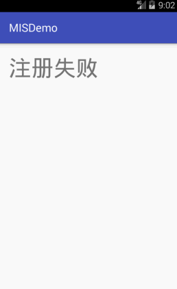
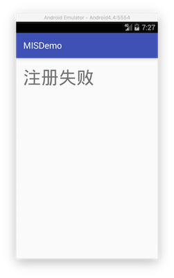

# 实验

## 软件逆向系列实验

* 使用apktool反汇编上一章实验中我们开发的Hello World v2版程序，对比Java源代码和smali汇编代码之间的一一对应关系。
* 对Hello World v2版程序生成的APK文件进行程序图标替换，并进行重打包，要求可以安装到一台未安装过Hello World v2版程序的Android模拟器中。
* 尝试安装重打包版Hello World v2到一台已经安装过原版Hello World v2程序的模拟器中，观察出错信息并解释原因。
* 去掉Hello World v2版程序中DisplayMessageActivity.java代码中的那2行日志打印语句后编译出一个新的apk文件，假设文件名是：misdemo-v3.apk，尝试使用课件中介绍的几种软件逆向分析方法来破解我们的认证算法。

### smali代码分析

1. 检出[Deliberately Vulnerable Android Hello World](https://github.com/c4pr1c3/DVAHW)最新版代码，在Android Studio中导入该项目；
2. ``Build`` -> ``Generate Signed APK...``，生成的发布版apk文件位于项目根目录下相对路径：``app/app-release.apk``；

此时App运行和使用效果如下动图所示：



```bash
# 在app-release.apk文件所在目录执行如下命令
# 确认 apktool 在系统 PATH 环境变量中可找到
apktool d app-release.apk 
```

``apktool``反编译过程的输出信息如下，反编译成功后，会在当前目录下生成apk文件名命名的一个独立目录。

```
I: Using Apktool 2.2.1 on app-release.apk
I: Loading resource table...
I: Decoding AndroidManifest.xml with resources...
I: Loading resource table from file: /Users/huangwei/Library/apktool/framework/1.apk
I: Regular manifest package...
I: Decoding file-resources...
I: Decoding values */* XMLs...
I: Baksmaling classes.dex...
I: Copying assets and libs...
I: Copying unknown files...
I: Copying original files...
```

3. 反汇编出来的``smali``代码位于apktool输出目录下的 **smali** 子目录，源代码目录中的 **res** 目录也位于输出目录的一级子目录下。



如上图所示，是[Deliberately Vulnerable Android Hello World](https://github.com/c4pr1c3/DVAHW)在模拟器中运行，输入注册码错误时的提示信息页面。注意到其中的提示消息内容为：**注册失败**。依据此**关键特征**，在反汇编输出目录下进行**关键字查找**，可以在 ``res/values/strings.xml`` 中找到该关键字的注册变量名为``register_failed``。

```bash
grep '注册失败' -R . 
./res/values/strings.xml:    <string name="register_failed">注册失败</string>
```

用文本编辑器打开 ``res/values/strings.xml`` 查看会在上述代码行下一行发现：

```
<string name="register_ok">注册成功</string>
```

继续在反汇编输出目录下进行**关键字查找**：``register_ok``，可以发现

```
./smali/cn/edu/cuc/misdemo/R$string.smali:.field public static final register_ok:I = 0x7f060027
```

现在，我们有了``register_ok``的资源唯一标识符：``0x7f060027``，使用该唯一标识符进行关键字查找，我们可以定位到这一段代码：

```
./smali/cn/edu/cuc/misdemo/DisplayMessageActivity.smali:    const v5, 0x7f060027
```

用文本编辑器（本书使用[atom](https://atom.io/)）打开上述``DisplayMessageActivity.smali``，定位到包含该资源唯一标识符所在的代码行。同时，在Android Studio中打开``DisplayMessageActivity.java``源代码，定位到包含``textView.setText(getString(R.string.register_ok));``的代码行，如下图所示：


根据源代码行号和smali代码中的``.line 39``，我们可以找到Android源代码中的Java代码和Smali代码之间的对应“翻译”关系。上述smali代码注释说明如下：

```smali
# 当前smali代码对应源代码的行号
.line 39

# 将 0x7f060027 赋值给寄存器v5
const v5, 0x7f060027

# invoke-virtual 是调用实例的虚方法（该方法不能是 private、static 或 final，也不能是构造函数）
# 在非static方法中，p0代指this
# 此处的实例对象是 cn.edu.cuc.misdemo.DisplayMessageActivity
# Lcn/edu/cuc/misdemo/DisplayMessageActivity; 表示DisplayMessageActivity这个对象实例 getString是具体方法名
# I表示参数是int类型
# Ljava/lang/String; 表示 Java内置的String类型对象
# 整个这一行smali代码表示的就是 调用 cn.edu.cuc.misdemo.DisplayMessageActivity对象的getString方法，传入一个整型参数值，得到String类型返回结果
invoke-virtual {p0, v5}, Lcn/edu/cuc/misdemo/DisplayMessageActivity;->getString(I)Ljava/lang/String;

# 将最新的 invoke-kind 的对象结果移到指定的寄存器中。该指令必须紧跟在（对象）结果不会被忽略的 invoke-kind 或 filled-new-array 之后执行，否则无效。
# 其中 kind 典型取值如virtual、super、direct、static、interface等，详见Android开源官网的 'Dalvik 字节码' 说明文档
move-result-object v5

# 此处的v4赋值发生在 .line 37，需要注意的是这里的v4是一个局部变量（用v表示），并不是参数寄存器（用p表示）。
# 当前initView()方法通过 .locals 定义了8个本地寄存器，用于保存局部变量，如下2行代码所示：
# .method private initView()V
#    .locals 8
# V 表示 setText 的返回结果是 void 类型
invoke-virtual {v4, v5}, Landroid/widget/TextView;->setText(Ljava/lang/CharSequence;)V
```

搞懂了上述smali代码的含义之后，我们破解这个 **简单注册小程序** 的思路可以归纳如下：

* 改变原来的注册码相等条件判断语句，对布尔类型返回结果直接 **取反**，达到：只要我们没有输入正确的验证码，就能通过验证的“破解”效果；
    * 将 ``if-eqz`` 修改为 ``if-nez``
* 在执行注册码相等条件判断语句之前，打印出用于和用户输入的注册码进行比较的“正确验证码”变量的值，借助``adb logcat``直接“偷窥”到正确的验证码；
    * 在 ``invoke-virtual {v2, v3}, Ljava/lang/String;->equalsIgnoreCase(Ljava/lang/String;)Z`` 代码之前增加2行打印语句

```smali
# .method private initView()V
#    .locals 9
# 注意修改上述initView()方法下的.locals值从8到9
const-string v8, "tag-here"
invoke-static {v8, v3}, Landroid/util/Log;->v(Ljava/lang/String;Ljava/lang/String;)I
```


上述2种思路都需要直接修改smali代码，然后对反汇编目录进行**重打包**和**重签名**。

### 重打包

```bash
apktool b app-release
```

### 重签名

```bash
cd app-release/dist/
<Android SDK Path>/build-tools/<valid version code>/apksigner sign --min-sdk-version 19 --ks <path to release.keystore.jks> --out app-release-signed.apk app-release.apk
```

需要注意的是，上述重签名指令中用到的``apksigner``是包含在Android SDK的build-tools子目录下的，Android 7.0开始使用apksigner。7.0之前的版本，使用的Java SDK里的``jarsigner``。签名用到的证书文件，需要预先生成。关于Android APK签名的完整方法，可以参考Anroid开发者官网的[签署您的应用](https://developer.android.com/studio/publish/app-signing.html?hl=zh-cn)。

### 破解效果展示

直接通过“取反”注册码判断逻辑修改后的APK运行和使用效果如下动图所示：


通过**插桩**打印语句方式实现的直接“偷窥”正确注册码方法修改后的APK运行和使用效果如下动图所示：


### 实验后思考

1. **重签名**的过程需要用到签名证书对应的私钥，所以作为应用程序的开发者，必须保护好自己的私钥，避免泄漏，可以有效杜绝 **打包党** 制作山寨应用，覆盖安装到用户手机上。作为用户，要避免从不正规应用分发渠道（论坛、软件下载站、搜索引擎搜索结果等）、小众应用市场安装应用，避免 **打包党** 制作的山寨应用抢先正版应用一步安装到你的手机上。
2. 正式对外发布的应用，一定要做好必要的代码混淆和应用加固，增加 **打包党** 、**攻击者** 逆向分析和重打包应用的难度。开发者在发布应用之前，可以用类似 **apktool** 这样的工具测试应用是否能被自动反汇编、反汇编后代码的可读性是否足够差，根据应用安全加固的需求决定是否需要进一步加强代码混淆和使用更健壮的应用防逆向加固技术保护源代码。

## FAQ

### 查看Android SDK安装路径

在``Android Studio``中打开``SDK Manager``，查看``Android SDK Location``的路径信息。

以Mac系统为例，Android SDK典型默认安装路径为：``~/Library/Android/sdk``

### 解决编译时报错： Error retrieving parent for item: No resource found that matches the given name 'xxxx'

出现以上信息，说明``build.gradle``配置文件中存在错误配置的编译版本参数。``compileSdkVersion``, ``buildToolsVersion``， ``minSdkVersion`` 和 ``targetSdkVersion``的配置会导致出现上述编译错误信息。

向前兼容是 Android 非常关注的事情。用户在升级到新版 Android 的时候，用以前版本的 SDK 构建的现有应用应该不会出问题。这就是 ``compileSdkVersion``, ``minSdkVersion`` 和 ``targetSdkVersion`` 的作用：他们分别控制可以使用哪些 API ，要求的 API 级别是什么，以及应用的兼容模式。

从[Deliberately Vulnerable Android Hello World](https://github.com/c4pr1c3/DVAHW)目前的模块级别``build.gradle``配置文件摘录如下：

```gradle
android {
    compileSdkVersion 25
    buildToolsVersion "24.0.3"
    defaultConfig {
        applicationId "cn.edu.cuc.misdemo"
        minSdkVersion 19
        targetSdkVersion 25
        versionCode 2
        versionName "2.0"
        testInstrumentationRunner "android.support.test.runner.AndroidJUnitRunner"
    }
    buildTypes {
        release {
            minifyEnabled false
            proguardFiles getDefaultProguardFile('proguard-android.txt'), 'proguard-rules.pro'
        }
    }
}
```

> compileSdkVersion

compileSdkVersion 告诉 Gradle 用哪个 Android SDK 版本编译你的应用。使用任何新添加的 API 就需要使用对应 Level 的 Android SDK。

以上示例配置文件中使用的 ``compileSdkVersion 25``，对应 ``Android 7.1``。

需要强调的是**修改 compileSdkVersion 不会改变运行时的行为**。当你修改了 compileSdkVersion 的时候，可能会出现新的编译警告、编译错误，但新的 compileSdkVersion 不会被包含到 APK 中：它纯粹只是在编译的时候使用。（你真的应该修复这些警告，在Android后续新版本发布时，一些目前还只是过时的API在未来新版本中可能会被正式弃用）

因此我们强烈推荐**总是使用最新的 SDK 进行编译**。在现有代码上使用新的编译检查可以获得很多好处，避免新弃用的 API ，并且为使用新的 API 做好准备。

注意，如果使用 Support Library ，那么使用最新发布的 Support Library 就需要使用最新的 SDK 编译。例如，要使用 23.1.1 版本的 Support Library ，compileSdkVersion 就必需至少是 23 （大版本号要一致！）。通常，新版的 Support Library 随着新的系统版本而发布，它为系统新增加的 API 和新特性提供兼容性支持。

> buildToolsVersion

查看当前系统上已经安装的Android SDK Build Tools版本的方法：

查看 ``<sdk>/build-tools/`` 目录下的子目录有哪些，子目录的命名对应的就是可用的 ``buildToolsVersion``。

[Android开发者官网推荐](https://developer.android.com/studio/releases/build-tools.html#notes) 开发者总是使用官方最新的SDK工具版本。


> minSdkVersion

如果 compileSdkVersion 设置为可用的最新 API，那么 minSdkVersion 则是应用可以运行的最低要求。minSdkVersion 是 Google Play 商店用来判断用户设备是否可以安装某个应用的标志之一。

在开发时 minSdkVersion 也起到一个重要角色：lint 默认会在项目中运行，它在你使用了高于 minSdkVersion 的 API 时会警告你，帮你避免调用不存在的 API 的运行时问题。如果只在较高版本的系统上才使用某些 API，通常使用[运行时检查系统版本](https://developer.android.com/training/basics/supporting-devices/platforms.html)的方式解决。

请记住，你所使用的库，如 [Support Library](https://developer.android.com/topic/libraries/support-library/features.html) 或 [Google Play services](https://developers.google.com/android/guides/overview)，可能有他们自己的 minSdkVersion 。你的应用设置的 minSdkVersion 必需大于等于这些库的 minSdkVersion 。例如有三个库，它们的 minSdkVersion 分别是 4, 7 和 9 ，那么你的 minSdkVersion  必需至少是 9 才能使用它们。在少数情况下，你仍然想用一个比你应用的 minSdkVersion 还高的库（处理所有的边缘情况，确保它只在较新的平台上使用），你可以使用 [tools:overrideLibrary 标记](https://developer.android.com/studio/build/manifest-merge.html)，但请做彻底的测试！

当你决定使用什么 minSdkVersion 时候，你应该参考当前的 [Android 分布统计](http://developer.android.com/about/dashboards/index.html)，它显示了最近 7 天所有访问 Google Play 的设备信息。面向国内用户发布应用的开发者可以参考[腾讯移动分析的Android分布统计](https://mta.qq.com/mta/data/device/os)。

> targetSdkVersion

三个版本号中最有趣的就是 targetSdkVersion 了。 targetSdkVersion 是 Android 提供向前兼容的主要依据，在应用的 targetSdkVersion 没有更新之前系统不会应用最新的行为变化。这允许你在适应新的行为变化之前就可以使用新的 API （因为你已经更新了 compileSdkVersion 不是吗？）。

targetSdkVersion 所暗示的许多行为变化都记录在 [VERSION_CODES](https://developer.android.com/reference/android/os/Build.VERSION_CODES.html) 文档中了，但是所有恐怖的细节也都列在每次发布的平台亮点中了，在这个 [API Level 表](https://developer.android.com/guide/topics/manifest/uses-sdk-element.html)中可以方便地找到相应的链接。

> 注意：Android开发者官网的许多文档中文翻译版没有英文版的内容更新及时，尤其是涉及到新版本变更的内容时更是如此。

例如，[Android 6.0 变化文档](http://developer.android.com/about/versions/marshmallow/android-6.0-changes.html)中谈了 target 为 API 23 时会如何把你的应用转换到[运行时权限模型](http://android-developers.blogspot.com/2015/08/building-better-apps-with-runtime.html)上，[Android 4.4 行为变化](http://developer.android.com/about/versions/android-4.4.html)阐述了 target 为 API 19 及以上时使用 set() 和 setRepeating() 设置 alarm 会有怎样的行为变化。

由于某些行为的变化对用户是非常明显的（[弃用的 menu 按钮](http://android-developers.blogspot.com/2012/01/say-goodbye-to-menu-button.html)，运行时权限等），所以将 **target 更新为最新的 SDK 是所有应用都应该优先处理的事情**。但这不意味着你一定要使用所有新引入的功能，也不意味着你可以不做任何测试就盲目地更新 targetSdkVersion ，**请一定在更新 targetSdkVersion 之前做测试**！

minSdkVersion 和 targetSdkVersion 与 compileSdkVersion 的另一个不同之处是它们会被包含进最终的 APK 文件中，如果你查看生成的 AndroidManifest.xml 文件，你会看到类似下面这样的标签：

```xml
<uses-sdk android:targetSdkVersion="25" android:minSdkVersion="19" />
```

如果你在 manifest 文件中手工设置，你会发现 Gradle 在构建时会忽略它们（尽管其它构建系统可能会明确依赖它们）。

### 解决编译时gradle报告相关错误

```
Information:Gradle tasks [:app:assembleDebug]
Error:Failed to complete Gradle execution.

Cause:
The version of Gradle you are using (2.14.1) does not support the forTasks() method on BuildActionExecuter. Support for this is available in Gradle 3.5 and all later versions.
```

以上错误信息发生在直接使用Android Studio 3.0.1的菜单``Build`` -> ``Build APK(s)``编译[Deliberately Vulnerable Android Hello World](https://github.com/c4pr1c3/DVAHW)项目代码时，该项目代码最初是在Android 2.2中开发和调试通过，换到了新版本Android Studio时由于默认的工程编译设置使用了本地gradle二进制程序。恰好在2台不同的电脑上不仅Android Studio版本不同，连gradle二进制程序版本也有较大版本的差异。因此，需要修改工程的编译设置，优先使用工程代码中本地封装的gradle二进制程序来解决这个兼容性问题。在Android Studio的首选项设置里，我们可以通过GUI设置界面查看到修改后的gradle二进制程序使用优先级设置如下图所示：


对应的，[修改了Android工程代码中的``.idea/gradle.xml``](https://github.com/c4pr1c3/DVAHW/commit/b1e2d6c89715c1d30e19a29afb3d74e6a8b5bc28)，修改前后差异如下图所示：


上述gradle编译设置，在以下Android Studio集成开发环境中测试通过。生成调试版本的apk，应使用Android Studio菜单的``Build`` -> ``Make Project``或者``Rebuild Project``。生成发布版本的apk，应使用Android Studio菜单的``Build`` -> ``Generate Signed APK...``。

```
Android Studio 3.0.1
Build #AI-171.4443003, built on November 10, 2017
JRE: 1.8.0_152-release-915-b08 x86_64
JVM: OpenJDK 64-Bit Server VM by JetBrains s.r.o
Mac OS X 10.13.2
```

stackoverflow上有一个类似的问题：[Gradle version 3.3 does not support forTask() method on BuildActionExecuter
](https://stackoverflow.com/questions/44206433/gradle-version-3-3-does-not-support-fortask-method-on-buildactionexecuter/44254745#44254745)，如果本书给出的解决方案依然无法解决gradle编译版本相关的问题，可以参考stackoverflow上的这个问答帖中提到的一些方法进行尝试。

## 通信协议逆向系列实验

* 使用[第3章实验EvilTwin](../chap0x03/exp.md)的方法在电脑上搭建一个无线热点，手机正常连接到该热点后，手机所有的通信数据都将可以在电脑上进行抓包分析。
* 手机和电脑处于同一局域网条件下，在电脑上打开burpsuite并监听在局域网IP上。手机设置全局HTTP代理指向burpsuite的监听IP和端口，此时手机的所有HTTP和HTTPS通信数据都将可以在电脑上的burpsuite中进行查看分析和拦截篡改。关于使用burpsuite分析HTTPS流量的方法请查看[官网帮助文档](https://portswigger.net/burp/help/proxy_options_installingCAcert.html)。
* Android上使用[tcpdump](http://www.androidtcpdump.com/)进行抓包

## 相关代码

* [Deliberately Vulnerable Android Hello World](https://github.com/c4pr1c3/DVAHW)

## 参考资料

* [Picking your compileSdkVersion, minSdkVersion, and targetSdkVersion](https://medium.com/google-developers/picking-your-compilesdkversion-minsdkversion-targetsdkversion-a098a0341ebd#.tz5zzucma)
* [Dalvik 字节码定义与Smali语法之指令格式](https://source.android.com/devices/tech/dalvik/dalvik-bytecode?hl=zh-cn)
* [Dalvik 可执行文件格式与Smali语法之数据类型定义](https://source.android.com/devices/tech/dalvik/dex-format?hl=zh-cn)
* [Dalvik 机器指令索引](https://developer.android.com/reference/dalvik/bytecode/Opcodes.html)
* [UnCrackable Mobile Apps](https://github.com/OWASP/owasp-mstg/tree/master/Crackmes)

