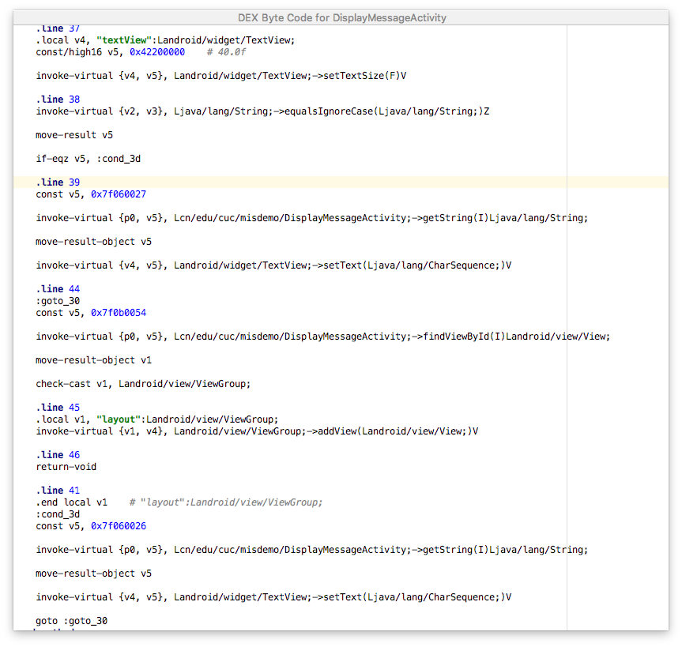
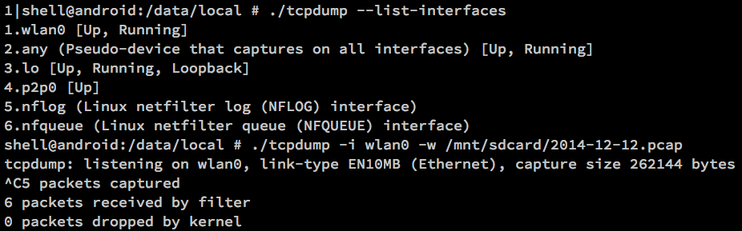
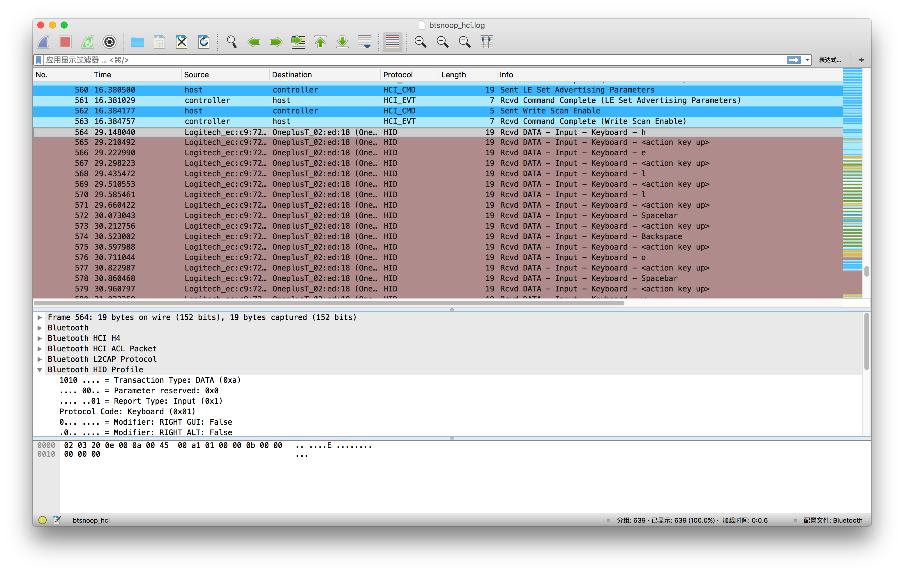

# 第七章 移动终端应用逆向分析

## 软件逆向分析基础之静态分析

### 静态分析基础

静态分析是指在不运⾏代码的情况下，采用词法分析、语法分析等各种技术⼿段对程序⽂件进⾏扫描从⽽⽣成程序的反汇编代码，然后阅读反汇编代码来掌握程序功能和理解程序原理的⼀种技术。在整个分析过程中，阅读理解反汇编代码是主要分析工作。反汇编（或反编译）代码⽣成⼯具简称反汇编（反编译）⼯具，选择一个好的反汇编工具可以帮助逆向工程师更有效率的去分析目标程序的内部实现原理。

静态分析Android应用程序有两种常用方法：第一种方法是阅读反汇编生成的[Dalvik 字节码](https://source.android.com/devices/tech/dalvik/dex-format?hl=zh-cn)。常见的Dalvik字节码反汇编工具有IDA Pro、Apktool（内置了baksmali用于反编译生成smali文件，``smali``之于Dalvik字节码的关系就像``汇编语言``之于``CPU机器指令``的关系）。另一种方法是阅读反汇编生成的Java源代码，可以使用[dex2jar](https://github.com/pxb1988/dex2jar)从dex文件生成jar文件，然后再使用[JD-GUI](http://jd.benow.ca/)阅读jar文件的代码。本书重点介绍第一种方法，即反编译并阅读理解[Dalvik 字节码](https://source.android.com/devices/tech/dalvik/dex-format?hl=zh-cn)。

### APK反编译⼯具集

#### Apktool

[Apktool](https://github.com/iBotPeaches/Apktool) 是一个用于逆向第三方、闭源、二进制Android应用的工具。它能将大多数资源文件解码回原始形态并且可以在进行修改之后提供重新打包成APK文件或JAR文件的能力，这使得手工调试``smali``代码成为可能（从Apktool的``2.1.0``版本开始，这个调试功能被从Apktool中移除，作者推荐使用Android Studio的一款``smali``语言插件[IdeaSmali](https://github.com/JesusFreke/smali/wiki/smalidea)）。

``apktool``的详细使用请参阅[apktool官方文档](https://ibotpeaches.github.io/Apktool/documentation/)。

#### Android Studio的APK Analyzer




Android Studio 2.2包含了APK Analyzer，通过它我们能够直观地看到APK的组成。[APK Analyzer](https://developer.android.com/studio/build/apk-analyzer.html) 让你可以打开并审查存于你电脑中的 APK 文件的内容，不管它是通过本地 Android Studio 工程构建，还是需要从服务器上或者其他构件仓库中构建后得到的。它不需要必须要在任何你所打开的 Android Studio 项目中被构建，甚至也不需要它的源代码。如上图一所示，是在Android Studio 3.0中通过菜单 ``Build`` -> ``Analyze APK...`` 功能打开 [Deliberately Vulnerable Android Hello World](https://github.com/c4pr1c3/DVAHW) 编译出来的``release``版apk文件的截图。通过对 ``DisplayMessageActivity`` 类右键单击弹出菜单里选择 ``Show Bytecode`` 可以直接查看该类所在源代码文件的``smali``伪机器指令代码，如上图二所示。

使用 APK Analyzer 可以为应用“瘦身”，如上图一所示，文件和文件夹根据文件大小降序排列。这让我们很容易看出对 APK 大小优化最容易从哪里入手。每当你深入到某个文件夹的时候，你能看到占用了 APK 大部分空间的资源和其他实体。

通过APK Analyzer可以快速查看APK中文件的最终版本（比如AndroidManifest.xml、resources.arsc在被打包到APK文件中后，本来是二进制形式存储的，APK Analyzer能够解析并显示这些文件的内容）。

当你点击任何 DEX 文件，你可以看到一个含有多少类和方法被定义，以及它包含的总引用数（引用数不包括在单个 DEX 文件的 [64K 限制](https://developer.android.com/studio/build/multidex.html#about)里）的总结。你甚至可以深入到包里查看到底是谁使用了这些引用。

APK Analyzer 可以帮助你验证你的 [Proguard](https://www.guardsquare.com/en/proguard) 的配置是否正确，比如查看你需要的方法或类是否在 APK 中存在或者它们是否被重命名（混淆）。你可以确定你不需要的类是不是被移除了，且没有占用之前说的引用方法数。

APK Analyzer能比较两个不同APK中各个实体的大小。这对于我们了解为何你的APP相比上个版本变大了是很有用的。在发布一个新版APK之前，在APK Analyzer中导入你即将发布的APK。在右上角点击Compare With，选择上一个版本的APK，点击OK。然后就会出现类似图6的对话框，允许你比较之间的差别。

APK Analyzer还有命令行版[apkanalyzer](https://developer.android.com/studio/command-line/apkanalyzer.html)，该工具被包含在Android SDK Tools中，位于``<android_sdk>/tools/bin/apkanalyzer``。更多关于APK Analyzer的使用请参与[android开发者官网的Analyze Your Build with APK Analyzer](https://developer.android.com/studio/build/apk-analyzer.html)。

### DVM与JVM

Java虚拟机基于栈结构，需要频繁从栈读取或写入数据，这个过程需要更多的指令与内存访问次数，会消耗cpu时间。Dalvik虚拟机基于寄存器，数据访问通过寄存器直接传递，比栈方式快。

Android 运行时 (ART) 包含一个具备代码分析功能的即时 (JIT) 编译器，该编译器可以在 Android 应用运行时持续提高其性能。JIT 编译器补充了 ART 当前的预先 (AOT) 编译器的功能，有助于提高运行时性能，节省存储空间，以及加快应用及系统更新速度。相较于 AOT 编译器，JIT 编译器的优势也更为明显，因为它不会在应用自动更新期间或重新编译应用（在无线下载 (OTA) 更新期间）时拖慢系统速度。

尽管 JIT 和 AOT 使用相同的编译器，它们所进行的一系列优化也较为相似，但它们生成的代码可能会有所不同。JIT 会利用运行时类型信息，可以更高效地进行内联，并可让堆栈替换 (OSR, On Stack Replacement) 编译成为可能，而这一切都会使其生成的代码略有不同。

Java虚拟机运行的是Java字节码，生成的字节码文件也就是class文件，然后再由Java虚拟机去执行编译运行过程。而Dalvik虚拟机运行的则是其专有的文件格式Dex。

在Java SE程序中的Java类会被编译成一个或者多个字节码文件（.class）然后打包到JAR文件，而后Java虚拟机会从相应的class文件和jar文 件中获取相应的字节码；Android应用虽然也是使用Java语言进行编程，但是在编译成class文件后，还会通过一个工具（dx）将应用所有的 class文件转换成一个.dex文件（dex文件是压缩成zip文件，这样可以减少占用空间），而后Dalvik虚拟机会从其中读取指令和数据。

### ART

Android Runtime (ART) 是 Android 上的应用和部分系统服务使用的托管运行时。ART 及其前身 Dalvik 最初是专为 Android 项目打造的。作为运行时的 ART 会执行 Dalvik 可执行文件并遵循 [Dex 字节码规范](https://source.android.com/devices/tech/dalvik/dex-format?hl=zh-cn)。ART 是面向 Android 5.0（Lollipop 或 L）版本及更高版本推出的新 Android 运行时。Dalvik 将不再可用。

ART 和 Dalvik 是运行 Dex 字节码的兼容运行时，因此针对 Dalvik 开发的应用也能在 ART 环境中运作。不过，Dalvik 采用的一些技术并不适用于 ART。有关最重要问题的信息，请参阅在 [Android Runtime (ART) 上验证应用行为](http://developer.android.com/guide/practices/verifying-apps-art.html?hl=zh-cn)。

ART 采用预先 (AOT) 编译的方法。这意味着，在安装时，dex 代码会被编译为 OAT 文件中的原生代码，并替换 Dalvik 的 odex 文件。这种做法有以下几点意义：

* 与 Dalvik 相比，性能得到了提高。在实验室中测得的能耗也有相应的改善。
* 没有运行时代码缓存。OAT 文件被映射到内存（因此可分页）。从 Proportional Set Size（简称 PSS，或各进程之间平均共享的内存）来看，OAT 文件占用的 RAM 内存似乎更大了。不过，我们发现，由于 OAT 文件可分页，而 Dalvik JIT 缓存不可分页，因此就实际内存压力而言，对系统的影响反而有所减轻。
* 与 zygote 中的预加载类相似，ART 在编译时会尝试预先初始化一组类。这会创建一个“boot.art”文件，其中包含预先初始化的类和相关对象的压缩堆的映像。此文件会在 zygote 启动时映射到内存中。尽管这会占用额外的存储空间（通常为 10MB），但它可以加快 zygote 的启动，并可以创造机会，让系统在内存压力较大的情况下能够交换出某些预先加载的类。此外，这还有助于改善 ART 的[低 RAM](http://source.android.com/devices/tech/config/low-ram.html?hl=zh-cn) 性能，因为在 Dalvik 中，大部分此类信息都存储在线性分配空间的脏页中。
* Dex 文件编译使用名为 ``dex2oat`` 的工具，比 ``dexopt`` 更耗时。所增加的时间各有不同，但是编译时间增加 2-3 倍的情况并不少见。例如，使用 dexopt 通常只需 1 秒就能安装的应用，如果使用 dex2oat，则可能需要 2-3 秒。与 dexopt 相比，Dex 文件编译需要更多时间，特别是在首次启动（恢复出厂设置或接收 OTA 后）过程中必须编译用户的所有应用时，这一点尤为明显。为了减少所需的编译量，ART 支持对系统分区中的库和应用进行预先优化的选项。纳入预先优化的 dex 文件会占用系统映像的空间。因此，这些选项实际是以牺牲首次启动时间来换取系统映像大小。请注意，OTA 相对而言不是太频繁，并且之后的启动时间，无论是否进行预先优化，都应该是相同的。
* 如果启用全编译，则 OAT 文件比 odex 文件大。我们会在本文档的后面部分讨论降低此成本的选项。

自 Android 7.0 起，设备可以使用两个系统分区来启用 [A/B （无缝）系统更新](https://source.android.com/devices/tech/ota/ab_updates?hl=zh-cn)，用于确保可运行的启动系统在[无线 (OTA) 更新](https://source.android.com/devices/tech/ota/index.html?hl=zh-cn)期间能够保留在磁盘上。这样可以降低更新之后设备无法启动的可能性，也就是说，用户需要将设备送到维修/保修中心进行更换和刷机的情况将有所减少。用户在 OTA 期间可以继续使用设备。在更新过程中，仅当设备重新启动到更新后的磁盘分区时，会发生一次宕机情况。即使 OTA 失败，设备也仍然可以使用，因为它会启动到 OTA 之前的磁盘分区。用户可以再次尝试下载 OTA。建议仅针对新设备通过 OTA 实现 A/B 系统更新。

自 Android 8.0 起，ART机制又有了一些[重大改进](https://source.android.com/devices/tech/dalvik/improvements?hl=zh-cn)，总结概括如下：

* 并行压缩垃圾回收。垃圾回收引擎每次运行时都会压缩堆空间占用（内存占用显著降低）并且对运行中的应用性能影响微乎其微（GC造成的暂停将大幅减小），可以充分利用多核CPU进行垃圾回收任务执行的并行化；
* 大量循环结构代码优化，例如边界检查（编译期静态确认循环边界条件，运行时确保循环没有越界）消除、归纳变量（induction variable）消除、循环体内的死代码消除和删除整个无用循环、利用SIMD（单指令多数据）进行循环代码的向量化等等
* 使用类层次结构分析（Class Hierarchy Analysis, CHA）
* 安装后的dex文件布局优化。得益于从Android 7 ART中引入的PGO（性能分析导引优化），系统可以得知dex文件中哪些class/method/string会被频繁访问，哪些很少或根本从未被用到，因此可以调整dex文件布局，把热点数据放到相邻的位置。因为dex在运行时会被mmap映射进内存，这就意味着更少的内存占用

以下是 ART 实现的一些主要功能。

#### 预先 (AOT, Ahead-of-time) 编译

ART 推出了预先 (AOT) 编译，可提高应用的性能。ART 还具有比 Dalvik 更严格的安装时验证。

在安装时，ART 使用设备自带的 ``dex2oat`` 工具来编译应用。该实用工具接受 DEX 文件作为输入，并针对目标设备生成已编译应用的可执行文件。该实用工具应能够毫不费力地编译所有有效的 DEX 文件。但是，一些后处理工具会生成无效文件，Dalvik 可以接受这些文件，但 ART 无法编译这些文件。有关详情，请参阅解决垃圾回收问题。

#### 优化的垃圾回收

垃圾回收 (GC) 可能会损害应用的性能，从而导致显示不稳定、界面响应速度缓慢以及其他问题。ART 通过以下几种方式优化垃圾回收：

* 采用一个而非两个 GC 暂停
* 在 GC 保持暂停状态期间并行处理
* 采用总 GC 时间更短的回收器清理最近分配的短时对象这种特殊情况
* 优化了垃圾回收人机工程学，这样能够更加及时地进行并行垃圾回收，这使得 [GC_FOR_ALLOC](http://developer.android.com/tools/debugging/debugging-memory.html?hl=zh-cn#LogMessages) 事件在典型用例中极为罕见
* 压缩 GC 以减少后台内存使用和碎片

#### 开发和调试优化

ART 提供了大量功能来优化应用开发和调试。

> 支持采样分析器

一直以来，开发者都使用 [Traceview](http://developer.android.com/tools/help/traceview.html?hl=zh-cn) 工具（旨在跟踪应用执行）作为分析器。虽然 Traceview 可提供有用的信息，但其根据每次方法调用开销得出的 Dalvik 分析结果会出现偏差，而且使用该工具明显会影响运行时性能。

ART 添加了对没有这些限制的专用采样分析器的支持，从而更准确地了解应用执行情况，而不会明显减慢速度。KitKat 版本为 Dalvik 的 Traceview 添加了采样支持。

> 支持更多调试功能

ART 支持许多新的调试选项，特别是与监控和垃圾回收相关的功能。例如，开发者可以：

* 查看堆栈跟踪中保留了哪些锁，然后跳转到持有锁的线程。
* 询问指定类的当前活动的实例数、请求查看实例，以及查看使对象保持有效状态的参考。
* 过滤特定实例的事件（如断点）。
* 查看方法退出（使用“method-exit”事件）时返回的值。
* 设置字段观察点，以在访问和/或修改特定字段时暂停程序执行。

### Dalvik 字节码

Dalvik 字节码的通用设计规则总结如下：

* 机器模型和调用规范旨在大致 **模仿** 常见的``真实架构`` 和 ``C 样式的调用规范``：
    * 机器基于寄存器，而帧的大小在创建时确定后就固定不变。每一帧由特定数量的寄存器（由相应方法指定）以及执行该方法所需的所有辅助数据构成，例如（但不限于）程序计数器和对包含该方法的 ``.dex`` 文件的引用。
    * 当用于位值（例如整数和浮点数）时，寄存器会被视为宽度为 32 位。如果值是 64 位，则使用两个相邻的寄存器。对于寄存器对，没有对齐要求。
    * 当用于对象引用时，寄存器会被视为其宽度能够正好容纳一个此类引用。
    * 对于按位表示，``(Object) null == (int) 0``。
    * 如果一个方法有 N 个参数，则在该方法的调用帧的最后 N 个寄存器中按顺序传递参数。较宽的参数占用两个寄存器。给实例方法传递一个 this 引用作为其第一个参数。
* 指令流中的存储单元是 16 位无符号数。某些指令中的某些位会被忽略/必须为 0。
* 指令并非一定限于特定类型。例如，在不做任何解释的情况下移动 32 位寄存器值的指令不一定非得指定是在移动整数还是浮点数。
* 对字符串、类型、字段和方法的引用有单独枚举和已编入索引的常量池。
* 按位字面数据在指令流中内嵌表示。
* 在实践中，一个方法需要 16 个以上的寄存器不太常见，而需要 8 个以上的寄存器却相当普遍，因此很多指令仅限于寻址前 16 个寄存器。在合理的可能情况下，指令允许引用最多前 256 个寄存器。此外，某些指令还具有允许更多寄存器的变体，包括可寻址 ``v0 - v65535`` 范围内的寄存器的一对 ``catch-all move`` 指令。如果指令变体不能用于寻址所需的寄存器，寄存器内容会（在运算前）从原始寄存器移动到低位寄存器和/或（在运算后）从低位结果寄存器移动到高位寄存器。
* 存在几个“伪指令”，用来容纳被常规指令（例如，``fill-array-data``）引用的可变长度数据有效负荷。在正常的执行流程中绝对不能遇到这类指令。此外，这类指令必须位于偶数字节码偏移（即以 4 字节对齐）上。为了满足这一要求，如果这类指令未对齐，则 dex 生成工具必须发出额外的 ``nop`` 指令来进行填充。最后，虽然并非必须这样做，但是大多数工具会选择在方法的末尾发出这些额外的指令，否则可能需要在这些方法周围分布额外的指令。
* 如果安装到正在运行的系统中，那么在安装过程中，静态链接优化可能会更改某些指令的格式。这样可以在链接已知之后加快执行的速度。有关建议的变体，请参阅相关的[指令格式文档](https://source.android.com/devices/tech/dalvik/instruction-formats.html)。使用“建议”一词是因为并非必须强制实施这些变体。
* 人类语法和助记符：
    * 对参数进行 ``Dest-then-source``（目标参数在前，源参数在后） 排序。
    * 一些运算码具有消除歧义的名称后缀，这些后缀用来表明运算类型：
    * 常规类型的 32 位运算码未标记。
    * 常规类型的 64 位运算码以 -wide 为后缀。
    * 特定类型的运算码以其类型（或简单缩写）为后缀，这些类型包括：-boolean、-byte、-char、-short、-int、-long、-float、-double、-object、-string、-class 和 -void。
    * 一些运算码具有消除歧义的后缀，这些后缀用于区分具有不同指令版式或选项的相同运算。这些后缀与主要名称之间以斜杠（“/”）分开，主要目的是使生成和解析可执行文件的代码中存在与静态常量的一对一映射关系（即，降低让代码查看者感到模糊不清的可能性）。
    * 在本文档的说明部分，我们使用 4 位宽的字符来强调值的宽度（例如，表示常量的范围或可能寻址的寄存器的数量）。
* 例如，在指令 ``move-wide/from16 vAA, vBBBB`` 中：
    * “move”为基础运算指令，表示这是基本运算（移动寄存器的值）。
    * “wide”为名称后缀，表示指令对较宽（64 位）数据进行运算。
    * “from16”为运算指令后缀，表示具有 16 位寄存器引用源的变体。
    * “vAA”为目标寄存器（隐含在运算中；并且，规定目标参数始终在前），取值范围为 ``v0`` - ``v255``。
    * “vBBBB”为源寄存器，取值范围为 ``v0`` - ``v65535``。
* 请参阅[指令格式文档](https://source.android.com/devices/tech/dalvik/instruction-formats.html)，详细了解各种指令格式（在“运算和格式”下列出）以及运算码语法。
* 请参阅 [.dex 文件格式文档](https://source.android.com/devices/tech/dalvik/dex-format.html)，详细了解字节码如何融入整个编码环境。

### 定位关键代码的方法（静态）

在逆向一个 Android 应用程序时，无论是有无源代码，我们都不可能随机选择一个源文件开始分析，亦或完整阅读所有源代码或反汇编代码后再开始进行分析。本小节将介绍几种快速定位程序关键代码的静态分析方法。

每个 apk 文件中都包含的 ``清单文件``（``AndroidManifest.xml``） 是最常见的定位关键代码的第一个突破口，因为在这个文件中记录了软件的包名、运行的目标系统版本、使用到的组件等。除此之外，在[第六章 安卓系统访问控制策略与机制](../chap0x06/main.md#Activity) 的 **应用生命周期管理 之 Activity** 一节中，我们已经介绍过了定位“**用户界面主入口**的 Activity”的方法，该方法也是需要在 ``清单文件`` 进行关键字查找即可找到**用户界面主入口**的 Activity。

在上述以 ``清单文件`` 分析为基础的快速定位关键代码方法之外，在实践中，常见的静态定位关键代码的方法主要分为：信息反馈法、特征函数法、和顺序查看法三大类。

#### 信息反馈法

先运行目标程序，然后根据程序运行时给出的反馈信息作为突破口寻找关键代码。例如，[Deliberately Vulnerable Android Hello World](https://github.com/c4pr1c3/DVAHW)在模拟器中运行，输入注册码错误时的提示信息页面。注意到其中的提示消息内容为：**注册失败**。这就是程序反馈给我们的信息。通常情况下，程序中用到的字符串会存储在 ``strings.xml`` 文件或者硬编码到程序代码中，如果是前者的话，字符串在程序中会以 ``id`` 的形式访问，只需要在反汇编代码中搜索字符串 ``id`` 值即可找到调用代码处；如果是后者的话，在反汇编代码中直接搜索字符串即可定位到关键代码附近。

#### 特征函数法

本方法和信息反馈法的相似之处在于都是从程序运行时给出的反馈信息作为突破口寻找关键代码，区别在于 **特征函数法** 侧重于从消息的 ``UI``（用户界面） 和 ``UE``（用户交互）实现技术原理推测用到了Android SDK中提供的哪些相关API函数，而 **信息反馈法** 则是从消息的文本内容特征出发。例如，弹出``注册失败``错误提示信息可能是调用的 ``Toast.MakeText().Show()`` 方法，在反汇编代码中直接搜索 ``Toast`` 应该很快能定位相关调用代码，如果 ``Toast`` 在程序中被多次调用的话，可能需要分析人员逐个阅读核对。

#### 顺序查看法

顺序查看法通常是从 **用户界面主入口 Activity** 或其他启动代码入手分析，逐行向下分析，掌握软件的执行流程，这种分析方法在病毒分析时经常用到：大多数病毒都会实现开机自启动或随常用应用软件的启动而自动加载执行。

## 软件逆向分析基础之动态分析

软件逆向分析中的动态分析指的是在没有软件源代码的情况下，调试程序时只能跟踪与分析汇编代码，查看寄存器的值，这些数据远远没有源码级调试展示的信息那么直观，但动态调试程序同样能跟踪软件的执行流程，反馈程序执行时的中间结果，在静态分析程序遇到瓶颈时，动态调试往往可以另辟蹊径，找到程序关键算法、关键代码、关键变量的突破口。

### 定位关键代码的方法（动态）

#### 代码注⼊法（动态调试和分析）

代码注入法属于动态调试方法，基本原理是修改 apk 文件的smali反汇编代码，加入打印语句输出，配合 ``LogCat`` 查看程序执行到特定点时的（变量和关键数据结构）状态数据。这种方法在解密程序数据时经常使用，具体的例子可以查阅[本章实验](exp.md)。

#### 栈跟踪法（动态调试和分析）

栈跟踪法的基本原理是输出运行时的栈跟踪信息，然后查看栈上的函数调用序列来理解方法的执行流程。和代码注入法类似，栈跟踪法主要是手动向反汇编后的smali文件中加入栈跟踪信息输出的代码。与注入 ``Log`` 输出的代码不同的是，栈跟踪法只需要知道大概的代码注入点。而且注入代码后的反馈信息比 ``Log`` 注入要详细的多。

例如一个典型的栈跟踪``Java``源代码如下：

```java
new Exception("print trace").printStackTrace();
```

将其转换成``smali``语法的反汇编代码如下：

```smali
new-instance v0, Ljava/lang/Exception;
const-string v1, "print trace";
invoke-direct {v0, v1}, Ljava/lang/Exception;-><init>(Ljava/lang/String;)V
invoke-virtual {v0}, Ljava/lang/Exception;->printStackTrace()V
```

栈跟踪信息记录了程序从启动到 ``printStackTrace()`` 被执行期间所有被调用过的方法，从下往上查看栈跟踪信息，很容易就可以找到在打印栈跟踪信息之前的完整函数调用链，这样函数的执行流程就一清二楚了。

#### Method Profiling（动态调试和分析）

Method Profiling（方法剖析）主要用于代码覆盖热点分析和性能优化。该功能除了可以记录每个函数占用的CPU时间之外，还能够追踪所有的函数调用关系，并提供比``栈跟踪法``更详细的函数调用序列报告，这种方法在实践中可以帮助分析人员节省很多时间，也被广泛使用。

从``Android Studio 3.0``开始，[Android Profile](https://developer.android.com/studio/profile/android-profiler.html) 被设计用来代替原先的``Dalvik Debug Monitor Server (DDMS)``来实现对程序执行过程额CPU、内存和网络信息等调试方法。

如果手动注入 [Method Tracing](https://developer.android.com/studio/profile/generate-trace-logs.html)代码的起始点与结束点不好确定，我们可以将它的范围设置的大一些，如在Activity的``onCreate()``方法中注入[``startMethodTracing()``](https://developer.android.com/reference/android/os/Debug.html#startMethodTracing()) 的代码反汇编代码如下：

```smali
const-string v0, "cuc"
invoke-static {v0}, Landroid/os/Debug;->startMethodTracing(Ljava/lang/String;)V
```

然后在 Activity 的 ``onStop()`` 方法中注入 ``stopMethodTracing()`` 的代码，反汇编代码如下：

```smali
invoke-static {}, Landroid/os/Debug;->stopMethodTracing()V
```

这样当程序打开关闭后就会生成 ```cuc.trace`` 文件，接下来[使用 ``traceview`` 工具来手动分析](https://developer.android.com/studio/profile/traceview.html)它即可。

## 通信协议逆向分析基础

### 模拟器

Android 模拟器可以模拟设备并将其显示在当前计算机上。利用该模拟器，开发者可以对 Android 应用进行原型设计、开发和测试，无需使用硬件设备。模拟器支持 Android 电话、平板电脑、Android Wear 和 Android TV 设备，并随附一些预定义的设备类型，便于开发者快速上手。开发者可以创建自己的设备定义和模拟器皮肤。需要注意的是，目前（Android SDK API Level 27）Android模拟器支持模拟真实设备的多数功能，不过虚拟硬件不包含以下功能：

* WLAN
* 蓝牙
* NFC
* SD 卡插入/弹出
* 连接到设备的耳机
* USB

以[命令行模式的Android模拟器控制软件](https://developer.android.com/studio/run/emulator-commandline.html)为例，该程序位于 ``Android SDK``的 ``tools`` 目录下。

```bash
# 确保 emulator 在系统环境变量 PATH 中已设置
# Linux & Mac 上的默认路径: $ANDROID_SDK_PATH/tools/emulator

# 查看系统中目前所有可用的Android模拟器
emulator -list-avds

# 启动上一条命令输出结果中的一个模拟器（使用模拟器代号）
# 该模拟器的所有通信数据会被写入当前目录下的 test.pcap 文件
emulator -tcpdump test.pcap -avd "Nexus_5_API_19"
```

### 真机

从 [www.tcpdump.org](http://www.tcpdump.org/) 下载libpcap和tcpdump源代码，交叉编译出tcpdump的目标CPU架构可执⾏程序(静态链接，真机普遍使用ARM，模拟器可以使用x86或ARM)，将该 ``tcpdump`` 上传到真机的/data/local目录（先上传到SD卡（例如：``/mnt/sdcard`` ），再``su``（所以真机需要先``root``）后移动到 ``/data/local``）。在真机上通过 ``adb shell`` 命令行方式直接执行 ``tcpdump`` 二进制程序的效果如下图所示：



如果不想自己从源代码交叉编译Android平台上可运行的``tcpdump``，可以使用[这里预先编译好的各个版本的``tcpdump``](https://www.androidtcpdump.com/android-tcpdump/downloads)。

另外，如果希望直接在手机上运行``tcpdump``，而不使用``adb shell``方式，可以在手机上安装一个终端管理软件。例如，``Terminal Emulator for Android``、``Termux``或``Termius``等。

### 针对HTTP协议通信监听与逆向分析

可以在PC/Mac上开启HTTP代理软件，Android手机或模拟器能够访问到该``HTTP代理服务``，设置并使用该代理。例如，可以参考[burpsuite官网的Android手机HTP代理开启和配置方法](https://support.portswigger.net/customer/portal/articles/1841101-configuring-an-android-device-to-work-with-burp)。

和用``tcpdump``抓包方式相比，本方法无需手机``root``。

#### 在电脑上自建无线热点

具体可以参考[第三章 Evil Twin基础实验](../chap0x03/exp.md)，一旦手机连入到自建无线热点，那么手机所有的通信数据都可以在电脑上通过对指定的无线接入点网卡抓包实现完全监听和控制。本方法同样不需要手机``root``。

#### 通信数据监听的旁门左道——『投毒』

利用DHCP服务器，可以指定内⽹任意可抓包主机作为⽆线⽹络中无线设备的默认⽹关。除此之外，DHCP响应数据里可以指定客户端使用我们自建的DNS服务器，在配置DNS解析记录时，我们可以配置所有解析记录指向开启了``透明正向HTTP代理``的可抓包主机，实现手机的特定HTTP/HTTPS请求都被我们的``透明正向HTTP代理``服务器捕获。

除此之外，利用局域网的ARP欺骗配合``dnsspoof``，我们可以实现对所有基于域名解析请求的相关流量被发送到我们指定的IP地址上，我们只需要在该IP地址上完成对相应协议通信数据的``代理``，即可实现``透明``的流量监听。

除此之外，对于已``root``的Android手机，我们还可以直接修改Android系统里的``/etc/hosts``⽂件，实现主动劫持已知域名相关的通信流量到我们指定的IP地址上。

### 监听蓝牙协议通信数据

Android 4.4+可以通过开发者选项中的“启用蓝牙HCI信息收集日志”功能捕获蓝牙设备与⼿机之间的点对点通信数据和⼿机的蓝牙⼴播数据。默认抓包结果写⼊到⼿机上的
``/sdcard/btsnoop_hci.log``，该文件可以用wireshark读取并解析。⽆线监听其他非本⼿机蓝牙点对点通信数据需要专门的硬件设备，具体查阅本书[第四章 移动通信安全概述的蓝牙通信数据嗅探基础一节](../chap0x04/exp.md#%E5%97%85%E6%8E%A2%E5%9F%BA%E7%A1%80)。

如下图所示是在手机上监听手机和蓝牙键盘之间通信数据的一个抓包实例。



### 通信协议逆向的核心

在获取到原始的网络通信数据抓包转储文件之后，需要分析工程师熟练使用⽹络协议分析⼯具对获取到的数据进行统计和深度分析。例如，使用wireshark的``显示过滤``规则和辅助⼯具。另外，网络协议的逆向往往需要结合软件逆向分析结果，特别是对于加密和私有协议的逆向分析更是如此。本章前文所述的静态和动态逆向分析技术，例如源代码级别、反汇编代码级别、注⼊代码并输出关键变量运⾏时状态值等方法，都常常被应用在网络协议逆向分析的辅助工作之中。

## 参考资料

* [丰生强 著. Android软件安全与逆向分析. 人民邮电出版社. 2013.](http://www.ituring.com.cn/book/1131)

