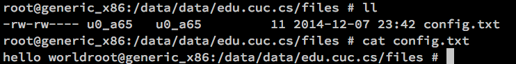

# 第八章 移动终端应用攻防与代码最佳安全实践

## 应用组件安全 

### 概述

Android应用组件包括 ``Activity``、``Service``、``Broadcast Receiver``、和``Content Provider``，它们是 Android 应用软件开发人员每天都会接触到的东西。这些如果在 ``AndroidManifest.xml`` 配置不当，会被其他应用调用,引起风险。Android应用内部的``Activity``、``Service``、``Broadcast Receiver``等，他们通过 ``Intent`` 通信，组件间需要通信就需要在 ``AndroidManifest.xml`` 文件中暴露组件，前面提到的风险就有可能是不恰当的组件暴露引起的。

Intent 启动不同组件的方法请参阅[第六章 Android应用基础之应用组件](../chap0x06/main.md#%E5%BA%94%E7%94%A8%E7%BB%84%E4%BB%B6)。本节要探讨的应用组件风险总结概括如下：

| | 攻击手段 |
|--|---------|
| Activity | 构造Intent直接调⽤，实现⾮授权访问 <br/> 后台守护进程通过进程枚举，直接启动新Activity覆盖到当前Activity进⾏『点击』劫持，实现钓鱼攻击（零权限要求） |
| Service | 构造Intent直接调⽤，实现⾮授权访问 |
| Broadcast Receiver | 构造Intent直接发送虚假⼴播消息，实现⾮授权访问 <br/> 注册同名IntentFilter，实现⼴播消息监听和劫持 |
| Content Provider | 直接访问暴露的URI，实现⾮授权访问 |

以下几个小节，将主要介绍使用这些组件时，可能会产生的安全问题，以及如何对它们进行防范。

### 恶意调用 Activity

以``恶意调用 Activity`` 为例，我们在[第六章 的Activity Manager (am) 实验](../chap0x06/exp.md)中已经通过 ``am start`` 命令展示了只要知道了 Activity 组件名称，就可以直接调用唤起。不仅如此，Service 也可以通过 ``am startservice`` 启动。类似于Web安全里的``任意URL访问和请求参数枚举``类攻击，一旦Android攻击者掌握了目标应用的敏感Activity组件名称，就有可能绕过脆弱的访问控制，直接操作原本受访问控制保护的用户交互界面。

在AndroidManifest.xml中的``<activity>``元素下有一个属性字段``android:exported=["true" | "false"]``用于决定当前``Activity`` 是否可由其他应用的组件启动。 “true”表示可以，“false”表示不可以。若为“false”，则 Activity 只能由同一应用的组件或使用同一用户 ID 的不同应用启动。默认值取决于 Activity 是否包含 Intent 过滤器。没有任何过滤器意味着 Activity 只能通过指定其确切的类名称进行调用。 这意味着 Activity 专供应用内部使用（因为其他应用不知晓其类名称）。因此，在这种情况下，默认值为“false”。另一方面，至少存在一个过滤器意味着 Activity 专供外部使用，因此默认值为“true”。例如以下示例定义：

```xml
  <activity
            android:name=".LoginActivity"
            android:label="@string/app_name"
            android:exported="false">
```

该属性并非限制 Activity 对其他应用开放度的唯一手段。开发者还可以利用权限来限制哪些外部实体可以调用 Activity（请参阅 [permission](https://developer.android.com/guide/topics/manifest/activity-element.html?hl=zh-cn#prmsn) 属性）。如下是一个标准的权限设置范例：

参与跨应用调用的组件或者公开的广播、服务设置权限。设置权限如下：

（1）组件添加android：permission属性。

```xml
<activity android:name=".Another" android:label="@string/app_name"
           android:permission="com.test.custompermission">
</activity>
```

（2）声明属性

```xml
<permission android:description="test"
        android:label="test"
        android:name="com.test.custompermission"
        android:protectionLevel="normal">
</permission>
```

``protectionLevel`` 有四种级别 ``normal``、``dangerous``、``signature``、``signatureOrSystem``。``signature``、``signatureOrSystem``时，只有相同签名时才能调用。

（3）调用组件者声明

```xml
<uses-permission android:name="com.test.custompermission" />
```

Android 提供各种 API 来在运行时检查、执行、授予和撤销权限。这些 API

是 android.content.Context 类的一部分，这个类提供有关应用程序环境的全局信息。

```java
if (context.checkCallingOrSelfPermission("com.test.custompermission")
        != PackageManager.PERMISSION_GRANTED) {
            // The Application requires permission to access the
            // Internet");
} else {
    // OK to access the Internet
}
```

### Activity （钓鱼）劫持

当用户安装了带有 ``Activity`` 劫持功能的恶意程序后，恶意程序会遍历系统中运行的程序。当检测到需要劫持的 ``Activity``（通常是网银或者其他网络程序的登录界面）在前台运行时，恶意程序会启动一个带有 [``FLAG_ACTIVITY_NEW_TASK``](https://developer.android.com/reference/android/content/Intent.html#FLAG_ACTIVITY_NEW_TASK) 标志的钓鱼式 ``Activity`` 覆盖正常的 ``Activity`` 从而欺骗用户输入用户名或者密码信息。当用户输入完信息后，恶意程序会将信息发送到指定的网址或者邮箱，然后切换到正常的 ``Activity``中去。

这种劫持手法透明，一般防病毒软件无法检测，手机用户更是防不胜防。有个比较简单的检测方式是``长按Home键``查看最后运行的程序来判断 ``Activity`` 是否被劫持过。然而这种方法并不是时常有效，攻击者可以设置属性 ``android:exludeFromRecents`` 的值为 ``true``，即使运行过的进程也不会显示最近运行过的列表中，这样前述简单检测方法就失效了。

### Service 安全

service一般用作后台任务，由于它没有界面，执行起来更加隐蔽，同样可以使用 ``android:exported`` 属性为 ``false`` 来阻止其他恶意软件调用。 同一作者如果想多个程序共享使用该服务可以定义权限，没有声明该权限下调用该服务会报 ``SecurityException`` 异常。

### Broadcast Receiver 安全

凡是通过``intent-filter``来接收的 ``Activity`` 都可以通过外部调用来访问，之前讲过解决方案是组件属性``android:exported``属性设置为``false``，让组件只能接收到``同用户ID和签名``的进程发送的广播。要想指定哪类进程可以发送，也可以配置``permission``。

广播分为``有序广播``和``无序广播``两种，分别是 ``sendBroadcast()`` 和 ``sendOrderedBroadcast()``方法。无序广播可以被所有广播接收者接收并且不能通过 ``abortBroadcast()`` 方法中止广播。有序广播按照优先级度顺序接受，优先度高的广播可以拦截广播调用 ``abortBroadcast()`` 中止广播。优先级度通过属性 ``android:priority`` 属性的数值来决定：数值越大，优先度越高。取值范围-1000到1000。我们可以设置接收短信的 ``receiver`` 的值为最大值 就可以拦截短信，短信不会存到收件箱。

针对伪造广播消息绕过访问控制和广播劫持类威胁，目前主要有五种安全解决方案：

> 1. 静态注册广播时添加 android:exported="false"属性，禁止本应用的广播接收器响应其他应用的广播。

```xml
<receiver android:name="com.test.MyBroadCastReceiver" android:exported="false">
            <intent-filter >
               ...
           </intent-filter>
</receiver>
```

> 2. 动态注册广播时，通过报名设置intent.setPackage("com.test.demo")，来决定你的广播对那个应用有效。

```java
Intent intent=new Intent("com.test.action");
intent.setPackage("com.test.demo");
this.sendBroadcast(intent);
```

> 3. 使用 ``LocalBroadcastManager`` 来实现 ``进程内广播``，其他进程无法接收广播信息。

注意：同一应用的其他进程也接收不到广播信息。

```java
// 发送广播
Intent intent = new Intent("com.test.action");
LocalBroadcastManager.getInstance(this).sendBroadcast(intent);

// 接收广播
 IntentFilter filter = new IntentFilter();
 filter.addAction("com.test.action");
 mReceiver = new MyBroadCastReceiver();
 mLocalBroadcastManager = LocalBroadcastManager.getInstance(this);
 mLocalBroadcastManager.registerReceiver(mReceiver, filter);
 ```

> 4. 使用 ``sendBroadcast(Intent intent, receiverPermission)`` 发送权限广播，只有具有这个权限的应用才能处理这个广播。

```java
// 广播发送
Intent intent = new Intent("com.test.action");
sendBroadcast(intent,"com.test.custom.permission");

```

```xml
<!-- 广播接收 -->
<!-- 在接收广播的APP 的 Manifest.xml文件中添加自定义权限 -->
 <uses-permission android:name="com.test.custom.permission" />
 <permission
        android:name="com.test.custom.permission"
        android:protectionLevel="normal"></permission>
```

```java
// 注册广播接收器
IntentFilter filter = new IntentFilter();
filter.addAction("com.test.action");
mReceiver = new MyBroadCastReceiver();
registerReceiver(mReceiver, filter);
```

> 5. 使用 ``registerReceiver(BroadcastReceiver receiver, IntentFilter filter, String broadcastPermission, Handler scheduler)`` 注册广播，只处理具有这个权限的APP发送的广播。

```xml
<!-- 广播发送 -->
<!-- 在发送广播的APP 的 Manifest.xml文件中添加自定义权限 -->
<uses-permission android:name="com.test.custom.permission" />
<permission
       android:name="com.test.custom.permission"
       android:protectionLevel="normal">
</permission>
```

```java
// 发送广播
Intent intent = new Intent("com.test.action");
sendBroadcast(intent);

// 广播接收
IntentFilter filter = new IntentFilter();
filter.addAction("com.test.action");
mReceiver = new MyBroadCastReceiver();
registerReceiver(mReceiver, filter, "com.test.custom.permission", null);
```

### Context Provider 安全

``Content Provider`` 组件是Android应用的重要组件之一，管理对数据的访问，主要用于不同的应用程序之间实现数据共享的功能。``Content Provider`` 的数据源不止包括SQLite数据库，还可以是文件数据。通过将数据持久化存储层和应用层分离，``Content Provider`` 为各种数据源提供了一个通用的接口。

如果在 ``AndroidManifest.xml`` 文件中将某个 ``Content Provider`` 的 ``exported`` 属性设置为``true``，则当前应用就多了一个威胁来源点。如果此 ``Content Provider`` 的实现有问题，则可能产生任意数据访问、SQL注入、目录遍历等风险。更多关于Content Provider组件安全可以查阅阿里聚安全的这篇文章：[Android安全开发之Provider组件安全](https://jaq.alibaba.com/community/art/show?articleid=352)。

## 数据安全

Android 手机中存放着许多用户个人相关数据，例如：手机号码、通讯录、短信、聊天记录、电子邮件等，这些数据涉及用户个人隐私和商业秘密，但实际应用程序在存储和网络传输时往往采取了一些错误的编码实现方案，导致了包括数据被窃、数据被篡改等安全事件的发生。以下，我们从应用程序开发的角度来看一看这些问题是如何产生的。

### 存储安全

数据分外部存储和内部存储两种，使用 ``new File("/sdcard/config.txt");`` 就可以在外部存储设备上读写文件。``AndroidManifest.xml``中声明以下权限就可以读写外部存储设备上的任意数据：

```xml
<uses-permission android:name="android.permission.WRITE_EXTERNAL_STORAGE">
```

乌云网上相关漏洞实例如下：

* ⼿机QQ 2012（Android）3.0可导致用户聊天信息泄露；
* 印象笔记客户端设计缺陷可导致用户信息泄露；
* ⼈⼈⽹Android客户端可能导致劫持或恶意软件安装，从不可信位置安装软件未做⽂件真实性和完整性检查。

使用 ``openFileOutput("/sdcard/config.txt", MODE_PRIVATE)`` 这类为内部存储文件读写。注意第二个参数 ``MODE_PRIVATE`` 使其他程序无法访问这个文件。如果改为 ``MODE_WORLD_READABLE`` 就会被其他程序访问到。应用使用内部存储时，数据默认是只能被当前应
用访问（基于⽂件访问权限设置）。⼀旦系统被root或代码编写错误，受保护数据将被其他程序访问到。



### 密钥认证

详细内容请参阅[第六章 Android安全机制概览中的密钥存储与密码学算法](../chap0x06/main.md#密钥存储与密码学算法)一节内容。

### 传输（通信）

详细内容请参阅[第六章 Android安全机制概览中的证书与PKI](../chap0x06/main.md#证书与PKI)一节内容。

### ROM 安全

根据 ROM 制作者不同， Android 系统的 ROM 分为如下三类：原生ROM、设备厂商定制ROM和第三方ROM。其中原生ROM指的是直接使用 Android Open Source Project 源代码编译出来的系统镜像，消费者实际能够购买到的设备基本都是来自设备厂商预装了厂商基于上游 AOSP 源代码修改定制之后的系统。第三方ROM则指的是独立于设备厂商的个人或社区团队组织基于 AOSP 代码修改编译出来的系统镜像。

安天实验室在2011年披露的《对CarrierIQ木马的综合分析报告》中报道了世界首例手机ROM中被植入隐私窃取软件的安全事件：

> 根据该公司公开的产品专利和产品培训资料，该产品搜集与网络相关的信息，包括语音和数据服务；还搜集与网络无关的信息，包括设备类型、可用内存和电池电量、设备中软件的类型、设备的地理位置信息、设备用户的按键信息、设备的使用历史等。这些信息被传回至 Carrier IQ 公司的服务器进行统计分析。其提供的后台产品可以根据 IMEI 或 IMSI对任何一个设备进行详细的历史记录查询，即用户的隐私被完全暴露给该公司及其产品用户。

> 运营商 Verizon 和 Sprint 在其多款手机中预装了这一软件，涉及 Android、Symbian 和 BlackBerry 三个平台。相关报道称受影响设备数量达 1.41 亿。多个著名的第三方定制 ROM 提供商，例如 CyanogenMod，也曾采用这一软件。

类似Windows盗版系统横行时代，盗版软件作者在修改版软件中加入后门代码、恶意代码等，针对移动终端系统的恶意ROM还经常会被加入恶意扣费程序、间谍程序和窃密程序等。

### 边信道信息泄漏

当应用处理用户或其它数据源输入的数据时，可能会把数据放在不安全的位置，而这些数据能够被同一设备上其它的恶意应用读取，这就造成了风险。由于利用这样的边信道信息泄露非常容易，导致应用容易受到很严重的攻击，攻击者通过一小段代码就能够读取不安全的敏感信息，我们也能通过adb之类的工具来读取。以下是以下边信道信息泄露的常见场景：

* 日志。Android提供的日志功能也是一个会造成信息泄露的地方，日志一般是开发者在开发期间调试使用的，我们在第七章实验中提到的``adb logcat``就可以读取到应用运行时产生的所有日志。
* 系统剪贴板信息。如果用户把信用卡号这样的敏感信息复制到了剪贴板，攻击者通过一小段代码就能轻轻松松读取到数据。
* URL缓存和浏览器Cookie对象。已经有大量基于 ``webview`` 的应用程序造成URL，cookie和缓存等泄露的问题，这允许攻击者劫持用户的会话。这样的缓存可能存在日志，流量历史，浏览缓存等多种形式。
* 第三方统计数据。某些情况下，有的应用会使用第三方API。在使用这类应用时，第三方的API可能会读取诸如设备ID及位置信息等敏感信息。

## WebView安全

WebView 可在应用中嵌入一个内置的 Web 浏览器，是 Android 应用开发常用的组件之一。通过 WebView 对 Android 应用的攻击案例屡见不鲜，例如2013年时爆发的 ``addJavascriptInterface`` 远程代码执行。但修复了 ``addJavascriptInterface`` 并不表示就能高枕无忧。应用在 WebView 上为 Javascript 提供的扩展接口，可能因为接口本身的问题而变成安全漏洞。

除此之外，在没有启用进程隔离的 WebView 与 App 具有相同权限，获得任意代码执行后可以访问应用私有数据或其他系统接口，可以将浏览器漏洞移植到手机平台上对应用进行针对性攻击。部分厂商使用自行基于开源浏览器引擎 fork 而来的内核，也可能因为同步上游补丁代码不及时而出现可利用的漏洞。

已知的 WebView 任意代码执行漏洞有 4 个，较早被公布是 [CVE-2012-6636](https://cve.mitre.org/cgi-bin/cvename.cgi?name=CVE-2012-6636)，揭露了 WebView 中 addJavascriptInterface 接口会引起远程代码执行漏洞。接着是 [CVE-2013-4710](https://cve.mitre.org/cgi-bin/cvename.cgi?name=CVE-2013-4710)，针对某些特定机型会存在 addJavascriptInterface API 引起的远程代码执行漏洞。之后是 [CVE-2014-1939](https://cve.mitre.org/cgi-bin/cvename.cgi?name=CVE-2014-1939) 爆出 WebView 中内置导出的 “searchBoxJavaBridge_” Java Object 可能被利用，实现远程任意代码。再后来是 [CVE-2014-7224](https://cve.mitre.org/cgi-bin/cvename.cgi?name=CVE-2014-7224)，类似于 [CVE-2014-1939](https://cve.mitre.org/cgi-bin/cvename.cgi?name=CVE-2014-1939) ，WebView 内置导出 “accessibility” 和 “accessibilityTraversal” 两个 Java Object 接口，可被利用实现远程任意代码执行。

出于安全考虑，Google 在 API 17 版本中就规定能够被调用的函数必须以 @JavascriptInterface 进行注解，理论上如果 APP 依赖的 API 为 17（Android 4.2）或者以上，就不会受该问题的影响，但在部分低版本的机型上依然受影响。

在 Android N 中增加了一个开发者选项，就是在所有的应用中将 WebView 的渲染进程运行在独立的沙箱中。即使恶意网页通过漏洞在渲染进程中执行了代码，还需要更多的漏洞绕过沙箱的限制。这一特性在 Android O 中默认启用。但在这一缓解措施正式部署到大部分设备之前，通过攻击 WebView 获得远程代码执行进而直接攻击应用仍然是可行的。

常见的XSS攻击的是因为客户端或服务端的代码开发不严谨等问题而存在漏洞的目标网站或者应用程序。这些攻击的先决条件是页面存在漏洞，而它们的影响往往也围绕着漏洞页面本身的用户会话。换句话说，因为浏览器的安全功能的影响，XSS攻击只能读取受感染的会话，而无法读取其他的会话信息，也就是``同源策略``的影响。UXSS（Universal XSS）保留了基本XSS的特点，利用漏洞，执行恶意代码，但是有一个重要的区别：

不同于常见的XSS，UXSS是一种利用浏览器或者浏览器扩展漏洞来制造产生XSS的条件并执行代码的一种攻击类型。

从2011年开始，Google的chromium项目的Bug列表就陆续被报告webkit存在一些UXSS漏洞。比如CVE-2011-3881 WebKitHTMLObjectElement UXSS漏洞，其它很多UXSS漏洞也是对源检测不全导致的跨域问题，虽然在Chrome浏览器上修复了，但由于Android系统引用了同一套WebKit，导致曾被修复的漏洞再次重现。2013年底，国内安全人员就开始陆续将这类Android UXSS爆光在网上。例如，腾讯SRC的安全研究人员做了个演示demo，通过提供一个二维码或者URL发送给他人，当使用聊天工具或者购物应用扫描二维码或者打开链接后，那么就可以窃取到他人的个人资料。

前面提到的这些UXSS漏洞，目前已经在Android 4.4中修复，同时它也提供了自动升级WebKit的功能，以便及时修复漏洞，因此历史经验总是在告诉我们：建议广大用户尽量采用最新版的软件和系统。

## 其他Android安全编码最佳实践

详细内容参阅[第六章 Android应用基础之实现安全性](../chap0x06/main.md#实现安全性)。

## 参考文献

* [卿斯汉. Android 广播机制安全性研究\[J\]. 电信科学, 2017, 32(10): 27-35.](http://www.infocomm-journal.com/dxkx/CN/abstract/abstract160124.shtml)
* [通过 WebView 攻击 Android 应用](https://paper.seebug.org/360/)
* [Mobile Security Testing Guide by OWASP](https://github.com/OWASP/owasp-mstg)

